# 1 Narodziny kina (1895 - 1910)

## 1.1 Kinetoskop

**Kinetoskop** to **rodzaj filmowego pudełka do podglądania**, wynaleziony przez Thomasa Edisona i Williama Dicksona w 1894 roku.

### Jak działał?

- Do środka wkładano **taśmę filmową** (35 mm), która przesuwała się na rolkach, oświetlana od dołu.
- Nad taśmą był obiektyw i okienko, przez które jedna osoba naraz mogła zaglądać do środka i oglądać ruchome obrazki.
- Obraz był poruszany za pomocą mechanizmu przypominającego maszynę do szycia — klatka po klatce.

📌 Nie był to projektor! Nie wyświetlał obrazu na ścianie — tylko jeden widz na raz patrzył do środka. Kino jako doświadczenie zbiorowe przyszło dopiero z braćmi Lumière.

## 1.2 Bracia Lumiere

Wymyślają kinematograf urządzenie do nagrywania i wyświetlania filmów. Wynaleziony w 1895 roku, był prawdziwym przełomem, bo jako pierwszy umożliwiał **projekcję filmu na ekran dla wielu widzów jednocześnie**.

1. **Rejestrowanie (kamera)**
   - Film **(taśma 35 mm)** przesuwał się skokowo za pomocą mechanizmu przypominającego **maszynę do szycia** (tzw. **transport taśmy**).
   - Przed taśmą był **obiektyw** i **migawka**, która przepuszczała światło tylko na ułamek sekundy — dzięki temu obraz się nie rozmazywał.

2. **Projekcja**

- Po zamianie żarówki w miejsce obiektywu i ustawieniu urządzenia poziomo, kinematograf stawał się **projektorem**.
- Przepuszczał światło przez film i soczewki, rzucając ruchomy obraz na ekran.

### Pierwszy w historii pokaz filmowy

Odbył się w Paryskiej kawiarni Grand Cafe 28 grudnia 1895.

Wyświetlono film [Wjazd pociągu na stację(1895)](https://youtu.be/J7laguPTT-Q?si=NEDySFMgHHGpRBgX), który uprzednio Ludwik i August nakręcili. Była to bardziej prezentacja wynalazku niż rozrywka. W 12 sekundzie ludzi siedzący najbliżej zaczęli uciekać.

Nieświadomie stworzyli oni pierwszy film ze stylu realistycznego i dokumentalnego. 

## 1.3 „Polewacz polany” (komiks Hermana Vogla, 1887)

W tamtych czasach jako rozrywka popularne były tzw. **gagi** w formie obrazkowej.

> **Gag** to *krótkie, zabawne zdarzenie lub sytuacja komiczna*, zwykle oparta na **wizualnym żarcie** lub **niespodziewanym zwrocie**. Często pozbawiony jest słów (lub dialogu) i polega na fizycznej akcji — np. ktoś się potyka, coś wybucha, coś spada na głowę bohatera. Gagi są fundamentem **komedii slapstickowej**, znanej z niemych filmów takich jak te z Charliem Chaplinem czy Busterem Keatonem.

Jednym z takich gagów (zaraz dowiemy się czemu istostnym) jest „L’Arroseur arrosé” („Polewa­cz polany”) autorstwa Hermana Vogela, który narysował go 1887.

A ważny on jest dlatego, że gdy bracia Lumière 2 lata po premierze swojego wynalazku wpadli na pomysł, że zamiast jedynie rejestrować rzeczywistość (kino realistyczne, dokumentalne) mogą nieco ją zaaranżować (Pokazuje narodziny **fikcji i żartu filmowego** oraz zawodu aktora filmowego) wzięli właśnie ten Gag jako scenariusz. Zorganizowali aktorów i nakręcili pierwszy film rozrywkowy - [L'Arroseur arrosé (The Sprinkler Sprinkled) (1895)](https://youtu.be/L2_ioXKuxoQ?si=74sOmNqVBgAOTeuU). Jak widać gra aktorska nie była jeszcze na wysokim poziomie, ale dała zarodek **komedii slapstickowej**.

## 1.4 Georges Méliès – ojciec filmowej fantazji i montażu trickowego

W międzyczasie, również w Paryżu, żył **Georges Méliès** – iluzjonista, właściciel teatru i pasjonat magii. Gdy w 1895 roku zobaczył pierwszy pokaz braci Lumière w Grand Café, był **zachwycony technologią**, ale... Lumière’owie nie chcieli mu sprzedać kinematografu, uważając film za narzędzie dokumentacji, nie rozrywki.

Méliès się więc na nich obraził – zdobył własne urządzenie i zaczął eksperymentować. Ale w przeciwieństwie do Lumière’ów, nie interesowała go rejestracja rzeczywistości. **Chciał zaczarować ekran**.

### ✨ Co zrobił Méliès?

- Wprowadził do kina **fikcję, teatr, fantazję i iluzję**. Jak?
- **Budował dekoracje, szył kostiumy, pisał scenariusze** – był reżyserem, operatorem, aktorem i scenografem w jednej osobie.
- **Odkrył montaż trickowy**: przez przypadek zauważył, że zatrzymując kamerę i wznowiając nagranie po zmianie scenografii lub pozycji aktora, można uzyskać **efekt nagłego zniknięcia, przemiany lub teleportacji**.

To był początek kina jako narzędzia do opowiadania historii nie tylko realistycznych, ale też niemożliwych. Tak narodził się styl ekspresjonistyczny, w kontraście do realistycznego kultywowanego przez braci Lumiere.

Méliès zaczął robić pokazy w swoim teatrze, miał już aktorów. Sceny, scenografie itp więc łatwo mu było nakręcić np. [Georges Méliès - Podróż na księżyc (1902)](https://youtu.be/ZNAHcMMOHE8?si=CBEfh9mP7hbIlUDA). Do tej pory kino było nieme, ale przecież dla Meliesa nie było problemu zatrudnić orkiestrę czy tzw. **bonimenteur**, co po francusku oznacza „gadający pan”, jego rolą było tłumaczenie co się dzieje na filmie podczas pokazu (tak więc film nie był jeszcze 100% samodzielny).

> Ciekawostka:
>
> Wykorzstanie bonimenteur w kinie stało się mega popularne w Japonii. Powstał więc odpowiednik tego słowa - **Benshi (katsuben)**. Zawód ten był tam popularniejszy niż nawet sami aktorzy!!!

## 1.5 Władysław Starewicz

Podczas gdy Georges Méliès zrewolucjonizował kino dzięki teatralnym sztuczkom i efektom specjalnym, inny artysta – **Władysław Starewicz** (tak naprawdę to był rusek) – poszedł jeszcze dalej: **zaczął ożywiać to, co martwe**.

Był on entomologiem (badał owady) i jednocześnie interesowało go kino. Miał zajawkę, żeby nakręcić film o walkach chrząszczy, ale owady... nie współpracowały XD Więc je pozabijał i z martwych owadów zrobił sobie aktorów, którymi sterował jak lalkami, poruszając ich kończynami klatka po klatce. Był więc jednym z pionierów techniki zwanej **stop-motion** - każda zmiana pozycji postaci to jedna klatka filmu. Setki ujęć tworzyły płynny ruch.

W ten sposób powstał film [Piękna Lukanida, 1912](Prekrasnaya Lyukanida (1912) The Beautiful Leukanida (Khanzhonkov)) - pierwszy animowany romans z owadami w roli głównej. Odtwarzał ludzkie emocje, dramaty i intrygi w świecie insektów.

### Wirażowanie

Starewicz wpadł również na pomysł barwienia taśmy filmowej (standard to nadal było 35mm) dla efektów emocjonalnych (np. noc → niebieska barwa).

Wykorzystał te techniki w 

- [Zemsta operatora filmowego, 1912](https://youtu.be/UYfr2WWFydk?si=GyNMiPY400JSMGUr)
- Gwiazdka u leśnych mieszkańców

To co wyprawiał ten gość nazywamy epoką **kina eksperymentalnego/technicznego**.

## 1.6 Szkoła z Brighton (1898–1907)

Wracamy do roku 1900, podczas gdy Méliès wyszukiwał nowinek technicznych żeby zaskoczyć widza, inna grupa filmowców - tym razem z Wielkiej Brytanii - zaczęła zadawać sobie inne pytanie: **Nie jak zaskoczyć widza, ale: jak opowiedzieć mu historię?**

Grupka filmowców zaczęła wspólnie eksperymentować z narracją filmu. Co zrobili jako pierwsi?

- Zaczęli **łączyć ujęcia w logiczny ciąg zdarzeń** – to narodziny **montażu narracyjnego**.
- Wprowadzili **zmiany planów filmowych** – np. najpierw pokazując ogólny widok (totalny), potem zbliżenie na twarz bohatera.
- Zaczęli myśleć o filmie **jak o historii z początku, środkiem i końcem** – nie tylko serii scen.

📌 Ich montaż **nie służył sztuczkom** jak u Mélièsa, ale **budowaniu przestrzeni, emocji i narracji**.

Przykładowe filmy to:

- [Grandma's Reading Glass - George Albert Smith, 1900](https://youtu.be/6ho05y9IMr4?si=RwV5Yzmm0loFVMlQ)

- [The Sick Kitten, George Albert Smith, 1901](https://youtu.be/FL8gv0XDdAU?si=STC9eV9gSjMKHEBO)

### Co to jest **montaż narracyjny**?

**Montaż narracyjny** to sposób łączenia ujęć, który prowadzi widza przez historię krok po kroku — pokazuje:

- przyczynę i skutek (np. ktoś strzela → ktoś upada),
- logikę przestrzenną (bohater patrzy w prawo → w następnym ujęciu widzimy, na co patrzy),
- zmiany czasu (np. retrospekcje, przeskoki).

To fundament filmowego opowiadania historii – coś, bez czego kino fabularne nie mogłoby istnieć.

## 1.7 Edwin S. Porter - Napad na Ekspres (1903)

O ile szkoła z Brighton zapoczątkowała sam montaż narracyjny jako technikę, to jednak Edwin S. Porter to kluczowa postać w rozwoju filmowej narracji – jego [Napad na ekspres” (The Great Train Robbery, 1903)](https://youtu.be/y3jrB5ANUUY?si=IjQLMEx-OXa8JXqQ) to *kamień milowy* w historii kina, często uznawany za pierwszy amerykański film fabularny z wyraźnie zarysowaną akcją i bohaterami.

Też jest to pierwszy tzw. Western (bardzo popularne filmy potem).

#### Co było przełomowe?

1. **Montaż narracyjny** – Porter łączył ujęcia w logiczną całość, tak jak wcześniej Brytyjczycy ze Szkoły z Brighton, ale:
   - film był dłuższy i bardziej dynamiczny,
   - opowiadał historię od początku do końca z wyraźnym konfliktem, akcją i zakończeniem.
2. **Zróżnicowanie przestrzeni** – pokazał akcję nie w jednym miejscu, ale w wielu lokalizacjach (stacja, pociąg, las, pościg), co tworzyło kinematograficzny świat.

#### Montaż równoległy

W bardzo prymitywnej formie pojawił się również **montaż równoległy**.

>  **Montaż równoległy** - technika montażu, w której **przeplatane są sceny dziejące się w tym samym czasie**, ale w różnych miejscach. Ma na celu zbudowanie napięcia, np. pokazując złoczyńców uciekających i bohaterów ich goniących.

W "Napadzie na ekspres" Mamy ujęcia bandytów uciekających i w tym samym czasie sceny grupy pościgowej zbierającej się w innym miejscu. Nie do końca wiadomo czy było to nawet celowe, Porter nie przeplata tych scen płynnie (zrobiłby D.W. Griffith kilka lat później), ale **montuje sekwencje następujące po sobie**, co sprawia wrażenie **symultaniczności**.)

> **Symultaniczność**  odnosi się do zjawiska jednoczesnego występowania kilku zdarzeń lub procesów, które mogą dziać się w różnych miejscach.

#### Ujęcie ustanawiające

> **Ujęcie ustanawiające** - To **szerokie ujęcie pokazujące miejsce akcji**, które pozwala widzowi zorientować się, **gdzie dzieje się dana scena**. Często pojawia się **na początku sekwencji**, by zbudować orientację przestrzenną.

Przykład - Stacja kolejowa

- Film **zaczyna się** szerokim planem peronu, gdzie pociąg się zatrzymuje.
- Widz widzi: pociąg, maszynistów, ludzi czekających — to **informuje o miejscu i czasie akcji**.
- Dopiero po tym pojawiają się bandyci, którzy wchodzą do budynku i zaczynają napad.

### 🎯 Najbardziej znana scena

Na końcu filmu bandyta strzela w stronę kamery – to słynne przełamanie czwartej ściany. Nie było częścią fabuły, ale **wielu widzów wtedy rzeczywiście odskakiwało z krzeseł**, bo to był szokujący efekt.

## 1.8 Film d'Art

We Francji czyli tam gdzie de facto narodziło się kino i film bardzo szybko zaczęto sobie zadawać pytanie:

**A co jeśli film mógłby być sztuką równą literaturze, teatrowi i malarstwu?**

W 1908 roku powstała inicjatywa o nazwie **Film d’Art** (*film sztuki*), której celem było wyniesienie kina ponad rozrywkę jarmarczną i uczynienie go pełnoprawną formą artystyczną.

### 🎭 Co wyróżniało Film d’Art?

1. **Ekranizacja dzieł literackich i teatralnych**
   - Sięgano po klasykę: Racine, Corneille, Hugo, Dumas.
   - Adaptowano dramaty, a nie codzienne scenki czy gagi.
2. **Zatrudnianie zawodowych aktorów teatralnych**
   - Zamiast przypadkowych statystów – **gwiazdy Comédie-Française**.
   - Gra była *teatralna*, z dużą ekspresją i gestem.
3. **Wysoka oprawa scenograficzna i muzyczna**
   - Dekoracje i kostiumy wzorowane na epoce.
   - Często grano do filmu muzykę napisaną specjalnie na tę okazję – **film zyskał ścieżkę dźwiękową jako element artystyczny**.

### 🎬 Najsłynniejszy film ruchu:

### ["Zabójstwo księcia Gwizjusza”1908](https://youtu.be/bh0tonXPEKQ?si=adSHqZVPASDaUqJw)

**Reż. Charles Le Bargy i André Calmettes**

- Historyczna rekonstrukcja wydarzeń z XVI wieku.
- Prawie jak sztuka teatralna przeniesiona na ekran.
- **Dialog był wypisany na planszach**, a aktorzy grali bardzo „klasycznie”.

### 📌 Znaczenie ruchu Film d’Art

- **Legitymizował kino jako sztukę wyższą** – przestało być wyłącznie „cyrkiem na taśmie”.
- Zapoczątkował **modę na adaptacje literackie** i film historyczny.
- Utorował drogę do **kina narodowego i kulturalnego** w Europie (np. francuskiego i włoskiego kina monumentalnego).

### 🎨 Wpływ malarstwa na kino

Tu warto omówić wpływ malarstwa na kino. Bo to od filmu **Film d'Art** się zaczęło. W filmach takich jak ["Zabójstwo księcia Gwizjusza”1908](https://youtu.be/bh0tonXPEKQ?si=adSHqZVPASDaUqJw) reżyserzy komponowali kadry jak obrazy malarskie:

- **Kompozycja sceny**: inspirowana malarstwem klasycznym i akademickim – postacie ustawione frontalnie, w symetrii, niczym na obrazach renesansowych.

- **Ujęcie statyczne**: kamera była nieruchoma, a scena wyglądała jak żywy obraz (*tableau vivant*).

- **Stylizowane światło i kolory**: w filmach barwionych (wirażowanych) celowo stosowano palety kolorów przypominające techniki malarskie.

- **Inspiracje ikonograficzne**: filmy biblijne, mitologiczne i historyczne korzystały z wizualnych wzorców malarstwa XIX wieku.

Widać to również w filmach **Mélièsa** (dekoracje jak teatralne kulisy, ale często komponowane jak ilustracje baśniowe). ale też w filmie

## 2 **Kino narracyjne i narodziny gwiazd (1910–1925)**

ten wykład to **narodziny wielkiej narracji filmowej i komedii slapstickowej**, czyli moment, w którym kino **przestaje być ciekawostką**, a staje się **pełnoprawnym sposobem opowiadania historii** – z emocjami, bohaterami, wielkimi scenami i śmiechem.

## 2.1 „Cabiria” (1914) – pierwszy monumentalny epos filmowy

Na początku XX wieku Włochy stają się kolebką **kina monumentalnego** – bogatego w kostiumy, dekoracje i wielkie tematy historyczne. Kulminacją tego nurtu jest film [Cabriia, 1914](https://youtu.be/gOWicOwtHa8?si=w0YcC2t8sQugXAcL) reżyserii Giovanni Pastrone.

Co nowego on wnosi?

- **Skala**: gigantyczne dekoracje, setki statystów, kostiumy – to **pierwszy film o takiej skali produkcyjnej**.
- **Narracja epicka**: wielowątkowa, obejmująca długi czas i wiele miejsc akcji.
- 📷 **Techniczny przełom: tracking shot / travelling**

> Uwaga tu kino nadal jest nieme. Ten film trwał 3h (pierwszy taki długi!!!), weź tu wysiedź tyle na filmie niemym XD

*Zatrudniono mnóstwo statystów.*

### 🎥 Co to jest **tracking shot / travelling**?

To **ujęcie z poruszającą się kamerą**, która **jedzie razem z postacią lub w głąb scenografii**.

- W „Cabirii” kamera przesuwa się **na wózku (dolly)**, pokazując **przestrzeń i głębię** scen.
- Wcześniej kamera była statyczna jak widz w teatrze — tu zaczyna „chodzić”, **wchodzić w świat przedstawiony**.

📌 Pastrone zastosował to, **zanim zrobił to Griffith** – technika ta weszła potem do klasyki jako „tracking shot”.

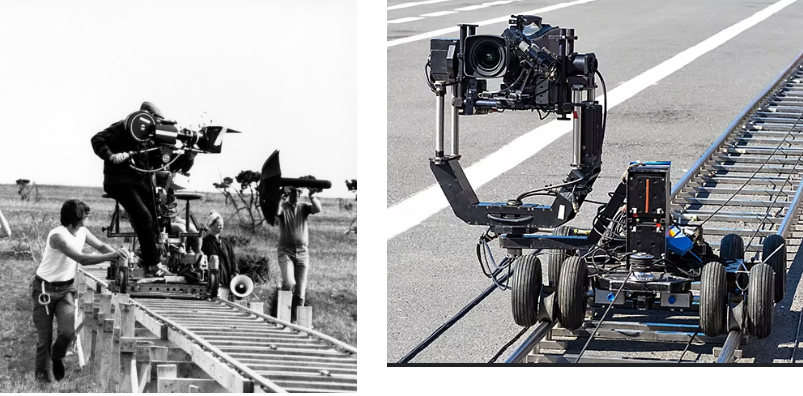

### 🌍 Co to znaczy, że film jest **epicki**?

**Epicki** nie znaczy tylko „długi” – oznacza film:

- **osadzony w historii lub micie** (starożytność, Biblia, wojny),
- z **wielką skalą emocjonalną i przestrzenną** (miasta, armie, kataklizmy),
- z bohaterami uwikłanymi w **wydarzenia większe od nich samych** (losy cywilizacji, upadki imperiów),
- często z **narracją z podziałem na akty lub rozdziały** – jak epopeja.

> 🎯 „Cabiria” to **film epicki, bo łączy prywatne dramaty bohaterów z monumentalną historią świata starożytnego.**

### 🏛️ Dziedzictwo „Cabirii”

- Ukształtowała styl późniejszych **superprodukcji historycznych**, np. „Ben-Hur” czy „Quo vadis”.
- Zainspirowała **D.W. Griffitha** przy tworzeniu „Nietolerancji” (1916).
- Pokazała, że **film może być nie tylko sztuką i rozrywką, ale też widowiskiem totalnym**.

## 2.2 D.W. Griffith – twórca filmowego języka i ojciec narracyjnego montażu

Pod wpływem europejskich osiągnięć (jak „Cabiria” i Szkoła z Brighton), amerykański reżyser **David Wark Griffith** stworzył w latach 10. XX wieku własny model opowiadania filmowego, który do dziś nazywamy **klasyczną narracją filmową**.

### 🧠 Co wniósł Griffith?

#### 1. 📏 **Ustandaryzował gramatykę kina**:

- Dzięki **zmienności planów**

  -  (Ujęcie ustanawiające → plan ogólny → półzbliżenie → zbliżenie) 
  - ustanowił pierwszy świadomy język filmowy, starał się samym montażem przekazać emocje, napięcie, rozbudować historię, dać więcej przekazu.

- Dzięki **cięcia na oś spojrzenia** 

  - (najpierw widzimy postać patrzącą w określonym kierunku, potem następuje cięcie i widzimy to na co ona patrzy) 
  - widz podąża wzrokiem za bohaterem i instynktownie rozumie przestrzeń
  - Przykład: 
    - Ujęcie 1: Kobieta patrzy w lewo, z lekkim niepokojem.
    - Ujęcie 2: Mężczyzna stoi przy oknie – widz wie, że to **na niego patrzyła**.
    - To podstawowy sposób budowania **relacji przestrzennych i emocjonalnych** między postaciami.

- Dzięki **montaż 180°** (zachowanie osi akcji).

  - To zasada ciągłości przestrzeni, która mówi, że: **kamera powinna pozostać po jednej stronie wyobrażonej osi**, łączącej dwie postacie lub kierunek ruchu.

  - Przykład:

    - Dwie osoby siedzą naprzeciw siebie przy stole.
    - Kamera kręci raz jedną, raz drugą, ale **z tej samej strony osi** – np. kobieta zawsze po lewej, mężczyzna po prawej.
    - Jeśli kamera przeskoczy **na drugą stronę** – nagle **kobieta jest po prawej**, choć się nie ruszyła.

    📌 Taki przeskok nazywa się **złamaniem osi** (*breaking the line*) i jest zwykle **unikany w klasycznym kinie narracyjnym**.

Te 3 zasady pozwalają lepiej przekazać historię.

#### 2. 🔁 **W pełni rozwinął montaż równoległy** (*cross-cutting*):

- przeplatał sceny dziejące się **jednocześnie w różnych miejscach**,
- budował napięcie i emocje, przyspieszając cięcia w finale,
- widz „składał” akcję z fragmentów i rozumiał jej logikę.

#### 3. 🎭 **Zintensyfikował aktorstwo filmowe**:

- zrezygnował z teatralnej przesady,
- zbliżenia pozwoliły na **grę twarzą i spojrzeniem**.

### 🎬 Najważniejsze filmy

#### [Niewidzialny wróg, 1912](https://youtu.be/p3Gtd7Upt7o?si=0GHeXCDXfSzUBbjk)

jeden z pierwszych filmów o chorobie wenerycznej (!), dramat społeczny.

#### [Muszkieterzy z Pig Alley (1912)](https://youtu.be/G8Y7nRq_JnY?si=Hj5jtL1nqulFdqY8)

pierwszy film gangsterski, realizm ulicy.

#### [Narodziny narodu (1915)](https://youtu.be/nknEDVXBfxk?si=lWo6vF2vPaIvjkk0)

 pierwszy *pełnometrażowy* film narracyjny, kontrowersyjny rasistowski przekaz, ale przełomowy formalnie.

#### [Nietolerancja (1916)](https://youtu.be/QTrBrDWxjg8?si=WSt51VzhPy499Qd4)

 odpowiedź na krytykę, film o nienawiści w różnych epokach.

#### [Way Down East / Męczennica miłości (1920)](https://youtu.be/oZhnS23xKAc?si=w-G8bnbfqceykLPm)

melodramat z oszałamiającą sceną na krze.

### Plany filmowe

**Plany filmowe **to podział ujęć w zależności od odległości kamery od filmowanego obiektu – najczęściej postaci. Pozwalają one regulować emocjonalny dystans między widzem a bohaterem oraz budować rytm sceny.****

| Plan                 | Opis                                           | Zastosowanie                      |
| -------------------- | ---------------------------------------------- | --------------------------------- |
| **Plan totalny**     | Ukazuje całą przestrzeń sceny, tłum, krajobraz | wprowadzenie miejsca akcji        |
| **Plan ogólny**      | Pokazuje całą sylwetkę postaci i otoczenie     | scena zbiorowa, kontekst          |
| **Plan pełny**       | Cała postać od stóp do głów                    | postać w działaniu                |
| **Plan amerykański** | Od kolan w górę                                | westerny, dialogi z rewolwerami 😉 |
| **Półzbliżenie**     | Od pasa w górę                                 | rozmowy, gesty                    |
| **Zbliżenie**        | Sama twarz / przedmiot                         | emocje, dramat, detale            |
| **Duże zbliżenie**   | Usta, oczy, dłoń, rewolwer                     | maksymalne napięcie               |

#### Typy montażu u Griffitha

David Wark Griffith **nie „wynalazł” montażu**, ale **nadał mu sens narracyjny i emocjonalny** – uczył, jak za pomocą cięcia prowadzić opowieść.

1. **Montaż równoległy (cross-cutting)**
    Przeplatanie dwóch akcji, które dzieją się jednocześnie w różnych miejscach.
    → *Scena zagrożenia i ratunku* (np. kobieta w niebezpieczeństwie i mężczyzna pędzący z pomocą).
    📌 *Nietolerancja (1916)* – 4 równoległe historie z różnych epok.
2. **Montaż emocjonalny**
    Cięcia służące nie logice przestrzennej, ale **emocji** – np. zbliżenie twarzy w dramatycznym momencie.
    → Wzmacnia napięcie i intymność.
3. **Montaż rytmiczny (tempo narracyjne)**
    Skracanie ujęć w miarę wzrostu napięcia – np. w pościgu, walce, zagrożeniu.
    → „Im krótsze ujęcia, tym większe napięcie”.
4. **Montaż przyczynowo-skutkowy**
    Każde cięcie logicznie wynika z poprzedniego – klasyczna, zrozumiała narracja.
    → Podstawa **stylu zerowego**, czyli klasycznego kina hollywoodzkiego.

## 2.3 **Narodziny gwiazd komedii – Chaplin, Keaton, Lloyd**

Gdy kino nauczyło się już opowiadać poważne historie (Griffith, Film d’Art), zaczęło także rozwijać się w drugą stronę — **komediową**.
 W erze filmu niemego komedia rozkwitała jako gatunek, który **nie potrzebował dialogów** – wystarczyły ruch, mimika i rytm.

### 🎩 **Max Linder** – pierwszy komediowy celebryta

- Francuski aktor i reżyser, **prekursor komedii slapstickowej**.
- Stworzył elegancką postać **dżentelmena w meloniku**, która była **bezpośrednią inspiracją dla Charliego Chaplina**.
- Jego filmy łączyły komizm sytuacyjny z wdziękiem i autoironią.

> 🎯 Był pierwszą **gwiazdą komedii filmowej** z prawdziwego zdarzenia – rozpoznawalny z twarzy, stroju, gestu.

[Max Linder - Le chapeau de Max - 1913](https://youtu.be/bmeeBXfw1cg?si=anhytkBn6fS8gF7j)

[Troubles of a Grass Widower (1912) | Max Linder](https://youtu.be/-qLvV0dGcVs?si=mZs6UVs0bXtQIe8Q)

### 🎭 **Charlie Chaplin** – emocja w slapsticku

- Stworzył ikoniczną postać **Charliego Włóczęgi** (ang. *The Tramp*): meloniki, wąsik, za duże buty, laska.
- Wniósł do slapsticku **empatię i czułość** – jego bohater był **biedakiem, ale z klasą i godnością**.
- Filmy łączyły **humor fizyczny z komentarzem społecznym**.

🎬 Przykłady:

- [*The Kid* (1921)](https://youtu.be/Lih7_P_hdNg?si=gmCBG4n0_1Y6TvoP) – wzruszająca opowieść o bezdomnym i porzuconym dziecku.
- [*Modern Times* (1936)](https://youtu.be/KUbvdZOMXMI?si=MM1FVEKze-VKymSk) – krytyka industrializacji z sekwencją wciągania do maszyny.

### 😐 **Buster Keaton** – „kamienna twarz”

- Znany z **braku mimiki** i **absolutnej powagi**, nawet w najbardziej absurdalnych sytuacjach.
- Mistrz **komedii fizycznej**, w której humor wynikał z precyzji, rytmu i logiki.
- Wykonywał **wszystkie swoje akrobacje samodzielnie** – jego filmy przypominają choreografię bardziej niż farsę.

🎬 Przykłady:

- [*Sherlock Jr.* (1924)](https://youtu.be/_QmMHu1mhLE?si=RFvcTRMYgMDLe_rx) – film o marzeniu bycia detektywem; genialne efekty wejścia w ekran.
- [*The General* (1926)](https://youtu.be/D_UdtS-8QS0?si=pUETvV7SmhgCmLA9) – komedia rozgrywająca się na parowozie w czasie wojny secesyjnej.

### 🤓 **Harold Lloyd** – człowiek z okularami

- Wizerunek: **sympatyczny everyman w okularach** – bardziej „chłopak z sąsiedztwa” niż postać.
- Łączył **komizm sytuacyjny z elementami kina akcji**.
- Znany z filmów o **wspinaczkach, pościgach i balansowaniu na krawędzi**.

🎬 Przykłady:

- *An Eastern Westerner* (1920) – parodia westernu z nieporadnym bohaterem.
- *Safety Last!* (1923) – scena wspinania się po wieżowcu i trzymania wskazówki zegara to klasyka kina niemego.

### 🧠 Kontekst do egzaminu:

#### 🎭 **Typaż aktorski**

- Aktorzy byli **„rozpoznawalni z daleka”** – sylwetką, strojem, gestem.
- Tworzyli **konkretne, powtarzalne persony** – widz wiedział, czego się po nich spodziewać.

#### 🕵️ **Styl zerowy (klasyczny Hollywood)**

- Narracja staje się **przezroczysta** – kamera „nie istnieje”, a widz zapomina, że ogląda film.
- Montaż służy **niewidocznemu prowadzeniu widza przez historię**.
- To w komediach niemych zaczyna się stosowanie tej zasady na dużą skalę.

#### 🎬 **Montaż wewnątrzkadrowy**

- Slapstick często opierał się na **długich, szerokich ujęciach**, w których **akcja rozgrywała się na oczach widza bez cięć**.
- Ruchy bohaterów i rekwizytów były tak precyzyjnie zaplanowane, że **sama przestrzeń działała jak „scena”**.

#### 🔇 **Kino nieme**

- Brak dźwięku wymuszał: **wyrazistą mimikę, gesty, rytm montażu i pantomimę**.
- Tablice z dialogami były używane oszczędnie – komedia opierała się na **wizualnym dowcipie**.

# 3 Mrok, psychologia i forma (1913–1950+)

Wykład 3 to podróż przez **mroczne, malarskie i psychologiczne oblicze kina**. Trzy wielkie opowieści się tu przecinają:

1. 🎭 **Szkoła Szwedzka** – kino głębokiego humanizmu i pejzażu duszy.
2. 🖼️ **Ekspresjonizm niemiecki** – kino jako **malarstwo emocji i koszmarów**, scenografia jako psychika.
3. 🕵️‍♂️ **Film Noir** – mroczny spadkobierca ekspresjonizmu, już w epoce dźwięku.

## 3.1 Szkoła szwedzka

W latach 1917–1924 Szwecja stała się jednym z centrów światowego kina – zupełnie innym niż Hollywood. Powstało tu zjawisko nazywane **szkołą szwedzką** – nieformalny nurt artystyczny, który wyróżniał się **poetyckością, naturalizmem i duchową głębią**.

### 🌲 Cechy szkoły szwedzkiej:

- **Zdjęcia w plenerze** – nie w atelier, lecz w lasach, nad jeziorami, w prawdziwych wnętrzach. Kino „oddychało naturą”.
- **Światło naturalne** – mistrzowskie operowanie światłem i cieniem, często o wschodzie lub zachodzie słońca.
- **Tempo powolne, kontemplacyjne** – zamiast akcji, **emocje, gesty, cisza**.
- **Poczucie melancholii, przemijania i losu** – temat ludzkiego wnętrza, cierpienia, obowiązku.
- **Psychologiczne pogłębienie postaci** – twarze mówią więcej niż dialog.

### 🎬 Najważniejsi twórcy:

Victor Sjöström - Aktor i reżyser, filmy głęboko humanistyczne, często o **konflikcie człowieka z naturą i losem**.

Mauritz Stiller - Reżyser o bardziej „europejskim” stylu, tworzył melodramaty i adaptacje literatury. odkrył **Gretę Garbo** – zabrał ją później do Hollywood.

### [Victor Sjöström, Wózek widmo (1921)](https://youtu.be/hzOk7hkDUew?si=02H3Nd0mIysRL-SL) – opowieść o śmierci, grzechu i odkupieniu.

 – słynne [**efekty duchów i przenikania przez ściany**](https://youtu.be/hzOk7hkDUew?si=q-iRCDGnGx4rK-RN&t=1739) – zrobione w kamerze, nie komputerowo!

 – inspiracja dla **Bergmana** i wielu późniejszych twórców.

> **Bergman** - to już jest klasyk nad klasyki, Łukasz mi go kiedyś pokazał, to że nadal nie pokazałem Ci filmu "Godzina Wilka" źle o mnie świadczy. 
>
> 

### 🌍 Znaczenie szkoły szwedzkiej:

- Połączyła **europejską wrażliwość** z **nowoczesną formą filmową**.
- Stała się **inspiracją dla niemieckiego ekspresjonizmu** i **kina artystycznego** XX wieku.
- Victor Sjöström później trafił do Hollywood i nakręcił tam m.in. *The Wind* z Lilian Gish.
- Jej duch wrócił z pełną mocą w filmach **Ingmara Bergmana**, który **wprost nawiązywał do Sjöströma** (dał mu główną rolę w *Tam, gdzie rosną poziomki*).

🎯 Szkoła szwedzka pokazała, że kino nie musi być ani teatralne, ani sensacyjne – może być **poetyckie, psychologiczne i ciche jak mgła nad jeziorem.**

Podsumowanie historii szkoły szwedzkiej -> [Rapowana Historia Kina - szwedzka szkoła filmowa](https://youtu.be/oGf9p61tJAg?si=5lT5mOUkE_inNLO3)

## 3.2 Ekspresjonizm filmowy – koszmar wyrażony obrazem

> Przypominka:
>
> **Ekspresjonizm**  to sztuka, która nie pokazuje świata takim, jaki jest, ale przekształca go zgodnie z emocjami i psychiką twórcy.
>
> Zamiast kopiować rzeczywistość (jak impresjonizm), ekspresjonizm ją **deformuje**, **przerysowuje**, **dramatyzuje**

Teraz przenosimy się do Niemiec. Tutaj od zawsze panują legendy, baśnie itp. Okres przed I wojną światową to czasy Cesarstwa Niemieckiego tzw. II Rzesz pod panowaniem **Wilhelma II**, potem w 1914 wybucha I wojna światowa. Niemcy sromotnie ją przegrywają, społeczeństwo jest rozbite, panuje bieda, bezrobocie, kryzysy ludzkie. Panujący ustrój to **Republika Weimarska**.

I to właśnie z tych dwóch powodów:

- baśniowe kino niemieckie przed wojną
- masakryczny stan psychiczny niemców po wojnie

to właśnie w Niemczech narodził się **Eskpresjonizm filmowy **

### **Kino wilhelmińskie** (ok. 1913–1918)

#### 🕰️ Kontekst:

- Okres **przed I wojną światową** (czasy Cesarstwa Niemieckiego – II Rzeszy pod panowaniem Wilhelma II).
- Kino niemieckie dopiero się rozwija – pod silnym wpływem **literatury romantycznej, legend i baśni**.
- Dużo eksperymentów formalnych, ale **jeszcze bez wyrazistego ekspresjonizmu**.

#### 🎬 Przykładowe filmy:

| Tytuł                                                        | Reżyser      | Znaczenie                                                    |
| ------------------------------------------------------------ | ------------ | ------------------------------------------------------------ |
| [**Student z Pragi** (1913)](https://youtu.be/MYsUEX5Aplo?si=cKTP-g12eALOIbRr) | Stellan Rye  | Pierwszy film psychologiczno-fantastyczny, **motyw sobowtóra**, proto-ekspresjonizm |
| [**Golem** (1914)]()                                         | Paul Wegener | Mistyczny horror, legenda o glinianym potworze – **pierwsza wersja** |
| **Homunculus** (1916)                                        | Otto Rippert | Seria filmów o sztucznie stworzonym człowieku – temat **transhumanizmu i władzy nad życiem** |
| **Der Andere / Ten drugi** (1913)                            | Max Mack     | Film o **rozdwojeniu jaźni** – podobny temat jak *Student z Pragi* |

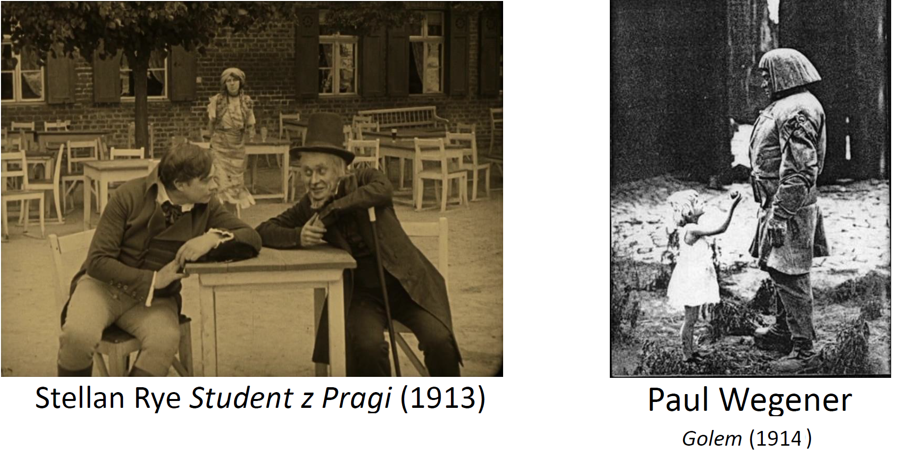

#### 📌 *Cechy*

teatr, literatura, efekt "dziwności", jeszcze bez charakterystycznej plastyki ekspresjonistycznej.

### **Kino wilhelmińskie** (ok. 1913–1918)

#### 🕰️ Kontekst:

- Okres **po I wojnie światowej**, w czasach **Republiki Weimarskiej**.
- Społeczne rozbicie, trauma wojenna, inflacja, poczucie bezsensu.
- Kino staje się **narzędziem psychologicznego i estetycznego niepokoju**.

#### 🎬 Przykładowe filmy:

| Tytuł                                                        | Reżyser       | Znaczenie                                                    |
| ------------------------------------------------------------ | ------------- | ------------------------------------------------------------ |
| [**Gabinet doktora Caligari** (1920)](https://youtu.be/m59RU6Fvc-g?si=rtDFCF17o8LM5LID) | Robert Wiene  | Klasyczny ekspresjonizm – **świat jako sen wariata**         |
| [**Nosferatu** (1922)](https://youtu.be/dCT1YUtNOA8?si=hW6rsO6yoYS8lZ0M) | F.W. Murnau   | Gotycki horror, estetyka światłocienia, **groza jako natura** |
| [**Golem** (1920) – nowa wersja](https://youtu.be/a6eu8gypnLo?si=BbhkyCdvBDZqaGak) | Paul Wegener  | Bardziej ekspresjonistyczna, monumentalna wersja wcześniejszego filmu |
| **Portier z hotelu Atlantic** (1924)                         | F.W. Murnau   | **Kammerspiel** – dramat psychologiczny, montaż wewnątrzkadrowy |
| [**Nibelungi** (1924)](https://youtu.be/M4ySPC42y28?si=UKyEab7XCb_Ko4Wo) | Fritz Lang    | Monumentalne kino mitologiczne, **symboliczne, ciemne i monumentalne** |
| [**Metropolis** (1926)](https://youtu.be/PmJRzuU4EHA?si=WYn5BkdLXlT_i1Le) | Fritz Lang    | Kino futurystyczne + ekspresjonizm + socjologia – **wizja świata industrialnego i klasowego** |
| **Faust** (1926)                                             | F.W. Murnau   | Adaptacja Goethego – **baśniowy horror z rozbudowaną plastyką** |
| [**Student z Pragi (1926)**](https://youtu.be/Guw03WOfyuU?si=6RpuEgghif8KuvUy) | Henrik Galeen | Bardziej ekspresjonistyczna, monumentalna wersja wcześniejszego filmu |
| [**Dr. Mabuse: Gracz (1922)**](https://youtu.be/LR42CfEUNhI?si=frZgGed6_slxESpi) | Fritz Lang    | Tytułowy Mabuse to **mistrz manipulacji i hipnozy**, symbol **chaosu społecznego i nadchodzącego totalitaryzmu**. |

#### 📌 *Cechy*

- deformacja, światło-cień, symbolika, poczucie losu, nierealna przestrzeń.
-  filmy, które **celowo deformują świat**, by wyrazić **emocje, lęki i psychikę**.
- 🎭 **Zdeformowana scenografia** - Przestrzenie przypominają koszmary senne – **krzywe ściany**, **dziwne kąty**, **malowane cienie**. Świat przedstawiony to **stan psychiczny bohatera**, nie realistyczne miejsce.
- ✋ **Przerysowana gra aktorsk** - Ruchy teatralne, często inspirowane **teatrem cieni**, **tańcem** i **mimem** – ciało wyraża emocję.
- 💀 **Tematyka** - Szaleństwo, rozdwojenie jaźni, przemoc, fatum, zło, władza, mit – kino staje się **psychologicznym lustrem podświadomości zbiorowej**.

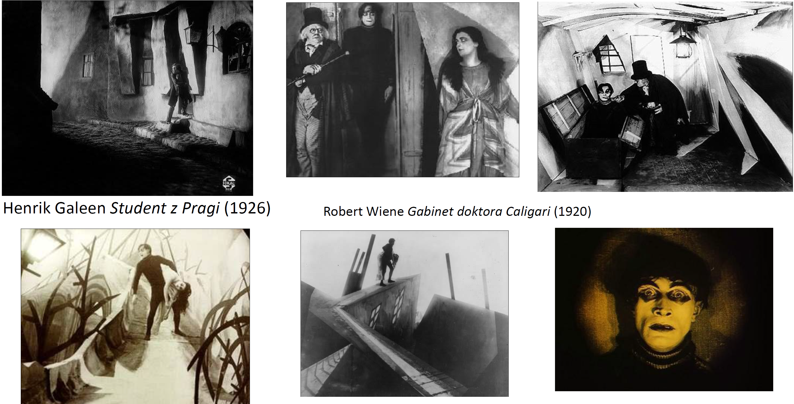

### Różnice

| Cecha       | Kino wilhelmińskie             | Kino weimarskie                          |
| ----------- | ------------------------------ | ---------------------------------------- |
| Epoka       | Przed I wojną                  | Po I wojnie                              |
| Ton         | Romantyzm, fantastyka, legenda | Trauma, psychologia, niepokój            |
| Scenografia | Naturalna lub teatralna        | Zdeformowana, ekspresjonistyczna         |
| Motywy      | Sobowtóry, mity, homunculus    | Szaleństwo, władza, klasa, zło           |
| Styl        | Eksperymentalny, klasyczny     | Ekspresjonistyczny, mroczny, symboliczny |

### Kino scenografów

> Kino, w którym **scenografia nie jest tylko tłem**, ale **aktywnym uczestnikiem fabuły** – **odbiciem stanu psychicznego postaci**, a nie realistycznym miejscem.

🎬 Przykład:

**„Gabinet doktora Caligari” (1920), reż. Robert Wiene**

- Cały film rozgrywa się w **światach malowanych**: krzywe ulice, poszarpane dachy, cienie namalowane na podłodze.
- Przestrzeń wygląda **jak koszmarna wizja schizofrenika** – bo… *fabuła dzieje się wewnątrz głowy bohatera*.
- **Nie ma realistycznych wnętrz ani ulic** – scenografia jest **projekcją psychiki, lęków, obłędu**.

📌 To pierwszy raz w historii kina, gdy **forma przestrzeni podporządkowana jest emocji** – a nie odwrotnie.

### 🎨 **Matte painting**

> Technika polegająca na **malowaniu fragmentów kadru na szkle**, które następnie **łączy się optycznie z planem filmowym** – tworząc **iluzję wielkich, niedostępnych lub nierealnych przestrzeni**.

🎬 Przykład:

**„Metropolis” (1926), reż. Fritz Lang**

- Gigantyczne panoramy miasta przyszłości – **nie zbudowano ich fizycznie**.
- Wykorzystano **matte painting**: w tle – namalowana metropolia z wieżowcami, na planie – aktorzy w studio.
- Efekt: **przekonująca iluzja gigantycznego miasta** przemysłowego, z windami, mostami, tłumami.

📌 Matte painting pozwolił **budować świat, którego nie dało się zbudować naprawdę**, zachowując wiarygodność wizualną.

### 📽️ **Proces Schüfftana**

> **Przodek greenscreenu**: technika optyczna, w której **aktualny plan filmowy (aktorzy)** łączony jest z **modelem lub malunkiem**, **w jednym fizycznym ujęciu**, bez montażu.
>
> 

🎬 Przykład:

**„Metropolis” (1926)**

- W scenach z **olbrzymią maszyną i robotnikami** – nie wszystko było zbudowane.
- Użyto **miniaturowych modeli**, które poprzez **lustrzane odbicia** na szklanej tafli łączono z aktorami.
- Dzięki temu aktorzy **„wchodzili” w dekoracje**, które istniały tylko jako miniatury.

📌 Pozwoliło to **pokazać ogromne przestrzenie i konstrukcje**, nie wydając fortuny na budowę scenografii.

### 🪞 **Kammerspiel** – filmowy „teatr kameralny”

No ale nie samym eskpresjonizemem niemcy żyli i też powstał **Kammerspiel** - nurt psychologiczno–realistyczny.

> Przeciwieństwo ekspresjonizmu wizualnego: **realistyczne, intymne, psychologiczne kino**, bez deformacji, ale z głęboką emocją.

🎬 Przykład:

**„Der Letzte Mann” / „Portier z hotelu Atlantic” (1924), reż. F.W. Murnau**

- Opowieść o **starszym portierze**, który traci prestiżową pracę – dramat **osobisty, nie społeczny**.
- **Nie ma plansz dialogowych** – wszystko opowiedziane **językiem ciała i kamery**.
- Film kręcony w **autentycznych wnętrzach**, z kamerą w ruchu (*kamera na wózku, na huśtawce, przyczepiona do roweru*).

📌 Kammerspiel to **kino spojrzenia, gestu i sytuacji codziennej**, a nie groteski i potworności.

## 3.3 Film Noir – amerykański cień ekspresjonizmu

Fritz Lang, reżyser ekspresjonistyczny, przenosi estetykę niemieckiego kina lat 20. do amerykańskiego thrillera psychologicznego – tworząc film   *Ministerstwo strachu* (1944)  rodzi się **styl noir** o niepewnej tożsamości i ukrytym zagrożeniu.

**Film Noir** - Styl narodzony w USA w latach 40., ale **pełen niemieckich wpływów** (Lang, Wilder).

🖤 Cechy noir:

- **Kontrasty światła i cienia** – światłocień, żaluzje, neonowa noc.
- **Bohater antybohater** – prywatny detektyw, były glina, samotny mściciel.
- **Femme fatale** – kobieta zguba.
- **Poczucie zagrożenia, paranoi, fatalizmu**.
- **Atmosfera zagrożenia i lęku** – nie wiadomo, kto jest kim.
- **Stylistyka światło-cienia** – silne kontrasty, ekspresjonistyczne kadry.
- **Motyw traumy** – przeszłość bohatera (instytucja psychiatryczna) wpływa na jego odbiór rzeczywistości.
- **Brak zaufania do instytucji, mediów, ludzi** – typowe dla filmów noir z czasów wojennych.

| Film                                                         | Reżyser          | Uwagi                                                        |
| ------------------------------------------------------------ | ---------------- | ------------------------------------------------------------ |
| [Ministerstwo strachu (1944)](https://youtu.be/RZV9Gp6ipEE?si=_QbJKvAhbDTPvIQc) | Fritz Lang       | Amerykański thriller szpiegowski z elementami noir, adaptacja powieści Grahama Greene’a. Pogranicze noir i ekspresjonizmu. |
| [*Zbłąkany pies* (1949)](https://youtu.be/qFS0mo0tO8g?si=VouqoL3tM9azd5w6) | Akira Kurosawa   | japoński noir z psychologią postaci                          |
| [*Niewłaściwy człowiek* (1956)](https://youtu.be/9RKEUzQe30M?si=3ehIwVstb_L1QKQH) | Alfred Hitchcock | człowiek wplątany w zbrodnię                                 |
| [*Psychoza* (1960)](https://youtu.be/0WtDmbr9xyY?si=8afX0QifpmQE5SYr) | Hitchcock        | horror z noir-ową psychologią                                |
| [*Chinatown* (1974)](https://youtu.be/p39LFdGI-YA?si=DjHLrteSieDuvnwA) | Roman Polański   | arcydzieło **neo-noir** – dekonstrukcja gatunku              |

### 🎥 *Ministerstwo strachu* (1944), reż. Fritz Lang

- Thriller szpiegowski z czasów II wojny światowej, **pełen atmosfery paranoi i nieufności**.
- Bohater – były pacjent szpitala psychiatrycznego – przypadkowo trafia w środek siatki niemieckich agentów w Anglii.
- Styl: **silne kontrasty światła i cienia, klaustrofobiczne wnętrza, zamglone realia** – typowa ekspresjonistyczna estetyka noir.
- Motywy: **zatarcie granicy między winą a niewinnością**, **niepewność tożsamości**, **trauma przeszłości**.

> 📌 **Film noir w wersji wojennej** – paranoja, manipulacja, niemożność ucieczki od systemu i samego siebie.

### 🎥 *Zbłąkany pies* (1949), reż. Akira Kurosawa

- **Japońska wersja filmu noir**, osadzona w powojennym Tokio.
- Młody detektyw gubi służbowy pistolet, który trafia w ręce przestępcy – cała fabuła to **wewnętrzna podróż przez moralne rozdarcie bohatera**.
- Styl: **ciemne ulice, upał, pot, brud miasta**, dekadencki klimat.

> 📌 Noir przeniesiony w realia japońskiego kryzysu i **psychologicznej winy**.

### 🎥 *Niewłaściwy człowiek* (1956), reż. Alfred Hitchcock

- Bohater (muzyk) zostaje **omyłkowo oskarżony o napad** – klasyczny motyw **człowieka wplątanego w obcą intrygę**.
- Film oparty na faktach – **surowy realizm**, bez typowego suspensu Hitchcocka.
- Żona bohatera popada w obłęd – **noir-owa psychologia traumy i niemożności działania**.

> 📌 Noir w wersji hiperrealistycznej, **bez stylizacji**, ale z pełną atmosferą lęku i niesprawiedliwości.

### 🎥 *Psychoza* (1960), reż. Alfred Hitchcock

- Formalnie horror, ale **pełen elementów noir**:
  - **kobieta z tajemnicą**,
  - **deszcz, motel, izolacja**,
  - **ciemne wnętrza i cieniste kadry**.
- Motyw: **podwójna tożsamość, przeszłość która determinuje teraźniejszość**, wyparta trauma.

> 📌 Noir przetworzony w **thriller psychologiczny** – przemoc, seks, samotność, winna kobieta.

> Tu jest giga znana scena, która wyznaczyła wgl co to znaczy straszna muzyka w kinie -> https://youtu.be/0WtDmbr9xyY?si=8afX0QifpmQE5SYr

### 🎥 *Chinatown* (1974), reż. Roman Polański

- Arcydzieło **neo-noir**: styl i struktura klasycznego noir, ale z dekonstrukcją mitu sprawiedliwości.
- Prywatny detektyw trafia na sprawę przekrętów wodnych, ale odkrywa **systemową korupcję i kazirodczą tragedię**.
- Styl: **ciemne garnitury, cienie żaluzji, femme fatale**, ale fabuła idzie dalej – **nie ma ratunku, nie ma nadziei**.

> 📌 Noir XXI wieku: **świat jako maszyna zła, a detektyw jako pionek**.

## 3.4 Podsumowanie

Jasne:

Po tym, jak **Griffith ustalił zasady filmowej narracji**, kino rozeszło się w trzy różne kierunki:

- **Szkoła Szwedzka** – kontemplacja, natura, psychologia; *świat odbija duszę bohatera*.
- **Ekspresjonizm niemiecki** – przerysowanie, mrok, lęk; *świat jest koszmarem psychicznym*.
- **Film Noir** – miejski cień, fatalizm, cynizm; *ekspresjonizm w realiach detektywa i zbrodni*.

Trzy różne odpowiedzi kina na pytanie: **jak pokazać to, co niewidzialne**.

# 4. Rewolucja w formie – montaż, subiektywność i dźwięk (1920–1930+)

ten wykład to eksplozja **eksperymentu, formy i świadomości kamery**. Mamy tu:

1. **Awangardę radziecką** – kino jako rewolucja w formie i treści.
2. **Początki teorii montażu** – Eisenstein, Kuleszow, Pudowkin.
3. **Eksperymenty z obrazem** – POV, split screen, eksperyment formalny.
4. **Przejście do kina dźwiękowego** – przełom 1927 r.

## 4.1 Awangarda radziecka – kino jako broń idei

> Przypominka:
>
> **awangarda** - Słowo **awangarda** pochodzi z francuskiego *avant-garde* i oznacza dosłownie: „straż przednia” – ta część wojska, która **idzie na przedzie kolumny**, przecierając szlak.
>
> ### 🎨 W sztuce:
>
> **Awangarda **to nurt artystyczny lub postawa, która:**
>
> - **przeciera nowe drogi**, zrywa z tradycją,
> - **eksperymentuje z formą, językiem, materiałem**,
> - **protestuje przeciwko zastanym regułom, stylom i wartościom**,
> - często jest **trudna w odbiorze**, prowokacyjna, zrozumiała tylko dla nielicznych „wtajemniczonych”.

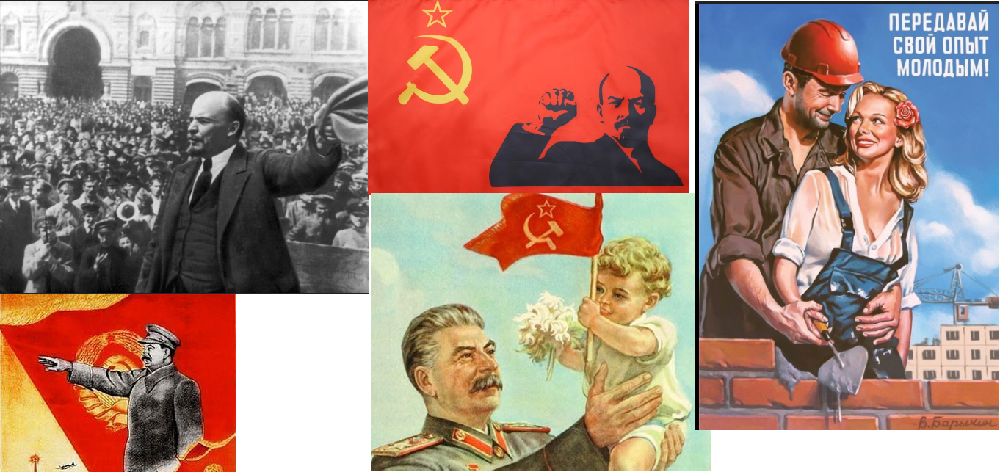

W 1918 w Rosji wybuchła rewolucja październikowa. Do władzy doszli komuniści na czele z Leninem, który powiedział:

Po rewolucji październikowej 1917 roku Lenin powiedział:

> 🎯 „Ze wszystkich sztuk najważniejsze jest dla nas kino.”

Dlaczego? Bo film docierał do mas, a masy trzeba było przekonać do nowego porządku.
Tak narodziła się **awangarda radziecka** – nie kino rozrywki, lecz **kino działania, agitacji i konstrukcji nowego człowieka**.

### 🎬 Główne cechy:

#### 1. **Montaż jako myślenie**

- Awangarda radziecka traktowała **montaż nie tylko jako łączenie ujęć**, ale jako **narzędzie ideologii**.
- Montaż miał **tworzyć sens**, **wywoływać emocje**, **kształtować postawy**.
- Ujęcia miały nie opowiadać realistycznie, ale **zderzać się** – jak wybuchy znaczeń.

#### 2. **Typaż zamiast gwiazd**

- Reżyserzy odrzucali hollywoodzkie „gwiazdy”.
- Zamiast tego dobierali aktorów **po twarzy, sylwetce, geście** – **człowiek miał być znakiem idei**, nie osobowością.
- **Twarz matki, robotnika, chłopa** – miała wyrażać klasę, nie jednostkę.

#### 3. **Ideologia przez formę**

- Kino nie tylko mówiło „co”, ale przede wszystkim **„jak”**.
- Ułożenie kadrów, rytm montażu, kontrasty – wszystko miało **kierować emocjami widza ku komunizmowi, walce, rewolucji**.

### 🎬 Kluczowe filmy i twórcy

| Film                                                         | Reżyser             | Znaczenie                                                    |
| ------------------------------------------------------------ | ------------------- | ------------------------------------------------------------ |
| [**Aelita** (1924)](https://youtu.be/KkeXXH22Ck0?si=ggcXieJm79GalVhB) | Jakow Protazanow    | Pierwszy radziecki sci-fi – lot na Marsa jako **utopia rewolucji**. Znakomite kostiumy **Aleksandry Ekster** – awangardowa plastyka w służbie idei. |
| [**Matka** (1926)](https://youtu.be/lCFJZZYyqrE?si=FubCLJI6HlLoSlmZ) | Wsiewołod Pudowkin  | Oparty na powieści Gorkiego. Montaż **emocjonalny** – zbliżenia twarzy, spojrzeń, dramatyczne rytmy. **Matka jako symbol rewolucji dojrzewającej w bólu**. |
| [**Ziemia** (1930)](https://youtu.be/A-E57eyjoao?si=y-V2d8GYyETkjE9b) | Ołeksandr Dowżenko  | Film-liryka. Poetyckie obrazy pól, chmur, ciał. Rewolucja jako **rytuał naturalny**, niemal religijny. Montaż jako **poezja obrazu**. |
| [**Człowiek z kamerą** (1929)](https://youtu.be/3GyNB4-eN1E?si=vNKHCXuBhVQih9X7) | Dziga Wiertow       | **Film o robieniu filmu** – bez aktorów, bez fabuły. Kino jako **czysta maszyna postrzegania**. Montaż jako proces myślowy i fizjologiczny. |
| [**Pancernik Potiomkin** (1925)](https://youtu.be/a_bkBbrdyyw?si=4TswK_Jdd1DIM5rF) | Siergiej Eisenstein | Arcydzieło montażu. Scena **Schodów Odeskich** – rytm, przemoc, emocja. **Montaż jako wybuch znaczenia**, nie ciągłość. |
| [**Październik** (1927)](https://youtu.be/9DSpIA9ZqO8?si=orlHTelaOpDJUUtZ) | Eisenstein          | Jeszcze bardziej formalny. Ujęcia symboliczne: Chrystus → Budda → bogowie – zderzenie idei. **Montaż intelektualny** – widz ma **zrozumieć**, nie tylko poczuć. |

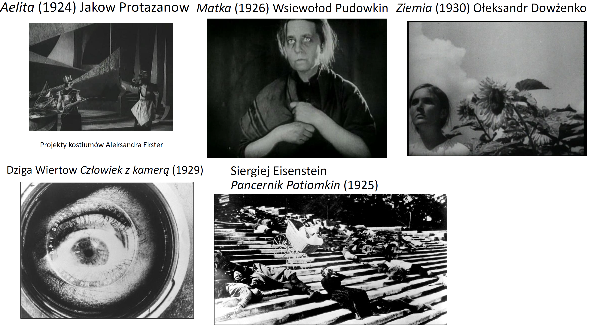

#### 📚 **Awangarda radziecka – definicja**

> Kierunek filmowy rozwijany w latach 20. XX w. w ZSRR, traktujący kino jako **narzędzie kształtowania świadomości społecznej**. Najważniejsze było **„jak” się pokazuje – forma była treścią**.

🎯 Awangarda radziecka traktowała kino jak laboratorium myśli i emocji – zamiast opowiadać historie, miała **kształtować nowego człowieka.**

## 4.2 Efekt Kuleszowa – narodziny sensu z montażu

Na początku XX wieku filmowcy zadawali sobie pytanie:

> **Czy ujęcie samo w sobie coś znaczy? Czy znaczenie rodzi się dopiero między ujęciami?**

W odpowiedzi **Lew Kuleszow**, radziecki teoretyk i reżyser, przeprowadził prosty, ale genialny eksperyment, który zmienił historię kina.

Zanim zaczniesz czytać dalej -> [OBEJRZYJ TO](https://youtu.be/_gGl3LJ7vHc?si=msKnojx30fs9yQ7F).

### 🧪 Eksperyment Kuleszowa (ok. 1918–1921)

🔹 Materiały:

- **Ujęcie 1**: twarz aktora Iwana Mozżuchina – neutralna, bez emocji.
- **Ujęcie 2**: zupa / trumna / dziewczynka bawiąca się.

🔁 Kombinacje:

1. **Twarz + zupa** → widz widział **głód**.
2. **Twarz + trumna** → widz widział **smutek**.
3. **Twarz + dziewczynka** → widz widział **czułość**.

Wszystkie trzy kombinacje używały **tej samej twarzy** – bez zmiany ekspresji.

### 🧠 Co z tego wynika?

> Znaczenie **nie jest zawarte w samym ujęciu**, lecz powstaje z ich zestawienia.
>  To **montaż tworzy sens**, emocję i narrację –  **tak samo jak zdanie powstaje z połączenia słów**.

### 🎯 Znaczenie efektu Kuleszowa

#### 1. Narodziny filmowej semantyki

- Film zaczyna być rozumiany **nie jako rejestracja rzeczywistości**, ale jako **język** (w międzyczasie Griffith robi to samo)
- Montaż to **gramatyka filmu** – dzięki niemu reżyser może *sugerować, porównywać, zestawiać, prowokować*.

#### 2. Podstawa dla radzieckiej szkoły montażu

- Eisenstein, Pudowkin, Wiertow rozwijają tę myśl:
  - **Eisenstein**: montaż = konflikt idei,
  - **Pudowkin**: montaż = emocjonalna droga bohatera,
  - **Wiertow**: montaż = maszyna myślenia.

#### 3. Fundament dla kina światowego

- Każdy montaż (film, reklama, teledysk) **bazuje na założeniu, że widz zestawia ujęcia w sensowną całość**.
- Efekt wykorzystywany też w montażu równoległym, reakcjach twarzy, symbolice obrazu.

## 4.3 Montaż wg Eisensteina

**Siergiej Eisenstein** traktował montaż nie jako technikę porządkowania filmu, ale jako **narzędzie do przekazania myślenia czy filozofii**.

Zaproponował **klasyfikację typów montażu**, od najprostszego technicznie do najbardziej ideowego.

### 🧩 Typy montażu wg Eisensteina

| Typ montażu                                  | Na czym polega?                                              | Przykład z filmu                                             |
| -------------------------------------------- | ------------------------------------------------------------ | ------------------------------------------------------------ |
| **1. Metriczny**                             | Cięcia odbywają się **według równego rytmu czasowego**, niezależnie od treści ujęcia. | *„Październik”* (1927): chaotyczna scena z tłumem i bronią – cięcia co 2 sekundy nadają **mechaniczny, bezlitosny rytm**.] |
| **2. Rytmiczny**                             | Cięcia są dopasowane do **ruchu w kadrze** – rytm wynika z tego, co się dzieje, a nie z zegarka. | [*„Pancernik Potiomkin”* (1925): scena **Schodów Odeskich** – montaż reaguje na bieg, upadki, krzyk, oddanie strzału.](https://youtu.be/a_bkBbrdyyw?si=kpy-Si3j4mrv1PyT&t=2892) |
| **3. Toniczny** (tonalny)                    | Montaż oparty na **emocjonalnym nastroju sceny** – zmienia się tempo cięć, długość ujęć, kontrasty światła. | *„Matka”* (1926): gdy matka rozpacza – cięcia są **wolne, ciężkie, zbliżenia twarzy i powolna dynamika**. |
| **4. Ponadtonalny**                          | Połączenie **tonalnego + rytmicznego + metricznego** – działa na wielu poziomach jednocześnie (emocja + rytm + czas). | Rzadziej wyróżniany oddzielnie; obecny jako **gęsty, emocjonalny finał** np. w *Październiku*. |
| **5. Intelektualny**                         | **Zderzenie znaczeń** – ujęcia nie mają związku fizycznego, ale **tworzą metaforę lub ideę**. | [*„Październik”*: Bóg → krzyż → totem → maszyna – **religia = opresja = system = przemysł**.](https://youtu.be/9DSpIA9ZqO8?si=EUTC4ckW88fzDtKV&t=1896) |
| **6. Asocjacyjny** (wariant intelektualnego) | Ujęcia budują **symboliczny sens** przez zestawienie obrazów niczym znaki (np. chińskie kanji). | *„Październik”*: kobieta + dziecko = miłość (jak znaki ideograficzne). |

### 🧠 Przykład montażu intelektualnego

[TA scena chyba](https://youtu.be/9DSpIA9ZqO8?si=EUTC4ckW88fzDtKV&t=1896)

>  Tu się przyda kontekst historyczny: Komunizm opierał się na totalnym odrzuceniu religi oraz kapitalizmu. Boga nie ma, a każdy człowiek ma być wolny i równy. Komuniści chcieli sprzedać wizję religii jako mechanizm kontroli i zniewolenia społeczeństwa przez władze kapitalistyczne, które potrzebował niewolników do swoich fabryk i przemysłu. 

W *„Październiku”* Eisenstein pokazuje:

1. Obraz boga chrześcijańskiego,
2. Następnie totemy, buddy, hinduskie figury,
3. Potem maszyny, fabryki, parę i tryby.

Przeplatając naprzemiennie te 3 sceny.

📌 Widz sam łączy znaczenie:
 **religia = zbiór mitów = system opresji = trybiki kapitalizmu.**

> 🧠 **Obraz przestaje przedstawiać – zaczyna argumentować.**

## 4.4 Dziedzictwo awangardy radzieckiej

Wpływ montażu i środków formalnych *spoza narracji klasycznej*,

kontynuacje w kinie **psychologicznym** (Dreyer), **eseistycznym** (Godard) i **formalnie eksperymentalnym** (Mann).

### [Carl Theodor Dreyer – „Męczeństwo Joanny d’Arc” (1928)](https://youtu.be/wfXwcQ6XeZg?si=GISpzYBRjwi36TWX)

- Dreyer stosuje **radykalny montaż zbliżeń** – emocje budowane tylko twarzą.
- Minimalna scenografia, dominująca **ascetyczność formy**.
- Film **czysto wizualny i psychologiczny**, jakby „na granicy awangardy”.

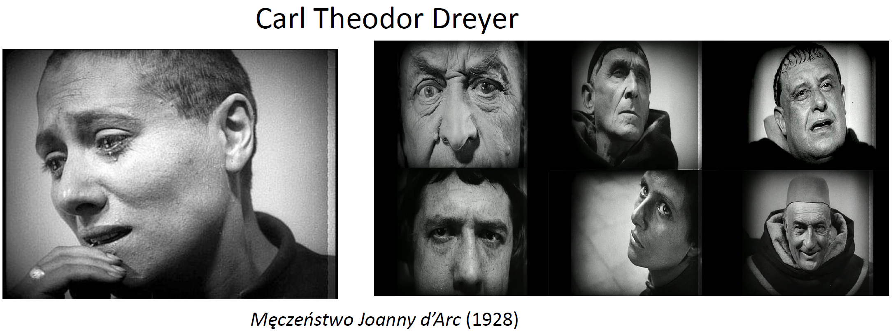

 → Dreyer **łączy duchowość z formą filmową** – jak *Ziemia* Dowżenki czy *Matka* Pudowkina.
 → Estetycznie i tematycznie to *awangarda przez skupienie* – montaż jako cisza.

### [Jean-Luc Godard - Żyć własnym życiem(1962)](https://youtu.be/ZAZGR5O33jw?si=0m4RUDJgtOCfvosz)

- Sekwencje montowane **nielinearnie**, w formie **eseju filmowego**.
- Inspirowany **awangardą, radziecką i francuską**.
- Scena oglądania *Męczeństwa Joanny d’Arc* wewnątrz filmu – *świadomość kina*.

 → Godard to **spadkobierca Eisensteina** – traktuje film nie jako opowieść, ale jako **montaż idei i obrazów**.
 → **Awangarda intelektualna** – jak Październik, ale po francusku.

##  4.5  **Eksperymenty formalne – POV i Split Screen**

### **POV (point of view shot)** – ujęcie z oczu bohatera

Widz widzi to, co bohater → empatia, identyfikacja.

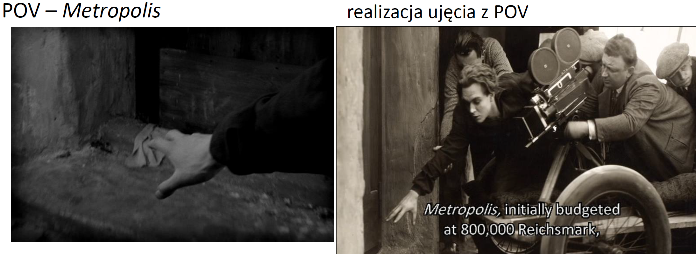

Przkładem też jest ta scena z [Michael Mann Zakładnik(ang.Collateral) 2004](https://youtu.be/d9_n6wwkIHM?si=2QKOlapiBRR4rZXi)

| 📌 **Obiektywny punkt widzenia**                              | 👁️ **Subiektywny punkt widzenia (POV shot)**                  |
| ------------------------------------------------------------ | ------------------------------------------------------------ |
| Kamera działa jak **niewidzialny obserwator**.               | Kamera **zastępuje spojrzenie postaci** – widzimy to, co widzi bohater. |
| Pokazuje świat „z zewnątrz”, neutralnie.                     | Tworzy silniejsze utożsamienie widza z emocjami, przeżyciami postaci. |
| Najczęstszy w kinie narracyjnym (*styl zerowy*).             | Może być używana do pokazania **dezorientacji, strachu, pożądania, halucynacji**, itp. |
| Widz **nie zajmuje miejsca postaci**, tylko ogląda ją z boku. |                                                              |
| Przykład: klasyczne ujęcie rozmowy dwóch osób przy stole z neutralnej pozycji. | Przykład: [scena z *Psychozy* (Hitchcock), kiedy kamera pokazuje zbliżające się ostrze oczami ofiary.](https://youtu.be/0WtDmbr9xyY?si=ItAB0UertY_ePYiw&t=59) |

### Split screen (podzielony ekran)

Jednoczesne pokazywanie dwóch/więcej wydarzeń.

## 4.6 🎙️ Początki kina dźwiękowego

[**„Śpiewak jazzbandu” (The Jazz Singer, 1927)**](https://youtu.be/HCPMaAnohMs?si=b6lBXtV5Ih5Sh_6G) w reżyserii Alana Croslanda to film, który przeszedł do historii jako **pierwszy dźwiękowy film fabularny**, tzw. *talkie* – czyli film z **synchronizowanym dźwiękiem mówionym**.

### 🔧 Jak to działało?

Film powstał przy użyciu systemu **Vitaphone** – dźwięk był **nagrywany oddzielnie na płytach gramofonowych**, a potem **synchronizowany z projekcją**. To jeszcze nie było pełne udźwiękowienie wszystkich dialogów – większość filmu wciąż była niema, ale zawierał **kilka scen mówionych** i [**piosenki śpiewane  przez Ala Jolsona**, m.in. słynne „Toot, Toot, Tootsie”.](https://youtu.be/8SzltpkGz0M?si=pbQHxf21ru01D8qh)

### 🎭 Reakcje twórców

- **Awangarda europejska i twórcy kina artystycznego** reagowali **z rezerwą**. Uważali, że:
  - dźwięk zubaża **uniwersalność obrazu**,
  - narzuca „gadające głowy” i **teatralizację kina**,
  - odbiera obrazowi jego **czysto filmowy język**.
- Reżyserzy jak **Chaplin** długo pozostali wierni **kinu niememu**, bo uważali, że **emocje najlepiej wyraża się obrazem, ruchem i mimiką**.

### 📉 Trudności techniczne

- Mikrofony były **duże, nieruchome** – aktorzy musieli mówić w jednym miejscu.
- Kamery musiały być **zamknięte w specjalnych pudłach wygłuszających**, co ograniczało ich ruch.
- Studia musiały być **całkowicie wytłumione**, co eliminowało wcześniejszy realizm plenerowy.

### 🔁 Przełom i rewolucja

Mimo oporu, sukces *Śpiewaka jazzbandu* okazał się **komercyjnym trzęsieniem ziemi**:

- W ciągu kilku lat **cały przemysł przeszedł na dźwięk**.
- Rozwinęły się nowe gatunki: **musical**, **komedia dialogowa**, **kryminał z dialogiem**.
- **Hollywood** stało się jeszcze potężniejsze, bo dźwięk wymagał **studiów z infrastrukturą**, których nie miała Europa zniszczona wojną.

## 4.7 Podsumowanie

- **Rewolucja → kino awangardowe**: forma jako ideologia.

- **Myśl wyrażona montażem**: Kuleszow i Eisenstein uczą, że znaczenie leży w cięciach.

- **Kamera zyskuje świadomość**: subiektywność, wielość spojrzeń (POV, split).

- **Dźwięk zamyka epokę niemoty**: *Śpiewak jazzbandu* jako symbol przełomu.

# 5: Obywatel Kane i rewolucja w ramach klasyki (1940–1950)

**Kino autorów i eksperyment w ramach Hollywoodu**. Głównym bohaterem jest oczywiście **Orson Welles** i jego *Obywatel Kane* – film, który często pojawia się na liście „najlepszych w historii”. Obok niego pojawiają się inne tytuły i twórcy, którzy rozciągali granice klasycznego kina, często **w ramach jego zasad** – nie łamiąc ich całkowicie, lecz **eksperymentując z wnętrza**.

## 5.1: Orson Welles i potrójne autorstwo – scenariusz, reżyseria, zdjęcia

„Obywatel Kane” (1941) nie był dziełem jednego człowieka, ale rezultatem **trójstronnego partnerstwa**, które wpłynęło na całą historię kina.

- **Herman J. Mankiewicz** – doświadczony scenarzysta z Hollywood, odpowiedzialny za **pierwotny szkic scenariusza**. To on wprowadził wątek fikcyjnego magnata prasowego wzorowanego luźno na Williamie Randolphie Hearstcie.
- **Orson Welles** – **wizjoner reżyser**, zaledwie 25-letni debiutant w kinie, ale już znany z teatralnych innowacji i [radiowego eksperymentu („Wojna światów”)](https://youtu.be/Xs0K4ApWl4g?si=o5Q5zIOY51fB4e-W). Nadał filmowi **strukturę mozaikowej narracji**, złożył historię z rozproszonych wspomnień.
- **Gregg Toland** – operator-eksperymentator, który przyniósł ze sobą **techniczne innowacje zdjęciowe**, zwłaszcza głębię ostrości i nietypowe kąty kamery. Współpracował z Wellesem **jako równorzędny autor wizji**.

👉 **Co ważne**: Welles – mimo że figuruje jako główny autor – **dzielił kontrolę twórczą** z pozostałymi. Film powstał dzięki **symbiozie trzech osobowości**, co stało się precedensem dla późniejszego rozumienia **kina autorskiego**.

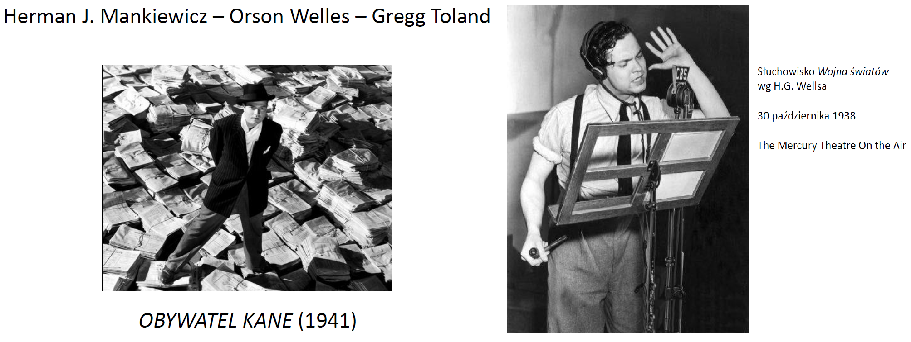

## 5.2 2: *Obywatel Kane* (1941) – **formalna rewolucja**

Film opowiada historię **Charlesa Fostera Kane’a**, magnata prasowego, który umiera samotnie w pałacu Xanadu. Jego ostatnie słowo – *„Różyczka” (Rosebud)* – staje się punktem wyjścia dla dziennikarskiego śledztwa. Jednak zamiast jednej, spójnej biografii, otrzymujemy **mozaikę sprzecznych wspomnień**.

#### 🕵️‍♂️ Narracja jako śledztwo

Każda osoba opowiada Kane’a inaczej – **przez pryzmat własnych emocji, interesów, zawodów**. Ostatecznie nikt nie zna prawdy. To wprowadza figurę **narratora niewiarygodnego**: widz musi sam zbudować własną wersję Kane’a.

### 🎥 Formy, które zrewolucjonizowały kino:

| **Element**                       | **Znaczenie / Innowacja**                                    |
| --------------------------------- | ------------------------------------------------------------ |
| **Głębia ostrości**               | Dzięki technice Gregga Tolanda, wszystko w kadrze – od pierwszego po ostatni plan – jest ostre. Widz może samodzielnie „czytać” obraz. To **przeciwieństwo klasycznego prowadzenia wzroku**. |
| **Montaż wewnątrzkadrowy**        | Akcja rozwija się w obrębie **jednego ujęcia**: np. dzieci bawiące się na śniegu widoczne za oknem podczas rozmowy rodziców z prawnikiem – dramatyczna ironia sceny zawarta bez cięć. |
| **Zdjęcia pod kątem (low angle)** | Kamera często filmuje bohaterów z dołu – **Kane wydaje się olbrzymi, monumentalny**, ale też przytłaczający i groźny. |
| **Nietypowa chronologia**         | Opowieść to **zbiór retrospekcji** – żadna nie jest nadrzędna, nie ma jednej „wersji wydarzeń”. |
| **Styl noir**                     | Mimo że film nie jest klasycznym noir, pojawiają się jego cechy: **kontrasty światłocienia, atmosfera tajemnicy, sylwetki w cieniu, fatalizm**. To estetyczne preludium do czarnego kina lat 40. |
| **Narrator niewiarygodny**        | każda wersja Kane’a inna, nikt nie zna prawdy,  każdy wspomina inaczej |

### :man: Obywatel Kane jako kino operatorów

Choć Orson Welles był twórcą wizji *Obywatela Kane’a*, to jego rewolucyjne podejście do formy **nie byłoby możliwe bez geniuszu operatora Gregga Tolanda**.

W tym filmie **kamera przestaje być przezroczystym rejestratorem** wydarzeń. Zamiast tego staje się **aktywnym narratorem**, który **kieruje odbiorem, sugeruje sensy, a czasem je kwestionuje**.

| Element zdjęciowy                          | Znaczenie i zastosowanie                                     |
| ------------------------------------------ | ------------------------------------------------------------ |
| **Głębia ostrości**                        | Wszystko w kadrze jest ostre – **nawet plan czwarty**. Dzięki temu widz może wybierać, na co patrzy (np. scena, w której młody Kane bawi się na śniegu, a jego przyszłość rozgrywa się w rozmowie rodziców na pierwszym planie). |
| **Oświetlenie kontrastowe (światło-cień)** | Wprowadza estetykę noir – **mrok, dramatyzm, izolacja postaci w cieniu** (np. samotny Kane w pustej sali z echem kroków). |
| **Low angle shots (ujęcia od dołu)**       | Budują **monumentalność i grozę** Kane’a, zwłaszcza w scenach władzy i dominacji. Czasem widać nawet sufit – rzadkość w tamtych czasach! |
| **Kompozycja warstwowa**                   | Sceny są **wieloplanowe** – działanie rozgrywa się jednocześnie z przodu i z tyłu kadru (np. scena z lustrem: przeszłość i przyszłość Kane’a w jednej przestrzeni). |

#### 🧠 Dlaczego mówimy o „kinie operatorów”?

- *Obywatel Kane* pokazuje, że **znaczenia w filmie mogą być tworzone nie tylko przez montaż**, ale **przez kompozycję kadru, światło, ruch kamery i głębię**.
- Operator (Toland) nie tylko „ilustruje” scenariusz – **współtworzy sens filmu razem z reżyserem**.
- To model, w którym **operator staje się autorem na równi z reżyserem** – rzadkość w klasycznym Hollywood.

## 5.3 **Welles przed „Kane’em”: „Wojna światów” (1938) – słuchowisko radiowe**

- Adaptacja powieści H.G. Wellsa, nadana w formie fałszywego raportu na żywo.
- Wywołała panikę – ludzie myśleli, że naprawdę trwa inwazja Marsjan.
   → Dowód, że **Welles wiedział, jak manipulować percepcją odbiorcy**.

## 5.4 Inne filmy Orsona Wellesa – dekonstrukcja klasyki

### 🎩 *Wspaniałość Ambersonów* (*The Magnificent Ambersons*, 1942)

- **Temat**: melancholijna opowieść o upadku arystokratycznej rodziny Ambersonów w cieniu rozwoju przemysłu (symbolizowanego przez pojawienie się samochodu).
- **Styl**: film jest bardziej stonowany niż *Kane*, ale równie formalnie dopracowany. Welles posługuje się **kamerą jako narratorem emocji i nastroju**.
- **Cechy operatorstwa**:
  - **Płynne jazdy kamery**, które prześlizgują się przez dom Ambersonów, ukazując jego majestat i późniejszy rozpad.
  - **Ciemność i światło** oddające zmieniający się status społeczny i duchową pustkę bohaterów.
- ⚠️ **Ciekawostka**: film został brutalnie przemontowany przez studio bez zgody Wellesa – oryginalne zakończenie przepadło.

### 🕵️ *Dama z Szanghaju* (*The Lady from Shanghai*, 1948)

- **Temat**: mroczna opowieść o zdradzie, pożądaniu i manipulacji – klasyka noir, ale **przez pryzmat Wellesa**.
- **Zabiegi formalne**:
  - Słynna **scena w gabinecie luster** – dekonstrukcja percepcji, tożsamości i zaufania. Obraz rozpada się jak relacje bohaterów.
  - Ekspresyjne **ujęcia pod kątem**, głębokie cienie, krzywe linie – **świat nie jest stabilny, jest iluzją**.
- **Styl noir**: femme fatale (Rita Hayworth), fatalizm, intryga, psychologiczny mrok – ale **Welles rozmontowuje gatunek od środka**.

### 🚬 *Dotyk zła* (*Touch of Evil*, 1958)

- **Temat**: skorumpowany detektyw (Welles) i granica dobra i zła w przygranicznym miasteczku USA-Meksyk.
- **Formalne arcydzieło**:
  - Otwarcie filmu to jedno z najsłynniejszych **long take’ów** w historii kina – trwające ponad 3 minuty ujęcie bez cięć, budujące napięcie i **czyste kino akcji bez słów**.
  - Styl noir: **ciemność, brud, dekadencja, złamane postacie**.
  - **Zabawy perspektywą i narracją**, zwłaszcza w finale – co jest prawdą? kto jest naprawdę winny?
- **Znaczenie**: uważany za **zamknięcie klasycznego okresu filmu noir**, ale i jego **redefinicję**.

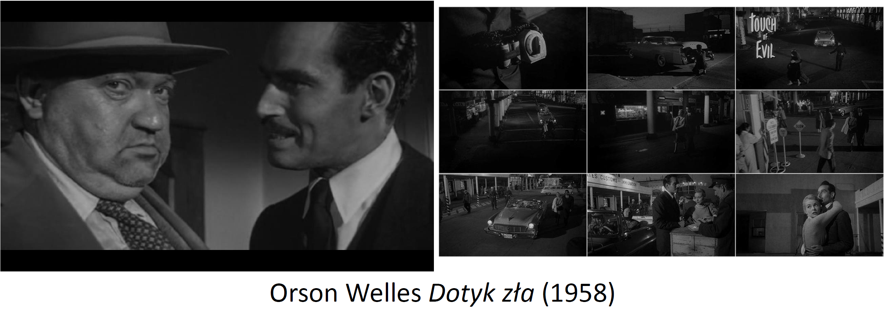

Te trzy filmy pokazują, że **Welles po Kane’ie nie przestał eksperymentować**, tylko ****przeniósł walkę o wolność artystyczną na nowe pola – gatunki, narracje, formę.** Każdy z tych filmów to **kino niepokorne**, operujące światłem, montażem i iluzją.

## 5.5 Kontrasty i pokrewieństwa: Ford, Lang, Reed, Vidor

### 🐎 **John Ford – \*Dyliżans\* (\*Stagecoach\*, 1939)**

- **Reprezentuje**: klasyczne Hollywood, narrację linearną, silną strukturę trzech aktów.
- **Styl**: spójna fabuła, bohaterowie o wyraźnych motywacjach, moralne wybory – przeciwieństwo złożonego Wellesa.
- **Znaczenie**: Ford ustanawia wzorzec westernu (i kina narracyjnego w ogóle).
- **Kontrast z Wellesem**: tam, gdzie *Kane* stawia pytania, *Dyliżans* daje odpowiedzi.
- 🔁 Ale: Welles cenił Forda i widział w nim mistrza wizualnej opowieści – *Kane* też czerpie z westernowego monumentalizmu.

### 🏙️ **Fritz Lang – \*Metropolis\* (1926)**

- **Wpływ wizualny**: ekspresjonistyczne kontrasty światła i cienia, monumentalne scenografie, zdjęcia **low angle** – wszystko to trafia do *Kane’a*.

- **Tematycznie**: człowiek vs system, technologia, alienacja – echa tego widać w krytyce medialnej potęgi Kane’a.

- **Pokrewieństwo**: Welles i Lang jako twórcy **operowi, totalni**, łączący rozmach wizualny z gorzką diagnozą społeczną.

  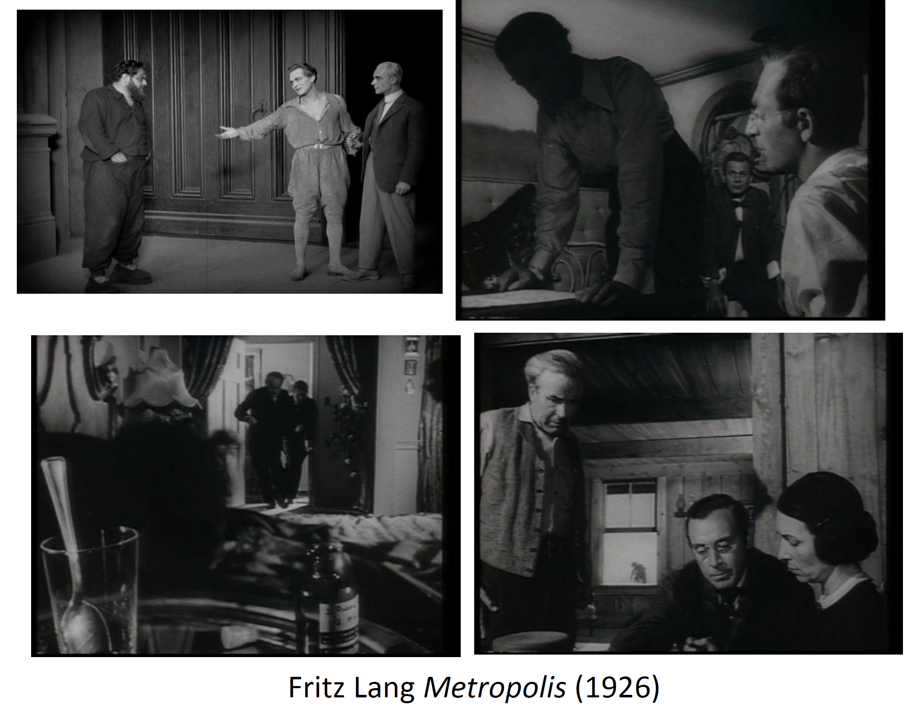

### 🌫️ **Carol Reed – \*Trzeci człowiek\* (\*The Third Man\*, 1949)**

- **Rola Wellesa**: gra Harry’ego Lime’a – cynicznego antybohatera skrytego w cieniu ruin Wiednia.

- **Estetyka noir**: ujęcia z ukosa, klaustrofobiczne uliczki, silne kontrasty światła.

- **Narracja**: rozbita, pełna nieufności – jak w *Kane’ie*.

- **Zbieżność**: Reed operuje obrazem i niedopowiedzeniem jak Welles – film często traktowany jako „duchowy krewniak *Kane’a*”.

  

### 💄 **Charles Vidor – \*Gilda\* (1946)**

- **Rita Hayworth**: partnerka i żona Wellesa, ikona femme fatale.
- **Styl noir**: erotyzm, niepewność, gra pozorów – Gilda to nie tylko kobieta, ale także **projekcja pragnień i lęków**.
- **Związek z Wellesem**: *Dama z Szanghaju* (1948) to jakby **demontaż Gildy**, odbicie tej postaci w krzywym zwierciadle.

Welles stał na skrzyżowaniu dróg:

- **Znał i cenił klasykę** (Ford),
- **Czerpał z ekspresjonizmu i europejskiej plastyki** (Lang),
- **Tworzył filmy-paralele w noirze** (Reed),
- **Dekonstruował gwiazdy i gatunki** (Vidor, Hayworth).

To właśnie ta **świadomość stylów i ich łamanie** uczyniła z niego **!!! pioniera kina autorskiego !!! **

- **Welles rozciąga język kina klasycznego** – używa go do zadawania pytań, nie dawania odpowiedzi.

- Kamera i montaż przestają tylko „pokazywać”, zaczynają **interpretować i sugerować**.

- Nawet w systemie Hollywoodu da się **eksperymentować i zmieniać historię kina**.

# 6 Realizm, Nowa Fala i postmodernizm (1940–2000+)

Ten ostatni wykład to **przegląd późniejszych nurtów**: **od neorealizmu włoskiego, przez francuską Nową Falę, po postmodernizm i kino historyczne**. To zarazem wykład-podsumowanie, bo zestawia dwie wielkie drogi kina:

> 🎞️ **Realizm** – z korzeniami u Lumière’ów → obserwacja, codzienność, prawda emocji.
>  🎭 **Ekspresja** – od Mélièsa → stylizacja, symbol, efekt.

## 6.1 Realizm filmowy – od Lumière’a po DOGMĘ

### 🎬 Neorealizm włoski – kino prawdy

#### 🧱 **Kontekst historyczny:**

- Neorealizm narodził się **tuż po upadku faszyzmu** i klęsce Włoch w II wojnie światowej.
- Kraj był zrujnowany, społeczeństwo pogrążone w biedzie – i właśnie to **kino zaczęło pokazywać**.
- Pierwszym impulsem był film **„Opętanie” (1943)** Luchino Viscontiego – **jeszcze zakazany przez cenzurę Mussoliniego**, ale już przełamujący konwencje.

#### 📜 **Kanon neorealizmu** – 3 kluczowe filmy:

| Film                          | Reżyser            | Znaczenie                                                    |
| ----------------------------- | ------------------ | ------------------------------------------------------------ |
| *Rzym, miasto otwarte* (1945) | Roberto Rossellini | Pierwszy „oficjalny” film neorealizmu; **realny Rzym** tuż po wojnie; opór wobec nazizmu |
| *Złodzieje rowerów* (1948)    | Vittorio De Sica   | Historia ojca i syna – dramat biedy i godności; **ikona kina realistycznego** |
| *Cud w Mediolanie* (1951)     | De Sica            | Łączy realizm z bajką; **społeczna alegoria** o bezdomnych i ich marzeniach |

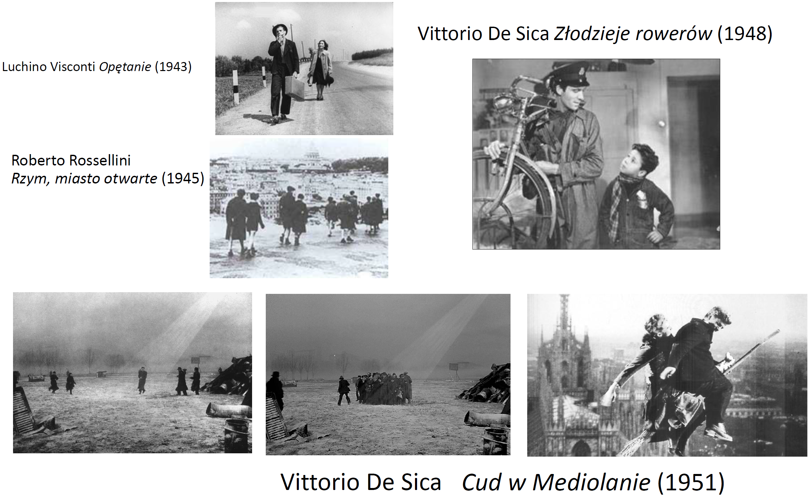

#### 🎭 **Cechy stylu neorealistycznego:**

- **Amatorzy** zamiast gwiazd: twarze prawdziwych ludzi, nie aktorów.
- **Lokacje**: prawdziwe ulice, podwórka, domy – bez dekoracji filmowych.
- **Światło zastane** – bez sztucznego oświetlenia, obraz wygląda jak „podglądany”.
- **Tematyka**: życie codzienne, ubóstwo, relacje rodzinne, moralne wybory.
- **Forma jako narzędzie prawdy**: montaż i kompozycja są podporządkowane szczerości emocji.

#### 🎯 Neorealizm to **nie tylko styl**, ale **etyka kina**:

> „Nie pokazujemy tego, co wymyślone, lecz to, co istnieje – i uczucia, które naprawdę bolą.”

W kolejnych punktach zobaczymy, jak ta filozofia ewoluuje: najpierw u Bressona, a potem w Dogmie czy kinie irańskim.

## 6.2 Między klasyką a modernizmem (Carné, Bresson, Astruc, Bazin)

### 🎭 **Marcel Carné – „Komedianci” (1943–45)**

- Reżyser **poetyckiego realizmu** we Francji przed i w czasie wojny.
- *Komedianci* (oryg. *Les Enfants du Paradis*) to **epicka opowieść o teatrze i miłości**, często nazywana „francuskim *Obywatelem Kane’em*”.
- Styl: **malarstwo światłem**, poetycki dialog, scenografie budujące nastrój.
- Kino klasyczne, ale emocjonalne i humanistyczne.
   ➡️ *Komedianci* nie pasują do Nowej Fali – to film **„starego mistrza”**, któremu młodzi zarzucali teatralność.

### 🎬 **Robert Bresson (1901–1999)**

- Francuski reżyser **asceta** – radykalny w realizmie.
- **Brak aktorów zawodowych** (używał „modeli”), żadnych emocji, brak muzyki dodanej.
- Dźwięk traktował jako **główne źródło narracji**, nie obraz.

**Filmy:**

- *Ucieczka skazańca* (1956): surowy dramat wojenny – **czysty realizm**, zero patosu.
- *Kieszonkowiec* (1959): samotność i winę pokazuje przez **detale ruchu i dźwięku**.
   ➡️ Jego styl to **prekursor DOGMY 95** i minimalistów (np. Kiarostami).

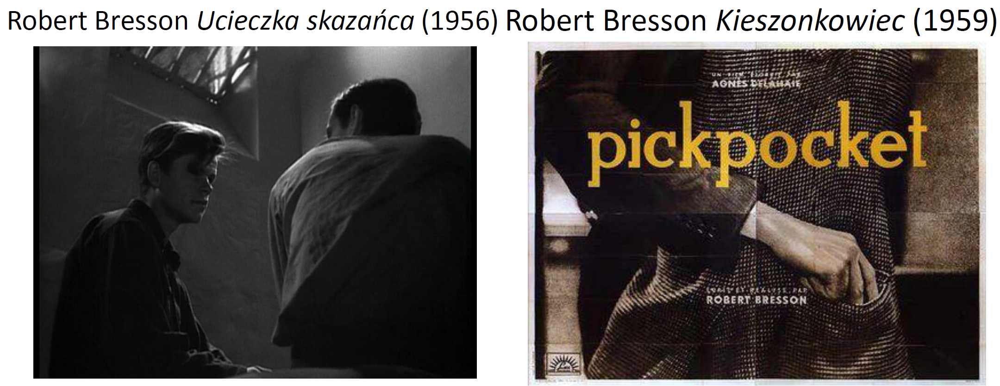

### ✒️ **Caméra-stylo – Alexandre Astruc**

- Esej z 1948 roku – **„kamera jako pióro”**.
- Twórca nie tylko reżyseruje, ale **pisze osobisty esej obrazem**.
- Kluczowa inspiracja dla Nowej Fali: film nie musi być adaptacją – może być **autorskim wyznaniem**.

### 📚 **André Bazin – ojciec teorii filmowej**

- Współzałożyciel *Cahiers du Cinéma*, mentor Truffaut i Godarda.
- Promował **realizm, długie ujęcia, głębię ostrości** – przeciwnik montażu manipulacyjnego.
- Wierzył, że kino powinno **pokazywać świat „jakim jest”**, nie przetwarzać go.

➡️ Bazin to **intelektualne zaplecze Nowej Fali** – ich „teolog filmowy”.

## 6.3 Nowa Fala – wolność formy, wolność twórcy

### 🌊 Skąd ta fala?

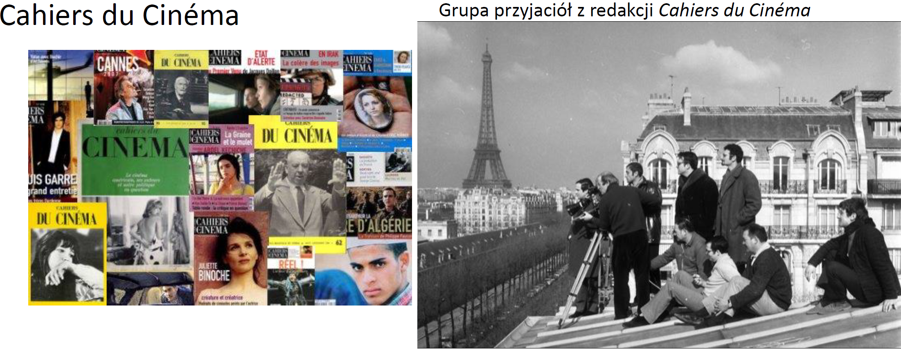

Nowa Fala narodziła się we Francji **na przełomie lat 50. i 60.**, jako bunt młodych krytyków i przyszłych reżyserów skupionych wokół czasopisma **„Cahiers du Cinéma”**. **François Truffaut, Jean-Luc Godard, Éric Rohmer, Claude Chabrol i Jacques Rivette** – wszyscy zaczynali od krytyki, a potem sami zaczęli kręcić filmy, które miały zrewolucjonizować kino.

Ich celem było odrzucenie „**kina papy**” – czyli ciężkiego, studyjnego kina opartego na literackich adaptacjach i wypracowanych formułach narracyjnych. Chcieli czegoś świeżego, osobistego, autentycznego.

### 📷 Jak wygląda Nowa Fala?

| Cecha                    | Opis                                                         |
| ------------------------ | ------------------------------------------------------------ |
| 🎥 **Zdjęcia w plenerze** | Kręcenie w autentycznych lokacjach, nie w studiu             |
| 🌞 **Naturalne światło**  | Rezygnacja z teatralnego oświetlenia                         |
| 🤳 **Kamera z ręki**      | Ruch, spontaniczność, intymność                              |
| 🌀 **Zerwanie z klasyką** | Narracja nielinearna, skoki montażowe, łamanie 4. ściany     |
| ✍️ **Caméra-stylo**       | Hasło Alexandre’a Astruca: kamera = pióro, film jako osobisty esej |
| 🧍 **Autobiografizm**     | Bohaterowie to często alter ego reżysera                     |

### 🎥 Kluczowe filmy i ich reżyserzy

| Reżyser               | Film                    | Cechy                                                        |
| --------------------- | ----------------------- | ------------------------------------------------------------ |
| **François Truffaut** | *400 batów* (1959)      | Historia dojrzewania jego ekranowego alter ego – Antoine’a Doinela. |
| **François Truffaut** | *Cykl o Doinelu*        | Kontynuacja jego życia w kolejnych filmach (aż po „Miłość dwudziestolatka”). |
| **Jean-Luc Godard**   | *Do utraty tchu* (1960) | Rewolucja formalna: cięcia jump cut, film w ruchu, metakomentarz. |
| **Jean-Luc Godard**   | *Pogarda* (1963)        | Film o robieniu filmu; cytaty kultury, dekonstrukcja kina.   |
| **Jean-Luc Godard**   | *Alphaville* (1965)     | Sci-fi bez efektów – poetycki, chłodny dystopijny esej o języku i władzy. |
| **Agnès Varda**       | *Cléo od 5 do 7* (1962) | Realny czas, kobiecy punkt widzenia, egzystencjalna refleksja. |

#### Francois Truffaut

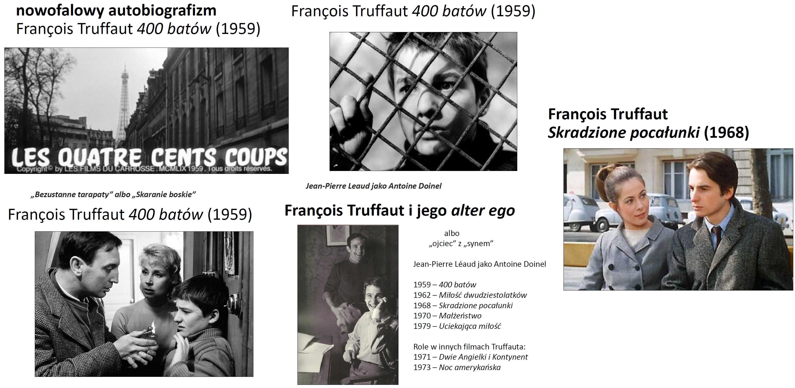

Skupmy się teraz na **François Truffaucie** i jego filmowym alter ego – **Antoine’ie Doinelu** – bo to klucz do zrozumienia, jak **Nowa Fala przenosi życie reżysera na ekran**.

**400 batów (1959)**

- Debiut Truffauta, jeden z najważniejszych filmów Nowej Fali.
- Antoine Doinel = alter ego reżysera: **chłopiec z trudnym dzieciństwem, porzucony, wrażliwy, zagubiony**.
- Film pokazuje realia życia, a nie fabularne schematy. Finałowy kadr (zatrzymanie na plaży) – ikona.

| Film                      | Rok  | Faza życia         |
| ------------------------- | ---- | ------------------ |
| *Antoine i Colette*       | 1962 | pierwsza miłość    |
| *Małżeństwo po francusku* | 1968 | praca, związek     |
| *Bed and Board*           | 1970 | życie rodzinne     |
| *Miłość na ucieczce*      | 1979 | podsumowanie życia |

Klucz to **autobiografia emocjonalna** – Truffaut nie odtwarza faktów, tylko **uczucia**. Kino bardzo osobiste, szczere – „filmowe dojrzewanie”.

#### Jean-Luc Godard

***Do utraty tchu* (1960)**

- Debiut Godarda i manifest Nowej Fali.
- Historia gangstera i dziennikarki – pretekst, nie klasyczna fabuła.
- Montaż skokowy (jump cut): celowe łamanie płynności, by widz czuł *filmowość filmu*.
- Kamera z ręki, zdjęcia w realnych przestrzeniach Paryża.

👉 Godard **burzy iluzję kina** – przypomina, że to sztuka, nie życie.

| Cecha                    | Znaczenie                                              |
| ------------------------ | ------------------------------------------------------ |
| 🎬 *Caméra-stylo*         | reżyser pisze kamerą jak piórem – film jako esej       |
| 💬 Cytaty, odniesienia    | filozofia, literatura, popkultura – kino myślące       |
| 🧠 Filmy o filmie         | postacie świadome, że są w filmie                      |
| 🤯 Dekonstrukcja gatunków | np. *Alphaville* – sci-fi noir bez efektów specjalnych |

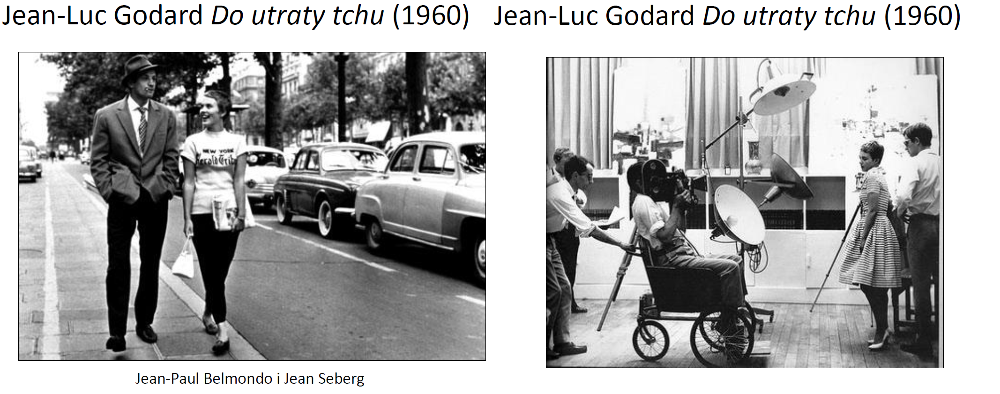

### 🧠 Co zapamiętać?

- Nowa Fala to **kultura twórczej wolności**, gdzie **forma jest wypowiedzią**, a reżyser – autorem (✍️ **Caméra-stylo**)
- Ich filmy to **eksperymenty**: z czasem, przestrzenią, tożsamością i samym językiem filmu.
- To kino **dla widza myślącego** – często autorefleksyjne i meta-filmowe.
- Wpływ: **od Scorsese po Tarantino** – Nowa Fala otworzyła drzwi do kina autorskiego na całym świecie.

## 6.4 Szkoła Polska (1956–1961) – rozliczenie z historią i narodową tożsamością

🔹 **Kontekst historyczny:**

- Powstaje po **odwilży 1956 roku**, gdy zniesiono część cenzury.
- Widzimy przełom: od socrealizmu do **krytycznej refleksji nad przeszłością** – szczególnie II wojną światową i Powstaniem Warszawskim.

🔹 **Tematy i cechy:**

- Bohater tragiczny, często młody, wciągnięty w tryby historii.
- Kino pytające o **sens ofiary, winy, patriotyzmu** – rozliczenie z mitem heroizmu.
- Estetyka realistyczna, ale z moralną i filozoficzną głębią.

🔹 **Twórcy i filmy:**

| Reżyser       | Film                        | Temat i znaczenie                                        |
| ------------- | --------------------------- | -------------------------------------------------------- |
| Andrzej Wajda | *Kanał* (1957)              | Powstanie Warszawskie jako **tragedia i bezsens ofiary** |
| Andrzej Wajda | *Popiół i diament* (1958)   | Bohater rozdarty między komunizmem a dawnym etosem AK    |
| Andrzej Munk  | *Eroica* (1958)             | **Ironia i antybohaterskość** wobec romantycznego patosu |
| Andrzej Munk  | *Zezowate szczęście* (1959) | Czarna komedia o losach "szarego człowieka" w PRL-u      |

## 6.5 Styl barokowy, Nowa Przygoda, cyberpunk i postmodernizm

### 🔹 **Kino Nowej Przygody / Nowe Hollywood**

Pojawia się w latach 70. i 80. jako odpowiedź młodych twórców wychowanych na klasyce – ale z nową energią, montażem, humorem i technologią.

- Reżyserzy: **Steven Spielberg, George Lucas, Ridley Scott**
- Kino dla szerokiej publiczności, ale z autorskim sznytem
- Łączy **akcję, efektowność, emocje i epickość**
- Często odnosi się do historii lub mitów (np. Indiana Jones, Gwiezdne wojny do campbellowskiej mitologii)

🎬 Symbolem tego stylu są m.in.:

- *Ben-Hur* (1959) i *Kleopatra* (1963) – klasyczne superprodukcje
- *Faraon* (1966) – polska wersja epickiego rozmachu
- *Gladiator* (2000) – współczesne odrodzenie kina przygodowego w stylu retro

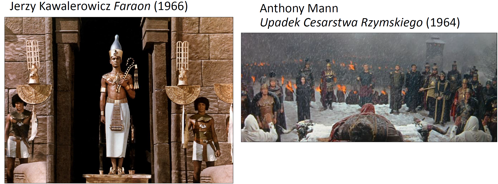

### 🔹 **Cyberpunk – ciemna strona przyszłości**

Styl rodem z noir i science fiction. W cyberpunku:

- Technologia nie wyzwala – raczej zniewala i alienuje
- Bohaterowie to outsiderzy, często walczący z systemem
- Mieszanka **mroku, deszczu, neonów i refleksji o człowieczeństwie**

📽️ Klasyczne przykłady:

- *Blade Runner* (Ridley Scott, 1982)
- *Ghost in the Shell* (Mamoru Oshii, 1995)
- *Matrix* (1999) – cyberpunk + filozofia + action film

> **Zagadnienie egzaminacyjne**: Cyberpunk – cechy stylu wizualnego i tematyki

### 🔹 **Postmodernizm – cytat, pastisz, ironia**

Postmodernizm w kinie to zabawa z konwencją i świadomość formy. Cechy:

- **Cytaty z innych dzieł**, mieszanie stylów i gatunków
- **Świadoma sztuczność** – kino wie, że jest kinem
- **Ironia i gra z widzem** – emocje podszyte dystansem

📺 Przykłady:

- *Pulp Fiction* (1994) – popkulturowa mozaika, rozbita narracja, styl ponad treść
- *Braveheart* (1995) – film epicki, ale z emocjonalnym patosem i uproszczeniem historii
- *Gladiator* (2000) – odnowienie stylu peplum (filmów o starożytnym Rzymie) z hollywoodzkim rozmachem

### Pochodne neorealizmu

#### 🔹 **DOGMA 95** (manifest z 1995)

- Stworzony przez Larsa von Triera i Thomasa Vinterberga.
- Zakładał „powrót do prawdy” w kinie:
   ❌ żadnej muzyki spoza świata filmu,
   ❌ brak sztucznego światła,
   ❌ brak rekwizytów,
   ❌ kamera z ręki.

🎬 Filmy jak *Festen* (1998) to **czysty eksperyment formalny**, emocjonalny i „nagryzający realność”.

#### 🔹 **Kino irańskie (lata 90.)**

- Twórcy jak **Abbas Kiarostami**, **Mohsen Makhmalbaf**, **Jafar Panahi**.
- **Naturalne plenery, dzieci jako bohaterowie, poetyckość codzienności.**
- Często podwójna warstwa znaczeniowa: **realistyczna i metaforyczna** (np. *Gdzie jest dom mojego przyjaciela?*).

→ **Forma ograniczona cenzurą**, ale przekuwana w **siłę artystyczną**.

→ **Połączenie realizmu, humanizmu i refleksji filozoficznej.**

#### 🔹 **Mumblecore (kino niezależne USA, 2000s)**

- Improwizowane dialogi, kamera cyfrowa, niska jakość techniczna.
- Historie **młodych ludzi, codziennych relacji, nieporadności emocjonalnej**.
- Przedstawiciele: **Duplass brothers**, **Joe Swanberg**, **Greta Gerwig** (wczesna faza).
- Film: *Hannah Takes the Stairs*, *The Puffy Chair*.

→ Kino **skrajnie niskobudżetowe**, ale autentyczne – **realizm relacyjny**.

## 6.6 Podział na realizm i ekspresjoznim

### 🧱 **Czym jest realizm w kinie?**

- Fundament: **obserwacja świata takim, jakim jest**.
- Cechy: **naturalne światło, amatorzy, prawdziwe lokacje, codzienne tematy**.
- Dominująca zasada: **forma ma nie przeszkadzać w odbiorze prawdy**.
- Skupienie na **sprawach społecznych**, **moralności**, **autentyczności emocji**.

### 🔮 **Czym jest ekspresjonizm?**

- Fundament: **świat subiektywny, wewnętrzny, stylizowany**.
- Cechy: **kontrast, sztuczność, deformacja, metafora wizualna, psychologia**.
- Dominująca zasada: **forma wyraża emocje i wewnętrzne stany**.
- Kino pełne **symboliki**, **niepokoju**, **napięcia**, często **mroczne i teatralne**.

| Styl                   | Obraz                           | Bohater                     | Narracja                 | Cel artystyczny                    |
| ---------------------- | ------------------------------- | --------------------------- | ------------------------ | ---------------------------------- |
| **Realistyczny**       | Naturalne światło, plener       | Zwykły człowiek             | Otwarta, prosta          | Pokazać prawdę                     |
| **Ekspresjonistyczny** | Stylizacja, cień, geometryzacja | Zniekształcony, symboliczny | Fragmentaryczna, złożona | Oddać stan psychiczny lub metaforę |

### 🧭 Podział nurtów według osi: realizm – ekspresjonizm

| Realizm (Lumière)                                            | Ekspresjonizm (Méliès)                                       |
| ------------------------------------------------------------ | ------------------------------------------------------------ |
| **Ludwik Lumière** – dokument, rejestracja rzeczywistości    | **Georges Méliès** – fantazja, montaż trikowy                |
| **Szkoła Szwedzka** – pejzaże, naturalizm (Sjöstrom, Stiller) | **Szkoła z Brighton** – narracja wizualna, efekty            |
| **Neorealizm włoski** (1943–1952) – Rossellini, De Sica      | **Ekspresjonizm niemiecki** (1919–1925) – „Gabinet doktora Caligari” |
| **Nowa Fala** (1959–1965) – Truffaut, Godard, Varda          | **Film Noir** (USA, 40–50s) – kontrast, cienie, fatalizm     |
| **DOGMA 95** (1995) – Trier, Vinterberg                      | **Neonoir** (1970–…) – Blade Runner, Chinatown               |
| **Kino Irańskie** (l. 90) – Kiarostami, Panahi               | **Kino Nowej Przygody** – Spielberg, Lucas (efekty, stylizacja) |
| **Współczesne kino niezależne** – mumblecore, Bresson, realizm relacyjny | **Cyberpunk** – dystopia, technologia, tożsamość             |
|                                                              | **Francuski Neobarok** – stylizacja, emocja, teatralność     |
|                                                              | **Postmodernizm** – cytat, ironia, intertekstualność, styl > treść |

# ----------------------------------

# Słownik pojęć

Klasyczne kino hollwywoodkie (1908-1927) - < wypisane filmy >

Niemiecki ekspresjonizm  - < wypisane filmy >

Impresjonizm francuski - < wypisane filmy >

Radziecka szkoła montażu - < wypisane filmy >

Klasycznie kino hollywoodkie po wprowadzeniu dźwięku - < wypisane filmy >

Neorealizm włoski - < wypisane filmy >

Francuska nowa fala - < wypisane filmy >

Nowe Hollywood i Amerykańskie kino niezależne - < wypisane filmy >

Współczesne kino z HongKongu - < wypisane filmy >

Kino Polskie - < wypisane filmy >

- **animacja** (*animation*) – każdy proces, w ramach którego wrażenie ruchu zostaje wytworzone w wyniku fotografowania serii rysunków (patrz także: *animacja celuloidowa*, *obiektowa* lub *animacja komputerowa*). Iluzja ruchu zostaje wytworzona dzięki niewielkim różnicom w położeniu, zarejestrowanym klatka po klatce.
- **animacja celuloidowa** (*cel animation*) – tradycyjna animacja wykorzystująca serię rysunków na celuloidzie. Iluzja ruchu uzyskiwana dzięki nieznacznym różnicom między kolejnymi klatkami filmu.
- **auteur** – termin pochodzący z języka francuskiego, odnoszący się do reżysera filmowego, którego osobisty styl lub tematyka są rozpoznawalne w różnych filmach. W szerszym sensie, często jest także używany w wartościującym sensie, w celu określenia dobrych twórców filmowych (*autorów dzieł*), w przeciwieństwie do twórców komercyjnych.
- **CGI – animacja komputerowa** – *computer-generated imagery*, obrazy wygenerowane komputerowo, często w celu wsparcia komputerowo generowaną postacią, scenografii i innymi efektami kadru.
- **cięcie (cut)** – 1) w pracy nad filmem – sposób łączenia ze sobą fragmentów filmu (scen) w jeden filmowy ciąg; 2) w gotowym filmie – gwałtowne przejście od jednego ujęcia do kolejnego.
- **cięcie oszukujące** (*cheat cut*) – w systemie montażu ciągłego cięcie, które łączy ze sobą ujęcia z zachowaniem ciągłości akcji, lecz nie są one zapisane z obiektywnej perspektywy; w ujęciach może zmieniać się lokalizacja aktora, jego pozycja, gesty, mimika lub rekwizyty.
- **czas projekcji** – czas potrzebny do odtworzenia filmu na ekranie. Może różnić się w zależności od zastosowanego sprzętu (*np. zbyt szybki projektor*).
- **czas trwania** (*duration*) – w filmie fabularnym, fabuła filmu przedstawia ciąg zdarzeń w czasie. Czas ten może różnić się od rzeczywistego czasu projekcji i czasu trwania historii, która jest opowiadana. W zależności od zabiegów montażowych czas trwania historii, czasu projekcji i czasu trwania narracji mogą się różnić.
- **częstotliwość (frequency)** – w filmie fabularnym częstotliwość to liczba powtórzeń określonego wydarzenia. Ta sama historia jest czasami przedstawiona kilkukrotnie.
- **detal** (*detail*) – plan filmowy ukazujący dłoń, oko czy część obiektu. Często stosowany do wyeksponowania szczegółu, symbolu lub emocji.
- **diegeza (diegesis)** – świat przedstawiony filmu, przedstawiony opowiadaniem; do diegezy zaliczamy także te zdarzenia, które należą do historii (zakładamy, że się wydarzyły), a które nie zostały pokazane na ekranie. Zobacz także: *dźwięk diegetyczny*, *dźwięk niediegetyczny*.
- **długość ogniskowej** (*focal length*) – długość ogniskowej decyduje o stopniu powiększenia obrazu, a więc o perspektywie zarejestrowanej przez obiektyw. Świetnie nadaje się do zmiany rozmiaru planu. Zobacz także: *obiektyw*, *zoom*.
- **dolly (wózek)** – pod wózek z kamerą ruchomą ramieniem przesuwa się po torach (*jazda*).
- **dubbing (dubbing)** – proces polegający na zastąpieniu na ścieżce dźwiękowej filmu nagranego dialogu w innym języku głosami lektorów. W przypadku pogranicza mówionego i dialogu stosuje się też lektora lub napisy.
- **dystrybucja** (*distribution*) – jedna z trzech głównych dziedzin przemysłu filmowego zajmująca się rozpowszechnianiem gotowego produktu filmowego i zapewnianiem tytułów. Zobacz także: *pokaz*, *produkcja*.
- **dźwięk asynchroniczny** (*asynchronous sound*) – dźwięk, który nie jest czasowo zharmonizowany z obrazem, nie pasuje do niego, gdy dialog nie jest zsynchronizowany z ruchem ust.
- **dźwięk bezpośredni** (*direct sound*) – muzyka, odgłosy i dialogi zarejestrowane podczas filmowania, w przeciwieństwie do dźwięku postsynchronowego.
- **dźwięk diegetyczny** (*diegetic sound*) – każdy dźwięk, który mógłby lub efektywnie wydaje się pochodzić z przestrzeni fabularnej świata filmu (*np. radio grające w scenie*).
- **dźwięk niediegetyczny** (*nondiegetic sound*) – dźwięk pochodzący spoza przestrzeni opowiadania, np. nastrojowa muzyka, komentarz narratora.
- **dźwięk niesymultaniczny** (*nonsimultaneous sound*) – dźwięk, który pochodzi z przeszłości lub przyszłości względem wydarzeń w obrazie (*np. retrospekcje lub przemyślenia bohatera*).
- **dźwięk symultaniczny** (*simultaneous sound*) – dźwięk towarzyszący wydarzeniom w tym samym czasie, co czas fabularny historii, towarzyszący mu obraz.

- **dźwięk synchroniczny** (*synchronous sound*) – dźwięk, który w czasie do ruchu mającego miejsce na ekranie, np. gdy dialog odtwarzany pasuje do ruchu ust postaci.
- **dźwięk z offu** (*offscreen sound*) – dźwięk pochodzący z poza kadru, pochodzący z czasu i przestrzeni widocznego na ekranie, ale nie z miejsca aktualnie zarejestrowanego przez kamerę. Jest to jeden z dźwięków niediegetycznych. Zobacz także: *dźwięk diegetyczny*, *dźwięk niesymultaniczny*.
- **dźwięk zza kadru** (*sound over*) – dźwięk symultaniczny ze źródłem, które – jak zakładamy – znajduje się w przestrzeni sceny, ale nie jest widoczne na ekranie.
- **efekty specjalne** (*special effects*) – ogólny termin określający różne manipulacje obrazem, za pomocą których zostają zniekształcone lub udziwnione obrazy, np. pokazanie obiektu UFO. Używa się do tego animacji, zdjęć poklatkowych, zdjęć optycznych, a ostatnio – komputerowych (*CGI*).
- **elipsa czasowa** (*ellipsis*) – w filmie fabularnym, skrócenie czasu trwania fabuły poprzez pominięcie części trwania historii. Zobacz także: *montaż oszczędny*, *czas projekcji*.
- **fabuła (plot)** – w filmie fabularnym, wszystkie zdarzenia, które zostały nam bezpośrednio przedstawione na ekranie, włącznie z łączącymi je elementami narracyjnymi. Chronologicznie czasem trwania oraz umiejscowieniem w przestrzeni różni się od historii, która jest wyobrażeniem przez widza kontekstu, składającego się ze zdarzeń widzianych i niewidzianych. Zobacz także: *historia*, *czas rzeczywisty*, *czas trwania*, *czas projekcji*.
- **film noir** – termin odnoszący się do pewnych typów filmów francuskich krytyków z lat 40. XX wieku: kryminały amerykańskie, z pesymistyczną fabułą, mroczną atmosferą, dużym nasyceniem światła i cienia oraz często kobiecym kusicielem (*femme fatale*). Bohater z reguły cyniczny i nie-moralny.
- **filtr** – szklane lub żelatynowe nakładki nakładane na obiektyw kamery lub kopie filmu w celu zmniejszenia ilości światła, koloru lub nasycenia.
- **forma (form)** – całościowy system relacji zachodzących między elementami filmu.
- **forma abstrakcyjna** (*abstract form*) – typ organizacji filmu, w którym jego części zostały zorganizowane zgodnie z rytmem, ruchem, kolorem, kształtem, linią i ruchem, a nie z opowiadaniem historii.
- **forma asociacyjna (associational form)** – typ organizacji filmu, w którym zestawia się różne obrazy na zasadzie skojarzeń w celu osiągnięcia określonego efektu.
- **forma kategoryjalna (categorical form)** – typ organizacji, w której części odnoszą się do różnych składników danego tematu. Na przykład film o Stanach Zjednoczonych może zostać podzielony na 50 części, z których każda byłaby poświęcona jednej z 50 części (*stanów*).
- **forma narracyjna – fabularna** (*narrative form*) – typ organizacji dzieła filmowego, w której części są ze sobą powiązane serią przyczynowo-skutkowych zdarzeń z postaciami działającymi w określonym czasie i w przestrzeni.
- **forma retoryczna (rhetorical form)** – typ organizacji filmu, w której celem jest dostarczenie argumentów na poparcie określonej tezy.
- **format akademii** (*academy ratio*) – format obrazu kinowego wprowadzony przez Amerykańską Akademię Sztuki i Wiedzy Filmowej. Początkowo szerokość klatki filmowej wynosiła 1.33:1, później została skorygowana przez wprowadzenie tzw. „maski akademickiej” i obecnie jej stosunek to 1.85:1 w USA.
- **format filmu – wymiary, szerokość filmu** (*gauge*) – szerokość taśmy filmowej mierzona w milimetrach.
- **format obrazu** (*aspect ratio*) – stosunek szerokości kadru filmowego do jego wysokości. Standardowy *format akademii* jest określany jako 1.85:1, a inny często spotykany format to 2.35:1.
- **funkcja (function)** – rola spełniana przez pojedynczy element w całości filmu, np. przez kadr, ujęcie, znak itp.
- **futurospekcja (flashforward)** – zabieg narracyjny, w którym wydarzenie przyszłe pokazane jest na ekranie przed wydarzeniami wcześniejszymi. Przeważnie ma to na celu przedstawienie zdarzenia, którego znaczenie nie zostało jeszcze całkowicie wyjaśnione.
- **gatunki filmowe** (*genres*) – różne rodzaje filmów, rozpoznawalne i zrozumiałe zarówno przez widzów, jak i twórców, ze względu na zestaw typowych cech tematycznych, stylu i środków wyrazu. Przykłady: m.in. *musical*, *film gangsterski*, *komedia romantyczna*.
- **głębia ostrości** (*depth of field*) – strefa (zakres odległości), w której obiekty pozostają ostre. Przy małej przysłonie (np. 2.8) głębia ostrości będzie płytka. Przy dużej (np. 11) – głęboka. Typowe zakresy to 4.5 m oraz 4.5 m odległości – za wszystko, co znajduje się w tym zakresie, będzie ostre.
- **głębia przestrzeni – głęboka kompozycja** (*deep space*) – układ przestrzenny elementów sceny, w której pomiędzy pierwszym a drugim planem znajduje się znaczna odległość, co tworzy efekt głębi. Widz ma poczucie trójwymiarowości, a dzięki użytym dystansom, jak szerokokątny obiektyw – efekt ten się pogłębia.
- **granica kadrowania graficzna** – granica pomiędzy dwoma obiektami w kadrze przypominającymi lub spójnymi pod względem koloru, kompozycji, kształtu lub lokalizacji.

- **harmonizowanie linii wzroku – montaż oparty na punkcie widzenia** (*eyeline match*) – sposób montowania scen, w którym przestrzegana jest zasada 180° i nie przekracza się osi akcji; w montażu opartym na punkcie widzenia pierwsze ujęcie przedstawia postać patrzącą poza kadr, a drugie to, na co patrzy. Jeśli ujęcie pokazuje przestrzeń zewnętrzną kadru, to postać widziana w pierwszym ujęciu pozostaje przy tej linii, gdzie wcześniej była; spojrzenie, które patrzy znajduje się poza kadrem pod tym samym kątem.
- **historia** (*story*) – w filmie fabularnym, zbiór wszystkich zdarzeń przedstawionych bezpośrednio na ekranie, jak i tych, które zakładamy, że się zdarzyły, mimo że nie były zaprezentowane. Zobacz też: *fabuła*, *czas trwania*, *czas projekcji*, *czas narracji*, *czas rzeczywisty*.
- **ideologia** (*ideology*) – względnie spójny system wartości, poglądów i sądów podzielanych przez daną grupę społeczną. W filmie może przejawiać się przez cechy wizualne, wpisując z natury lub nieświadomie w ideologiczne przesłanie.
- **interpretacja** (*interpretation*) – aktywność widza polegająca na analizowaniu implikacyjnych i symptomatycznych znaczeń zasugerowanych w filmie.
- **kadrowanie** (*framing*) – zastosowanie ram kadru w celu wybrania i zakomponowania tego, co będzie widoczne na ekranie.
- **kadrowanie w ruchu – ruchomy kadr** (*mobile frame*) – efekt uzyskany na ekranie w wyniku poruszania się kamery – zastosowania obiektywu ze zmienną ogniskową (*zoom*) lub w wyniku ruchu kamery. Ruchoma kamera kadruje obraz w inny sposób niż klasyczne cięcie. Zobacz też: *ujęcie z kranu, panoramę, najazd, jazdę*.
- **kamera z ręki** (*hand-held camera*) – wykorzystanie ciała operatora jako statywu kamery.
- **kaszeta** (*mask*) – ciemna osłonka umieszczana na kamerze lub kopiatorce, która zasłania część klatki filmowej i zmienia jej proporcje (np. zmienia 4:3 do 1:1,85). Kaszeta może też odnosić się do efektu czarnego paska u góry i dołu ekranu lub po jego bokach (*letterboxing*), zdarza się też, że jest ona używana jako walor wizualny.
- **kąt kamery (kąt ujęcia)** – pozycja kamery (kądu) względem postaci w kadrze lub obiektu. Kiedy kamera znajduje się na wysokości oczu filmu, patrząc na postać klasycznie, realizuje się ujęcie neutralne. Kiedy umieszczona jest wyżej – może przedstawiać obiekt z góry (kąt wysoki); albo może przedstawiać obiekty z dołu (kąt niski).
- **kierunek ekranowy** (*screen direction*) – relacje przestrzenne (prawo-lewo) w obrębie sceny, ustalone w ujęciu inaugurującym, a później konsekwentnie utrzymywane w kadrach, ujęciach, ruchu i akcie. W trakcie montażu, zmiana kierunku ekranowego może prowadzić do zagubienia widza. Zobacz również: *oś akcji, harmonizowanie linii wzroku*.
- **klatka filmowa** (*frame*) – pojedynczy obraz w klasie filmowej. Setki klatek wyświetlane na ekranie w szybkim tempie, wytwarzają iluzję ruchu.
- **kompozycja** (*mise-en-scène*) – w obrazie filmowym, rozłożenie najważniejszych elementów w kadrze filmu.
- **kontrola ruchu (motion control)** – komputerowa metoda rejestrowania i manipulowania ruchem kamery, modeli, miniatur i innych wyposażonych w silniki w realizacji zdjęć specjalnych i efektów wizualnych.
- **linearność** (*linearity*) – kiedy w opowiadaniu mamy do czynienia z jednym ciągiem przyczynowo-skutkowym, w którym zdarzenia zachodzą bez odchyleń, opóźnień lub alternatywnych zdarzeń.
- **long take** – ujęcie trwające wyjątkowo długo, zanim nastąpi cięcie (*długi master shot*).
- **miksowanie** (*mixing*) – łączenie dwóch lub więcej ścieżek dźwiękowych w jedną.
- **mise-en-scène – inscenizacja** – wszystkie elementy przestrzenne kadrów: scenografia, rekwizyty, oświetlenie, kostiumy i charakterystyka postaci, ruchy postaci.
- **montaż (editing)** – 1) w pracy nad filmem – proces łączenia ujęć, dźwięków i efektów specjalnych w całość; 2) w gotowym filmie – zauważalne połączenie kadrów, zazwyczaj zmontowanych zgodnie z zasadą ciągłości (*montaż ciągły*).
- **montaż „na zakładkę”** (*overlapping editing*) – montaż, w którym część drugiego ujęcia pokazuje ponownie końcowy moment ujęcia wcześniejszego (*np. postać wychodząca z kadru*).
- **montaż ciągły** (*continuity editing*) – konwencjonalny styl montażu, w którym zakłada się zachowanie ciągłości przestrzeni i czasu oraz relacji ekranowych (*prawo-lewo, plan/kontrplan, kąt kamery*). W ujęciach nie występują błędy czasoprzestrzenne, nie gubimy kierunku akcji, ułożenia postaci itd. Zobacz też: *montaż „na zakładkę”, kierunek ekranowy, plan/kontrplan*

- **montaż eliptyczny** (*elliptical editing*) – taki sposób montowania ujęć, który prowadzi do pominięcia części zdarzeń i wytworzenia elips czasowych w czasie trwania fabuły.
- **montaż intelektualny** (*intellectual montage*) – montaż polegający na zderzaniu ze sobą serii obrazów, co prowadzi do powstania abstrakcyjnych idei, niezwiązanych z osobą w żadnym pojedynczym obrazie.
- **montaż na ruchu – cięcie na akcji** (*match on action*) – w montażu ciągłym, cięcie, które łączy dwa różne ujęcia tej samej akcji; w tym samym momencie ruchu, harmonizując taką ciągłość wrażeń wzrokowych. Jest to sposób akcji, która rozpoczyna się w jednym ujęciu, jest kontynuowana lub kończy się w ujęciu następnym.
- **montaż nieciągły** (*discontinuity editing*) – każdy alternatywny sposób montażu, wykorzystujący techniki sprzeczne z zasadą ciągłości (ciągłego montażu). Możemy do nich zaliczyć elipsę czasową, montaż intelektualny, montaż równoległy, montaż graficzny, skupienie się nie na logice akcji, skupienie się bardziej na rytmie, zestawieniach formalnych. Zobacz także: *montaż eliptyczny, montaż intelektualny, montaż równoległy, harmonizowanie graficzne, montaż na zakładkę, montaż niesymultaniczny, wstawka niediegotyczna, montaż na zakładkę*.
- **montaż równoległy** (*crosscutting*) – rodzaj montażu pozwalający za pomocą przeplatania ujęć na przedstawienie dwóch lub więcej wątków akcji, które dzieją się w innych miejscach, jednak zazwyczaj w tym samym czasie.
- **motyw** (*motif*) – element filmu powtarzany w znaczący sposób.
- **motywacja** (*motivation*) – zawarte w filmie uzasadnienie dla obecności danego elementu. Może się odwoływać od wiedzy widza na temat rzeczywistości pozafilmowej, czy przyczynowości narracyjnej, znajomości konwencji gatunkowych, albo wzorów stylistycznych widocznych w filmie.
- **nachodzenie planów** (*overlap*) – wskaźnik sugerujący głębię przestrzeni obrazu filmowego, polegający na umieszczeniu jednego elementu przed drugim.
- **nakładanie dialogów** (*dialogue overlap*) – w montażu sceny, takie zaaranżowanie przejścia między ujęciami, które zakłada, że fragment dialogu z ujęcia A pojawia się jeszcze w ujęciu B, przedstawiającym inną postać lub inny element sceny. Daje to wrażenie planu, przerywanego przez cięciem.
- **narracja** (*narration*) – proces, poprzez który *fabuła* przekazuje *informację o historii* albo ujawnia zdarzenia w historii. Styl narracji może być różny: może być *wszechwiedzący* lub *ograniczony*, *bardziej obiektywny* lub *subiektywny*, *linearny* lub *nielinearny*. Film może również różnić się w różnych stopniu ujawnianiem motywacji bohatera.
- **naświetlenie – ekspozycja** (*exposure*) – ilość światła padającego na każdą klatkę filmu, regulowana poprzez ustawienie w kamerze wartości przysłony i czasu naświetlania.
- **niski klucz oświetleniowy** (*low-key lighting*) – styl oświetlenia charakteryzujący się dużym kontrastem i ciemnością. Służy do uzyskania nastrojowego, ekspresyjnego klimatu (*typowy w filmach noir*). Źródło światła jest ostre, a światło wypełniające zredukowane lub nieobecne, co powoduje efekt *chiaroscuro* (światłocień), polegający na mocnym kontraście światła i ciemności widocznej na obrazie.
- **obiektyw anamorficzny** (*anamorphic lens*) – obiektyw przeznaczony do rejestracji obrazu panoramicznego na taśmie filmowej o klasycznym formacie (np. 35mm z maską akademii). Obiektyw ten ściska obraz w poziomie w czasie rejestracji, a następnie rozszerza go anamorficzny obiektyw w czasie kopiowania. Zastosowanie pozwala uzyskać panoramiczny obraz bez zmniejszania jakości optycznej i bez kadrowania obrazu.
- **obiektyw standardowy** (*normal lens*) – obiektyw, który przedstawia filmowane obiekty bez zauważalnych zniekształceń, bez wyraźnego zwiększania lub redukowania głębi planu. Dla formatu filmu 35 mm długość ogniskowa obiektywu mieści się w przedziale od 35 mm do 50 mm.
- **obiektyw szerokokątny** (*wide-angle lens*) – obiektyw o krótkiej ogniskowej, mający zdolność obejmowania szerokich kadrów i silnego zbliżenia brzegów kadru, zakrzywia te brzegi (*beczkowanie*). Wzmacnia głębię ostrości, więc często stosowany w scenach z większą głębią. Obiekty bliskie planu są wyolbrzymione względem dalszych. W filmie 35mm długość ogniskowej takiego obiektywu wynosi 35 mm lub mniej. Zobacz także: *głębia ostrości, głębia przestrzeni*.
- **obiektyw zoom** (*zoom lens*) – obiektyw pozwalający na zmianę długości ogniskowej w trakcie ujęcia. Im bliżej jest obraz, tym ciaśniejsze pole widzenia, co często stosuje się jako zabieg dramatyczny. W przeciwieństwie do kamery, która fizycznie przybliża się lub oddala od obiektu, zoom nie zmienia relacji przestrzennych między obiektami – dlatego nie powoduje *paralaksy*, więc nie daje *szerokokątnego* wrażenia głębi.
- **obraz monochromatyczny** (*monochromatic color design*) – rodzaj kolorystyki, w którym używana jest tylko jedna barwa w różnych odcieniach.
- **ostre światło** (*hard lighting*) – światło, które wyraźnie wyznacza cień, ma twardą krawędź i ostre krawędzie.
- **oś akcji** (*axis of action*) – w systemie montażu ciągłego zasada organizacji cięcia akcji poprzez postać znajdującą się w ruchu. Wyobrażona linia (oś), która dzieli przestrzeń na dwie strony – postać pozostaje po tej samej stronie względem wszystkich elementarnych scen, określająca jej kierunek ruchu.

- **oświetlenie boczne** (*side lighting*) – światło padające na postać lub przedmiot z boku, podkreślające strukturę przestrzenną przedmiotu lub postaci, wydobywając kontury i tekstury, podkreślając szczegóły.
- **oświetlenie dolne** (*underlighting*) – światło wypływające z punktu znajdującego się poniżej postaci występujących w scenie.
- **oświetlenie górne** (*top lighting*) – światło rzucane z góry, pochodzące ze źródła umieszczonego nad postacią.
- **oświetlenie trójpunktowe** (*three-point lighting*) – najpowszechniejsze światło oświetlające scenę z trzech różnych kierunków: składa się na nie światło kontrowe, światło rzucane zza postaci, jasne światło wypełniające oraz miękkie, jasne światło wypełniające, równoważące światło główne.
- **panorama** (*pan*) – ruch kamery w poziomie bądź pionie (przy użyciu bez zmiany lokalizacji kamery), podczas którego kamera się obraca. *Panorama pozioma* to obrót kamery na osi w linii poziomej (lewa–prawa), *panorama pionowa* to obrót na osi pionowej (góra–dół). Wygląda to tak, jakby kamera podnosiła „głowę” w górę lub opuszczała ją w dół.
- **pełna głębia ostrości** (*deep focus*) – takie ustawienie parametrów obiektywu kamery i oświetlenia, które pozwala na utrzymanie w pełni ostrej zarówno części obiektu znajdujących się na pierwszym, jak i dalszym planie.
- **perspektywa dźwięku** (*sound perspective*) – wrażenie przestrzenne dźwięku (odległość, źródło dźwięku), wynikające ze stosunku poziomu głośności, jego barwy, pogłosu, a także efektu czasu i otwarcia stereofonicznego.
- **perspektywa powietrzna** (*aerial perspective*) – wskaznik sugerujący głębię obrazu poprzez przedstawienie obiektów w oddali w nieco chłodniejszych barwach i mniej wyraźnie. Typowo używana w zdjęciach plenerowych z silnymi i niewyraźnymi planami dalszymi.
- **perspektywa ukośna** (*canted framing*) – sposób kadrowania, w którym pozioma linia w obrazie nie jest równoległa do dolnej krawędzi kadru. Obiekty wydają się przechylać, a cała scena traci stabilność, co wzmaga uczucie niepokoju.
- **pikselacja** (*pixilation*) – forma animacji poklatkowej, w której ruch obiektów trójwymiarowych, ludzi (często także lalek), rejestrowany jest klatka po klatce. Postacie są fotografowane w serii kolejnych zdjęć ruchu zatrzymanych w pozycji.
- **plan amerykański** (*plan średni*) – sposób kadrowania, w którym dolna krawędź kadru wypada na wysokości ud postaci.
- **plan filmowy – rodzaj kadru** (*film shot*) – wyróżnia się różne plany filmowe, definiowane na podstawie odległości obiektu głównego. Zobacz także: *detal, plan bliski, plan ogólny, plan totalny, plan amerykański, plan średni, plan/kontrplan*.
- **plan ogólny** (*long shot*) – sposób kadrowania, w którym obiekt widoczny jest w całości, z większej odległości; często ukazuje postać ludzką od stóp do głów.
- **plan średni** (*medium shot*) – sposób kadrowania, w którym obiekt widoczny jest w całości lub w połowie; postać człowieka ukazana od pasa w górę, zajmuje w tym planie większość kadru.
- **plan totalny** (*extreme long shot*) – plan, w którym przedstawiony obiekt widoczny jest z bardzo daleka, ukazujący całość sceny lub pejzażu, ludzi lub obiektów wtopionych w przestrzeń.
- **plan/kontrplan – ujęcie/przeciwujęcie** (*shot/reverse-shot*) – dwa ujęcia (lub więcej) montowane ze sobą na zasadzie przeciwstawnej pozycji kamery. Zazwyczaj używane w scenach rozmowy. W *montażu na zasadzie osi* pokazuje się każdą postać z tej samej strony, w drugim ujęciu postać patrzy zza ramienia.
- **płytka kompozycja przestrzeni** (*shallow space*) – inscenizacja akcji na niewielu planach względem kadru, z niewielką głębią ostrości.
- **pokazy** – projekcja dla publiczności (*exhibition*) – jeden z trzech głównych elementów przemysłu filmowego (obok produkcji i dystrybucji), obejmuje wszystkie formy prezentacji filmów widowni. Zobacz także: *dystrybucja, produkcja*.
- **pomost dźwiękowy** (*sound bridge*) – 1) na początku sceny, dźwięk z poprzedniej sceny jest słyszany w kolejnej jeszcze przed jej rozpoczęciem; 2) na końcu sceny – dźwięk z kolejnej sceny pojawia się, zanim jeszcze widzimy jej obraz. Typowy zabieg w stylu klasycznym, służący zespoleniu scen w sposób „niewidzialny”, płynny i nienarzucający się.
- **porządek** (*order*) – w filmie fabularnym cecha określająca relację pomiędzy kolejnością zdarzeń w historii i narracji. *Porządek narracji* może zostać odwrócony względem *porządku historii* stosując np. *futurospekcję* lub *retrospekcję*.

- **postsynchronizacja** (*postsynchronization*) – proces dodawania dźwięku do obrazów po ich nakręceniu i zmontowaniu. W jej ramach może odbywać się nagranie dubbingu głosu, efektów dźwiękowych lub muzyki. Przeciwieństwo *dźwięku bezpośredniego*.
- **półzbliżenie** (*medium close-up*) – sposób kadrowania, w którym skala obiektu widocznego na ekranie jest dość duża: postać człowieka, widziana od klatki piersiowej w górę, zajmuje w takim planie większość kadru.
- **produkcja** (*production*) – jeden z trzech głównych etapów przemysłu filmowego; proces tworzenia filmu. Zobacz także: *dystrybucja, pokazy*.
- **przebitka – wcinaka** (*cut-in*) – krótkie ujęcie wklejone pomiędzy ujęcia odpowiadające scenie, często z oddalonego planu do bliższego, przedstawiające istotny szczegół, np. rękę, twarz.
- **przednia projekcja** (*front projection*) – technika, w której obraz tła (np. pejzaż) jest rzutowany na ekran umieszczony za aktorami lub obiektem, który filmujemy. Dzięki zastosowaniu półprzepuszczalnego lustra i odpowiedniego kąta, aktorzy wydają się znajdować w otoczeniu tego obrazu. Przeciwieństwo *projekcji tylnej*.
- **przekadrowywanie** (*reframing*) – korekta ruchu kamery, zazwyczaj po panoramie, mająca na celu utrzymanie postaci lub obiektu w centralnym punkcie kadru.
- **przenikanie** (*dissolve*) – płynne przejście między dwoma ujęciami, w którym jedno zanika, a drugie stopniowo się pojawia. Efekt nakładających się na siebie obrazów.
- **przenoszenie ostrości** (*racking focus*) – technika przesuwania ostrości z jednego obiektu w kadrze na inny, by skierować uwagę widza na nowy element sceny.
- **przeskok montażowy** (*jump cut*) – eliptyczne cięcie, które zakłóca ciągłość obrazu, sprawiając wrażenie „skoku” w czasie lub przestrzeni. Często stosowane celowo dla uzyskania efektu niepokoju, napięcia lub zaburzenia rytmu. Zobacz także: *cięcie oszukujące, montaż nieciągły*.
- **przestrzeń** (*space*) – jedno z podstawowych pojęć w filmie. Odnosi się zarówno do przestrzeni trójwymiarowej w kadrze (kompozycja, głębia, ustawienie obiektów), jak i do przestrzeni narracyjnej – świata przedstawionego filmu. Przestrzeń może być:
  - **ekranowa** – widoczna w kadrze,
  - **pozakadrowa** – poza widocznym kadrem, ale sugerowana dźwiękiem lub wzrokiem postaci,
  - **fabularna** – świat przedstawiony historii, nawet jeśli nieukazany na ekranie.
- **przestrzeń pozakadrowa** (*offscreen space*) – przestrzeń filmowa niewidoczna w danym momencie kadrowania, ale sugerowana przez zachowanie postaci, dźwięki lub układ spojrzeń. Zobacz też: *przestrzeń*.
- **przysłona** (*iris*) – ruchoma, okrągła przesłona, która otwiera się lub zamyka, odsłaniając lub zasłaniając kadr. Klasyczny zabieg kończący sceny w kinie niemym (*zamykanie irysowe*).
- **redukcja rozmiaru** (*scale reduction*) – zabieg wizualny pokazujący obiekty jako mniejsze niż w rzeczywistości, np. przez użycie makiety.
- **retrospekcja** (*flashback*) – przedstawienie wcześniejszych wydarzeń niż obecna akcja filmu. Używane dla nadania kontekstu, wyjaśnienia przeszłości bohatera lub fabularnego zwrotu.
- **roletka** (*wipe*) – przejście między ujęciami, w którym nowe ujęcie „wypycha” poprzednie z ekranu poprzez poziomy, pionowy lub inny graficzny efekt.
- **rotoskopia** (*rotoscoping*) – animacyjna technika, w której rysuje się klatka po klatce na podstawie uprzednio zarejestrowanego materiału filmowego z aktorami. Pozwala uzyskać bardzo realistyczny ruch postaci w animacji.
- **rytm** (*rhythm*) – odczuwalne tempo i regularność ujęć, cięć i wydarzeń w filmie. Może być szybki, powolny, nieregularny itd. Rytm wpływa na emocjonalny odbiór filmu.
- **scena** (*scene*) – podstawowa jednostka kompozycyjna w filmie, zwykle składająca się z kilku ujęć dziejących się w jednej lokalizacji i czasie. Sceny oddzielone są zwykle zmianą miejsca lub czasu akcji.
- **segmentacja** (*segmentation*) – analiza struktury filmu poprzez wyodrębnienie logicznych części narracyjnych, np. aktów, sekwencji, scen.
- **sekwencja** (*sequence*) – jednostka dramaturgiczna większa niż scena, składająca się z ciągu powiązanych tematycznie scen. Często prowadzi do punktu zwrotnego w fabule.
- **sekwencja montażowa** (*montage sequence*) – zestaw krótkich ujęć przedstawiających rozwój wydarzeń w czasie, np. trening postaci, podróż, budowa czegoś, pokazany skrótowo i symbolicznie.

- **soczewka** (*lens*) – optyczne urządzenie z przezroczystego materiału (szkła, plastiku), które skupia lub rozprasza światło, tworząc obraz. W kamerach i projektorach odpowiada za ostrość i charakterystykę obrazu (np. głębię ostrości, zniekształcenia).
- **spójność (unity)** – stopień, w jakim wszystkie elementy filmu są ze sobą zharmonizowane, tworząc logiczną i znaczeniową całość. Wysoka spójność to cecha klasycznego stylu narracyjnego.
- **storyboard** – sekwencja rysunków obrazujących kolejne ujęcia filmu. Używana na etapie planowania zdjęć do wizualizacji kompozycji, ruchu kamery, efektów specjalnych itp.
- **styl (style)** – zestaw powtarzających się środków wyrazu filmowego (kadrowanie, montaż, kolorystyka, dźwięk) stosowanych przez twórcę, nurt lub epokę.
- **system 180°** – zasada montażu, w której kamera nie powinna przekraczać osi akcji (linii między dwiema postaciami), aby zachować spójność przestrzenną. Przekroczenie osi może dezorientować widza.
- **szwenk (whip pan)** – szybki ruch kamery poziomy (lub pionowy), często stosowany do dynamicznego przejścia między scenami lub jako efektowny zabieg formalny.
- **ściemnianie/rozjaśnianie (fade)** – stopniowe pojawianie się lub zanikanie obrazu (albo dźwięku). Może być czarne (fade to black) lub z/do bieli, albo między ujęciami (fade in/out).
- **światło miękkie** (*soft lighting*) – światło dające łagodne cienie i niski kontrast. Zazwyczaj uzyskiwane przez rozproszenie źródła światła (np. przez dyfuzję).
- **światło przednie (front lighting)** – światło padające na obiekt od strony kamery, oświetlające twarz w sposób równomierny i „płaski”.
- **światło rysujące – podstawowe** (*key light*) – główne źródło światła w scenie, definiujące kształty i kierunek oświetlenia. Ustawiane zazwyczaj z boku i powyżej postaci.
- **światło tylne – kontrowe** (*backlighting*) – światło padające zza obiektu w stronę kamery, tworzące kontur i separujące postać od tła.
- **światło wypełniające – dodatkowe** (*fill light*) – dodatkowe źródło światła zmniejszające kontrast cieni rzuconych przez światło główne. Często umieszczone po stronie przeciwnej niż *key light*.
- **taśma filmowa** (*film stock*) – materiał światłoczuły (celuloidowy lub plastikowy), na którym rejestrowany jest obraz w kamerach analogowych. Wyróżnia się różne formaty (np. 8 mm, 16 mm, 35 mm).
- **teleobiektyw** (*telephoto lens*) – obiektyw o długiej ogniskowej, dający duże przybliżenie. Zmniejsza głębię ostrości i „spłaszcza” przestrzeń. Typowe ogniskowe: 75 mm i więcej.
- **tempo** (*pace*) – szybkość narracyjna filmu, rytm montażu, długość ujęć, tempo dialogów. Wpływa na odbiór emocjonalny i dynamikę filmu. Może być szybkie (np. kino akcji) lub powolne (np. dramaty psychologiczne).
- **tyczka (boom)** – wysięgnik do mikrofonu używany podczas nagrań dialogów, umożliwia rejestrację dźwięku blisko aktora, bez widoczności mikrofonu w kadrze.
- **tylna projekcja** (*rear projection*) – technika, w której obraz tła (np. pejzażu) wyświetlany jest za aktorami, nagrywanymi na pierwszym planie. Pozwala łączyć scenę z tłem bez efektów cyfrowych.
- **typaż (typecasting)** – obsadzanie aktorów w rolach zgodnych z ich fizycznością, wcześniejszymi rolami lub stereotypami (np. „twardziel”, „matka Polka”). Może ograniczać różnorodność ról aktora.

- **ujęcie** (*shot*) – fragment filmu zarejestrowany od momentu włączenia do wyłączenia kamery. Może być krótki (np. ujęcie zbliżeniowe) lub długi (tzw. master shot). To podstawowa jednostka montażu filmowego.
- **ujęcie kombinowane z użyciem maski** (*matte shot*) – ujęcie, w którym część obrazu (zazwyczaj tło) została dodana później, osobno zarejestrowana i połączona z aktorami np. w procesie *reprojekcji*.
- **ujęcie powtórnie ustanawiające** (*reestablishing shot*) – ujęcie szerokie używane po serii bliższych planów, aby przypomnieć przestrzenne relacje między postaciami i otoczeniem.
- **ujęcie reprojekcyjne** (*process shot*) – ujęcie, które łączy różne obrazy w jeden, np. przez *projekcję tylną*, *przednią* lub *maski*. Pozwala np. filmować aktorów w studiu z projekcją tła.
- **ujęcie ustanawiające** (*establishing shot*) – ujęcie początkowe sceny pokazujące lokalizację, relacje przestrzenne między postaciami i otoczeniem.
- **ujęcie z jazdy** (*tracking shot*) – ujęcie, w którym kamera porusza się względem sceny w przód, tył lub bok. Często używane do śledzenia postaci.
- **ujęcie z kranu** (*crane shot*) – ujęcie wykonywane z kamery zamontowanej na ruchomym ramieniu (*kranie*), umożliwiające ruch w pionie i poziomie.
- **ujęcie z punktu widzenia (POV)** (*point-of-view shot*) – ujęcie pokazujące świat z perspektywy danej postaci, tak jakby kamera „patrzyła jej oczami”.
- **ujęcie-sekwencja** (*plan-séquence*) – długa sekwencja filmowa nakręcona w jednym ujęciu, bez montażu.
- **ustawienie frontalne** (*frontality*) – ustawienie postaci lub obiektu dokładnie przodem do kamery.
- **wariacja – zmienność** (*variation*) – powtórzenie elementu filmu w zmienionej formie (np. powracający dźwięk, ale z innym efektem emocjonalnym).
- **wewnętrzny dźwięk diegetyczny** (*internal diegetic sound*) – dźwięk słyszany przez postać (np. głosy w jej głowie), który należy do świata filmu.
- **wstawka niediegetyczna** (*nondiegetic insert*) – ujęcie niepochodzące ze świata przedstawionego (np. symboliczne, ilustracyjne), dodane dla kontrastu lub komentarza.
- **wysoki klucz oświetleniowy** (*high-key lighting*) – styl oświetlenia z dominującym światłem wypełniającym, dającym jasny, miękki obraz bez mocnych cieni.
- **wysokość kamery** (*height of framing*) – fizyczna wysokość kamery względem filmowanego obiektu (np. poziom oczu, z góry, z dołu).
- **zamknięcie/rozwiązanie** (*closure*) – moment w filmie fabularnym, w którym wszystkie wątki zostają rozwiązane, a historia domknięta.
- **zbliżenie** (*close-up*) – ujęcie bliskiego planu (np. twarzy, dłoni), często używane do pokazania emocji lub detali.
- **zdjęcia nakładane** (*superimposition*) – technika polegająca na nałożeniu jednej warstwy obrazu na drugą (np. dwie twarze widoczne jednocześnie, scena wspomnienia).
- **zewnętrzny dźwięk diegetyczny** (*external diegetic sound*) – dźwięk należący do świata filmu i słyszany przez postaci oraz widzów (np. rozmowa, dźwięki otoczenia).
- **znaczenie** (*meaning*) – interpretacja, jaką nadajemy filmowi. Może być:
  1. **referencyjne** – związane z fabułą i treścią,
  2. **ekspresywne** – związane z emocjami lub stylem,
  3. **ideologiczne** – dotyczące wartości lub przesłania filmu.
- **znaczenie historyczne** (*historical meaning*) – jak film odnosi się do wydarzeń, idei lub wartości z danej epoki

# Pokrycie zagadnień

Scharakteryzuj poniższe kierunki filmowe (podaj krótką definicję, głównych reżyserów i najważniejsze filmy oraz przybliżone daty trwania danej tendencji, np. „lata 20-początek 30”, nie wymagam dat rocznych):

- [x] Szkoła z Brighton

- [x] Film d’Art
- [x] Szkoła Szwedzka
- [x] Awangarda Radziecka
- [ ] Awangarda Francuska
- [x] Ekspresjonizm i kino weimarskie
- [x] Film Noir
- [x] Neorealizm Włoski
- [x] Szkoła Polska
- [x] Nowa Fala
- [x] Kino Nowej Przygody/Nowe Hollywood
- [x] Cyberpunk
- [x] Dogma 95
- [x] Postmodernizm

Omów:

- [x] wpływ malarstwa na kino
- [x] początki kina (bracia Lumière a Georges Méliès)
- [x] przejście od kina niemego do dźwiękowego
- [x] kino scenografów [na przykładzie Gabinetu Doktora Caligari]
- [x] kino operatorów [na przykładzie Obywatela Kane’a]

Pojęcia i terminy (itp.):

- [x] plany filmowe
- [x] zasada 180° [i jej znaczenie dla projektowania scenografii]
- [ ] formaty taśmy filmowej
- [ ] kaszetowanie, winieta
- [x] travelling
- [x] wirażowanie 
- [x] bonimenteur/benshi (katsuben)
- [x] ujęcie ustanawiające
- [x] montaż (typy montażu, np. wg. Griffitha, Eisensteina)
- [x] głębia ostrości i montaż wewnątrzkadrowy (wewnątrzujęciowy) 
- [x] efekt Kuleszowa
- [x] typaż
- [x] styl zerowy (kino hollywoodzkie)
- [ ] oświetlenie trójpunktowe
- [ ] zdjęcia nakładane/podwójna ekspozycja
- [x] matte painting/dorysówka
- [x] kamera (ujęcie) subiektywna (P.O.V)  a obiektywna
- [ ] poliwizja
- [x] split screen
- [ ] „MacGuffin” (wg Alfreda Hitchcocka)
- [x] „narrator niewiarygodny”, „kłamstwo narracyjne”
