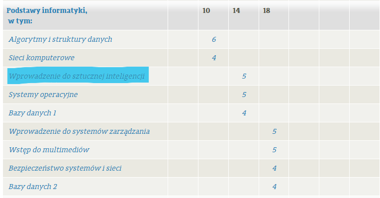

# Research 
Przeglądam przedmioty inżynierskie na infie po prostu:



Na 3 semie mają oni przedmiot [Wprowadzenie do sztucznej inteligencji (WSI)](https://usosweb.usos.pw.edu.pl/kontroler.php?_action=katalog2/przedmioty/pokazPrzedmiot&prz_kod=103A-INxxx-ISP-WSI), który przed reformą nazywał się [Podstawy sztucznej inteligencji (PSZT)](https://usosweb.usos.pw.edu.pl/kontroler.php?_action=katalog2/przedmioty/pokazPrzedmiot&prz_kod=103A-INxxx-ISP-PSZT). Myślę, że to jest dobry punkt startowy.

Są też linki do dysków :D
- [WSI](https://drive.google.com/drive/u/0/folders/1XK0eqMpRasfvbHRnKHj4mCGw8Ixr1N3y)
- [PSZT](https://drive.google.com/drive/u/0/folders/1wL5aZ5NJ4iRvO3m54co6LBpiSRxLiXf0)

Potem na specce "Sztuczna inteligencja" mają przedmioty:
- [Przeszukiwanie i optymalizacja (POP)](https://usosweb.usos.pw.edu.pl/kontroler.php?_action=katalog2/przedmioty/pokazPrzedmiot&prz_kod=103A-INSZI-ISP-POP)
- [Sztuczne sieci neuronowe(SSNE)](https://usosweb.usos.pw.edu.pl/kontroler.php?_action=katalog2/przedmioty/pokazPrzedmiot&prz_kod=103A-INSZI-ISP-SSNE)
- [Uczenie maszynowe (UMA)](https://usosweb.usos.pw.edu.pl/kontroler.php?_action=katalog2/przedmioty/pokazPrzedmiot&prz_kod=103A-INSZI-ISP-UMA)

A jako obieraki tej specki mamy:
- [Inżyniera uczenia maszynowego (IUM)](https://usosweb.usos.pw.edu.pl/kontroler.php?_action=katalog2/przedmioty/pokazPrzedmiot&prz_kod=103A-INSZI-ISP-IUM&callback=g_ee3951a2)
- [Podstawy wielkich modeli językowych z zastosowaniami (LLM)](https://usosweb.usos.pw.edu.pl/kontroler.php?_action=katalog2/przedmioty/pokazPrzedmiot&prz_kod=103A-INSZI-ISP-LLM&callback=g_ee3951a2)

Dysk:
- [UMA](https://drive.google.com/drive/u/0/folders/1K8YnYrYcRj1w59UBh28EDYe9c-PEqURN)
- reszta brak :(

# Wnioski
Przerobię materiały najpierw z WSI (bo są nagrane wykłady), potem PSZT i zobaczę co dalej. Dziś przecież nawet nie wiem, czego nie wiem.

## PSTZ
Opinia z [weiti.pw](https://weiti.pw/opinion.php?id_val=1131&context=class)

```plaintext
Wykład:

Mieszanka Biedrzyckiego, Arabasa, Zawistowskiego oraz Wawrzyńskiego.

Arabas > Biedrzycki > Wawrzyński > Zawistowski.

Warto chodzić, nawet, jeśli na pierwszy rzut oka się nie rozumie - prowadzący chętnie i rzetelnie odpowiadają na pytania.

Jak nie lubisz wykładów to chociaż idź na Arabasa i Biedrzyckiego a zamiast pozostałych jebnij sobie kursik na courserze "Neural Networks and Deep Learning".
```

