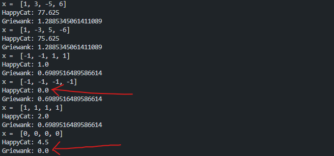

# Lab 1 - Evolutionary Algorithms

We will implement two different Evolutionary Algorithms and explore their ability to solve the problem of minimalization of two functions.

Functions:
- [Happy Cat](https://benchmarkfcns.info/doc/happycatfcn.html)
- [Griewank](https://benchmarkfcns.info/doc/griewankfcn.html)

Algorithms:
- Evolutionary Algorithm with parameters specified later
- Evolutionary Strategy (mu + lambda)

We will work in a four dimension search space.

Both of the function can be easily calculated based on the definitions from [this python lib](https://benchmarkfcns.info/fcns).

And the global minimums of them are arbitrarily known:

# Evolutionary algorithm

First, we will implement some general evolutionary algorithm that is not an Evolutionary Strategy (since remember that ES are a subset of EA).

This is the general schema of such algorithm:

- `parameters initialization` - includes params about population size,  crossover or mutation possibilities, etc...
- `initialization()` - generates first totally random population
- `evaluate()` - evaluates each individual (candidate solution)
- `stop?` - in our case stopping criterium is reaching the number of 10000 evaluations
- `selection()` - its mission is to select a subset of population, where individuals with higher evaluation have better chances to selected, these are going to be parents
- `genetics_operators()` - divided in `crossover()` and `mutation()`
    - `crossover()` - combines two or more parents to produce one or more offsprings
    - `mutation()` - introduces random change in an individual genes
- `succession()` - its purpose is to decide which individuals are going to live in the next generation

As it is in the case of EA, we have a bunch of decision to deal with:
- As for the `selection` we will choose the `tournament` one.
- As for `crossover` we will choose the `one-point crossover`.
- As for `mutation` we will use the normal distribution.
- As for `succession` we will use the `elitary` one.

