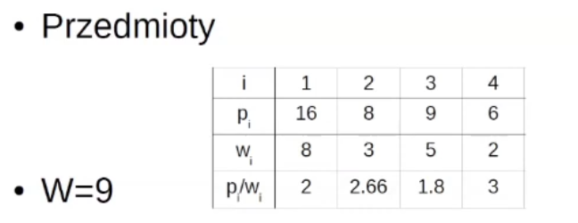
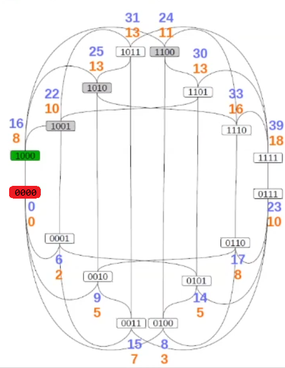
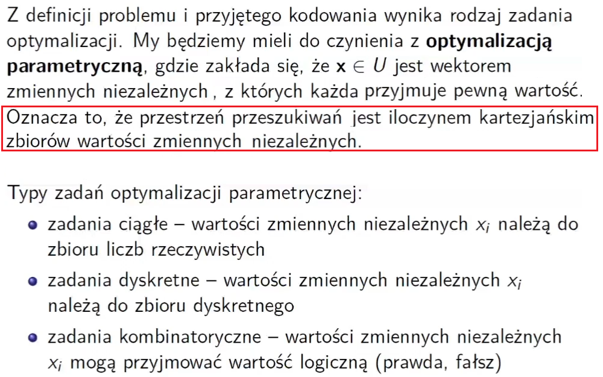
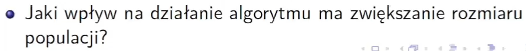
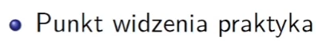
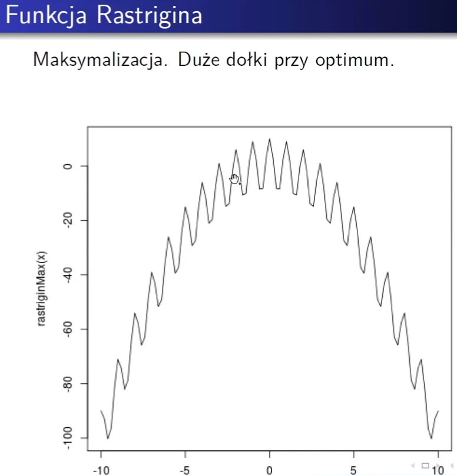

# W1 - Rozwiązywanie zadań przez przeszukiwanie, A\*, najszybszy wzrost, metoda Newtona

"Co innego powiedzieć wykład, a co innego temat wyłożyć" - Jarosław Arabas

Kilka podstawowych chwytów, które będą państwo poznawać w trakcie dalszego wykładu.

## Problem plecakowy


Każdy przedmiot może zostać zabrany lub nie (`xi`) oraz jest ich trochę za dużo.

`wi` - waga

`pi` - zysk

Plecak ma limity górny wagi czyli udźwig `W`

Czyli chodzi o maksymalizację sumy iloczynów `pi` i `xi` przy założeniu, że suma iloczynów `xi` i `wi` jest mniejsza od `W` 


Mamy 4 przedmioty. Dla ułatwienia podano też ile zysku `x` daje jedna jednostka wagi `w` danego przedmiotu. 

Tutaj rozwiązaniem jest zapakowanie przedmiotów 2 i 3 wartość jego wynosi 17. Nasuwa się ono prosto, ale jak do tego dochodzimy?

Wszystkich kombinacji wektorów `x` jest 2^4 czyli 16.


Więc nie przerasta to naszej wyobraźni.  

A jak napisać program, który robi to?

Rekurencyjnie!


Tworzy nam się drzewo binarne, gdzie root to węzeł dla którego żadna z decyzji dotyczących bitów nie została podjęta a liście to takie kombinacje, gdzie już są tylko 0 i 1, czyli wiadomo wszystko.

De facto węzeł `01??` reprezentuje rodzinę 4 możliwych rozwiązań.

Przejrzenie wszystkich możliwych kombinacji, żeby żadnego możliwego rozwiązania nie pominąć  to można jakoś usystematyzować, np. po prostu cały czas skręcają w lewo i wracając się na liściach. Można to robić albo metodą rekurencyjną albo używając stosu.

Takie drzewo to **Przestrzeń przeszukiwań**, a jego węzły to **elementy** tej przestrzeni, czyli reprezentacje potencjalnych rozwiązań + reprezentacje grup potencjalnych rozwiązań.


Reprezentacje potencjalnego rozwiązania dosyć łatwo jest wycenić stwierdziwszy badając liczbę pomarańczową czy ograniczenie wagowe jest spełnione czy nie, możemy obliczyć ich zysk.

Takie przyporządkowanie przypisujące konkretną wartość każdej reprezentacji potencjalnego rozwiązanie to **Funkcja celu**. Może być ona definiowana **optymistycznie**, czyli będziemy chcieli maksymalizować jej wartość (szukać takiego rozwiązania, dla którego zwraca ona max) lub **pesymistycznie**, gdzie chcemy minimalizować (np. błąd często jest taką funkcją). 

Czyli zdefiniowaliśmy sobie **przestrzeń przeszukiwań** oraz **funkcję celu** dla niektórych elementów tej przestrzeni (czyli dla reprezentacji potencjalnych rozwiązań)

Dla reprezentacji grup rozwiązań nie da się wyznaczyć wartości funkcji celu. Więc co z nimi zrobić? 

Czyli jaką wartość powinien mieć np. węzeł  `01??`

Jak już mamy zapakowane `01` to najmniej ile uzyskamy to `8`, a najwięcej `23` ale jest ono niedopuszczalne, więc najwięcej możliwe jest `17`. Więc jaką teraz wartość wybrać pomiędzy `8` a `17`?

Odp: Tę większą :happy:

No bo .. do czego służy nam funkcja celu?  

Przy większej liczbie bitów `n` w wektorze `x` liczba liści `2^n` do przejrzenia brute force staje się nieakceptowalnie duża, wiec jeżeli mielibyśmy jakąś funkcje, która pomogła by nam nawigować w tym drzewie, po to, że np. odrzucić część przestrzeni, która nie jest warta oglądania, to było by bardzo dobrze.  No i w sumie branie jako wartości dla węzłów drzewa reprezentujących grupy rozwiązań wartość taką jaka jest największa osiągalna z tego węzła ma swoje echo w tym.

 

Tu każdy rodzic dostaje wartość największa dopuszczalną przez jego dzieci. A jeśli dwoje dzieci jest niedopuszczalne, to rodzic też jest oznaczany jako niedopuszczalny. To podpisywanie wartości się robi "od tyłu".

Zasady tworzenia tych etykiet są proste.

```
Dzieci: X + X => Rodzic: X
Dzieci: X + liczba => Rodzic: liczba
Dzieci: liczba1 + liczb2 => Rodzic: max(liczba1, liczba2)
```

I na tej podstawie jesteśmy w stanie zrobić taką scieżkę, gdzie bierzemy optymalną wartość. 


 Jak jesteśmy w wektorze `????`, to gdybyśmy mieli za wczasu te wartości zielone znane, to byśmy wiedzieli, które decyzje należy podjąć. Czyli najpierw pozostawić przedmiot numer 1 w spokoju. Potem dobrać przedmiot 2.

No właśnie gdybyśmy te wartości znali za wczasu ....

No i teraz pytaniu jak to zrobić. No bo rozwiązanie takie, że najpierw generujemy te wartości niebieskie na dole, a potem te na górze, no to nie ma większego sensu, bo to brute force. Więc jak zrobić tak, żeby te wartości pojawiały się "za wczasu".

Tę ścieżkę nazwano radami dobrej wróżki. Gdyby istniała taka dobra wróżka, która by doradzała, to podejmując decyzję szli byśmy tą optymalną ścieżką, bez ogladania się na inne rozwiązania (czyli wystarczyło by tylko 4 węzły odwiedzić, czyli tyle ile mamy bitów a nie `2^4`, a to jest duża różnica.

No i pytanie skąd wytrzasnąć taką dobrą wróżkę?


Wiedząc, to:



Jaki największy zysk możemy uzyskać? 

Pierwsze zgrubne przybliżenie to spojrzeć na najlepszy stosunek `pi/wi` oraz na wagę max `W`.  Czyli na pewno ten łączny zysk nie może przekroczyć `9*3`, czyli `27`.  Ale to jest bardzo grube.

To teraz załóżmy sobie, że ostatni przedmiot można jednak dzielić, to weźmiemy wtedy przedmiot `4`, przedmiot `2` oraz połowę `1`, to da nam to zysk `22`. No i takie uproszczenie problemu zawsze da nam optymalne rozwiązanie przy założeniu podzielności przedmiotów. Tu wiemy, że jest to optymalne!!! (ale przy nieco innym problemie). Po prostu to uproszczenie czyni ten problem niezwykle łatwym (układ równań liniowych). 

Stosując taką zachłanną regułę na oszacowanie, to daje spoko nawet przybliżenie, no bo gdyby się okazało, że ostatni przedmiot trzeba dzielić, to wtedy po prostu musimy ten plecak lekko rozpakować i wsadzić inne przedmioty, oraz wiemy, że nowe przedmioty mają mniejsze `pi/wi` więc jest to ograniczenie GÓRNE. 


Dobra, zastosujmy teraz to w obliczeniach. Np. jesteśmy w węźle `011?`, czyli nasza waga wynosi już 8, a nasz zysk wynosi już `17`, no to teraz jaki jest max dla dalszych decyzji? Otóż przedmiotu `4` nad którym zostało na decydować można włożyć `1/2` czyli dostać zysku `8`. Więc max to jest `17+3` = `20`. 

Czyli wiedząc, że przedmioty `011` zostały zapakowane a nad czwartym się decydujemy, to wiemy że max może być zysk `20`.

Dobra a teraz jesteśmy w węźle `010?` Tu mamy `w=3` oraz `p=8`, biorąc przedmiot `4` zrobi nam się `w=5` oraz `p=14`. Skoro tak, to stosując regułę wyznaczania rodzica dla węzła `01??` wyznaczamy oszacowanie 20.

No i załóżmy teraz, że my już nie musimy wiedzieć jakie są wartości funkcji celu w dzieciach, żeby dowiedzieć się jakie jest jej oszacowanie u rodzica, bo ona już więcej nie zależy od tego co jest u dzieci, a jedynie od tego jakie przedmioty są zapakowane a co do których nie podjęto jeszcze decyzji. 

Od dołu patrząc mamy dobrą wróżkę która mówi dokładnie, a od góry mamy wyrocznie (oracle), która mówi jaka co najwyżej będzie wartość. 


My tutaj widzimy całe drzewo, no ale proces podczas obliczeń widzi tylko aktualny węzeł. Obliczenia wyroczni są wykonywane właśnie w danym węźle

No i proszę zauważyć, że kierując się nimi (czyli z dwóch dzieci wybierając lepszy według szacowanej przez wyrocznie funkcje celu) doszliśmy do **TEJ SAMEJ SCIEZKO CO ZA POMOCĄ WRÓŻKI** :happy:.

Pytanie teraz więc jaki jest ogólny algorytm na przeszukiwanie drzewa, żeby jak najszybciej (jak najmniejszą liczbą kroków (porównań dzieci)) dojść do rozwiązania. 

I tu jest właśnie propozycja:


Ang. Best First

W jednej iteracji algorytmu rozważany jest jeden węzeł przeszukiwań `x` 

`A` to zbiór węzłów oczekujących na zbadanie. Początkową zawartością tego zbioru `A` jest węzeł będący korzeniem drzewa `s0`.  

Zbiór A jest zorganizowany jako kolejka priorytetowa, czyli operacją pop wyciągnięty jest ten, który ma najwyższą wartość priorytetu. U nas priorytetem jest wartość funkcji celu.

Czyli w jednej iteracji z kolejki `A` wyciągamy aktualnie rozpatrywany węzeł `x`. Następnie tworzymy zbiór `Y` czyli jego sąsiadów i dołączamy go do zbioru `A`. No i tak to się kręci. Kiedy jest stop? Kiedy aktualnie rozpatrywany węzeł `x` ma stan terminalny (czyli wszystkie decyzje już zostały podjęte, brak `?`).


Rysunek na dole pokazuje iteracja po iteracji, co jest w danej iteracji w zbiorze A i co z niego zostanie spopowane.


W 5 iteracji dochodzimy do węzłów terminalnych i to spośród nich wybieramy solution. Ale zauważ, że w kolejnce jest jeszcze węzeł, który ma wartość 19 czyli większą niż dopuszczalne z terminalnych. Tu akurat zakończenie na dojściu do terminalnych dało nam rzeczywiste optimum, ale z racji, że jest to heurystyczna metoda, nie zawsze tak jest. Dlatego mamy dwie opcje:

- Albo przyjąć się pierwsze dopuszczalne terminalne, ale pogodzić się z faktem, że niekoniecznie jest ono rzeczywistym optimum (jednakże skraca to bardzo czas obliczeń)
- Albo gdy są jeszcze w zbiorze A węzły nieterminalne o większej funkcji celu to kontynować obliczenia i mieć gwarancje znalezienia optimum.

Drugie podejście da optimum, ale są takie przypadki, że doprowadzi do przeglądania CAŁEGO drzewa (całej przestrzeni przeszukiwań).


To co nazywaliśmy wyrocznią jest tak naprawdę funkcją heurystyczną.

Nasza funkcja celu dla węzłów terminalnych jest dokładną wartością jego zysku. Ale dla węzłów nieterminalnych, jest oszacowaniem maksymalnej wartości jaką terminalne wychodzące z tego węzła może osiągnąć.

Dobra wróżka mówiła dla każdego poddrzewa jaka jest dokładna wartość możliwa dla węzła nieterminalnego będącego korzeniem tego podrzewa.

No i nasza wyrocznia też fajnie jakby się tego trzymała.

No i okazuje się, że optymizm jest tutaj pożądaną właściwością. Nasza wyrocznia powinna być nadmiernie optymistyczna czyli jeżeli potrafimy już obliczyć dokładnie jaki zysk mamy w ustalonych przedmiotach `g(x)` to szacunkowy przyrost tego zysku `h(x)` powinien po zsumowaniu z aktualnym `g(x)+h(x)` dać wartość, które nie jest mniejsza od najlepszego węzła terminalnego osiągalnego w tym drzewie. Czyli wyrocznia powinna mieć wartość nie mniejszą niż dobra wróżka `g(xt)`. Ten mechanizm nazywamy **dopuszczalnością**, a nieoficjalnie **nadmiernym optymizmem**.

Druga cecha to **monotoniczność**. W miarę tego jak już coraz więcej wiadomo o konkretach, to błąd oszacowania przyrostu zysku nie powinien nigdy rosn  ąć.


Czyli **dopuszczalność**: zielona liczba (wyrocznia) powinna być zawsze większa niż niebieska (dobra wróżka).

**Monotoniczność**: W głąb drzewa rozbieżność między zieloną a niebieską liczbą powinna maleć.


No dobra, ale co nam te dwie właściwości funkcji heurystycznej dają?

- Jak wyrocznia nie jest nadmiernie optymistyczna (jej oszacowania są optymistyczne), to to może prowadzić do opóźnienia sprawdzania optymalnych rozwiązań (sprawdzono empirycznie). Czyli takie podejście przyspiesza dojście do rzeczywistego optimum.
- Monotoniczność z kolei prowadzi do założenia dosyć szybkiego, że jak znajdziemy węzeł terminalny o wartości `x`, to wszystkie węzły nieterminalne, co mają mniejszą wartość oszacowania od `x` możemy odciąć ich drzewa. Im szybciej możemy takie założenia zrobić tym szybciej odrzucamy duże poddrzewa, a tym szybciej możemy takie założenia robić im szybciej błędy oszacowań maleją.

No i właśnie gdy algorytm najpierw najlepszy **(best-first**) skojarzymy z funkcją **heurystyczną** i zapewnimy **dopuszczalność** i **monotoniczność** to wtedy możemy mówić o [**Algorytmie A***](https://pl.wikipedia.org/wiki/Algorytm_A*).

## Inne podejście

Ale możemy inaczej spojrzeć na naszą przestrzeń przeszukiwań.


Wprowadzimy do grafu dodatekowe krawędzie wychodzące od rozwiązań terminalnych do innych rozwiązań terminalnych, które różnią się JEDNYM BITEM. 

Żeby było lepiej widać to możemy tak zobrazować te krawędzie:


To jest inna przestrzeń przeszukiwań. To jest graf niebędący drzewem. Nie mamy tu już żadnych znaków zapytania. Każdy węzeł jest terminalny oraz połączony jest z czterema innymi (bo na 4 pozycjach można zmienić wartość bitu).  

Również w tej przestrzeni możemy rozwiązywać problem plecakowy przez przeszukiwanie. Jaka jest zaleta? Nie musimy definiować funkcji celu, dla rozwiązań, które mają pytajniki w sobie.

O tym jak w takiej przestrzeni można rozwiązywać problem plecakowy z taką przestrzenią przeszukiwań będzie jeszcze kilka wykładów, ale zacznijmy od najprostszego sposobu.


Wspinaczkowy - czasem zwany też zachłannym.

`N(x)` - sąsiedztwo punktu roboczego.

Z `Y` wybieramy najlepszego sąsiada, czyli tego co ma najlepszą funkcję celu.

I teraz jeśli wartość funkcji celu punktu `y`, `q(y)` jest większa od wartości funkcji celu `q(x)`, to podmieniamy punkt roboczy.

`x0` to standardowo może być pusty plecak.

przykładowo:


Natępnym punktem roboczym staje się `1000`.



Ale jego wszyscy sąsiedzi są niedopuszczalni. Tak więc algorytm kończy działanie dając odpowiedź `1000`.

No ale my dobrze wiemy, że to nie jest rozwiązanie.

Rzecz polega na tym, że znaleźliśmy maksimum LOKALNE A NIE GLOBALNE.

Np. gdybyśmy zaczęli z punkty `0100` to byśmy doszli w pierwszej iteracji do `0110` i uznali to za rozwiązanie.

Po prostu algorytm wspinaczkowy cechuje się tym, że jeśli są maksima lokalne w przestrzeni poszukiwań, to wielokrotne jego uruchomienie z różnych punktów startowych daje różne rozwiązania.


Dobra, a teraz pomyślmy sobie, że rozwiązujemy problem szukania maksimum prostej na płaszczyźnie dwuwymiarowej (układ kartezjański) o równaniu `y=ax+b`. Tutaj przestrzeń przeszukiwań jest nieskończona. I tak samo każdy punkt ma nieskończoną liczbę sąsiadów. W związku z tym ciężko stosować algorytm wspinaczkowy, no bo w każdym kroku trzeba przejrzeć nieskończoność sąsiadów. No dobrze, no to w którą stronę pójść z danego punktu? 

Otóż zastanówmy się, że sąsiad o najwyższej wartości funkcji celu, to będzie taki sąsiad, którego różnica jego wartości funkcji celu a funkcji celu punktu roboczego jest największa. Co nam mówi o różnicach? Pochodne. A a wielu wymiarach? **Gradient**.


Gradient wskazuje kierunek najszybszego wzrostu. To jest wektor pochodnych cząstkowych funkcji celu względem poszczególnych współrzędnych.


No to w takim razie sprawa załatwiona. W algorytmie wspinaczkowym zamiast przeglądać wszystkich sąsiadów wystarczy obliczyć gradient:


I w ten sposób powstaje metoda najszybszego wzrostu:


Czyli liczymy gradient dla punktu roboczego i wychodzi nam kierunek `d`.

 A potem mnożymy ten wektor `d` przez współczynnik kroku i dodajemy ten wektor do punktu `x`, czyli przesuwamy ten punkt `x` o krok w stronę wektora `d`.

> Współczynnik kroku, to chodzi o to, że komputery operują na dyskretnych liczbach rzeczywistych, a nie prawdziwych. 
>
> Np. dla zmiennej typu float w python krok wynosi:
>
> 

Ale ten minimalny możliwy krok często nie ma sensu. Lepiej jest dobierać ten parametr:


W zależności od jego wartości różnie będziemy "skakać" po przestrzeni poszukiwań.

Cała sztuka polega na odpowiednim dobraniu współczynnika `Beta`.


Jeszcze taka dodatkowa wrzutka, że w metodzie najszybszego wzrostu nie stosuje się w praktyce z obliczeń gradientu, bo rzadko kiedy gradient jest dany analitycznie, zamiast tego ten gradient wyznacza się przez estymowanie czyli przez średnią wartość ilorazu różnicowego i wtedy jest to metoda stochastycznego wzrostu/spadku.


## Metoda Newtona

Na koniec została nam metoda Newtona.

Ona używa z kolei Hesjanu.

Hesian to macierz drugich pochodnych cząstkowych funkcji:


Hesjan mówi nam o tym jak zmienia się wartość gradientu. Czyli jest tak jakby pochodną gradientu. Gradient pokazuje jak zmienia się funkcja celu względem argumentu, a Hesjan mówi o tym jak zmienia się gradient względem argumentu.

To pozwala "przewidzieć", w którym kierunku "iść".

Czyli w danym punkcie zamiast iść w stronę gradientu i potem zakręcać, to od razu pójść tam gdzie on zakręci.


Uwaga: w praktycznych zastosowaniach nie używa się metody Newtona, tylko tzw. metody pseudo-Newtonowskie, gdzie zamiast hesjanu używamy jego aproksymacji na podstawie historii zmian gradientu (metody BFGS i DFP).

# W2

Zagadnienie optymalizacji w przypadku skomplikowanych funkcji celu obliczenia mogą trwać bardzo długo np. miesiąc. Dlatego takie skomplikowane procesy czasami upraszcza i robi się aproksymator, który sam się uczy z modelu i potem ten aproksymator się stosuje do obliczania wartości funkcji celu. 


 Optymalizacja łączy się z innymi dziedzinami jak np. sieci neuronowe czy klasyfikatorami w sposób naturalny. Np. często funkcje celu trudno jest wyznaczyć, więc tworzy się aproksymatory, które uczą się na modelach i podają "szybko" wartości funkcji celu zamiast serio je liczyć.

## Od początku


Przestrzeń przeszukiwań to ten obszar, gdzie będziemy się poruszać, żeby znaleźć nasze optimum. Przestrzeń to zbiór możliwych  wartości `U` oraz metryka `|.|`, dzięki której możemy śledzić jak daleko jesteśmy punkt od punktu.


Zwykle nie przeszukujemy całej przestrzeni tylko na podzbiorze `D`. (np. w problemie plecakowym mamy ograniczenie pojemności plecaka).


No i dana jest funkcja celu `q(x)` gdzie `x` to wektor potencjalnego rozwiązania, a `q` go ocenia.


Szukamy takiego wektora `x*`, że wartości funkcji celu `q` będzie najmniejsza/największa.


No i minimum lokalne, to takie wektor (punkt), że istnieje taka liczba `δ` większa od zera, że dla każdego `r` mniejszego od tej liczby i dla każdego `y` należącego do zbioru części wspólnej możliwych rozwiązań `D` i sąsiedztwa punktu `x` o promieniu `r` wartość funkcji celu `q(x)` jest mniejsza lub równa wartości funkcji celu `q(y)`

> Sąsiedztwo:
>
> 


**Funkcje wielomodalne** - to takie co mają więcej niż jedno optimum. W kontraście do [funkcji unimodalnej](https://pl.wikipedia.org/wiki/Funkcja_unimodalna).


No To co ogranicza zbiór `U` to między innymi **ograniczenia kostkowe**, które definiują krańce. Mogą też być inne ograniczenia które "tną" zbiór U "w środku". Np. liczymy grubość belki, to kostkowe będą że musi być ona większa od zera (no bo wiadomo w prawdziwym świecie nie może być belka o ujemnej lub zerowej szerokości), a od góry można sobie coś sensownego założyć że max 3m grubości.


Jeśli ograniczenia twarde są złamane, to nie da się obliczyć funkcji celu dla danego punktu. Miękkie mogą być łamane "po drodze", ale wynik optymalizacji musi już je spełniać. 

Czyli podczas wędrówki po przestrzeni przeszukiwań punkt roboczy może być na chwilę w obszarze, który nie spełnia miękkich, ale nie może być nigdy w obszarze, który nie spełnia twardych. 

No bo czasem jest tak, że obszar dopuszczalny ma kształt rogalika, i łatwiej ściąć idąc chwilę po niedopuszczalnym niż iść naookoło.

### Rodzaje zadań



My na wykładzie najwięcej czasu poświęcimy na zadania ciągłe, ale tymi dwoma też zajmiemy się na początku.


`x` to wektor, a `xi` to elementy tego wektora. No i mogą one być albo binarne, albo wyliczeniowe (jak w implementacji problemu plecakowego (`0,1,?`)), albo liczbami rzeczywistymi.

A ocb z tymi "specyficzne"? No bo może to być cokolwiek co komputer umie reprezentować. Np. grafy (struktura danych). 

### Punkt startowy


Taki punkt startowy wyznaczony dzięki wiedzy dziedzinowej może:

- przyspieszyć optymalizację
- być konieczny w przypadku trudnych wielowymiarowych problemów
- ale też może to uwięzić optymalizator w ekstremum lokalnym


>  Wielowymiarowe to np 1000 wymiarów. W takich przestrzeniach przeszukiwań jest niesamowicie pusto (dużo rozwiązań nie spełnia ograniczeń), stąd trzeba mega dużo czasu poświęcić, aby taką przestrzeń przeszukać.


Nie wygooglujesz tego "Galara" to jakiś gość co męczył tę funkcję na konferencjach i Biedrzyckiemu się spodobało, więc używa jej jako świetny przykład, tego że czasem wybranie punktu zgodnie z wiedzą domenową może uwięzić algorytm w ekstremum lokalnym.

Np. tu zaczniemy od 6 to algorytm głuputki jest spojrzy w lewo prawo, patrzy gdzie spadek, pójdzie tam. Spojrzy że potem obaj sąsiedzi gorzej i mówi koniec. A 7 sąsiadów dalej mamy lepsze rozwiązanie :smile:. A np. jak zaczniemy w przedziale (-2,2) no to wiadomo, że będzie to samo, ale tu akurat dojdziemy do globalnego. Ale z kolei np. jak zaczniemy w x=12, to często taki algorytm będąc daleko od ekstremów nabierze dobrego kierunku i tak jakby "przeskoczy" lokalne i dobrze pójdzie do globalnego.

Więc jak widać **punkt startowy** ma znaczenie.

### Rodzaje metod optymalizacji


lokalne to np. metody Newtona. Globalne to np. algorytmy ewolucyjne, choć tu z kolei gwarancje znalezienie ekstremum globalnego mamy, ale w nieskończoności. Tzn. jak damy mu nieskończoność czasu to dopiero wtedy mamy gwarancje 100%. Ale praktyka pokazuje, że ewolucyjne sobie nieźle radzą i rzeczywiście te optima globalne znajdują.

## Przykładowy problem

 

 

Pierwsza obserwacja to taka, że mamy 48bitową przestrzeń binarną jako naszą przestrzeń przeszukiwań `Ω`

Przedmiotem funkcji celu będzie koszt energii na dobę.

Na tym przykładzie będziemy opisywać dalej.

## Algorytmy ewolucyjne

Grupa metod, które są inspirowane ewolucją naturalną zarówno w sposobie działania jak i nazewnictwie (osobnik, populacja, krzyżowanie, mutacja, selekcja).

### Pseudokod


Jak ktoś ma expa, to wie jak te parametry `pm`, `pc`, `mu` ustawić dla danego problemu.

- `mu` - liczba osobników w populacji
- `pc` - pstwo krzyżowania
- `pm` - pstwo mutacji

Co dalej?
`t` to licznik generacji

Najpierw losowo tworzona jest pierwsza generacja `P0`, a następnie oceniana (czyli liczone są wartości funkcji celu dla każdego osobnika populacji).

Na początku z populacji aktualnej `Pt` tworzymy populację tymczasową `Tt`.  Potem tworzymy kolejną populację tymczasową `Ot`, która poddawana jest ocenie i następnie ona staje się populacją aktualną. To przed-ostatnie równanie `Pt+1 = Ot` fachowo nazywane jest **sukcesją generacyjną**. Sukcesja czyli kto przeżyje, generacyjna czyli całe pokolenie. 


 "pośredni" - czyli mieć trochę cech jednego rodzica, trochę drugiego

U(0,1) to oznacza rozkład jednostacjny.

### Holland, 1975

Tamto były generyczne ogólne kroki. Ale je można konkretyzować. Np. w tym algorytmie Hollanda było tak;


selekcja czyli "kto poruchał", "kto przekazał geny". No i w Hollandzie rozważamy każdego osobnika z osobna i sprawdzamy dla niego `Ps`, a tym  ma większe to `Ps` im większa jest funkcja celu. 

> Imo trochę małe jest tu to pstwo. Małe wyjdą te populacje.


W Hollandzie była reprezentacja binarna osobników. Krzyżowanie powyżej polega na wybraniu indeksu wektora i podmiance.


No i tu jako sukcesję przyjęto, że cała generacja przeżywa. 

> Ale w sumie po co zarówno tu jak i w selekcji (reprodukcji) jest dzielenie populacji? Jakaś dziwna redundancja imo.

No i takie też były założenia u tego Hollanda:


Czyli u nas jak mamy 48bitów, to populacja powinna mieć z 200 osobników.

Ale dużo osobników to zajmuje dużo czasu bo ocena jest często czasochłonnym procesem. Np. u nas w ocenie wykorzystywany jest jakiś fizyczny model chłodni i tam mamy różniczkowanie numeryczne a to są mocno uciążliwe obliczenia.


Tak wtedy uważano po prostu. No ale dziś wiemy, że to jest ofc jest racja dla pewnych problemów, ale są też takie dla których nie jest to już racja. 


Gloryfikowane wtedy było krzyżowanie jednopunktowe (zgodnie z teorią schematów),

Teoria schematów mówi, że w ogołności w problemach jest jakaś część wektora, która jest mocno istotna i ważne jest, aby ją dobrze znaleźć, a reszta wektora jest taka dopełniająca tylko. Dlatego jak już znaleziono schemat z dobrymi częściami istotnymi to starano się go nie dzielić tylko optymalizować te mniej znaczące resztki.

Stąd jednopunktowe z racji, że ma jedno cięcie to rzadko łamie schematy było gloryfikowane,  ale ono czasem nie daje wszystkich możliwych kombinacji genów.

Dlatego wymyślono inne schematy krzyżowania.


Nie zawsze da się tak zrobić, że kodowanie binarne koduje dobrze nasz problem.

Pojawiło się więc rozróżnienie pomiędzy genotypem, a fenotypem. **Genotyp** to jest to na czym pracuje nasz algorytm (binarny on jest), a **fenotyp** to jest to co rzeczywiście jest tym genotypem zakodowane. Np. fenotyp to może być liczba rzeczywista albo graf.


No ale tu się pojawiało problemy, bo np. mamy genotyp `0111`, który koduje 7. No i teraz, żeby zrobić mutacje to rzeczywistym sąsiadem jest liczba 8, ale przecież genotyp dla 8 wygląda tak `1000` (czyli totalna odwrotność XD).  No więc jak np. mutujemy 1 czy 2 bity, to nie da się uzyskać 8semki z 7demki.

No więc wymyślono kodowanie Graya, gdzie każda kolejna liczba dziesiętna różni się jednym bitem.


Konwersja liczby `y` normalnej naturalnej to jak się zrobi xor jej reprezentacji binarnej z jej reprezentacją binarną ale przesuniętę jeden bit w prawo, to wyjdzie nam liczba w kodzie Graya.

### Podsumowanie


On jest łatwy mega w implementacji, więc Biedrzycki zazwyczaj sam implemenci niż traci czas na dokumentacje czyichś.


metaheurystyka to kiedy nad heurystyką nadzoruje inna heurysyka

## Przykładowy problem


# Algorytm ewolucyjny

### Pseudokod


> Nie wiem co ten koleś tłumaczy, czemu jest drugi raz pseudokod???
>
> Może tamten to był genetyczny a to ewolucyjny?
>
> Temu chyba bliżej do tego co robiłem na OAST.

Kryterium stopu to może być po prostu liczba iteracji.

W funkcji `operatory_genetyczne` niekoniecznie jest krzyżowanie, mutacja musi być. 

No i tu wybieramy z tej populacji starej oraz nowej co przeżyje 


## Rozmiar populacji

Są dwa optima. Mała populacja jest git, potem jest coraz gorzej, a potem ogromna też jest git.

**curse of dimensionality** - w miarę wzrostu liczby wymiarów (rozmiar zadania) liczba obserwacji (rozmiar populacji) potrzebnych do odpowiednio gęstego spróbowania przestrzeni przeszukiwań rośnie wykładniczo:


## Inicjacja


Jak damy różnorodne punkty na starcie, to większa szansa, że któryś trafi na "fajny" obszar przestrzeni.


To działa ok dla małych przestrzeni. Obecnie ten pomysł odpadł i stosujemy losowanie po prostu.


To co teraz robi się to posiew równomierny. A z tym nierównomiernym to się Biedrzycki nigdy nie spotkał.

## reprodukcja (selekcja)


ruletkowa jest słaba, nie polecam (*)

> Od teraz "ja" to wykładowca.


Najbardziej popularna którą ja polecam to jest turniejowa. Ale ma ona cechy typu, że:

- osobnik najlpeszy danej populacji może nie przeżyć (bo go nie wybierzemy do udziału w trunieju)
- osobnik najgorszy może przeżyć (bo go wybierzemy dwa razy do turnieju)

Co czyni go:

- Odpornym na optima lokalne (czyli ma dobre zdolności eksploracyjne), co jest np. główną bolączką ruletkowej
- A kolejna cecha to łatwość w implementacji


Robi się skalowanie funkcji celu, żeby wychodziło ok pstwo.

Też często trzeba skalować elementy wektorów, bo jeden ogromny może mieć dużo większą siłę mutacji czy coś.


Turniejowa daje lepsze szanse na przeżycie tym kiepskim, co jest ok, no bo w danej chwili kiepski osobnik może się okazać być świetnym rodzicem w następnej iteracji (bo przejdzie przez siodło akurat).

## Idea mutacji


`sigma` to siła mutacji tzw.

## Krzyżowanie


A jakie są pomysły na krzyżowanie:


Wymienijące to jest np. jednopunktowe:


W nim losuje się dwóch rodziców i rodzi się jeden potomek.


No i w równomiernym wszystkie kombinacje sąsiadów są osiągalne:


## Sukcesja


Elitarna nie gubi dobrego osobnika.  

Czyli brane jest `k` najlepszych z `P(t)` a z tej zmutowanej (czyli `O(t)`) wywalane jest `k` najgorszych.

Im większe `k` tym większa tendencja algorytmu do utniknięcia w optimum lokalnym.

## Eksploracja vs eksploatacja

Te dwie siły są przeciwstawne. 


No i na ten kompromis składają się wszystkie elementy algorytmu.

- **selekcja** - jeżeli zrobimy selekcje, która przyjmuje bardzo dużą uwagę do jakości osobnika, wtedy będziemy mieli bardziej eksploatacje. A np. taka miękka selekcja pozwoli na lepsza eksplorację.
- **sukcesja** - jeżeli pozwolimy na to, żeby osobniki dobre ginęły to poprawi nam się eksploracja 
- **krzyżowanie** - może nam zmniejszyć różnorodność populacji (np. poprzez uśrednianie), co daje lepszą eksploatacje.
- **mutacja** - jeżeli będzie zbyt słaba, no to eksploatacja, jeżeli zbyt mocna no to esploracja

 No i sztuka polega na odpowiednim dobraniu parametrów tego kompromisu.

### Dynamika prostego algorytmu ewolucyjnego


Po lewej mamy przestrzeń przeszukiwań a na osi `z` widzimy wartość funkcji celu. Mamy trzy optima z czego to po prawej jest globalne. 

Po prawej mamy średnią funkcje celu osobników populacji względem iteracji. 

Jak widać pierwsze iteracje ona rosła a potem doszła do pewnego poziomu i jest z miarę stała. I to jest zazwyczaj cecha takich algorytmów. Ona najpierw szybko rosną, potem jest stagnacja i potem znowu ewentualnie mogą szybko urosnąć potem znowu długa stagnacja.

Też warto zauważyć, że w tym przykładzie algorytm znalazł optimum ale lokalne.

No i ofc normalnie to nie mamy takiego ładnego wykresu poziomicowego, żeby sb zobaczyć wykres funkcji celu. Normalnie to ona są w 10000 wymiarach i jej wynik zależy od iluś tam równań różniczkowych, które są zależne od siebie i wgl. Normalnie te funkcje nie mają wzoru. To jest ok na wykład, a nie real-life.


Tu widać, że najpierw było kiepsko, potem skok do średnio, a potem po długim nic skok do optimum globalnego.


Tu jest przesadzone z eksloracja np.

Zawsze trzeba znaleźć złoty środek.

## Wady algorytmu ewolucyjnego

C

Czyli ta sama wada objawiona w dwóch kwestiach. Biedrzyckiego to by dopiero Bursztyn jechał.

# W3

Algorytmy ewolucyjne:


## Strategie ewolucyjne

Teraz opowiemy sobie o zupełnie innej gałęzi, która należy do aglorytmów ewolucyjnych. Została nazwana wtedy **strategami ewolucyjnymi**. 

 

Na początku Rechenberg i Schwefel korzystali z algorytmu wspinaczkowego. Który wybierał losowo sąsiada i jeśli nie był on gorszy od aktualnego punktu do zostawał aktualnym punktem. W wybieraniu losowo sąsiada mamy krok wspinaczkowy czyli parametr `σ`. Im większa sigma tym gorsza eksploatacja ale lepsza eksploracja, im mniejsza sigma, to na odwrót. Fajnie jest runnować algorytmy zmieniając te sigmy za każdym runnem i patrzeć, która daje lepsze wyniki. Trzeba sigme znać przed runem. A to co zrobili Ci panowanie to.... **mechanizm adaptacji kroku**.

Ze względu na podobieństwo do ewolucji nazwano to **strategami ewolucyjnymi**, a **(1+1)** stąd, że mamy jeden punkt roboczy i z niego generowany jest jeden potomek.


`pam_sukcesow` pamięć sukcesów na początku jest pusta, a jest ona po to, aby odpowiednio dostosowywać `sigmę` czyli siłę mutacji.

Kryterium stopu to jak zawsze liczba iteracji określona z góry.

`Y` sąsiad, `X` aktualny punkt zaburzony zostaje za pomocą standardowego rozkładu normalnego pomnożonego przez siłę mutacji. 

Potem sprawdzamy czy `Y` jest lepszy. Jeśli tak to zapisujemy sobie że w tej iteracji był sukces.

I co `k` iteracji (parametr run'u) adaptujemy sigmę. 

Skąd tak? Jeśli sukcesów jest bardzo mało to znaczy, że algorytm jest bardzo chaotyczny tzn. ma silną mutację i za dużo eksploruje, bo mamy jakiś dobry X a on porównuje go z na oślep wybranymi punktami.  W takim wypadku zmniejszamy sigme, mutacje będą mniejsze, poszukamy coś w bliższym sąsiedztwie. Jeśli z kolei mamy dużo sukcesów, to jesteśmy blisko jakiegoś ekstremum, zwiększmy mutację, żeby zrobić ewentualny skok na inne ekstremum. 

Liczby 1.22 i 0.82 są sprawdzone empirycznie, wyliczone i koniec.


 Skąd się ta 1/5 wzięła?


`q` to funkcja oceny. 

To są wnioski z badań na podstawie fcji kwadratowej. 

Na tym rysunku ekstremum jest tam gdzie schodzą się okręgi (poziomice funkcji to są). Szare strefy pokazują krok. Patrząc na szare strefy obczaj kiedy jest największa szansa wykonać odpowiedni krok (w dobrym kierunku). Krok tzn przesunąć cały szary okrąg. Mamy tu przypadki no i dla funkcji kwadratowej wychodzi, ze najlepiej jak szara strefa będzie w 1/5 pokrywała lepsze punkty. Tak wychodzi analitycznie dla fchi kwadratowej, a dla reszty potwierdzono to eksperymentalnie, co też analitycznie ma sens, bo każdą funkcje rzeczywistą w odpowiednio małym otoczeniu można przybliżyć poprzez jakąś funkcje kwadratową.


No, ale 1+1 miało swoje wady, bo łątwo utykało w lokalnym ekstremum z powodu  tylko jednego osobnika. 

Więc teraz robimy `μ` punktów roboczych i `λ` potomków. Przy czym `λ` jest więcej np. 100 a μ 20.

 `+` w nazwie jest stąd, że do następnej generacji przechodzi najlepsze osobniki z sumy zbiorów.

Tu różnica jest taka, że w `Tt` wybieramy totalnie losowo, nie ma preferencji dla lepszych osobników.


Każdy osobnik oprócz rozwiązania jako 1 chromosom zawiera też drugi chromosom czyli `sigma` używane do mutacji. Dla każdego wymiaru jest oddzielna `sigma` czyli jak mam parametrów do optymalizacji 15, to mamy 15 `sigm`.


cecha - jeden parametr do optymalizacji, jeden wymiar z wektora rozwiązania, jedna liczba z osobnika


A co się kryje za tym dziwnym wyrażeniem?


Tu Bierdrzycki zrobił eksperyment:


Jako `n` wziął 10.

**wykres pudełkowy (boxplot)** - pierwszy kwartyl, mediana, trzeci kwartyl, wąsy

## Jak sigma się zmienia w praktyce?


Na początek ktoś ustawił 2. Ale algorytm zauważył, że jest w jednym z wielu w [funkcji Ackleya](https://en.wikipedia.org/wiki/Ackley_function) ektremów lokalnych, więc szybko zwiększył swoje sigma, aż natrafił na sąsiedzctwo ekstremum globalnego. Potem stopniowo sobie zmniejszał sigma szlifując swoje rozwiązanie. Czyli zrobił szybką eksplorację, potem przeszedł do eksploatacji. Czyli widzimy algorytm sam potrafi dopasować sobie sigma podczas ewolucji. 

## Parametry w praktyce


Dobry osobnik (ma dużą funkcje celu) ale ma słabo wylosowane sigme, czyli nie zmienia się za bardzo, to ciężko go wyrzucić, bo będzie przertwywał następne sukcesje, a jego potomkowie są skupieni wokół lokalnego ekstremum. 


Tu zamiast `+` jest przecinek. Czyli nie łączymy zbiorów na początku. Nie jest elitarna, bo możemy łatwo zgubić mocnego rodzica, któremu wylosowały się słabe dzieci. 


Kiedy której używać?

`,` ma lepsze zdolności do eksploatacji (bo nie przywiązuje się mocno do aktualnie najlepszego osobnika)

`+`  jest lepsza w eksploracji

Jak mamy prosty problem to `,` lepszy, bo szybko znajdzie ekstremum globalne, jak mamy trudny problem, wielowymiarowy i długo się liczy, to `+` da nam szybko sensowne wyniki.

### Cechy strategii ewolucyjnych

W stosunku do ogólnych algorytmów ewolucyjnych:

- selekcja czysto losowa, brak nacisku selektywnego
- sukcesja deterministyczna z naciskiem selektywnym

### Jak zwiększyć szansę znalezienie optimum globalnego?

- Uruchomić algorytm wielokrotnie z losowymi punktami startowymi

## Algorytmy ewolucyjne - podsumowanie

### Pytania na egzamin


Będzie działał, ale przestrzeń przeszukiwań z początku będzie mega wąska. Będzie potrzebował więcej czasu, zeby się rozpędzić. Taki z normalnym startem od samego początku ma szansę zobaczyć przestrzeń "globalnie". A taki z jednego punktu będzie musiał iść do pierwszego optimum, a potem jak mu się uda przeskoczyć siodło i iść do kolejnego. Co ofc jest trudniejsze.


Losowa jest lepsza jak wyżej.


Zbyt mała mutacja większa szansa na znalezienie optimum lokalnego i tam się zatrzymanie. Zbyt duża mutacja to będzie zbyt chaotyczny, nie będzie umiał się na niczym skupić i też nic ciekawego nie znajdzie. Trzeba znaleźć kompromis między eksploracją a eksploatacją. 


Jest ona za duża, algorytm będzie zmniejszał sigme aż w końcu się zatrzyma.


Z jednej strony fajnie bo osobniki dobre się nie gubią. Ale generalnie większa elita oznacza większą skłonność do 



Im większa populacji to niby tym lepiej, no bo więcej pokrywamy przestrzeni przeszukiwań. Ale mamy ograniczoną liczbę iteracji (a fachowo określa się to jako liczbę ewaluacji (wywołań funkcji `q`)). A wiadomo jak jest duża populacja, to więcej będzie tych wywołań. To jest zazwyczaj najbardziej czasochłonna operacja. Więc ostrożnie tutaj plis. W dużych populacja też osobniki słabe więcej umierają, więc czasem ciężko przeskoczyć siodło -> populacje duże łatwiej utykają w optimach lokalnych. 

### Jak je ze sobą porównywać

No Free Lunch Theorem - nie wiedząc z góry jakie zadanie optymalizacji przyjdzie nam rozwiązywać nie możemy, nie możemy dobrać efektywnej metody do rozwiązywania tego problemu.


Zawsze dany algorytm optymalizacji jest najlepszy dla PEWNYCH problemów, nigdy ogólnie. 

### Ocena



Nie porównujemy wyniki pojedyńczego uruchomienia, a średnie z `n` uruchomień. Tak jest w środowisku naukowym. Ale dla inżyniera praktyka, która jako ekspert od algorytmów ewolucji dostał zadanie zoptymalizować coś, nie obchodzi ile razy tylko czy ten wynik co uzyskał czy jest dobry ciekawy dla niego itp. 

Artykuły, raporty pokazują wyniki średnie, ale praktyk interesuje się tymi rekordami. Co z tego że algorytm jakiś średnio wychodzi kiepsko jak możliwe jest uzyskać nim super wynik optymalizacji?


Porównując dwa algorytmy to fajnie jest dać zupełnie takie same populacje początkowe.


> Coś można kombinować z ziarnem, że mimo, że algorytmy są oparte na losowości to dostajesz dokładnie te same wyniki. Nie zrozumiałem za bardzo tej części, ale się domyślam ocb.


Powstały benchmarki do porównywania algorytmów. Definiują konkretne funkcje testowe, parametry itp, mówią jak zrobić eksperyment, żeby porównania były uczciwe.


Dużo ludzie badacze robili tak, że dodawali do artykułu swoje funkcje, żeby zmanipulować wyniki. 

#### Funkcje do testowania


Dobra funkcja do testowania. Mamy optimum globalne w zerze, a potem dużo lokalnych, przy czym im dalej od globalnego, to są one tym trudniejsze do wyjścia te optima lokalne. 


Kolejna, ta z kolei odwrotnie. optima lokalne przy globalnym są trudniejsze. 



Znowu, trudne optima lokalne przy globalnym.


Ona jest rekurencyjna, jak się dowolny fragment powiększy to wychodzi ona jeszcze raz.


#### Benchmarki

Biedrzycki poleca zestaw **CEC2005**. Jest on z konferencji CEC z 2005 roku i jest 25 funkcji testowych, które mają różne cechy.


Biedrzycki mówi, ze jego implementacja w C jest koszmarnie napisana i przez to eksperymenty na nim się bardzo wolno liczą.

 `D` to Dimension czyli wymiary.

Dla każdej funkcji jest podane ile ma ona optimum `f(x*)`.  Więc zanotować mozna sobie jaka była różnica po 1000, po 10000 oraz po 100000 ewaluacjach.


1sza funkcja jest testowa, jeśli tu algorytm jest słaby, to znaczy że są w nim jakieś "większe" usterki.


