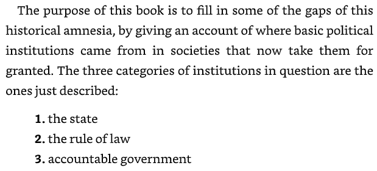
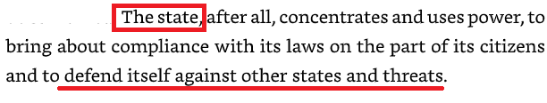
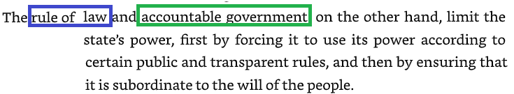
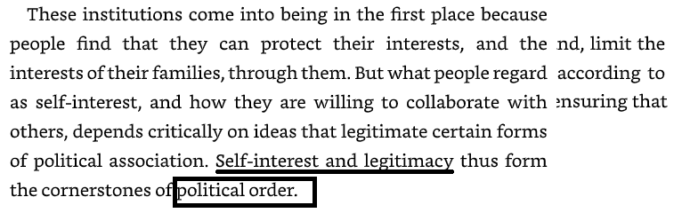
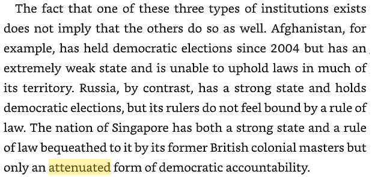
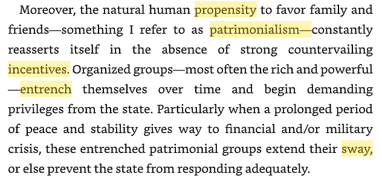

[Magna Carta](https://en.wikipedia.org/wiki/Magna_Carta)

[Glorious Revolution](https://en.wikipedia.org/wiki/Glorious_Revolution)


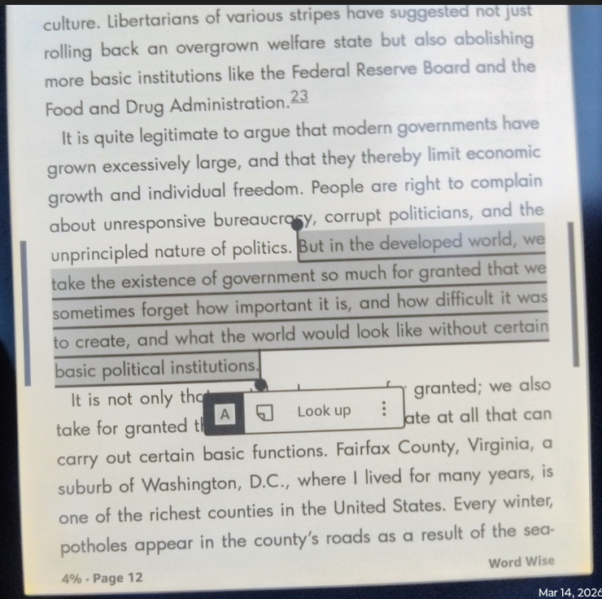

GDP - Grand Domestic Product - każda rzecz wyprodukowana przez firmę w Polsce oraz sprzedana (bo dopiero przy fakcie transakcji dowiadujemy sie o niej istnieniu) wnosi do PKB.

https://pl.wikipedia.org/wiki/Produkt_krajowy_brutto 

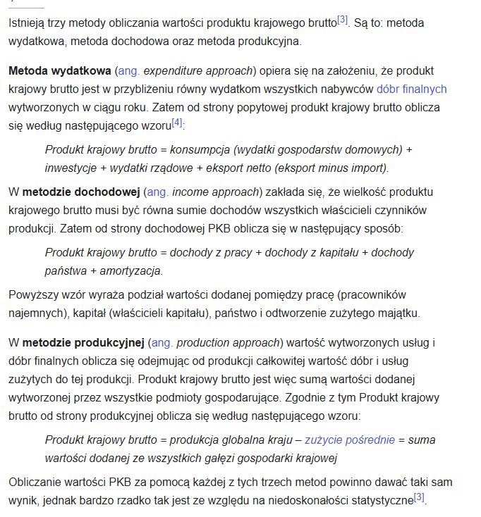

Kraj produkuje "dobra", które można zmierzyć pieniądzem i teraz pytanie ile państwo (ang. state) pobiera procent tego dobra, po to żeby: budować infrastrukturę i instytucje do dalszego produkowania. Podatek Twój od Umowy o Pracę to jakieś 30kilka procent. Potem płacisz w VaT, akcyza itd.

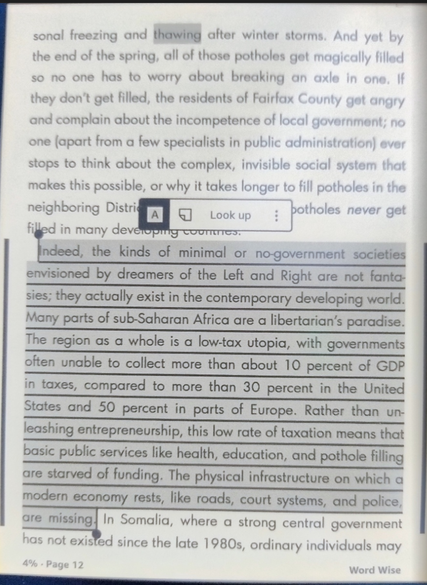

Po to są instytucje i regulacje.

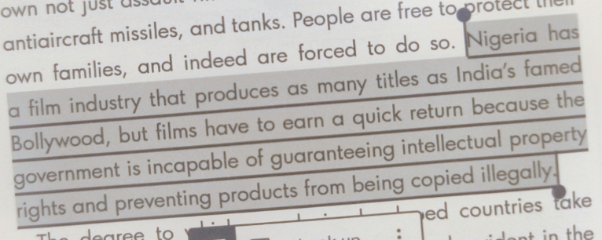

Okazuje się, że free-market-economy i i demokracja doprowadzą do stabilnego rządu, jednak może i są to konieczne ale nie wystarczające warunki.

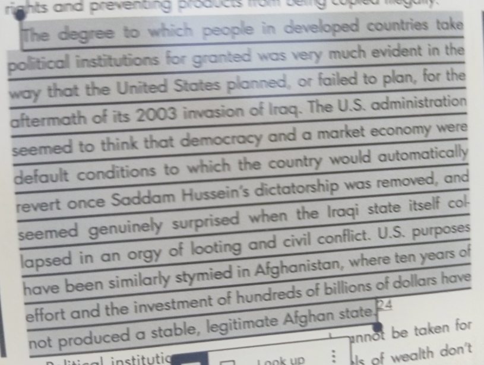

## Getting to Denmark

//TODO obczaj artykuł i termin.

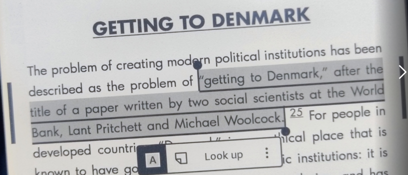

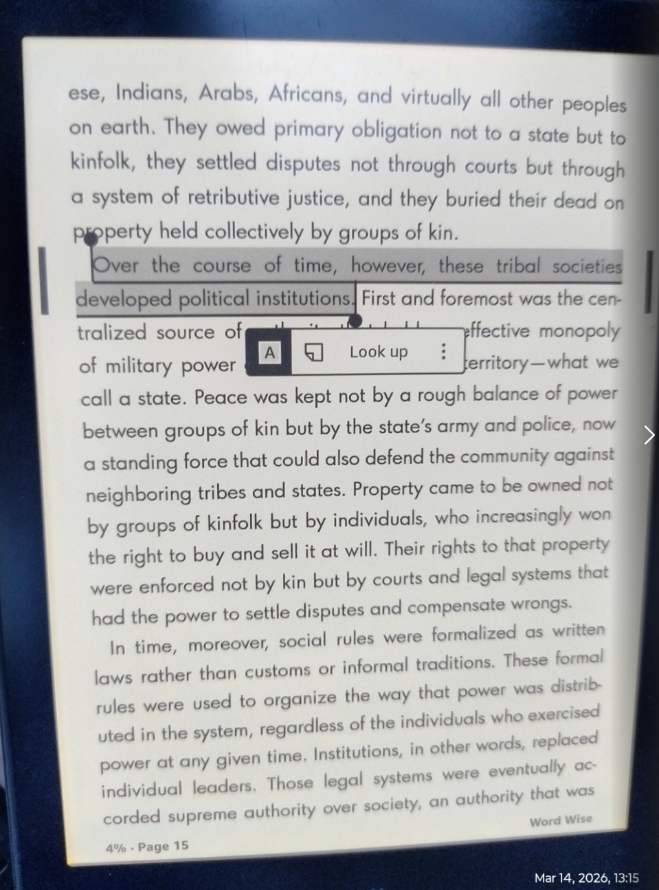

Plemiona i kinsmenostwo to naturalna rzecz na całym świecie dla gatunku ludzkiego, dla zwierząt po prostu. To było od zawsze. I właściwie państwo to jest rise z takiego trybu na nadzorowaniem zjednoczonymi klanami/tribe'ami oraz zamiana wodza na "rule of law", kinsmenów na elekcję itd.

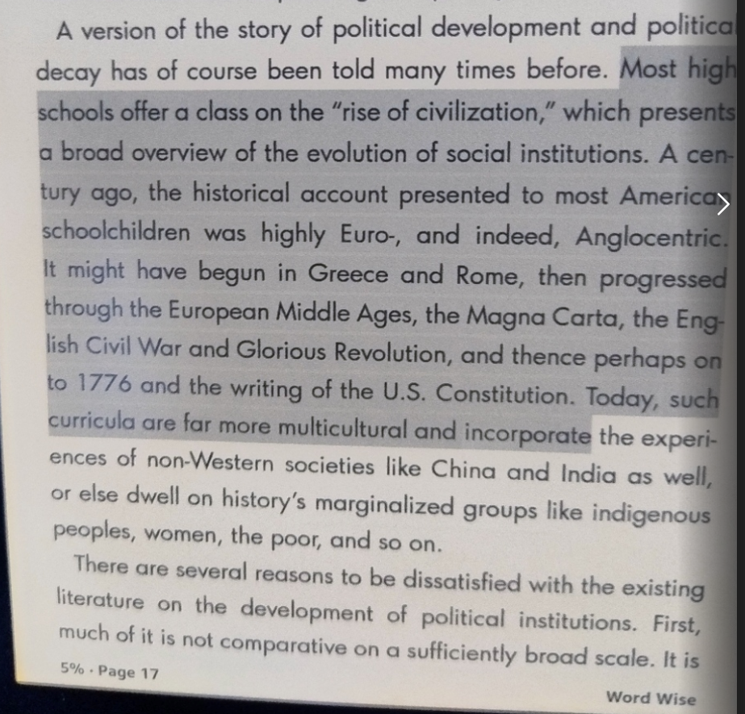

Chiny czy Indie miały cywilizacje/state na długo przed Europą. Ten eurocentryzm trzeba wpleść.

Co będziemy umieć:

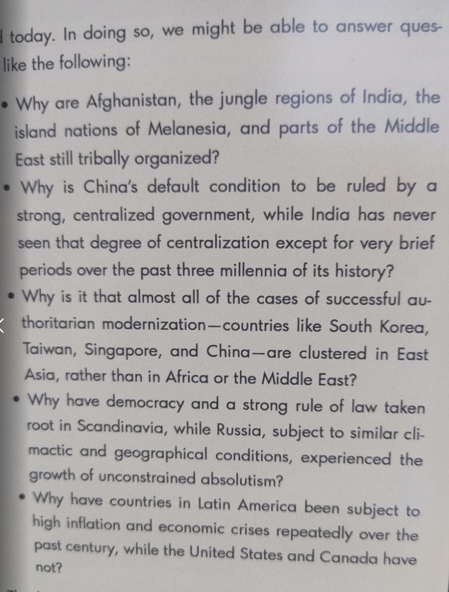

## China first

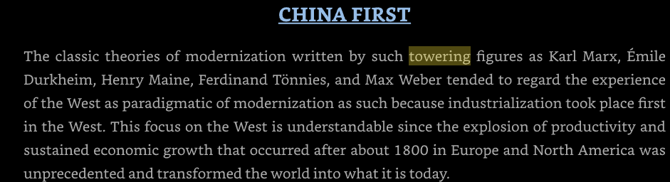
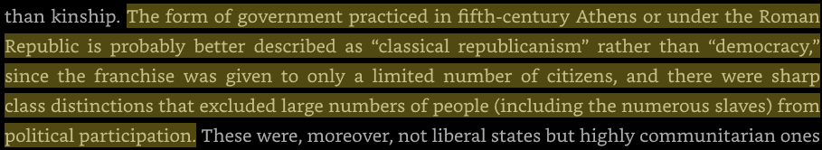

## Turtles all the way down
Nazwa rozdziału:

ODTAA - One Damn Thing After Another https://en.wikipedia.org/wiki/ODTAA

Root'y polityki trzeba zejść aż do biologii organizmów i od tego zaczniemy. Od natury człowieka;

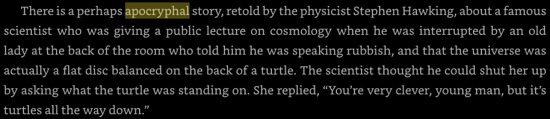
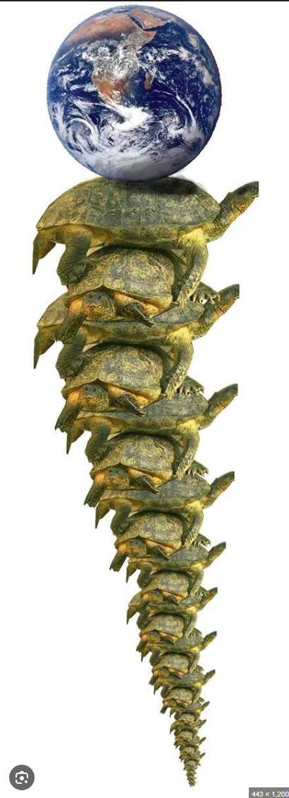
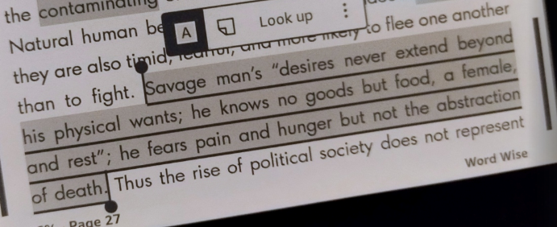


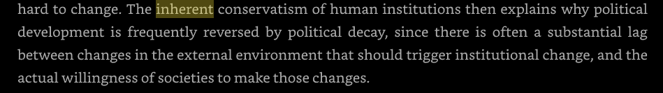

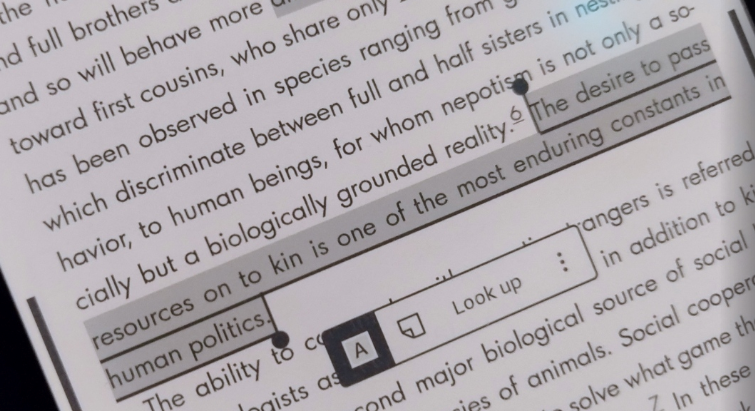

Czemu?

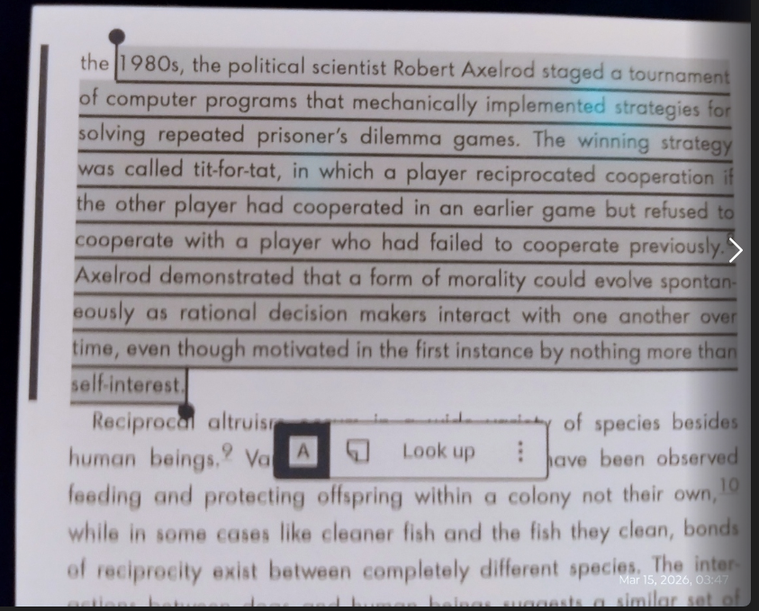

Reciprocal altruism -  https://en.wikipedia.org/wiki/Reciprocal_altruism  https://www.google.com/search?q=reciprocal+altruism&sourceid=chrome&ie=UTF-8 

# 2 The state of Nature

Philosophical discussions of the state of nature; how the contemporary life sciences shed light on human nature and hence on the biological foundations of politics; politics among chimpanzees and other primates; what aspects of human nature undergird politics; when different parts of the world were first settled.

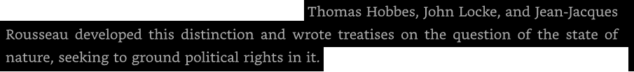

Hobbes - [dzieło "Leviathan"](https://en.wikipedia.org/wiki/Leviathan_(Hobbes_book))

[YT: Theory & Philosophy - "What is Leviathan"](https://youtu.be/NXhzYxZqsY0?si=X_w3ktX4uNQrf3vb)

Z katalogu naturalnych pasji (passion jako mocno emocja) człowieka najgłębszą jest "fear of the violent death". Stąd mamy fundamentralne prawo (ang **liberty**) natury człowieka jakim jest prawo do zachowania (preserve) własnego życia.

Również oprócz tego mamy trzy podubki ludzkie, które prowadzą do quarrel:
- competition
- fear
- glory

Pierwsza każe człowieka aby napadał innych dla zysku, druga na wszelki dla bezpieczeństwa, trzecia dla reputacji.

To prowadzi do "War of every man against every man" i to escape from this perilous situation człowiek agrees to give up their natural **liberty** in return for other people respecting their right to life. Tak narodził się właśnie state według Hobbes. The state enforces these reciprocal commitments in the form of society contract. The state secures the right to life (every single entity concern) by securing the peace (the state concern).

Potem o tym samym traktują Locke i Rosseau. Ale ich dzieła mówią jakby to człowiek był super indywidualista a w pewnym momencie nagle według chłodnej kalkulacji odkrył, że bardziej musię opłaca robić Tit-for-Tat. Ale to wcale tak nie było, bo to "odkrycie" po pierwsze było nieświadome, po drugie było na drzewku ewolucji miliony lat przed. Już Arystoteles był bliżej racji, że człowiek jest polityczny z natury (aczkolwiek strzelił tu fartownie raczej z zachwytu ideą państwa niż analizie bioligicznej).

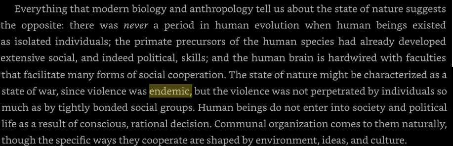

Indeed, the most basic forms of cooperation predate the emergence of human beings by millions of years. Biologists have identified two natural sources of cooperative behavior:
- **KIN SELECTION** 
- **RECIPROCAL ALTRUISM**

**Kin selection** - With regard to the first, the name of the game in biological evolution is not the survival of a given organism but the survival of that organism’s genes. individuals of any sexually reproducing species will behave altruistically toward kin in proportion to the number of genes they share. Parents and children, and full brothers and sisters, share 50 percent of their genes, and so will behave more altruistically toward each other than toward first cousins, who share only 25 percent.

[Altruism](https://en.wikipedia.org/wiki/Altruism) - the unselfish concern for the welfare of others, characterized by actions that benefit someone else, often at a personal cost or risk to oneself, without expecting rewards.

**Reciprocal altruism** - The ability to cooperate with genetic strangers is referred to by biologists as reciprocal altruism, and in addition to kin selection is the second major biological source of social behavior found in many species of animals. Social cooperation depends on an individual’s ability to solve what game theorists label **repeated prisoner’s dilemma games**. In these games, individuals potentially benefit by being able to work together, but <u>they can often benefit more if they let other individuals do the cooperating and free-ride off of their efforts. </u>

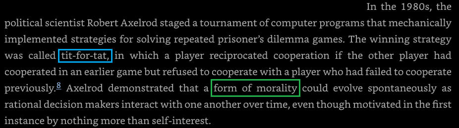

https://en.wikipedia.org/wiki/Demonic_Males

https://www.google.com/search?q=demonic+males&sourceid=chrome&ie=UTF-8

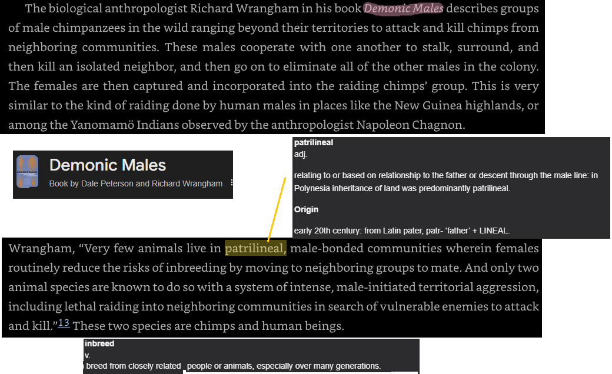

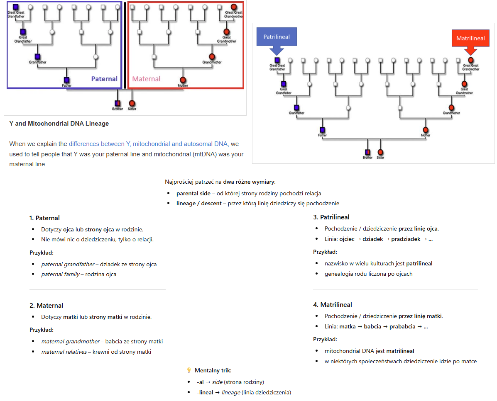

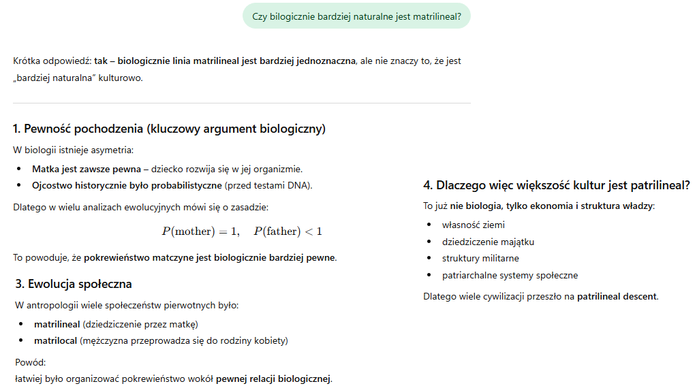

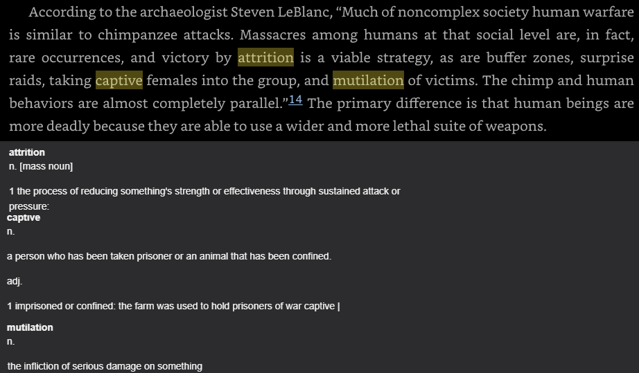

Szympansy bronią swoich "ranges" (strefy wpływów?) podobnie jak ludzie, ale in other respects they are very different.

Males and females do not come together to form a family as a tool for raising children byt the create a SEPARATE male and female hierarchies. The politics of dominance przypomina jednkal ludzką. An alpha male in a chimp colony is not born to that status, tak samo jak Big Man in Melanesian society he has to earn it BY BUIDLING COALITIONS OF SUPPORTERS. 

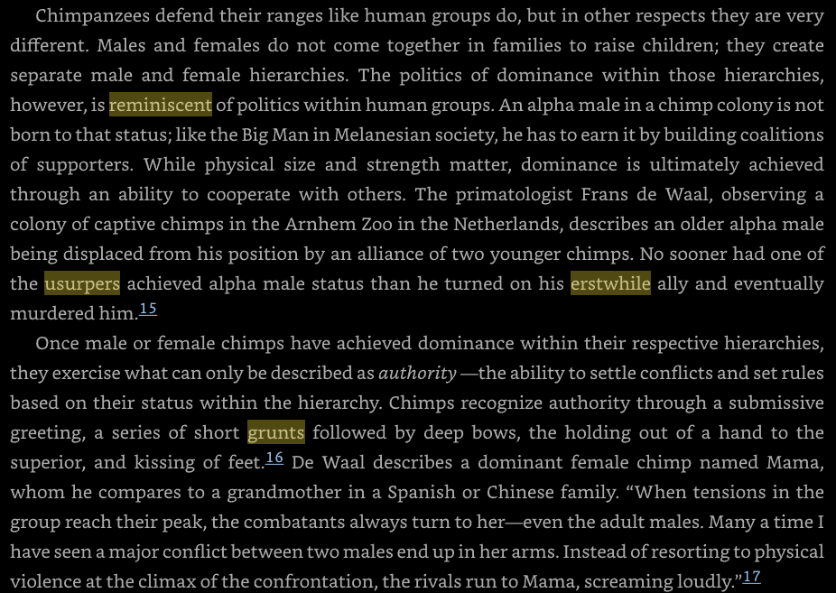

W koloniach są dwie nielależne linie hierarchii, męska i damska. Jest taka "mama" a po drugiej stronie jest alpa male. A wyżej opisane jest jak należy żyć. Dążyć do "authority".

No więc doszliśmy do wniosku, że:
- każdy chce przekazywać swoje geny, males poprzed ilość, females poprzez jakość,
- malesy muszą więc walczyć o authority
- females z resztą też
- trzeba więc umieć dobrze budować koalicje

Nazwijmy to `CONCLUSIONS.1`

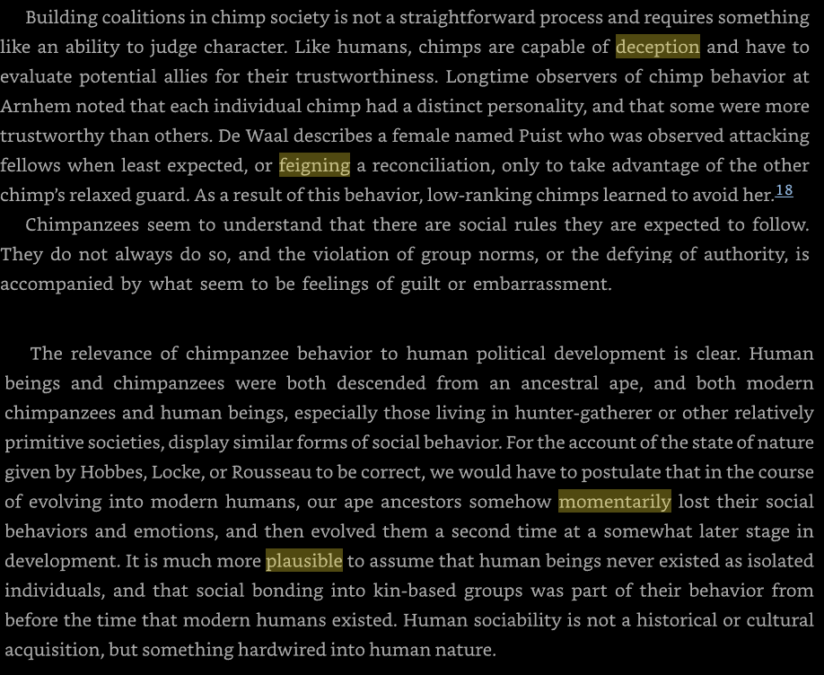

## 2 Specifically human

Szympansy i ludzie mają 99% shareowanego DNA. Co między innymi distinguishes human beings from their chimplike precedents? Krótka odp: the Language.

Skąd w człowieku wzięły się tak rozwinięte inteligiencja i cognitive skills? W 5 milionów lat, odkąd Homo line broke off from the human-chimp ancestor mózg człowieka potroił się w rozmiarze, co jest giga superszybkim development in evolutionary terms (ewenement na skale zjawiska). Stąd też np kanał rozrodczy kobiety ledwo nadążał za rozmiarem głowy noworodków. 

Where did this cognitive power come from?

Na pierwszy rzut oka może się wydawać, że jest to konieczny krok w adaptacji do fizycznego środowiska, że greater intelligence oferuje przewagę co do polowania, zbieractwa, wytwarzania narzędzi itp. ALE to nie jest satysfakcjonujące wyjaśnienie since many other species also hunt, gather and even use tool WITHOUT having developed anything like human being's coginitive abilities.

Many evolutionary biologists have speculated that the human brain grew as rapidly as it did for a different reason: to be able to cooperate and compete with other human beings. Compete in forms of `CONCLUSIONS.1`.

Im lepiej umiesz interpretować czyjeś zachowanie, tym jesteś lepszy w `CONCLUSIONS.1`, więc przekażesz więcej genów, więc "zostaje" ten skill.

Teoria gier pokazuje, że kooperujemy z tymi co wykazali się to be honest and reliable, a negujemy tych to zachowali się opportunistically.

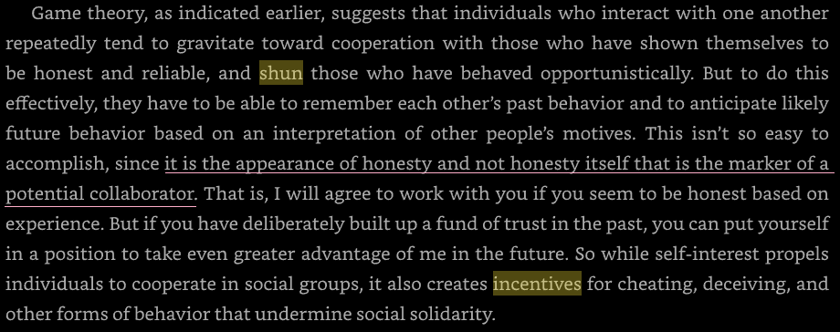

Chimpanzees can achieve a band level of social organization of a few dozen individuals because they possess some of the cognitive skills required to solve basic repeated prisoner’s dilemma games. Chimps thus have sufficient memory and communications skills to interpret and predict each other’s likely behavior, out of which evolve leadership and cooperation.

But chimps are unable to move to higher levels of social organization because they do not have **LANGUAGE**. Having language means that knowledge of who was honest and who deceitful no longer depends on direct experience but can be passed on to others as social knowledge.

Ale skąd się wziął ten language?

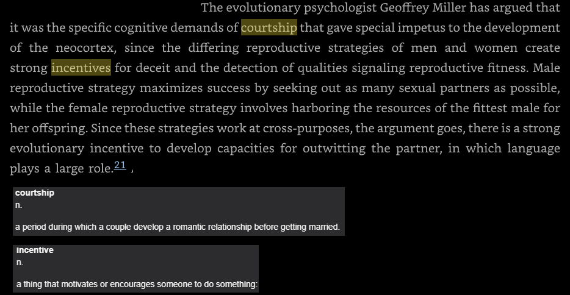

No i wiadomix, language, sociability i mastery of the environment wszystkie naraz "reinforced each other" i stąd ten cały rozwój neocortexu.

"This then explains the need for increased brain size, since a very large portion of the neocortex, which is the part of the brain possessed by behaviorally modern humans but not by chimps or archaic humans, is devoted to language."

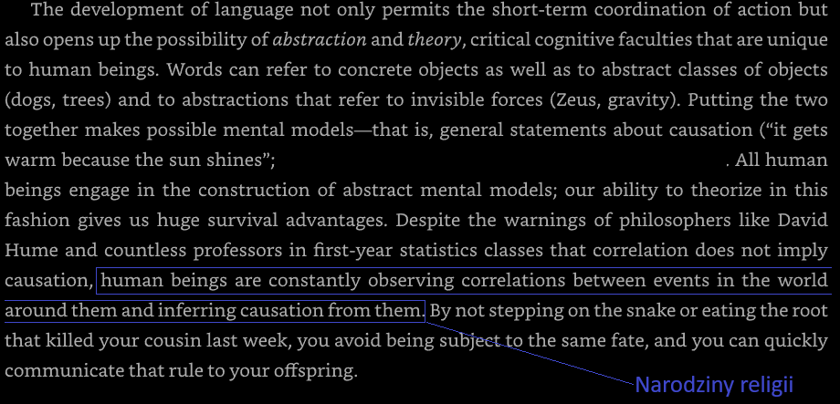

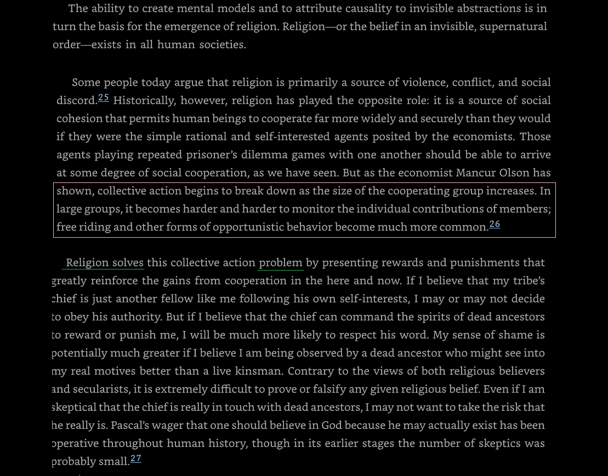

Rola funkcyjna religii w wzmacnianiu norm społecznych oraz tworzeniu silnych społeczeństw była jest znana od dawna. Takie zasady jak:
- Tit-for-tat
- Returning favors for favors
- Returning harms for harms

Są racjonalnym następstwem of repeated interaction (repeated prisoner's dilemma). Dlatego też stanowią universal moral rules we wszystkich ludzkich społeczeństwach. 

The [Golden rule](https://en.wikipedia.org/wiki/Golden_Rule) mandating that you treat others as you want them to treat you is a simply variation of tit-for-tat, one that emphasizes the benefit rather than the harm side.

> (The Christian principle of returning a favor for a harm in this respect is highly unusual and, one might note, more often than not unimplemented in Christian societies. No society I know of approves returning a harm for a favor as a general moral rule within the group.)

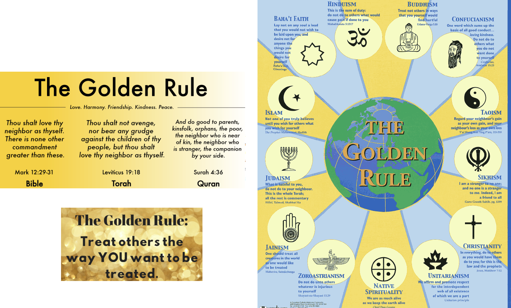

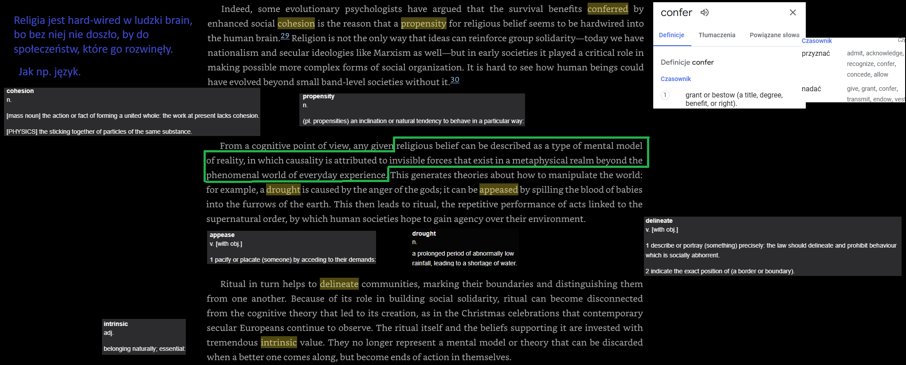

### The beast with red cheeks

Dlaczego religie mimo, że są tak nieracjonalne jak tylko mogą być są tak ciężke do wyplewienia z ludzkiego umysłu?

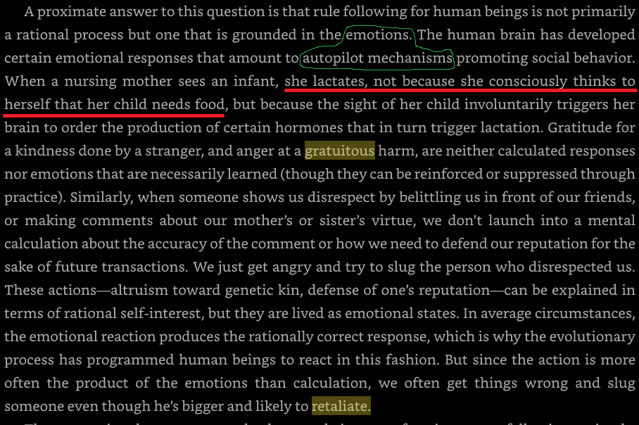

```json
{
    "flashcards": [
        {
            "front": {
                "ipa": "/ɡrəˈtuːɪtəs/",
                "part": "adjective",
                "word": "gratuitous"
            },
            "reverse": {
                "definition": "Uncalled for; lacking good reason; unwarranted.",
                "example": {
                    "position": 6,
                    "sentence": "The film was criticized for its gratuitous violence."
                },
                "synonyms": [
                    "unwarranted",
                    "unjustified",
                    "needless",
                    "superfluous"
                ],
                "translation": [
                    "nieuzasadniony",
                    "bezpodstawny",
                    "niepotrzebny"
                ]
            }
        }
    ],
    "user_id": "a4193128-4f1d-4458-9a63-862e303090e7"
}
```

```json
{
    "flashcards": [
        {
            "front": {
                "ipa": "/rɪˈtæliˌeɪt/",
                "part": "verb",
                "word": "retaliate"
            },
            "reverse": {
                "definition": "To make an attack or assault in return for a similar attack.",
                "example": {
                    "position": 9,
                    "sentence": "After the insult, she felt a strong urge to retaliate."
                },
                "synonyms": [
                    "avenge",
                    "reciprocate",
                    "strike back",
                    "hit back"
                ],
                "translation": [
                    "odwetować",
                    "odpłacić",
                    "zrewanżować się"
                ]
            }
        }
    ],
    "user_id": "a4193128-4f1d-4458-9a63-862e303090e7"
}
```

These emotional responses make human beings conformist, norm-following animals.

Norm following is embedded in human nature via the specific emotions of anger, shame, guilt, and pride. We feel anger when a norm is violated, such as when a stranger goes out of his way to disparage us, or when a religious ritual shared by our group is mocked or neglected. We feel shame when we ourselves fail to live up to the norm, and we feel pride when we have the approbation of the community for achieving a collectively valued goal.

Economists argue that blindly following rules can be economically rational, since calculating optimal outcomes in every situation is often costly and counterproductive.

If we had to constantly negotiate new rules with our fellow human beings at every turn, we would be paralyzed and unable to achieve routine collective action.

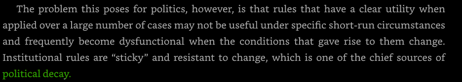

### The struggle for recognition

**The desire/struggle for recognition** is a [Hegel's](https://en.wikipedia.org/wiki/Georg_Wilhelm_Friedrich_Hegel) term. **Recognition** is not a good that can be consumed. Rather, it is an intersubjective state of mind by which one human being acknowledges the worth or status of another human being, or of that human being’s gods, customs, and beliefs.

Recognition is usually relative rather than absolute worth. Everyone hierarchies people in their own circle. 

This makes struggle for recognition a **game of zero sum**, while struggles over economic exchange is **game with positive sum**.

It has biological roots, The individual who achieves alpha male status also receives greater access to sexual partners and therefore more reproductive success.

The individual who achieves alpha male status also receives greater access to sexual partners and therefore more reproductive success.

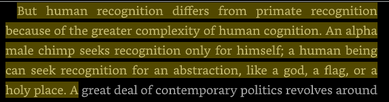

So people during the ages wanted not only status for themselves but also for their customs, gods and traditions.

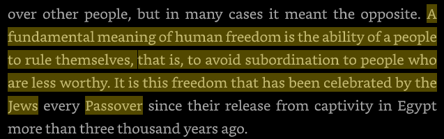

Coerced recognition isn’t meaningful; the admiration of a free individual is far more satisfying than the obeisance of a slave.

> coerced - by force
> obeisance - a gesture expressing respect, such as bow or cursty, a noun from 'obey'
> curtsy -  a traditional gesture of respect, greeting, or acknowledgment performed by women and girls, involving bending the knees while bowing the head. [youtube](https://www.youtube.com/watch?v=etiMil0_4Jw)


Political leadership emerges initially because members of a community admire a particular individual who demonstrates great physical prowess, courage, wisdom, or the ability to adjudicate disputes fairly.

As political systems develop, recognition is transferred from individuals to institutions—that is, to rules or patterns of behavior that persist over time, like the British monarchy or the U.S. Constitution.

But in either case, political order is based on **legitimacy** and the **authority** that arises from legitimate domination. Legitimacy means that the people who make up the society recognize the fundamental justice of the system as a whole and are willing to abide by its rules.

E.g. Nowadays we obtain legitimacy by democratic elections. But democracy is hardly the only form of goverment that has been regarded as legitimate historically.

### Foundations of political development

We now have in place all of the important natural building blocks out of which we can construct a theory of political development.

Human beings are rational, self-interested creatures, and will learn to cooperate out of pure self-interest as economists assert. But beyond this, human nature provides certain structured paths toward sociability that give human politics its particular character. These include:
• Inclusive fitness, kin selection, and reciprocal altruism are default modes of sociability. All human beings gravitate toward the favoring of kin and friends with whom they have exchanged favors unless strongly incentivized to do otherwise. 
• Human beings have a capacity for abstraction and theory that generates mental models of causality, and a further tendency to posit causation based on invisible or transcendental forces. This is the basis of religious belief, which acts as a critical source of social cohesion. 
• Humans also have a proclivity for norm following that is grounded in the emotions rather than in reason, and consequently a tendency to invest mental models and the rules that flow from them with intrinsic worth. 
• Human beings desire intersubjective recognition, either of their own worth, or of the worth of their gods, laws, customs, and ways of life. Recognition when granted becomes the basis of legitimacy, and legitimacy then permits the exercise of political authority.

> proclivity - a strong, natural, and often habitual inclination or tendency towards a specific activity, behavior, or thing, typically a liking for it

In its early stages, human political organization is similar to the band-level society observed in higher primates like chimpanzees. This may be regarded as a default form of social organization.

Nowadays this behaviors are overriden by social norms, e.g. hiring a more qualified employee rather than a member of family, but when instituions break down, people fallback to default mode anyway. This is called with the book term **patrimonialism**.

The human capacity for abstract theorizing soon produces a host of new rules for mastering the environment and regulating social behavior that go well beyond anything that exists among chimpanzees. In particular, ideas concerning dead ancestors, spirits, gods, and other invisible forces create new rules and powerful incentives for following them. Religious ideas of various sorts enormously increase the scale on which human societies can be organized and constantly generate new forms of social mobilization.

The tendency to invest mental models and theories with intrinsic worth promotes social stability and allows societies to bulk up enormously in size. <u>But it also means that societies are highly conservative and will fiercely resist challenges to their dominant ideas. </u> This is most obvious in the case of religious ideas, but secular rules also tend to be invested with great emotion under the headings of tradition, ritual, and custom.

The conservatism of societies with regard to rules is then a source of **political decay.**

Institutions that were once created and worked for ceratain environment that no longer exists usually cannot be changed due to people's emotional attachments to them.

From this reason social change is not linear, but rather a prolonged stasis followed by catastrophic change.

> Stasis is a state of equilibrium, inactivity, or stoppage, often referring to the slowing of bodily fluids (like blood flow) or a period of little evolutionary change

This in turn explain why violence plays so much role in political development.  As Hobbes points out "the fear of violent death" is the strongest emotion and cannot be measured by any economic rate. And this fear typicall motivates people more than mere economic self-interest.

**Politics emerges as a mechanism for controlling violence**, yet sometimes only the violence is the way to escape political equilbrium.


Finally, the desire for recognition ensures that politics will never be reducible to simple economic self-interest.

Political power ultimately rests upon recognition—the degree to which a leader or institution is regarded as legitimate and can command the respect of a group of followers. Many can follow their leader because of self-interest ("this one is the most favorable to me, he will lead me to my own success"), but the most powerful political organizations are those that legitimate themselves on the basis of a broader idea.


The huge variance that we see across politcal forms at present and also past times is the first instance the product of variance in the physical environments that human beings came to inhabit.

**As societies ramify and fill different environmental niches across the globe, they develop distinctive norms and ideas** in a process known as specific evolution. Groups of humans also interact with each other, and this interaction is as much a driver of change as is the physical environment.

> ramify - means to branch out, spread, or divide into many parts, often developing complex, unexpected consequences.

But widely separated human societies have come up with strikingly similar solutions to the problem of political order. Virtually every society was at one time organized on the basis of kinship, whose rules increased steadily in complexity. Different societies reached these converging outcomes by a wide variety of pathways, but the fact of convergence suggests an underlying biological similarity among human groups.

### Evolution and migration

Transition from ape to human took place in Africa, but the exit out of Africa that led to the populating all of the world happended in two waves.

What are labeled archaic human beings—species like Homo erectus and Homo ergaster—left that continent as much as 1.6–2 million years ago and found their way to northern Asia. An ergaster descendant, Homo heidelbergensis, may have left Africa and reached Europe around 300,000–400,000 years ago, and was the progenitor of later species like the famous Neanderthals who inhabited much of Europe.

Anatomically modern humans (same size and physical characteristics like contemporary people) appeared 200,000 years ago.

But it was only 50,000 years ago that behaviorally modern humans emerged—human beings who had the ability to communicate using language and who therefore could begin to evolve much more complex forms of social organization.

**Virtually all modern human beings outside of Africa are believed, by one current theory, to be descended from a single small group of behaviorally modern humans, perhaps as few in number as 150 individuals, who left Africa and crossed what is now the Straits of Hormuz into the Arabian peninsula approximately fifty thousand years ago.**

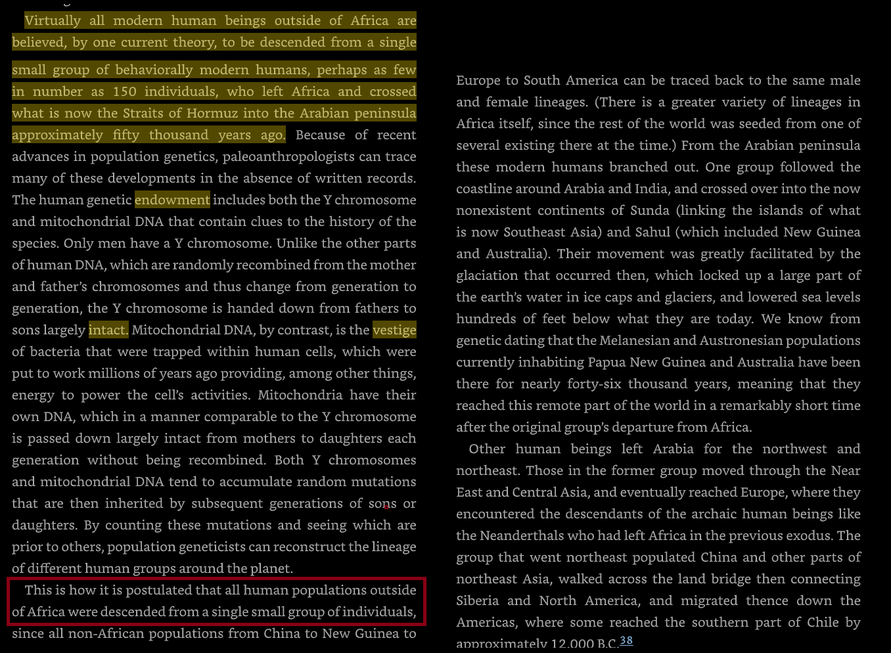

The biblical story of the Tower of Babel, in which God scatters a unified human race and makes them speak different languages, is thus metaphorically true. As little bands of human beings migrated and adapted to different environments,

As we will see in the following chapters, the first complex forms of social organization continued to be based on kinship, but they could emerge only with the assistance provided by religious ideas.

## 3 The tyranny of cousins

> btw: China made a transition from kinship-based forms of organization to state-level organization more than three thousand years ago,

### Stages of prehistory

The two basic components of biological evolution:
- variation and
- selection
apply to human societies as well.

Thos societies that succeed in adaptating usually win out over ones that don't.

Our continuing use of terms like “developing” or “development” (as in “developing countries” or the “US Agency for International Development”) is testimony to the widespread view that existing rich countries are the product of a prior evolution of socioeconomic forms, and that poor countries would participate in this process if they could. Human political institutions are transmitted across time culturally. 

Evolutionary anthropologists have designated stages based on the form of social or political organization, which I will use here since this is my subject matter. 
Elman Service developed a four-level taxonomy involving:
- bands,
- tribes,
- chiefdoms, and
- states.

For bands and tribes, social organization is based on kinship, and these societies are relatively egalitarian. Chiefdoms and states, by contrast, are organized hierarchically and exert authority on a territorial rather than a kinship basis.

> *egalitarian* - believing in or based on the principle that all people are equal and deserve equal rights and opportunities.

Many people believe that tribalism was a first form, but **Tribal** organization did not arise, however, until the emergence of settled societies and the development of agriculture around 9,000 years ago. The **hunter-gatherer societies** that preceded agricultural ones were organized for tens of thousands of years in a much simpler fashion, based on small groups of nomadic families comparable in scale to primate **bands**.

> Such societies still exist in marginal environmental niches, and they include the Eskimos, the Bushmen of the Kalahari Desert, and Australian Aborigines.

Rousseau pointed out that the origin of political inequality lay in the development of agriculture, and in this he was largely correct. Since band-level societies are preagricultural, there is no private property in any modern sense. Like chimp bands, hunter-gatherers inhabit a territorial range that they guard and occasionally fight over. But they have a lesser incentive than agriculturalists to mark out a piece of land and say “this is mine.” If their territory is invaded by another group, or if it is infiltrated by dangerous predators, band-level societies may have the option of simply moving somewhere else due to low population densities. They also tend to have fewer investments in cleared land, houses, and the like.

Within Band-level group there is no economic exchange or any of the modern individualism. There is only an anthropoligtsts term **the tyrrany of cousins**. That is, your social world was limited to the circles of relatives surrounding you, who determined what you did, whom you married, how you worshipped, and just about everything else in life.

Hunting and gathering is done with family or groups of families. Hunting leads to sharing, since there is no technology to store. 

**There is considerable speculation on the part of evolutionary psychologists that the almost universal contemporary practice of meal sharing (Christmas, Thanksgiving, Passover) is derived from the millennia-long practice of sharing the proceeds of hunts.**

Band-level societies are highly egalitarian. The major social distinctions are based on age and sex; in hunter-gatherer societies, the men hunt and the women gather, and there is a natural division of labor in reproductive matters. But within the band, there is relatively little differentiation between families, no permanent leadership, and no hierarchy. Leadership is vested in individuals based on qualities like strength, intelligence, and trustworthiness, but it tends to migrate from one individual to another. Apart from parents and their children, opportunities for coercion are very limited.

> coercion - the practice of persuading someone to do something by using force or threats.

In egalitarian societies it is hard to find cases in which one individual tells one or more others "Do this!". Rather it is: "If this is done, it will be good,” possibly or possibly not followed by somebody else doing it... Since the leader is unable to compel any of the others to carry out his wish, we speak of his role in terms of **authority** rather than **power**.

> compel - force or oblige (someone) to do something.

In this type of society, leaders emerge based on group consensus; they have no right to their office and cannot hand it down to their children. 

W sumie to jest typowe jak np w szkole, w grupie znajomych, jednego dnia Ty jesteś szefem, drugiego ktoś inny, z dnia na dzień możesz stracić swój status, ludzie "się poznają na sobie" wiadomo z czasem kto jest w co dobry.

Since there is no centralized source of coercion, there can obviously be no **law** in the modern sense of third-party enforcement of rules.

**Band-level societies** are built around nuclear families and are typically what anthropologists label exogamous and patrilocal.

> exogamous -  refers to the social practice or rule of marrying outside one's own specific group, clan, tribe, or community. It promotes genetic diversity, prevents inbreeding, and fosters social alliances with other groups. It is the opposite of endogamy (marrying within) and is often known as out-marriage.
> patrilocal - relating to a pattern of marriage in which the couple settles in the husband's home or community.

Patrilocalism, where women marry outside the band promoted genetic diversity and set the conditions for the emergence of something like intergroup trade.

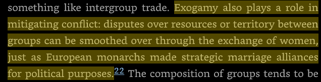

