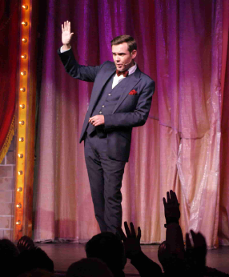
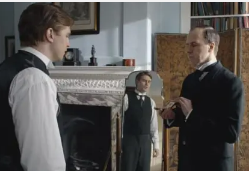
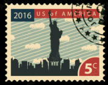
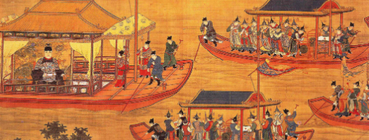

# Six Ways To Make People Like You

## 1 Show sincere interest in them


Dog is the only animal that doesn't have to work for a living. Hen need to lay eggs, a cow to give milk etc. 
Just see how dog loves you, and wiggles his tail when he sees you

"You can make more friends in two months by becoming interested in other people, than you can in two years by trying to get other people interested in you".

### People are only interested in themselves

The New York Telephone Company analyzed 500 telephone calls and the word "I" - the most frequent - was used 3,990 times.

When you see a group photo that you are in, whose face do you look first at?

### Show interest in your coworkers



Especially as a leader

> "It is the individual who is not interested in his fellow men who has the difficulties in life" - Alfred Adler

The most famous magician at the time told Dale that every time he entered the stage he said to himself: 

"I am grateful because these people come to see me. They make it possible for me to make my living. I am going to give them the very best performance I can"

One can win attention and co-operation of even most sought people by becoming genuinely interested in them.

If we want to make friends, let's put ourselves out to do things for people that require time, energy and thoughtfulness. When the Duke of Windsor was Prince of Wales, he was scheduled to tour the South America. He spent months studying Spanish so that he could make public talks in the language of the country; People loved him for that!

### Small things matter

>  Valet - a man's personal male attendant, responsible for his clothes and appearance
>
> 

A story told to Dale by one of the Theredore Roosvelt (USA presidnet from 1901-1906) valets:

""""

My wife one time asked the President about a bobwhite*. She had never seen one and he described it to her fully. Some time later, the telephone at our cottage rang**. It was Mr Roosvelt himself. He had called my wife, to tell her that there was a bobwhite outside her window and that if she would look out she might see it. Little things like that were so characteristic of him.

*A bird [Northern bobwhite](https://en.wikipedia.org/wiki/Northern_bobwhite)

**James Amos (the valet) and his wife lived on the Roosvelt estate at Oyster Bay.

""""

### Birthdays are important


How to get the birthday date from anyone? Ask the other party if they believes the date of one's birthday has anything to do with character and disposition. When the talk is ready, you can ask them the month and day of their birth.

What next?

Equip yourself with a tool, that will tell you each 1-st of the month whose and when birthday it is. Prepare then accordingly and voile'la. 

### Show people enthusiasm


When somebody calls you  say "hello" in tones that bespeak how pleased you are to have that person call. Lets make this "hello" say "I am very pleased and happy that you've called, I couldn't wait no more to talk to you"

### Solve others problems



Typ miał zrobić raport o jakimś banku, ale prezes tego banku nie za bardzo chciał gadać na te tematy podczas wizyty. Nie udało mu się, ale usłuszał jednak podczas rozmowy od sekretarki, że znaczki pocztowe dla syna prezesa są gotowe. Prezes się ucieszył bardzo i typ wywnioskował, że syn zbiera i lubi znaczki. Po rozmowie udał się do swojego potężnego źródła znaczków. Następnie obdarował prezesa tymi znaczkami i prezes powiedział mu sam jak leci wszystko.

Jakiś handlowiec węglem chciał sprzedać go do jednego z chain-store* . Chodził do prezesa ale nie dawało rady. Ten handlowiec spytał Dale jak sobie z tym poradzić, Dale powiedział, że zorganizuje na spotkaniach debatę "Czy chain-store'y są dobre dla państwa" i żeby handlowiec spytał prezesa o pomoc. Ten tak zrobił - prezes gadał jak najęty przez 3h żeby obronić chain-store, to był jego temat bajka, jego życie, jego zainteresowania i cieszył się, że ktoś się tym interesuje i może o tym opowiedzieć. Na koniec rozmowy, jak już handlowiec wychodził, prezes sam z siebie go chwycił za ramię i rzekł "btw. masz tam jakiś węgiel na wiosnę mi sprzedać może?".

*(coś jak np. żabka, i inne brandy ale wtedy to nie było popularne)

> Dale recommends the book "The return to religion" by Dr. Henry Link.

### Summary

*Become genuinely interested in other people*

## 2 Smile

A smile says - "I like you. You make me happy. I am glad to see you"


That is why dogs make such a hit. They are so glad to see us that they almost jump out of their skin. So, naturally, we are glad to see them.

### Have a good time while meeting people

"A man rarely succeeds at anything unless he has fun doing it" - chairman of the board of one the largest rubber company

So....

!You must have a good time meeting people if you expect them to have a good time meeting you!

### Get it in your blood

As I leave for my office now, I greet the elevator boy in the apartment house with a 'Good morning' and smile. I greet the doorman with a smile. I smile at the cashier in the subway booth when he asks for change. As I stand on the floor Curb Exchange, I smile at men who never saw me smile until recently. I soon found that everybody was smiling back at me. 

### You don't feel like it?

Then what? 

First, force yourself to smile. if you are alone, force yourself to whistle or hum a tune or sing. Act as if you were already happy and that will tend to make you happy. Here is the way the Professor William James of Harvard put it:

>  "Actions seems to follow feeling, but really action and feeling go together, and by regulating the action, which is under the more direct control of the will, we can indirectly regulate the feeling, which is not"

Everybody in the world is seeking happiness - and there is one sure way to find it. That is by controlling your thoughts. Happiness doesn't depend on outward conditions. It depends on inner conditions. *It isn't what you have or who you are - it is what you thinks about it.*

> Nothing is good or bad, but thinking makes it so - William Shakespeare

### How to action this?

Most successful insurance man in America, told me that he figured out years ago that a man with a smile is always welcome. So, before entering a man's office, he always pauses for an instant and thinks of the many things he has to be thanful for, works up a great big honest-to-goodness smile, and then enters the room with the smile just vanishing from his face.

Use this advice from Elbert Hubbard:

Whenever you go out of doors, draw the chin in, carry the crown of the head high, fill the lungs to the utmost, drink in the sunshine, greet your friends with a smile,

### Chinese proverb



"A man without a smiling face must not open a shop"

### The value of smile:

- it costs nothing but creates much
- it enriches those who receive, without impoverishing those who give
- it happens in a flash and the memory of it sometimes lasts forever 
- none are so rich they can get along without it, and none so poor but are richer for its benefits

## 3 Name

Był kiedyś jakiś Jim Farley polityk i kampanie dobrze zrobił komuś tam i Dale go interviewował i było tak:

> He asked me what I though was the reason for his success. 
>
> I replied:
>
> -"I understand you can call ten thousand people by their first names"
>
> -"No, you are wrong", he said <u>"I can call fifty thousand people by their first names"</u>

Stworzył on specjalny system na to:

```
Whenever he met a new acquintance, he found out his complete name, the size of his family, the nature of his business, and the color of his political opinions. 

He got all these facts well in mind as part of the picture, and the next time he met that man, even if it was a year later, he was able to slap him on the back, inquire after wife and kids, and ask him about the hollyhocks* in the backyard.

*hollyhocks - jakieś kwiatki(malwy)
```

>  Potem na tej podstawie Jim Farley robiąć kampanie dla Roosevelt'a napisał do setek osób listy, wsiadł do pociągu i spotykał się z nimi na obiady, kolacje, śniadania i gadał z nimi a oni dalej szerzyli Roosvelta.

### King of steel

Andrew Carniege był nazywany królem stali mimo iż nie znał się na niej nic - but he knew how to handle men - and that is what made him rich.

Jak się tego nauczył?

```
When he was a boy back in Scotland, he got hold of a rabbit, a mother rabbit. He soon had a whole nest of little rabbits and nothing to feed them. But he had a brilliant idea. He told the boys in the neighbourhood that if they would go out and pull enough clover and dandelions to feed the rabbits, he would name the bunnies in their honor.
Then plan worked like magic and Carniege never forgot it.
```

Years later he made millions by using that same psychology in bussiness. Np. chciał sprzedać kolej dla Pensyylwanii do szedł do prezydenta i mówił, że nazwie jego imieniem tą kolej.

### Remember names

Większość ludzi nie pamięta imion (typowe na imprezie co nie), bo nawet nie próbują take the time and energy necessary to concentrate and repeat and fix names in their minds. Myślą, że są zbyt zajęci. No ale chyba nie tak zajęci jak Franklin D. Roosevelt, who takes time to remember and recall even the names of mechanics with whome he comes in contact. Tu jest taka historyjka, że jakiś mechanik przyszedł mu naprawić fure, i on z nim nawet nie gadał z tym mechanikiem, nawet się nie przedstawili ale na koniec jak już mechanik odchodził to Roosevelt podszedł do niego, called him by name, and thanked him for coming down to Washington.

Napoleon mimo wielu obowiązków could remember the name of every person he met.

Jaką miał technikę?

```
Prostą.
Jeśli nie usłyszał dokładnie imienia, syngalizował to i prosił aby powtórzyć. Jeśli nie wiedział to pytał "How to spell it".
Podczas konwersacji starał się powtórzyć to imię możliwe jak najczęściej i skojarzyć je z widokiem tego człowieka.
Jeśli to był ktoś ważny, to szedł krok dalej. Gdy tylko była okazja i był sam, zapisywał to imie na kartce i powtarzał sobie je wyobrażając tego człowieka.
```

### Summary

Remember that a man's name is to him the sweetest and most important sound in the language.

## 4 Be a good listener, encourage others to talk about themselves

Tutaj wystarczy sam tytuł. Szybko aplikuje to w swoje życie.

Historyjka:

```
Gość (Pioter) kupił garnitur, który zabarwił mu koszulę. Poszedł do tego sklepu i mówi co się stało. Tamtych dwóch co tam siedzi mu przerywa, mówi ze to niemozliwe i wgl awantura. Pioter się tak wściekł że ojezu, już nie chciał mieć z nimi doczynienia, chciał zwrócić garnitur i iść w pizdut. Aż w końcu przyszedł manager i kazał zamknąć mordę tamtym dwóm. Pitera spytał co jest i bez przerywania wysłuchał go. Na koniec manager uspokoił go powiedział, żeby założył następny raz i może tylko za pierwszym odbarwiło. Pioter zmienił zdanie i zamiast oddawać garniaka, to posłuchał i było git. To jest właśnie różnica między managerem i tymi dwoma i to dlatego on jest manager i ma swój gabinet a tamci siedzą na dole.
```

Hisotryjka:

```
Dawno temu podczas Civil War Linkoln napisał list do swojego old friend z Illinois prosząc aby wbił do Waszyngtonu. Powiedziałmu że ma problemy które chce z nim przedyskutować. Ziomek wbił i wtedy Lincoln godzinami sam gadał o całym problemie, o wszystkich rozwiązaniach, o ich plusach i minusach i nawet nie spytał ziomka co o tym sądzi, po godzinach wywodu podziękował mu za rozmowę and sent him back to Illinois. To po prostu clarified his mind. 
He didn't wanted advice. He had wanted merely a friend, sympathetic listener to whom he could unburden himself. 
That's what we all want when we are in trouble
```

Jeśli chcesz, zeby ludzi Cię nie lubili i gadali na Ciebie za plecami o to co musisz zrobić:

- Nigdy nie słuchaj ich zbyt długo. Gadaj ciągle o sobie. Jeśli wiesz co powiedzieć gdy ktoś inny gada nie czekaj aż skończy. Why waste your time listening to his idle chatter?


**"To be interesting, be interested. Ask questions that the other man will enjoy answering. Encourage gim to talk about himself and his accomplishments"**

## 5 Talk in terms of the other man's interests

Whenever Roosevelt expected a visitor, he sat up late the night before reading up on the subject in which he knew his gues was particuraly interested. Roosevelt knew, as all leaders know, that the <u>royal road to a man's heart is to talk to him about the things he treasures most</u>

Historyjka:

```
Jak byłem mały to byłem bardzo zainteresowany łódkami. Do cioci akurat przyszedł prawnik i gadał on ze mną o łódkach i było to dla mnie niezwykle interesujące. After he left, I spoke of him with enhusiasm. Moja ciotka poinformowala mnie ze to był prawnik i ze ma gdzieś moje łódki, spytałem to czemu o nich ze mną gadał? Powiedziała
"Because he is a gentleman. He saw you were interested in boats, and he talked about the things he knew would interest and please you. He made himselft agreeable"
```

Talk in terms of the other man's interests

Historyjka:

```
Jakiś koleś chciał zabrać swojego syna na wycieczke do Europy ale był biedny. Przy okazji miał spotkanie w robocie okazało się ze z jakimś typem co był posiadaczem jakiegoś pierwszego czeku na milion chyba, nie pamiętam. Jak tylko wszedł spytał o czek. Ten gość od czeku był rad, że go to interesuje i dużo mu o tym opowiedział i zasponsorował potem im wycieczke do Europy nie dość że synowi to jeszcze kolegom syna i ojcu i wgl.
```

