Camunda ma też dobry tutorial: https://camunda.com/bpmn/reference/

# Pierwsze przybliżenie

Z książki: Zbigniew Misiak, Modelowanie procesów biznesowych - BPMN 2.0 od podstaw. Rozdziały 7 i 8.

## Podstawy BPMN

Cel BPMN:

> Zasadniczym celem BPMN jest zapewnienie notacji, która może być łatwo zrozumiana
> przez wszystkich użytkowników biznesowych, począwszy od analityków biznesowych
> tworzących pierwsze szkice procesów, a skończywszy na developerach technicznych
> odpowiedzialnych za wdrażanie technologii, które będą wykonywać te procesy
> i finalnie osobach zarządzających, które będą kierować procesami oraz je
> monitorować. […] Celem BPMN jest ustandaryzowanie modelu i notacji procesu
> biznesowego w odniesieniu do wielu różnych notacji modelowania i punktów
> widzenia. Dzięki temu BPMN zapewni prostą metodę komunikowania informacji
> o procesie innym użytkownikom biznesowym, osobom wdrażającym procesy, 
> klientom i dostawcom. […] BPMN zapewni organizacjom możliwość zrozumienia
> ich wewnętrznych procedur biznesowych z wykorzystaniem notacji graficznej oraz
> da możliwość komunikowania tych procedur w ustandaryzowany sposób. […]
> Dzięki temu organizacje będą mogły zrozumieć, jak działają one same oraz inne
> podmioty, z którymi współpracują. Organizacje będą też mogły szybciej dopasowywać
> się do nowych warunków — zarówno wewnętrznych, jak i związanych ze współpracą
> biznesową.

Trudne zadanie przed BPMN połączyć takie 3 grupy stąd BPMN proponuje koncepcję **poziomów zgodności**, która dzieli elementy BPMN na 3 grupy.

**Poziom opisowy** - najbardziej podstawowe elementy. Diagramy niewiele się różnią od schematów blokowych, ale są ustandaryzowane i czytelne.

**Poziom analityczny** - te elementy pozwalają na tworzenie bardziej wyrafinowanych modeli, skierowanych do odbiorcy zainteresowanego analizą procesów na potrzeby ich automatyzacji.

**Poziom ostatni** - pozwalają w zamyśle na automatyzację (przez silnik?), choć nic nie stoi na przeszkodzie by korzystać z nich w celach dokumentacyjnych.

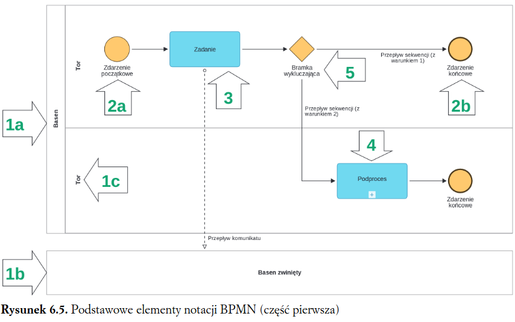

1a i 1b to **pools** - nazwa ma sugerować, że proces zawsze płynie.  W basenie możemy mieć **swimlanes** (1c), żeby pokazać kolejny level hierarchi wykonawcy czynności.

**Events** (2a i 2b) - to pewien stan rzeczywistości, który może reprezentować rozpoczęcie naszego procesu lub jego rezultat.

**Activities** pokazują jaka praca jest wykonywana, mogą to być **tasks** (3) oraz **subprocesses** (4).

Procesy rzadko są sekwencjami, aby móc je rozdzielać na ścieżki mamy **gates** (5).

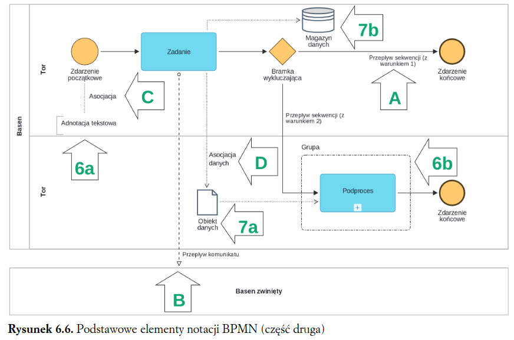

Najważniejszy rodzaj strzałek to te czarne (A) czyli **sequence flow**.

PRZEPŁYW PROCESU (TOKEN) MOŻE PŁYNĄĆ TYLKO W JEDNYM BASENIE.

Jak w takim razie pokazać komunikację różnych podmiotów?

Do tego służy kolejny rodzaj strzałek **message flow** (B).  On może być tylko między basenami.

Aby przekazywać dodatkowe info ale bez wpływania na elementy opisane wyżej to wykorzystujemy specjalne do tego **artefakty**.

Do tej kategorii zalicza się **text annotation** (C) oraz **group** (6b).

Gdy text annotation odnosi się do konkretnego elementu to możemu użyć konktora **association**. 

By pokazać w jaki sposób płyną dane w procese mamy **data object** (7a) oraz **data association** (D). 7b pokazuje **data storage**.

### Bramki

#### Bramka XOR.

Żeton idzie tylko jedną ścieżką, pierwszą która spełni warunek. Nie ma rozdzielania żetona. Można zaznaczyć default scieżkę.

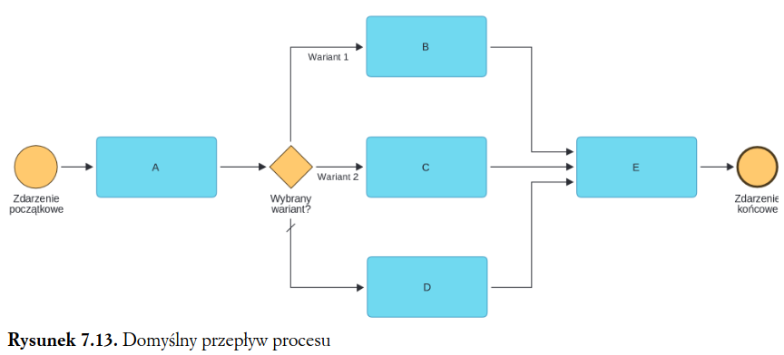

#### Bramka AND (pararell)

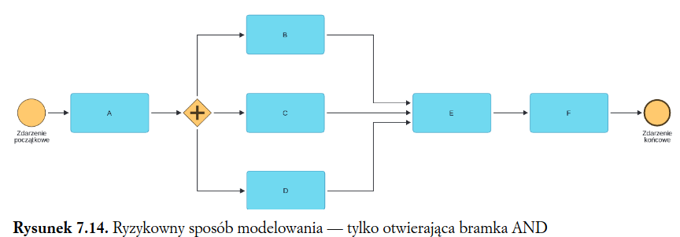

Tu bramka bierze jeden żeton i wypuszcza 3. Potem procesy B, C i D trzymają przez różne czasy żetony i do E żeton trafia 3-krotnie. 

Więc log pokaże np. ACEFDEFBEF

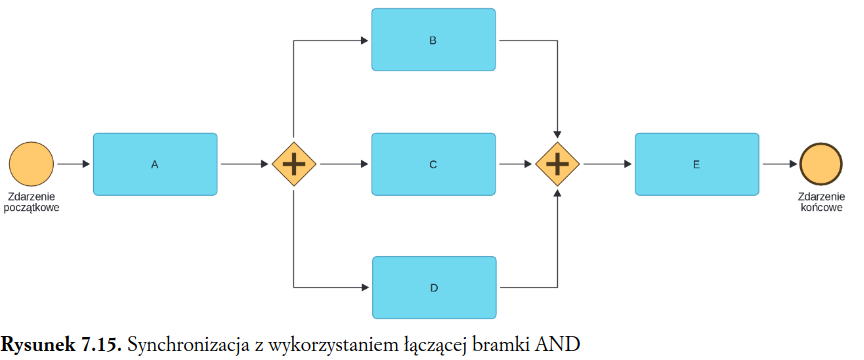

Tu ta druga bramka jest telepatycznie powiązana z pierwszą i skoro tamta wypuściła 3 żetony, to ta czeka na 3 żetony i dopiero wypuści jeden na wyjściu, jak na inpucie dostanie 3.

#### Bramka OR

Ta dostaje na input token i wypuszcza po jednym dla każdego prawdziwego warunku. Druga czeka na dokładnie tyle tokenów ile wypuściła ta pierwsza.

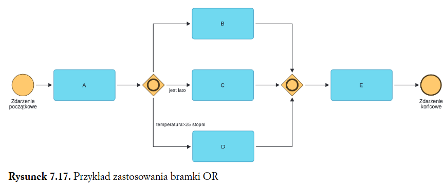

#### Bramka event-based

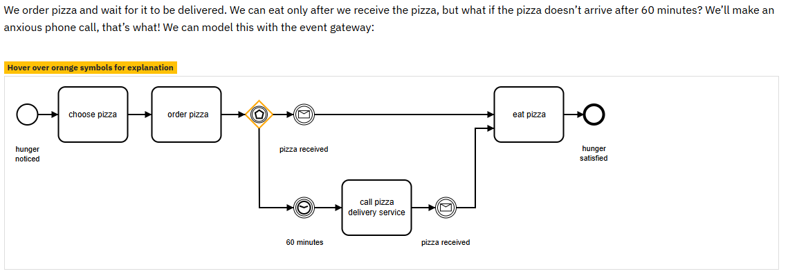

Token zatrzymuje się w bramce, a następnie bramka generuje token na tej ścieżce, gdzie wskazane wydarzenie się pojawiło i puszcza token dalej. Nie czekamy na kolejne wydarzenie.

### Zadania

Mamy dwa typy obiektów do opisania aktywności - zadania i podprocesy.

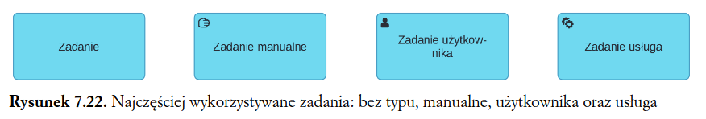

#### Zadanie manualne

Czyli takie, które nie jest robione z pomocą silnika procesowego. Oprócz zadań bez komputera, może to być też coś wykonywane w innych programach po prostu.

#### Zadanie użytkownika (user task)

System przypisze to zadanie jakiemuś użytkownikowi. Może to być w systemie CRM, ERP, "help desk" itp.

#### Zadanie typu usługa (service task)

Silnik automatyzujący proces woła inne oprogramowanie udostępniające pewną usługę (możemy odwołać się do koncepcji SOA, architektury zorientowanej na usługi, albo też bardziej współczesnej koncepcji mikrousług).

#### Zadania: wysłane i odbiór

Te 3 już wystarczą do podstawowego modelowania. Kolejnym krokiem są zadania stosowane do opisywania zautomatyzowanego przesyłania komunikatów.

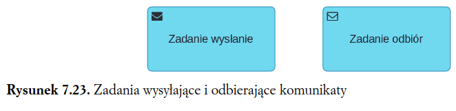

W BPMN jest ogólna zasada, że elementy ciemne są aktywne (rzucające), a jasne (otwarte) są pasywne (chwytające).

Zadania typów pasywnych czekają z tokenem i nie puszczą go, aż nie dostaną komunikatu od zewnątrz.

Ogólnie to nie musisz pokazywać drugiego basenu jeśli to nie jest istotne.

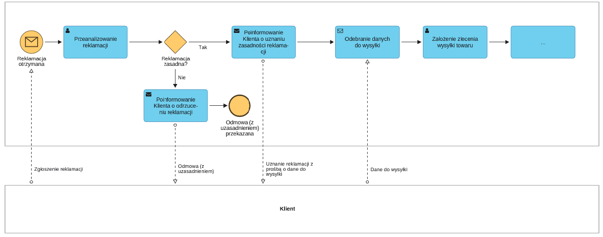

Żeton ma gdzieś message flow, on spaceruje tylko po sequence flow.

**Komunikat (message)** - wysyłany jest tylko i wyłącznie między basenami. Nie można używać komunikatów wewnątrz basenu.

### Zdarzenia: wstęp

Zdarzenia początkowe są z natury **chwytające (ang. *catching*)**. Nasłuchują aż coś z zewnętrznego środowiska się stanie i jak zajdzie to wypuszczają żeton (żeton to instancja procesu!!!). 

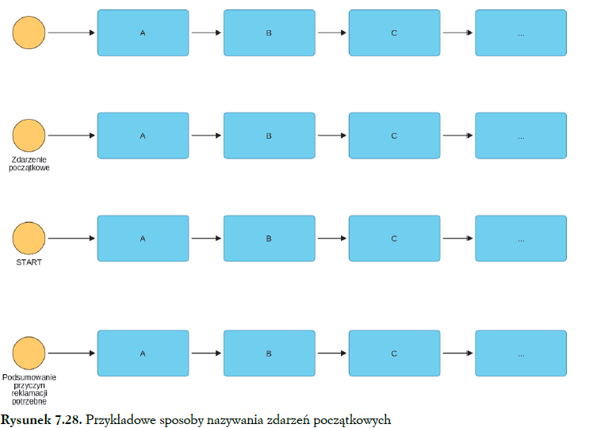

Fajną konwencją jest opisane jaki stan zewnętrznego świata jest "potrzebny" aby wyzwolił się token. Jak rozpoczęcie procesu jest decyzją pracownika, to ludzie często zostawiają puste.

Zdarzenia końcowe nie są pasywne jak początkowe, są one aktywne, czyli **rzucające (ang. *throwing)*** 

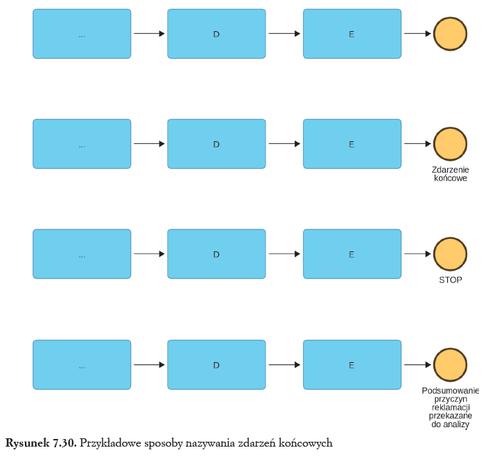

Grubsza obwódka. Zdarzenie końcowe zabija token.

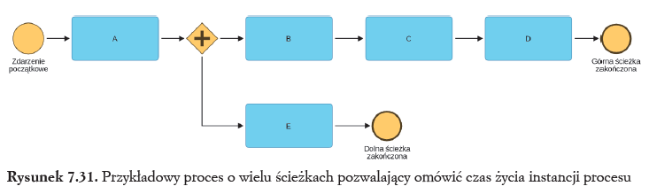

Instancja modelowanego procesu jednak żyje tak długo jak żyje przynajmniej jeden token.

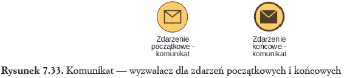

Zdarzenie początkowe wyzwalane komunikatem oraz końcowe wyzwalające komunikat.

Zauważ, że elementy pasywne mają puste ikony, tak jakby chciały aby je zapełnić, z kolei elementy aktywne emitują coś co może zapełniać.

**Zdarzenie początkowe wyzwalane przez czas**

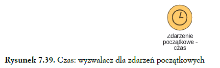

Np.

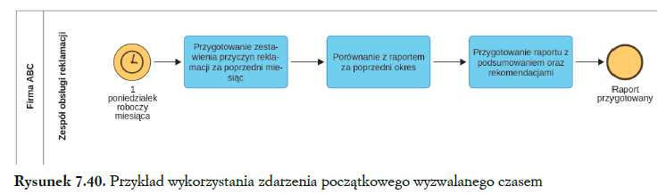

### Podprocesy

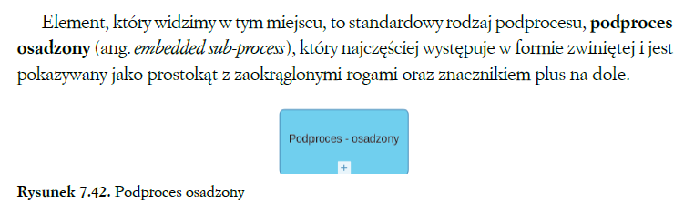

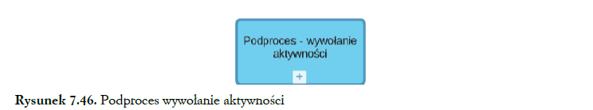

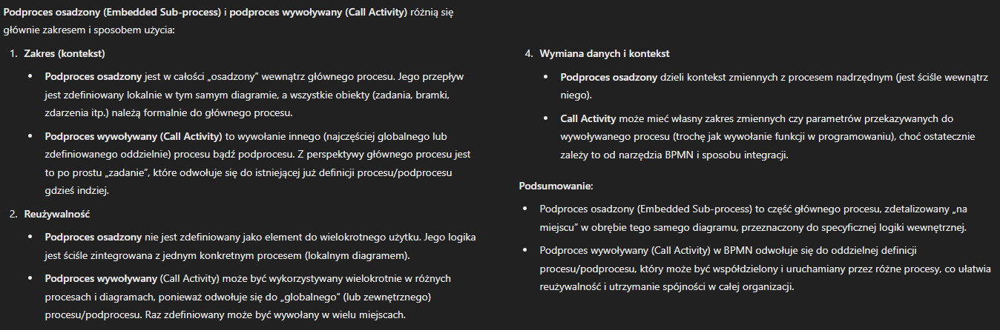

Podproces osadzony możemy też pokazać inline:

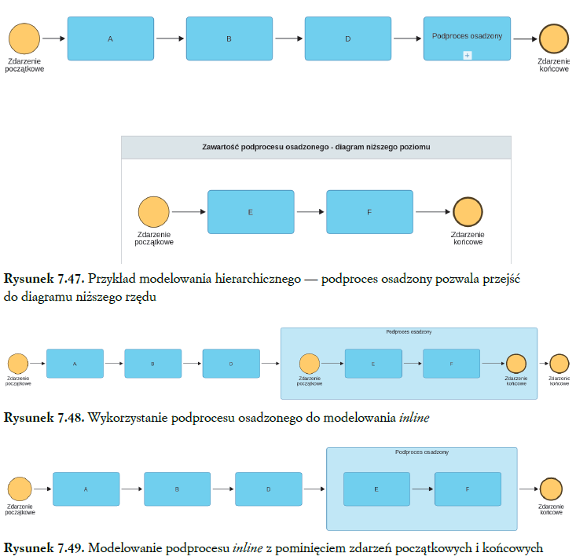

### Baseny i tory lanes

Dobra konwencja:

- basen -  cała firma
- tor - departamenty i komórki organizacyjne

Nie musisz rysować basenu, ale on defaultowo jakiś tam jest. BPMN czasami stosuje taką koncepcję "niewidzialnych" elementów.

W BPMN można tworzyć procesy publiczne oraz prywatne. Prywatny ma dużo szczegółów i można go dać do silnika wykonywalności. Publiczny to taka ocenzurowana wersja pozwalająca szybko pokazać partnerom to, co potrzebują wiedzieć o naszym sposobie działania, bez obciążania ich niepotrzebnymi informacjami o krokach procesu, które ich nie interesują.

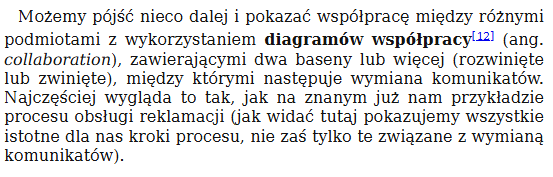

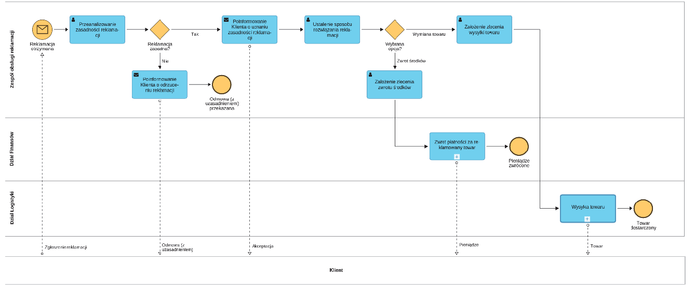

^Proces obsługi reklamacji jako współpraca

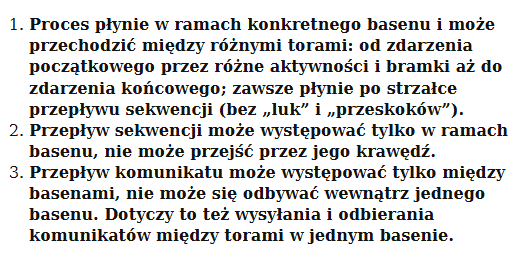

### Artefakty

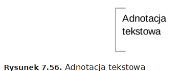

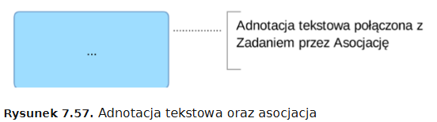

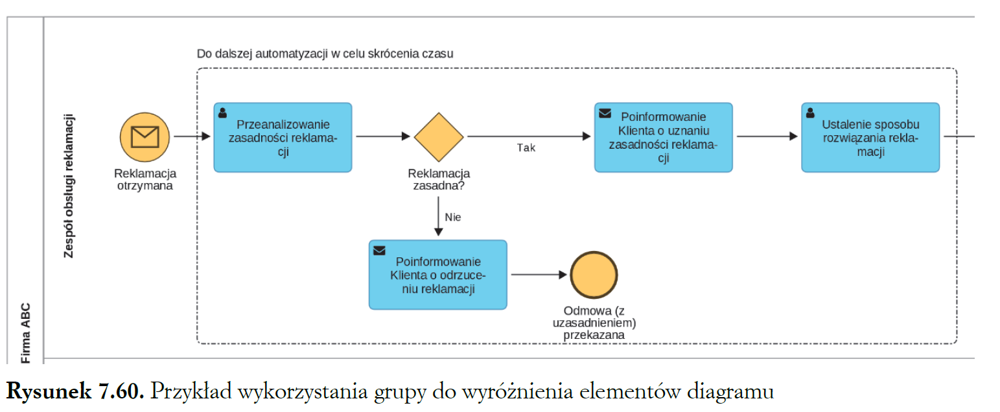

### Dane

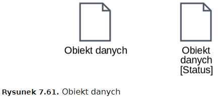

Obiekt danych to taka zmienna, która jest tworzona na czas działania instancji. Gdy token trafi na zadanie które ma asocjacje danych. Asocjacja pokazuje kto ma dostęp do tej zmiennej.

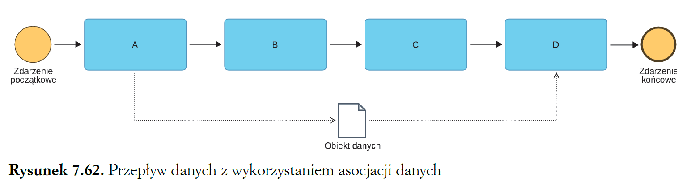

Jak chcemy coś do persistent memory to:

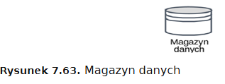

A jak chcemy pokazać na wielokrotność jakichś danych to: (czyli np. ze jest lista faktur a nie jedna)

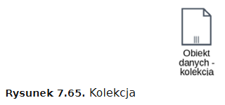

Są też dane wchodzące i wychodzące z procesu, nie obowiązuje ich standardowy czas życia więc.

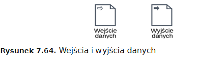

## BPMN dla zaawansowanych

### Intermediate events

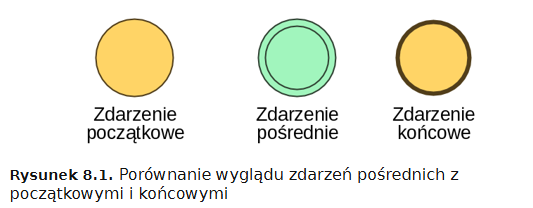

W sequence flow wskazują, że proces osiągnął jakiś specjalny stan albo że musi czekać aż coś nastąpi. 

Mogą też być poza sequence flow jako **boundary intermediate events** są do obsługi wyjątków, błędów i sytuacji specjalnych. Są one zawsze **catching**, nasłuchują, czy nie zdarzło się coś co może wpłynąć na wykonywanie aktywności której pilnują. 

Ten wpływ może być dwojaki:

- coś wymusza przerwanie pracy - **interrupting intermediate events**, 
- robimy "na boku" coś dodatkowego - **non-interrupting intermediate events**

#### W sequence flow

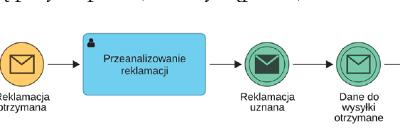

np. ten proces wysyła info (gdzieś niewyspecyfikowano jeszcze gdzie), że reklamację uznano, jest to idykator jakiegoś stanu w tym procesie. Następnie. Ten proces ruszy dopiero gdy otrzyma dane do wysyłki.

#### Poza sequence flow

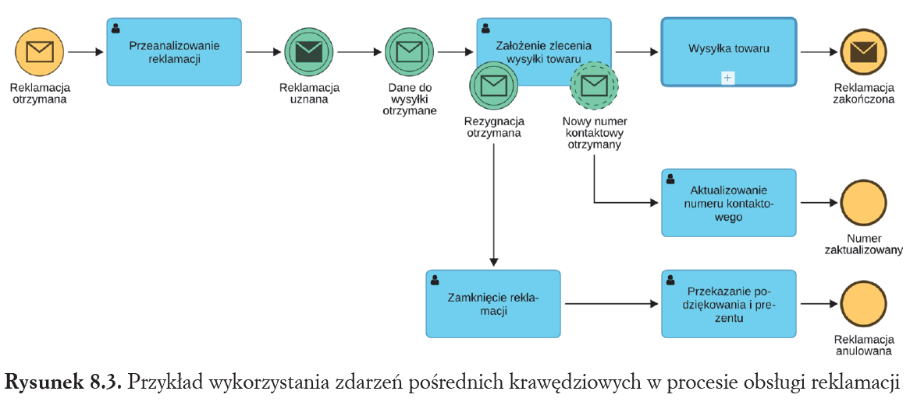

Tu na aktywność "Założenia zlecenia wysyłki towaru" ma dwa brzegowe eventy. Nasłuchują one gdy token ma aktywność. Różnią się tym, że otrzymanie Rezygnacji jest interrupting -> tzn. zabiera token od aktywności i wysyła nową drogą. A "Nowy numer kontaktowy otrzymany" nie jest interrupting, tworzony jest nowy token, a aktywność "rodzic" czego aż on dokona żywota zanim przejdzie do kolejnej aktywności.

#### event-driven sub-process

Umożliwiają obsługę wyjątków na poziomie całego procesu.

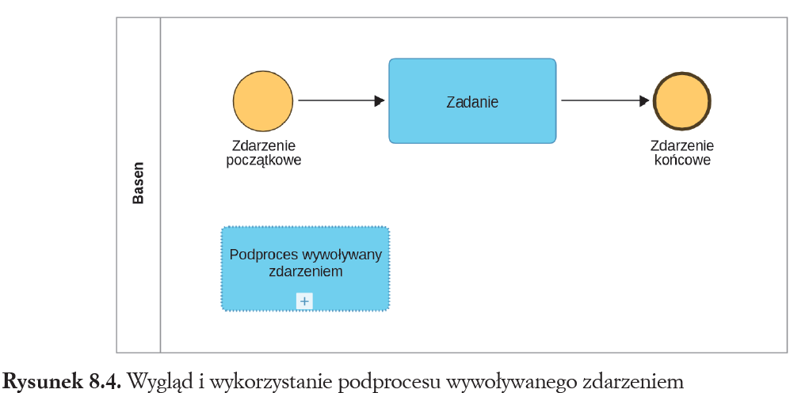

Rozwinięte:

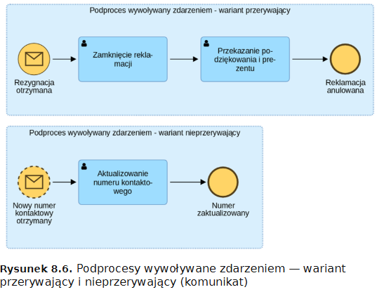

### Signal

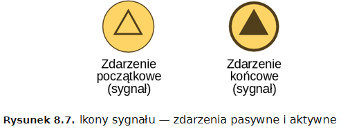

Po pierwsze może mieć wielu odbiorców - stąd nazwa sygnał. Czyli proces emituje w danym momencie sygnał. Sygnał może odebrać ktokolwiek, nie tak jak w przypadku komunikatu (**message**) ktoś z innego basenu.

### Czas

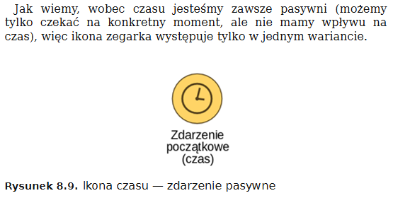

### Conditional event

Czym jeszcze można być wyzwolonym? **conditional event**.

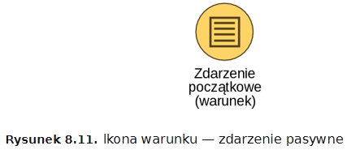

Tu też jest tylko wersja pasywna.

Można dzięki temu zacząć jako podproces albo proces pokazując że zaszły w otoczenia jakieś warunki.

### Escalation

BPMN wyróżnia dwie wagi problemów:

- eskalacje
- bardzo poważne problemy (o nich za chwilę)

Eskalacja to jak proces nie przebiega happy pathem i trzeba kogoś wyżej o tym poinformować. Tak więc eskalacje nie może być eventem startowym procesu. 

Podproces informuje o czymś proces rodzic.

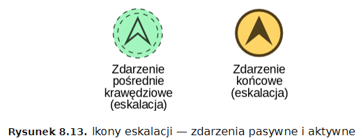

### Error

Eskalacja służy do sytuacji jak nie wszystko jest stracone i proces moze być kontynuowany. Error to gdy dupa blada się, nie dość że podproces się terminuje, to jeszcze w proces rodzic trzeba to obsłużyć.

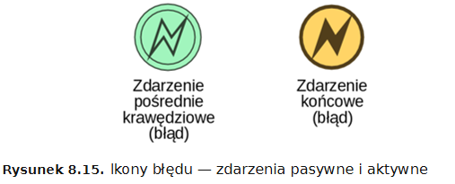

### Compensation

Służy ona do obsługi wycofywania rzeczy, które zostały zrobione.

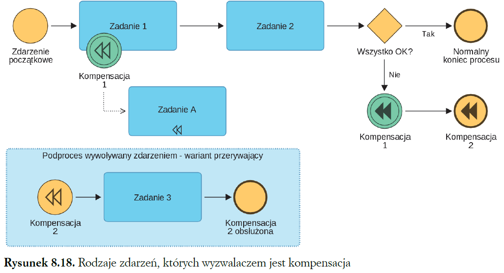

Np. tutaj po zadaniu 2 zadajemy sobie pytanie czy wszystko ok. Jeśli nie, to rzucamy zdarzenie "Kompensacja 1" oraz Kończymy proces rzucając Kompensacja 2. 

Kompensacja 2 zostanie złapana przez `Podproces wywoływany zdarzeniem - wariant przerywajacy`. 

Z kolei na `Kompensacja 1` nasłuchuje `Zadanie 1`, które w celu wycofania swoich działań wywoła `Zadanie A`.

Jak widać `Kompensacja 1` jest zdarzeniem brzegowym, ale odstępują od reguły. Nie nasłuchuje ona w trakcie wykonywania zadania, do którego jest przyczepiona a raczej nasłuchuje po jego zakończeniu, na wypadek, gdyby później się okazało, że trzeba je wycofać.

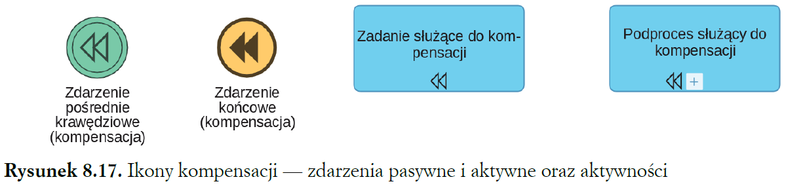

Tak, więc jeśli jakieś zadanie ma zdefiniowane swoje "wycofywanie", to można użyć mechanizmu kompensacji. Zadanie może nasłuchiwać na później rzucone zdarzenie kompensacji (końcowe lub pośrednie) poprzez swoje zdarzenie brzegowe, a rzeczywiste dokonanie wycofania wykona zadanie lub podproces służący do kompensacji.

### Cancel

Ale powstaje mały problem. Co gdy zadanie trzeba anulować w całości? Ma zdefiniowane multum kompensacji i bez sensu jest wołać każdą z nich.

Takie zadania ogólnie nazywamy **Transakcją** - może być wykonana albo dobrze w całości albo wcale.

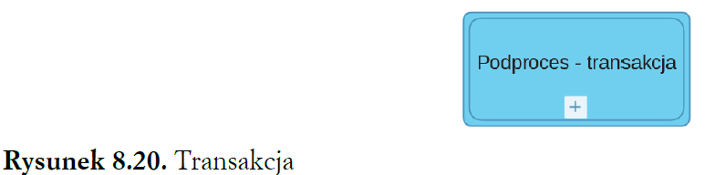

Znane z baz danych np.

I dla transakcji zdefiniowano dwa rodzaje wydarzeń:

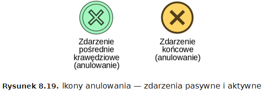

Jeśli zostanie wywołane zdarzenie anulujące dla danej transakcji, to ona da token dla każdej kompensacji. Wywoła wszystkie kompensacje zbiorowo bez konieczności wywoływania każdej z nich.

### Terminate end event

Zwykły event końcowy, którego ten event jest dziedzicem, zjada token, który do niego dotarł, ale nie ma wpływu na inne token.

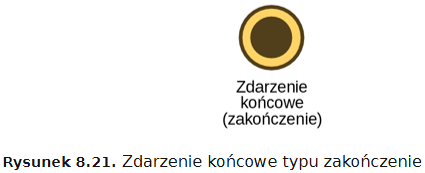

Za to jak tutaj dojdzie token, to zabija to wszystkie inne tokeny należące do procesu.

### Link

Gdy mamy duże i skomplikowane diagramy pomocne są linki. Skoro wydarzenia mają mechanizmy przenoszenia sequence flow i mogą rzucać token między sobą to czemu by nie zrobić takiego dla czystej czytelności diagramów?

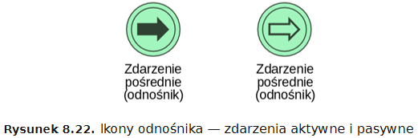

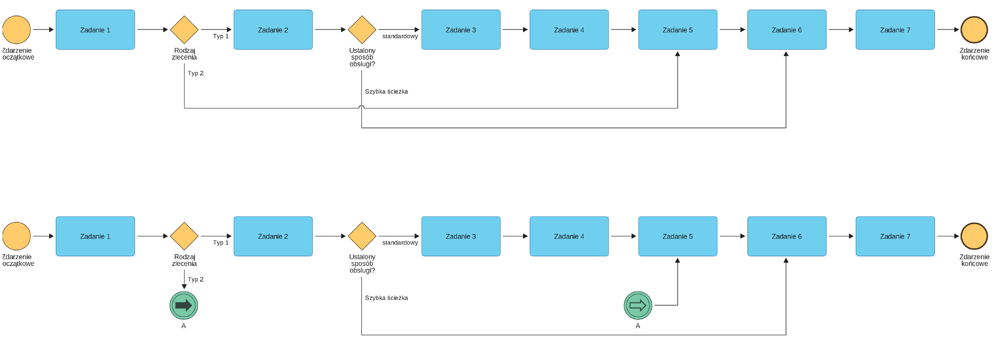

Np tu mamy dwa równoważne diagramy.

### Zdarzenia wielokrotne i równoległe

Czasami zdarza się tak, że mamy wiele zdarzeń początkowych np. tu:

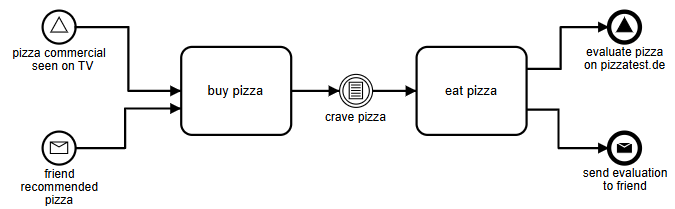

Tu proces się opadli jak zaistnieje jedno. Dla czytelności diagramu możemy użyć **multiple event**, a jego warianty opisać w nazwie:

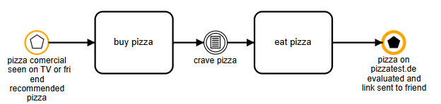

Ale Camunda nie zaleca takiego podejścia.

W BPMN 2.0 dodano też rodzaj uzupełniający. **Pararell event** -  Tu zdarzenie czeka aż wydarzą się wszystkie z opisu i dopiero wypuszcza token. 

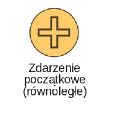

### Dodatkowe rodzaje bramek

Bramki XOR, AND i OR są sterowane danymi, można od razu na wydedukować którędy iść. A co jeśli zależy to od jakiś wydarzeń?

#### **event-based gateway** 

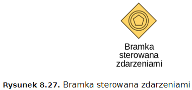

Kształt bramki a w środku ma zdarzenie wielokrotne chwytające

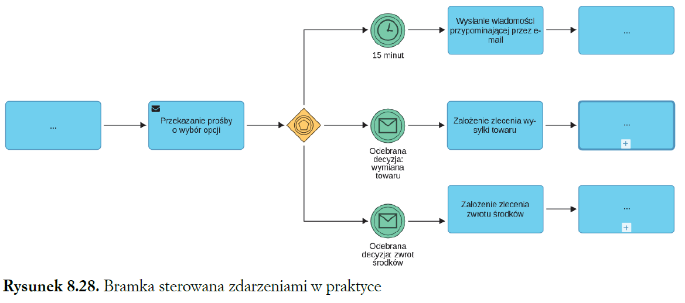

Co się pierwsze wydarzy to tam pójdzie token.

Ale tbh lepiej tak:

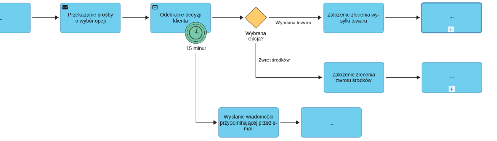

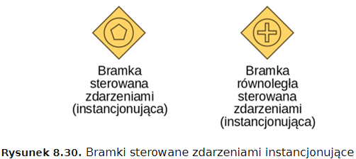

Mamy też bramkę równoległa sterowaną zdarzeniami. Tworzy ona token dla każdej ścieżki pobudzone zdarzeniem.

#### complex gateway

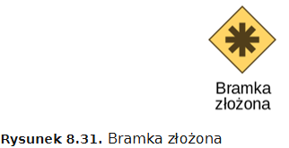

Tu designer sam opisuje logikę, nie jest to jednak zalecane.

### Dodatkowe rodzaje podprocesów

Wcześniej poznaliśmy dwa rodzaje podprocesów:

- osadzony
- wywołanie aktywności

Potem w sekcji zaawansowanej poznaliśmy jeszcze:

- transakcję
- podproces wywoływany zdarzeniem

Oraz, że ogólnie podproces może być:

- albo zwinięty i jego kliknięcie prowadzi do innego modelu
- albo rozwinięty i jego zawartość jest widczona

Jest jeszcze **ad-hoc sub-process**. 

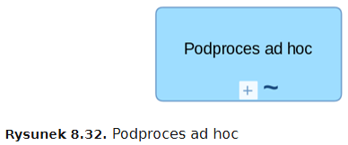

On został zaprojektowany z myślą o przypadkach gdzie analityk go umieszcza, ale sam nie wchodzi w szczegóły, wierząc że wykonawca procesu je po prosu dużo lepiej zna. Taki proces nie musi trzymać się struktury (stąd też nie jest wspierany przez narzędzia automatyzacji). Nie ma zdarzeń początkowych ani końcowych. Nie mu mieć sequnce flow itp.

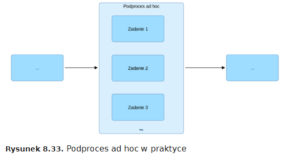

Rzadko jest to używane i raczej się odradza.

### Dodatkowe rodzaje zadań

#### Reguła biznesowa

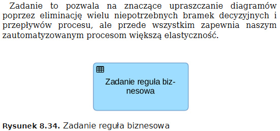

Reguły mogą być trzymane gdzieś zdalnie, nie na diagramach BPMN.

Obczaj: [DMN](https://en.wikipedia.org/wiki/Decision_Model_and_Notation)

#### Skrypt

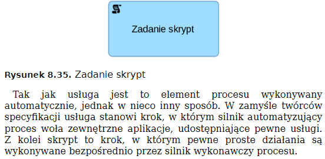

Np. walidacja wprowadzonych przez usera danych.

#### Activity call

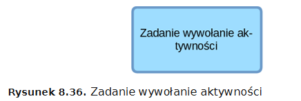

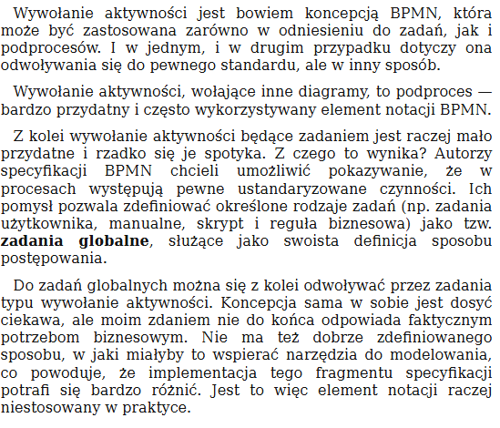

### Wielokrotne wykonania

Są mechanizmy, które pozwalają określić aktywność jako wielokrotnie wykonywane.

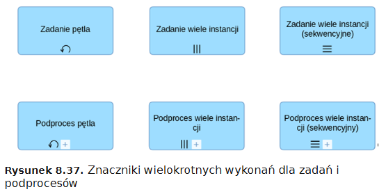

**Loop** - daną aktywność należy wykonać tyle razy ile będzie trzeba (przy czym nie jest to z góry znana liczba)

**multi instance** - tu wiemy z góry jaka jest liczba, i mogą one iść pararell

**multi instance in sequence**

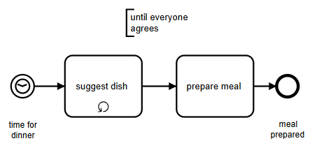

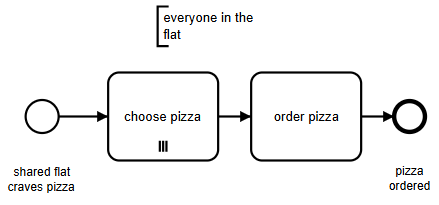

//TODO obczaj rozdział 9 później
