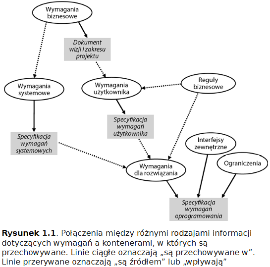
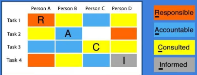
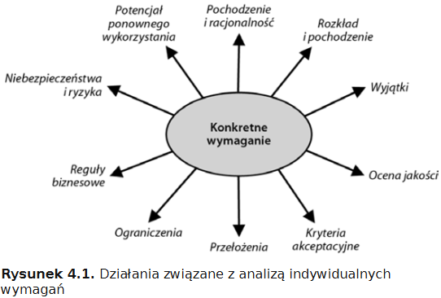
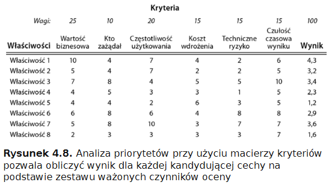

# Specyfikacja wymagań oprogramowania

# Wstęp

## Wymagania

**wymaganie** - wyrażenie potrzeb klienta, opisy dotyczące tego jak system powinien się zachowywać lub jaką mieć cechę lub atrybut. Mogą narzucać constraints na rozwijany system. 

> constraints - ograniczenia, ale bardziej rozumiane jako takie matematyczne, coś co określa dziedzinę funkcji.

| Rodzaj informacji                      | Definicja                                                    |
| -------------------------------------- | ------------------------------------------------------------ |
| **Wymagania biznesowe**                | Informacja, która opisuje dlaczego organizacja podjęła się projektu, określa cele biznesowe, definiuje wizję produktu i zawiera inne informacje dotyczące ustalania kierunku |
| **Reguła biznesowa**                   | Dyrektywa, która definiuje lub ogranicza działania w ramach operacji organizacji. Polityka, regulacja, prawo lub standard, których organizacja klienta przestrzega. |
| **Wymagania systemowe**                | Opis głównej możliwości lub cechy złożonego systemu, który składa się z wielu podsystemów, często obejmujących zarówno elementy sprzętowe jak i oprogramowanie. Wymagania systemowe stanowią podstawę pochodnych wymygań rozwiązania. |
| **Wymagania użytkownika**              | Opis zadania lub celu, który użytkownik chce osiągnąć za pomocą rozwiązania. |
| **Wymagania rozwiązania**              | Opis możliwości lub cech, które produkt w trakcie tworzenia musi posiadać, aby zaspokoić określone wymagania użytkowników i przyczynić się do osiągnięcia celów biznesowych projektu. Wymagania dotyczące rozwiązania obejmują wymagania funkcjonalne, niefunkcjonalne, dotyczące danych oraz operacje manualne. To na ich |
| **Ograniczenie**                       | Ograniczenie nałożone na wymagania, projekt lub implementację |
| **Wymagania danych**                   | Definicja obiekt danych lub elementu, którym system musi manipulować. jego budowy, atrybutów, relacji między innymi obiektami danych oraz ich formatu wejściowego i wyjściowego. |
| **Wymagania interfejsów zewnętrznych** | Opis połączenia między tworzonym systemem a innymi elementami otaczającego go świata, w tym użytkownikami, innymi systemami oprogramowania, urządzeniami sprzętowymi i sieciami. |
| **Wymagania funkcjonalne**             | Opis zachowania, jakie produkt będzie wykazywał w określonych okolicznościach. |
| **Wymagania niefunkcjonalne**          | Inaczej wymagania cech jakościowych. Cechy jakościowe opisują różne jakości, obsługę lub parametry wydajności systemu. |

## Inżynieria wymagań

Podzielna na dwie części:

- **rozwijanie wymagań** - działania, które zespół wykonuje aby zidentyfikować, dobrze zrozumieć oraz dobrze komunikować wiedzę na ich temat
- **zarządzanie wymaganiami** - odpowiednia opieka po ich pozyskaniu: obsługa zmian, śledzenie wersji, statusu LCM, śledzenie powiązanych elementów (inne wymagania, komponenty architektury, kod, testy)

### Rozwijanie wymagań

Podzielony na cztery części:

**Pozyskiwanie** - odkrywanie wymagań poprzez rozmowy z interesariuszami oraz analizy własne BA

**Analiza** - ocena wymagań pod względem szczegółowości, wartości, powiązań, wykonywalności

**Specyfikacja** - przedstawienie wiedzy na temat wymagań w odpowiednich i twałych formach

**Walidacja** - ocena w jakim stopniu zaspokajają ocenę potrzebę klienta

## Business Analyst

BA (ang. Business Analyst) - jego rola w zespole developerskim to inżynieria wymagań. W niektórych organizacjach ma też inne role - poza zespołem developerskim. 

Inżynieria wymagań to proces oparty na współpracy i komunikacji.

Wymagania dotyczą wszystkich interesariuszy. Wiele osób może wnosić wkład w wymagania, wiele osób pracuje na ich podstawie i równie wiele korzysta z ostatecznego rozwiązania. Zaangażowanie klienta jest potężnym czynnikiem przyczyniającym się do osiągnięcia sukcesu. BA musi współpracować z osobami, które potrafią dokładnie przedstawić potrzeby różnych grup interesariuszy. Większość decyzji dotyczących wymagań wymaga udziału wielu uczestników o różnych, czasem sprzecznych, interesach i priorytetach.

# Podstawy

## 1. Zrozumienie problemu przed wypracowaniem rozwiązania

System musi rozwiązywać właściwy **problem biznesowy**.

### 5 Whys

Technika służaca do analizy przyczyn źródłowych, która polega na  pracy wstecz od określonego problemu lub zaproponowanego rozwiązania (z którym przyszedł klient) w celu zidentyfikowania leżących u ich podstaw problemów i czynników źródłowych.

Przykład:

Klient przyszedł z propozycją rozwiązania problemu, a analityk zadając pytania "why" cofnął to do meritum problemów.

Na tej podstawie można wypracować **Diagram analizy przyczyn głównych** zwany również...

### Diagram ryby

Diagramem ryby lub diagramem Ishikawy.

Zacznij od przyczyny głównej, czyli czemu klient chce wgl cokolwiek robić, jako głowy ryby. Następnie rysujesz ość główną, z niej wychodzą przyczyny drugiego poziomu, a z nich przyczyny kolejnego. Potem, dla każdej możesz znowu narysować diagram ryby uwieszając inny element jako głowa. 

### Opis problemu

Szablon:

- Sytuacja - Opisz tło, kontekst i środowisko
- Problem - Opisz problem biznesowy tak jak teraz go rozumiesz
- Konsekwencje - opisz spodziewane wyniki jeśli problem nie zostanie rozwiązany
- Korzyści - Opisz wartość biznesową rozwiązania problemu
- Wizja - Opisz jak powinien wyglądać pożądany stan w przyszłości

### Kolejne kroki

1. Porozmawiaj z kierownictwem projektu i głównymi interesariuszami, aby dowiedzieć się dlaczego podjęto inicjatywę, i upewnij się, że rozumiesz problem, który ma zostać rozwiązany.
2. Utwórz diagram analizy przyczyn głównych.
3. Napisz opis problemu korzystając z szablonu.
4. Oceń czy obecna koncepcja rozwiązania adresuje ponownie zdefiniowany problem. Jeśli nie zasygnalizuj to.

## 2. Określenie celów biznesowych

**Wymaganie biznesowe** - informacje, które wyjaśniają dlaczego organizacja podjęła się projektu i jaką wartość zamierza z niego osiągnąć. Informacje te obejmują stwierdzenia dotyczące możliwości i celów biznesowych, metryki sukcesu oraz oświadczenie wizji.

Stanowią wytyczne kierunkowe dla całego projektu i skupiają się na tym czemu w ogóle uruchomienie projektu jest dobrym pomysłem.

Poniższe pytania mogą pobudzić dyskusję, która prowadzi do tych informacji.

**Wymagania biznesowe**  trafiają do dokumentu "Dokument wizji i zakresu projektu" lub "Karta projektu". 

### Cele biznesowe

Pozwalają określić kiedy problem biznesowy zostaje rozwiązany.

Powinno się je precyzować w sposób konkretny, realistyczny i mierzalny. Np.

Oraz podając wartości bezwzględne.

**Model celów biznesowych** - to diagram w języku modelowania [RML](https://argondigital.com/requirements-modeling-language/#:~:text=Requirements%20Modeling%20Language%20(RML%C2%AE,business%20teams%2C%20and%20technical%20stakeholders.. Jest to narzędzie bardziej złożonej analizy. 

### Metryki sukcesu

Pozwalają ocenić postęp i wkład rozwiązania w realizację celów biznesowych w funkcji czasu.

Czasem cel sam w sobie nadaje się do pomiaru - np. "Osiągnąć udział w rynku 45%".

Jednakże wiele celów albo:

- to wskaźniki opóźnione - nie wiesz nic dopóki nie ma końca projektu
- są potencjalnie pod wpływem innych czynników niż sam produkt/rozwiązanie/system - np. cel wzrost udziału w rynku to nie tylko sam produkt ale też marketing, sales, trendy.

### Deklaracja wizji

Zwięźle opisuje ostateczny zamiar dotyczący rozwiązania. Jak świat stanie się lepszym miejsce dzięki temu produktowi.

Szablon:

Nie mylić zakresu z wizją. **Zakres** określa jaką część wizji dany projektu zamierza zrealizować.

### Kolejne kroki

1. Zaprosić kluczowych interesariuszy w celu uzgodnienia wizji.
2. Sporządzić dokument lub inny kontener określający Wymagania biznesowe. Można użyć szablonu wyżej.
3. Zdefiniuj cele biznesowe.
4. Zdefiniuj miary sukcesu
5. Jeśli masz wile powiązanych ze sobą problemów i celów, sporządź model celów biznesowych, aby pokazać powiązania.

Pamiętaj! Każdy krok polega na komunikacji i współpracy z interesariuszami.

## 3. Określenie granic rozwiązania

Pytania:

- Które procesy biznesowe, funkcje i zdarzenia będą częścią rozwiązania, a które pozostaną na zewnątrz?
- Kto będzie korzystał z rozwiązania? A kto będzie z niego wyłączony?
- Które systemy będą częścią rozwiązania? Jakie będą ich interfejsy?
- Gdzie zaczyna się i kończy odpowiedzialność każdego systemu?
- Jakie zbiory danych, źródła i operacje zostaną uwzględnione w rozwiązaniu?
- Jak wpasowujemy nasze rozwiązanie w resztę naszego środowiska?
- Kiedo powinniśmy się zatrzymać?

### Precyzowanie koncepcji rozwiązania

Przykład: Obecnie restauracja ma dwa systemy: repozytorium menu i system składania zamówień. Klient składa zamówienie ustnie przez telefon lub osobiście. Pracownik wbija je do systemu, który odpytuje repozytorium menu i jeśli składniki są to generuje zamówienie wyświetlane kucharzowi w kuchni. 

Pożądany stan przyszły obejmuje zamówienia on-line. Ale granice rozwiązania można zdefiniować na kilka sposobów:

### Diagram kontekstu

Diagram ten ma w centrum w kółku system zainteresowania. Okrąg pokazuje granice systemu. Brak tu wewnętrznej struktury jakiekolwiek systemu. Ukazany też jest **przepływ danych** między systemami.

### Mapa ekosystemu

Wychodzi poza bezpośredni kontekst pojedynczego systemu:

**Stosowanie granic rozwiązania**

Pomagają one zdefiniować roadmape produktu. Implementacja całości może zająć wiele miesięcy, więc iteracyjne podejście pozwoli przedsiębiorstwu osiągać cele wcześniej.

### Kolejne kroki

1. Upewnij się, że wszyscy interesariusz rozumieją granice rozwiązania. Odwołaj się do celów biznesowych i określ minimalne zmiany potrzebne do ich osiągnięcia. 
2. Utwórz diagram kontekstowy i mapę ekosysteu
3. Na ich podstawie oceń czy obecnie żądane funkcjonalności należą do aktualnego zakresu projektu. Jeśli nie przenieś je na potem. (np. w tej iteracji system jeszcze nie komunikuje się ze [Stripe](https://stripe.com/en-pl), więc nie ma co implementować modułów od tego).
4. Przeanalizuj mapę ekosystemu, aby zidentyfikować system, które nie łączą się bezpośrednio z Twoim systemem, ale mogą wymagać zmian. Pracuj z ich właścicielami, aby upewnić się, że wszyscy rozumieją niezbędne modyfikacje i zobowiązują się do ich wprowadzenia.

## 4. Identyfikacja i charakterystyka interesariuszy

Każdy projekt ma ludzi, którzy się nim interesują.

**Interesariusz** - osoba, która aktywnie uczestniczy w projekcie, jest z nim związana lub może wpływać na jego kierunek.

"Sukces projektu to spełnienie wszystkich wymagań i ograniczeń oczekiwanych przez kluczowych interesariuszy" - Tim Lister.

Twój pierwszy krok to powinno być odnalezienie interesariuszy.

Tu przykładowi:

Niektórzy mogą interesować się samym projektem inni samym rozwiązaniem, które projekt dostarcza.

Szukając interesariuszy zadaj sobie pytania:

- Kto ma wpływ na budżet i harmonogram projektu?
- Kto może wyrazić cele biznesowe?
- Kto będzie korzystał pośrednio oraz bezpośrednio z produktu?
- Kto jest odpowiedzialny za inne systemy lub projekty, które wpłyną na Twój projekt?
- Kto może mieć wpływ prawny, regulacyjny lub procesowy?
- Kto zarządza relacjami biznesowymi z klientami, dostawcami i kontrahentami?
- Na czyje procesy biznesowe miałby wpływ system?
- Kto ma dostarczyć wszystkich danych potrzebnych do rozwiązania?
- Kto zna wszelkie istotne ograniczenia projektu, produktu lub procesu?

### Klienci i klasy użytkowników

Niektórzy klienci przedstawiają wymagania dotyczące produktu, oceniają produkty, nabywają produkt ale nigdy go nie używają.

Operacje biznesowe, których produkt dotyczy obejmują zadania komputerowe jak i czynności manualne. Czasem ktoś nigdy nie używa produktu bezpośrednio, ale z racji, że jest **pracownikiem procesu**, to jest też interesariuszem.

Prawie każdy produkt ma wiele **klas użytkowników**. Traktuj je jako oddzielne podkategorie interesariuszy.

Np. na platformie publikacyjnej `Speak-Out.biz`, gdzie autorzy mogą publikować artykuły na dowolny temat mam takie klasy:

- autor
- czytelnik
- redaktor publikacji
- administrator

### Charakterystyka grup interesariuszy

Przeprowadź analizę, aby zrozumieć kim są Twoi interesariusze. Pytania pomocne:

- Kim są? Ile ich jest?
- Gdzie się znajdują? Jaki jest best sposób komunikacji z nimi?
- Jakie role odgrywają w projekcie?
- Jak duży mają wpływ na projekt?
- Jakie są ich interesy i obawy?
- Jakie korzyści wiążą z produktem? Jakie są ich potrzeby, oczekiwania, kryteria sukcesu?
- Jakie informacje dotyczące operacji, technologii, danych lub czegokolwiek mogą dostarczyć?
- Co muszą wiedzieć na temat projektu?
- Jak będą korzystać z produktu, jeśli są użytkownikami?

**Macierz RACI** **(Responsibility Assignment Matrix)** identyfikuje role interesariuszy i ich odpowiedzialność w projekcie. Pokazuje kto jest responsible, accountable, consulted oraz informed.

**Mistrz produktu** - to upoważniony i wyznaczony przedstawiciel konkretnej klasy użytkowników.

### Kolejne kroki

1. Przyjrzyj tabelę 2.2 w poszukiwaniu interesariuszy
2. Scharakteryzuj każdą grupę
3. Utwórz katalog interesariuszy
4. Zidentyfikuj klasy użytkowników

## 5. Identyfikacja osób podejmujących decyzje

W pracy analityka są decyzje, które podejmujesz sam, ale też są takie, które już są poza Twoim zakresem. Nie tyczą się inżynierii wymagań a samych wymagań, ich semantyki. 

Jak rozpoznać decyzje, które musisz przegadać z interesariuszami?

- rozwiązywanie problemu sprzecznych wymagań w obrębie danej klasy użytkowników oraz między różnymi klasami użytkowników
- priorytetyzowanie wymagań różnego rodzaju
- dostosowywanie priorytetów w miarę pojawiania się nowych potrzeb i zmian rzeczywistości projektu
- dokonywanie kompromisowych wyborów między sprzecznymi atrybutami jakości (quality trade-off)
- określanie liczby wydań produktu oraz zakresu każdej z nich
- ustalanie, jakie nowe lub zmienione wymagania należy uwzględnić w planach rozwojowych (w **Product Backlog**)
- decydowanie, kiedy i w jaki sposób zmodyfikować zakres planowanej inkrementacji wydania produktu

W agile decyzje dotyczące wymagań podejmuje Product Owner. Co jest zgodne z odpowiedzialnością PO za tworzenie, priorytetyzację i zarządzanie elementami w Product Backlog.

> **Product Backlog** - [Rejestr Produktu](https://agileinstitute.pl/index.php/encyclopedia/rejestr-produktu/) (ang. [Product Backlog](https://agileinstitute.pl/index.php/encyclopedia/product-backlog/)) to uporządkowana lista wszystkiego, co w danym momencie wia[dom](https://agileinstitute.pl/index.php/encyclopedia/dom/)o o stanie i rozwoju produktu. Jest on jedynym źródłem wymaganych zmian, które mają być wprowadzone w produkcie. Osobą odpowiedzialną za [Rejestr Produktu](https://agileinstitute.pl/index.php/encyclopedia/rejestr-produktu/) jest [Właściciel Produktu](https://agileinstitute.pl/index.php/encyclopedia/wlasciciel-produktu/). Odpowiada on za treść poszczególnych elementów rejestru, ich dostępność oraz kolejność.
>
> Inna defka: [link](https://wolski.pro/podstawy-scrum/product-backlog-rejestr-produktu/)

### Reguła decyzyjna

Ustalona przez zespół procedura dotycząca podejmowania decyzji. Istnieje wiele możliwych reguł:

- Głos jednomyślny - głosowanie, istotne jest uzyskanie zgody wszystkich osób. Czasochłonne mega.
- Konsensus - każdy akceptuje decyzję grupy, ale z różnymi stopniami odczuwanego komfortu. Mniej czasochłonne.
- Głosowanie większościowe - opcja z największą liczbą głosów wygrywa
- Decyzja lidera - lider sam docieka i podejmuje decyzje
- Delegacja - lider mianuje kogoś, kto ma odpowiednią wiedzę do podjęcia decyzji

### Kolejne kroki

1. Przejrzyj czy masz jakieś decyzje typu wymienionego wyżej
2. Ustal regułę decyzyjną w zespole
3. Ustal komunikowanie podejmowanych decyzji osobom, które nie brały udziału w spotkaniu

# Pozyskiwanie wymagań

Często mówi się o "zbieraniu wymagań", jak gdyby był to prosty proces gromadzenia: wymagania są gdzieś w głowach ludzi, a analityk biznesowy po prostu prosi o nie i zapisuje. Nigdy tak nie jest. W rzeczywistości interesariusz zaczynają od losowych fragmentów informacji.

**Pozyskiwanie** - oznacza wydobycie lub wyłonienie czegoś ukrytego, jest to umiejętność oraz pewne wysiłki w celu uzyskania odpowiedzi. Ta umiejętność jest ważnym atutem jaką BA wnosi do projektu. Pozyskiwanie wymagań obejmuje nie tylko gromadzenie informacji od interesariuszy, ale także eksplorację, odkrywanie i wynalazczość. 

Źródła gdzie BA szuka wymagań:

- rozmowy z interesariuszami
- dokumentacja dotycząca procesów biznesowych, obecnych systemów i konkurencyjnych produktów
- prawa, regulacje i polityki biznesowe
- istniejące systemy, które mogą ale nie muszą być udokumentowane
- raporty o problemach użytkowników, dane z działu pomocy technicznej i zespołu wsparcia

## 6. Zrozumienie tego, co użytkownicy muszą zrobić za pomocą rozwiązania

W rozmowie z użytkownikiem rozwiązania musisz być skupiony na jego problemie.

Dlatego najlepsze jest pytanie "Co musisz zrobić z rozwiązaniem?".

Opisów celów użytkownika i interakcji prowadzących do ich osiągnięcia stanowią **wymagania użytkownika**.

### Pozyskiwanie wymagań użytkownika

Osoba nie uruchamia aplikacji, aby korzystać z konkretnej funkcji, tylko aby coś zrobić. Użytkownikom trudno jest wyrazić swoje "wymagania", ale łatwo im opisać jak mogliby wykonać działalność biznesową. 

Opis jednej interaktywnej sesji jaką robi użytkownik z produktem to **scenariusz**, czyli sekwencja kroków jakie user podejmuje w celu osiągnięcia określonego celu.

Zwykle opis ten zaczyna się od najbardziej typowej lub najczęściej wykonywanej czynności zwanej **happy path'em**. Na jej podstawie można eksplorować alternatywne przypadki. 

Skutecznym sposobem organizacji scenariuszy są **Use Case'y**.  Gdy interesariusz podczas rozmowy mówi "Chcę <coś zrobić>", "Muszę móc <coś zrobić>", to mam do czynienia z przypadkiem uzycia.

Projekty Agile z kolei używają **user stories** jako techniki omawiania możliwości systemu. Mają one taki szablon:

**Epika** - to zbiór logicznie powiązanych user stories.

Możemy pozyskiwać wymagania użytkownika albo w formie use case albo w formie user stories. 

### Anatomia przypadku użycia

W odróżnieniu od prostego formatu user stories mamy tu bogaty szablon:

### Zastosowanie wymagań użytkownika

Zarówno use case'y jak i user stories muszą zostać rozwinięte w zestaw **wymagań funkcjonalnych**, które są implementowane przez programistów.

### Kolejne kroki

1. Jeśli Twój zespół jeszcze nie zbadał zadań, które użytkownicy chcą wykonywać za pomocą przygotowanego rozwiązania, przeprowadź rozmowy z przedstawicielami użytkowników, aby zidentyfikować ich use case'y. Zbadaj happy path oraz alternatywne przebiegi. Upewnij się, że zanotowałeś wyjątki oraz to jak powinny być obsługiwane
2. Spróbuj wypełnić szablon przedstawiony w tabeli 3.3
3. Jeśli Twój projekt korzysta z user-stories, spróbuj udokumentować grupę powiązanych scenariuszy zarówno w formacie user stories jak i use case'ów.

## 7. Identyfikacja zdarzeń i odpowiedzi

Analiza zdarzeń jest szczególna skuteczna w przypadku systemów real-time lub middleware.

**Zdarzenie** - zmiana, która zachodzi w środowisku systemu i wywołuje w nim pewnego rodzaju reakcję.

Zdarzenie:

- biznesowe - user coś wyklikał np. zlecił przeskanowanie komputera
- sygnałowe - przyszła wiadomość jakiegoś protokołu komunikacyjnego od innego systemu np. wpięto pendrive lub rozpoczęto pobieranie z neta
- czasowe - upłynął jakiś czas od czegoś np. minął tydzień od ostatniego update'u

### Specyfikowanie zdarzeń

Najprościej jest wylistować zdarzenia, które system obsługuje.

**Tabela zdarzeń i reakcji** - opisuje możliwe zdarzenia i oczekiwane reakcje w oparciu o stan systemu w chwili wykrycia każdego zdarzenia. 

Tabela nie zastępuje wylistowania zdarzeń. Podsumuwuje dziłanie systemu na dość wysokim poziomie abstrakcji.

Żeby sprawdzić czy jest kompletna warto narysować **diagram przejść między stanami**.

### Kolejne kroki

1. Sporządź listę zdarzeń, na które Twój produkt musi reagować. Sklasyfikuj biznesowe, sygnałowe i czasowe.
2. Utwórz tabelę zdarzeń i reakcji.
3. Narysuj diagram przejść między stanami aby zwalidować tabelę.

## 8. Ocena koncepcji danych i relacji

Biznes komputerowy nazywany był kiedyś "przetwarzaniem danych". My (BA) o danych możemy myśleć jako o spoiwie, które łączy wszystkie inne rodzaje wymagań. Koniec końców funkcjonalność systemu istnieje w celu przetwarzania danych.

Pytania pomagające zdefiniować wymagania danych:

- Jakich danych wymaga każda składowa rozwiązania? Jakie są ich źródła?
- Jakie dany, które powinny być trwale przechowywane, produkuje każda składowa?
- Którzy interesariusze lub które systemy korzystają z każdego fragmentu danych? Jak je wykorzystują?
- Jakie obiekty danych są wejściem lub wyjściem dla jednostek zewnętrznych w stosunku do rozwiązania? Za pomocą jakich mechanimzów dane będą odbierane i wysyłane?
- Jakie obiekty danych przepływają między systemami, komponentami lub procesami w rozwiązaniu? Za pomocą jakich mechanimzów, będą wymieniane obiekty danych?
- Jakie ograniczenia, reguły biznesowe lub zależności dotyczą każdego obiektu danych?
- Który system lub proces jest "ownerem" dla każdego obiektu danych?
- Jakie informacje muszą być wprowadzone lub wyświetlane w interfejsie użytkownika?
- Jakich polityk musi przestrzegać system w zakresie zarządzania danymi. w tym jakości, dostępu, bezpieczeństwa, prywatności, integralności, retencji, archiwizacji i usuwania?

Rozpocznij badanie od zdobycia pełnej listy obiektów danych. Szukaj ich w:

- Rzeczownikach występujących w opisach problemu biznesowego, koncepcji rozwiązania, procesach, wymaganiach użytkownika, diagramach przejść stanów oraz tabelach zdarzeń i reakcji.
- Etykiety na liniach mapy ekosystemu lub na przepływach diagramu kontekstowego identyfikując obiekty danych na wysokim poziomie.
- Opisy raportów, widoków i innych "wyników" działa systemu dostarczają cennych wskazówek
- W przypadku istniejących produktów lub integracji z istniejącymi systemami mamy już dane. Konieczne może być mapowanie lub translacja.

### ERD

Po zidentyfikowaniu potencjalnych obiektów danych (**encji**) można utworzyć model danych, aby pokazać **relacje** między nimi.

**Entity Relationship Diagram (ERD)** to popularna konwencja do rysowania modeli danych. Może być na róznych levelach:

- biznesowy (koncepcyjny) - dla biznesu pokazuje nazwy encji i relacje
- logiczne - dodaje szczegóły dotyczące atrybutów do encji
- fizyczny - opisuje architekturę bazy danych (tabele, kolumny, klucze główne i obce...)

Charakter liczbowy relacji pomiędzy każdą encją to **kardynalność**

### CRUDCLUMT

Teraz szukaj w jaki sposób każda instancja jest 

- tworzona (**C**reate)

- odczytywana (**R**ead)

- aktualizowana (**U**pdate)

- lub usuwana (**D**elete)

​	Szukaj również wystąpień:

- kopiowania (**C**opied)

- listowania (**L**ist)

- używania (**U**sed)

- przenoszenia (**M**oved)

- przekształcania (**T**ransformed)

Szukaj obiektów danych, które są tworzone, ale nigdy nie są używane ani przechowywane, oraz obiektów, które są używane przez procesy, ale nigdy nie są jawnie odczytywane czy tworzone.

Szukaj źródeł danych, skąd one się biorą w systemie, czy z palca, czy z bazy itd.

### DFD

**Data Flow Diagram** - potomek diagramu kontekstu. To tak jak wziąć lupę i zajrzeć do środka okręgu. 

Dwie horyzontalne, równoległe linie to **magazyny danych** - przechowują pewną ilość danych trwale lub tymczasowo.

Szare prostokąty to zewnętrzne systemy.

Na rysunku mamy 6 procesów, które chodzą non stop w systemie są pobudzane danymi i tworzą jakieś inne dane.

### Słownik danych

ERD i DFD dostarczają ogólnego widoku na dane, szczegóły zaś są w **słowniku danych** (nie myl z słownik pojęć). Wierszami są dane, a kolumnami ich metadane.

### Kolejne kroki

1. Utwórz ERD
2. Utwórz DFD
3. Utwórz Słownik danych

## 9. Pozyskiwanie atrybutów jakościowych

**Wymaganie niefunkcjonalne / wymagania jakościowe usługi** - opisują atrybuty jakości, czyli nie co produkt robi, ale jak dobrze działa.

Zewnętrzne - obserwowane przez użytkowników

Wewnętrzne - obserwowane przez programistów i architektów rozwiązań

### Gromadzenie

Pytania pomocnicze:

- Czy pewne funkcje są bardziej istotne niż inne? Jeśli tak, to które z nich?
- Jakie mogą być konsekwencje tego, że pewne możliwości nie są dostępne przez pewien czas? Jak możemy najlepiej radzić sobie w takich sytuacjach?
- W jakich okresach można zaplanować działania konserwacyjne, minimalizując ich negatywny wpływ?
- Czy system powinien informować użytkowników, jeśli pewne funkcje są niedostępne?
- Jak możemy ocenić, czy cele dotyczące dostępności zostały spełnione?

### Konsekwencje

W przeciwieństwie do wymagań funkcjonalnych, te nie zawsze znajdują odzwierciedlenie w kodzie. Często wpływają jedynie na decyzje architektoniczne. 

Przykładowo mamy takie wymagany atrybut jakości: "Wszystkie systemy informatyczne muszą wymagać wieloczynnikowego uwierzytelnienia przed umożliwieniem użytkownikowi dostępu do usług systemowych". A to prowadzi z kolei do pytań takich jak:

A to tylko jedno wymaganie dotyczące bezpieczeństwa.

### Kompromisy 

Zawsze jest jakiś trade-off. np.

- Wzmacnianie bezpieczeństwa może wymagać, że user musi wykonać więcej czynności (np. 2FA)
- Zwiększenie wydajności (ang. performance) ma niewielki wpływ na możliwość instalacji, integralność, weryfikowalność i niektóre inne czynniki

### Określanie 

Niektóre cechy jakościowe odnoszą się do konkretnych funkcji use case lub user story np. czas odpowiedzi systemu na konkretne działanie usera.

Specyfikacja cech jakościowych musi być

- precyzyjna (zrozumiała dla wszystkich)
- konieczna (aby nie przesadzać z inżynierią produktu)
- mierzalna (aby wiedzieć dokładnie, co próbuje się osiągnąć)
- weryfikowalna (aby można było stwierdzić czy osiągnięto cel)
- realistyczna (aby nie marnować czasu na polowanie na unicorn-hunting)

Jedną z technik pisania takich wymagań niefunkcjonalnych jest [**planguage**](https://www.modernanalyst.com/Resources/Articles/tabid/115/ID/2926/Specifying-Quality-Requirements-With-Planguage.aspx). Ale można użyć też naturalnego języka bez struktury np.

### Kolejne kroki

1. Zbadaj co oznacza jakość dla Twoich użytkowników i innych interesariuszy. Udokumentuj to.
2. Sięgnij po specjalistyczne książki tej dziedziny:
   1. Lausen Soren, 2002, Software Requirements: Styles and Techniques
   2. Miller Roxanne E., 2009, The Quest for Software Requirements
   3. https://en.wikipedia.org/wiki/List_of_system_quality_attributes
   4. https://www.modernanalyst.com/Resources/Articles/tabid/115/articleType/ArticleView/articleId/2926/Specifying-Quality-Requirements-With-Planguage.aspx
   5. Roberston Suzanne, Robertson James, 2013, Mastering the Requirements Process: Getting Requirements Right
   6. Przygotuj listę pytań do interesariuszy na tej podstawie
3. Upewnij się, że każde z wymagań cech jakościowych jest weryfikowalne i że testerzy potrafią stwierdzić czy dane wymaganie zostało spełnione

# Analiza wymagań

Po zrozumieniu problemu i pozyskaniu wymagań od interesariuszy przychodzi krok, których robisz sam - przekształcenie tej całej wiedzy w opis możliwości i cech rozwiązania.

Większość BA może pozyskać wymagania, ale i tak przeoczyć coś, co jest potrzebne do stworzenia wartościowego rozwiązania. Można temu zapobiec tylko poprzez **analizę wymagań** i danych. Polega ona na klasyfikacji, sortowaniu, ustalaniu priorytetów, wizualizacji, przeglądania z różnych perspektyw, wyszukiwaniu konfliktów, wyszukiwaniu luk.

## 10. Analiza wymagań i zestawów wymagań

To ten obszar gdzie doświadczony BA naprawdę dodaje wartość.

Jest to krok wykonywany albo przez BA albo tymczasowo w głowach programistów, idealny przypadek to gdy programista dostaje od BA takie instrukcje, że tylko "bezmyślnie" musi je przetworzyć na kod, nie spędzając ani chwili na żadnej analizie biznesowej, nie zadawać sobie pytania "jak to ma działać?", a jedynie tylko "ok rozumiem co ma być, jak to teraz napisać?".

Analiza obejmuje:

- dzielenie systemu na części i określanie jak są one ze sobą powiązane
- przedstawienie wiedzy o wymaganiach na odpowiednim poziomie szczegółowości i w odpowiednich formach, aby zapewnić pełne zrozumienie
- odkrywanie i rozwiązywanie konfliktów, niezgodności, nadmiarów, pominięć i zależności
- wnioskowanie szczegółowych wymagań dotyczących rozwiązania na podstawie źródeł wyższego poziomu, takich jak wymagania systemowe, use case'y, reguły biznesowe i atrybuty jakości
- ocena wymagań pod kątem kilku cech jakościowych
- negocjowanie priorytetów wymagań

Jest to iteracyjny proces. Zaczynasz go gdy rozumiesz pewną bazę wymagań wystarczająco dobrze, by zespół mógł przejść do projektowania i rozwijania bez dużego ryzyka potencjalnych prac naprawczych.

### Analiza idywidualnych wymagań

Diagram prezentuje listę pytań kontrolnych jakie warto sobie zadać przy każdym wymaganiu.

#### Pochodzenie i racjonalność

BA musi umieć wskazać źródło (user story, use case, prośba interesariusza, polityka firmy, atrybut jakości, itp.). Zrozumienie racjonalności pomaga potem w priorytetach.
#### **Rozkład i pochodzenie**

rozkład dużych wymagań na mniejsze. np. **drzewo funkcji**

Projekty agile mogą napotkać takie user stories, które są zbyt duże aby zaimplementować je w jednym sprincie, nazywamy je  **epikami**. I to je trzeba dzielić.

#### Wyjątki

ludzie głównie skupiają się na opisaniu happy path'a, a programiści dużo kodu piszą aby obsłużyć wyjątki, ułatw im to.

#### Ocena jakości

skanuj automatycznie wymaganie pod kątem określonych cech:

- kompletność - brak wszystkich informacji
- poprawność - wymaganie dokładnie określa potrzebę interesariusza lub niezbędną właściwość rozwiązania
- wykonalność - wymagania da się się zaimplementować w ramach znanych ograniczeń technicznych, biznesowych i projektowych
- niezbędność - wymaganie dokumentuje to, czego interesariusz rzeczywiście potrzebuje
- priorytet - wymaganie da się sklasyfikować względem znaczenia i pilności włączenia do rozwiązania
- jednoznaczność - wymaganie przekazuje tylko jedno możliwe znaczenie dla wszystkich jego czytelników
- możliwość weryfikacji - istnieje sposób udowodnienia, że wymagania zostało poprawnie zaimplementowane

#### **Kryteria akceptacyjne** 

Opis zachowania systemu (testy, miary wydajności itp..), który pokazuje, że wymaganie jest spełnione.

#### Przełożenia

**Przełożenie** (ang. over-assumption) - to stwierdzenie, które uważa się za prawdziwe nie mając pewności, czy jest to prawda. Ludzie często zakładają niewypowiedziane założenia dotyczące wymagań. Sprzeczne i przestarzałe założenia mogą później powodować problemy.

#### Ograniczenia

Źródła ograniczeń to reguły biznesowe, zgodność z innymi systemami, realia fizyczne (takie jak rozmiar, interfejsy i materiały), standardy danych i interfejsów oraz atrybuty jakościowe. Ograniczenia projektowe dotyczą budżetu, czasu, personelu czy kompetencji. 

Niektórzy autorzy wymagań nieumyślnie nakładają ograniczenia używając języka dotyczącego szczegółów implementacji. Przemyśl czy to rzeczywiste ograniczenie czy tylko propozycja rozwiązania.

#### Reguły biznesowe

Często wpływają one na wymagania. Sprawdź czy nie jest tak przy tym wymaganiu.

#### Niebezpieczeństwa i ryzyka

Analiza wymagania w kontekście ryzyk:

- wpływ na wydajność systemu
- zagrożenia bezpieczeństwa
- wpływ na procesy biznesowe
- wysoka złożoność lub nowatorskość, które mogą sprawić, że wymagania będą trudne do zrozumienia
- potrzebne nowe techniki lub technologie przy implementacji
- ryzyka, które określają wymagania dla strategii biznesowych, architektur przedsiębiorstwa, czynników prawnych i środowiskowych
- niekorzystne interakcje z innymi systemami, komponentami lub bazami danych

#### Potencjał ponownego wykorzystania

Twórz takie wymagania, które można ponownie wykorzystać w innych kontekstach. Jeśli proces lub zestaw wymagań ma duże pstwo powtarzalności, rozważ stworzenie ogólnego szablonu dla tych wymagań w celu zwiększenia możliwości ponownego wykorzystania. 

### Analiza zestawów wymagań

Działania analizy zestawów wymagań nieco różnią od działań analizy wymagań one at a time.

#### Luki

Znaleźć te wymagania, których jeszcze nie ma.

Potencjalne źródła to:

- interesariusze, którzy nie dostarczyli jeszcze swoich wymagań
- brakujące wyjątki
- sytuacje dotyczące złożonej logiki
- przeoczone dane

Modele wizualne tu pomagają.

#### Konflikty i niezgodności

Szukanie niemożliwości implementacyjnych.

#### Nakładanie się i duplikacje

Gdy to możliwe, wskazuj na jedno, wiarygodne źródło informacji, zamiast je powtarzać.

#### Zaleźności

Niektóre wymagania zależą od implementacji innych wymagań.

#### Ocena jakości

Jakości zestawu wymagań ma dwa aspekty:

- modyfikowalność - zebrane wymagania są zorganizowane i oznaczone w taki sposób, który ułatwia ich zamianę i utrzymywanie rejestru dokonywanych zmian
- śledzenie - możliwe jest udokumentowanie logicznych powiązań między wymaganiami a ich źródłami, powiązanymi wymaganiami oraz kodem i testami.

#### Reprezentacja w różnych formach

Oprócz tekstu twórz diagramy, tabele prototypy, grupujące wymagania. Ułatwia to komunikacje z interesariuszami.

#### Priorytetyzacja

Żaden zespół nie może jednocześnie implementować wszystkiego co znajduje się w backlogu produktu.

Trzeba ustalić kolejność prac w sposób technicznie poprawny i dostarczający maksymalną na dany moment wartość dla klienta.

#### Złożone i domniemane wymagania

Obecność pewnej funkcjonalności czasami sugeruje istnienie innej bez wyraźnego tego określenie. Np. funkcja cofania sugeruje obecność funkcji ponownego wykonania.

### Kolejne kroki

- Przenalizuj wymagania działaniami z rysunków 4.1 i 4.3

## 11. Tworzenie modeli wymagań

Tekst to nie jedyny, a czasem nie najlepszy sposób reprezentacji wiedzy dotyczącej wymagań. Graficzne modele pozwalają spojrzeć na wymagania z perspektywy jakiej tekst nie daje.

### Modele

Dostępnych jest kilka języków/notacji modeli:

- model i notacja procesów biznesowych lub [BPMN](https://en.wikipedia.org/wiki/Business_Process_Model_and_Notation)
- [IDEF0](https://ptgmedia.pearsoncmg.com/images/9780133492040/samplepages/0133492044.pdf)
- Język modelowania wymagań lub [RML](https://argondigital.com/requirements-modeling-language/)
- Analiza strukturalna (ta książka)
- języku modelwania systemów lub [SysML](https://en.wikipedia.org/wiki/Systems_modeling_language)
- zunifikowany jezyk modelowania [UML](https://en.wikipedia.org/wiki/Unified_Modeling_Language)

Oraz samych modeli:

Po tworzeniu modeli, analizuj je wspólnie z interesariuszami. np.

Modele wstępne tzw. [strwaman](https://en.wikipedia.org/wiki/Straw_man_proposal) przespiesza proces modelowania. np. Jak nie znasz jakiejś wartości to zamiast wpisywać X użyj najlepszego szacunku dla niej. Dla interesariusza stanowi to kotwicę wokół, której może oprzeć swoje dalsze działania.

### Co potem

### Kolejne kroki

1. Zidentyfikuj tę cześć projektu, która aktualnie mogłaby skorzystać najbardziej na szczegółowym zbadaniu i wyjaśnieniu.
2. Utwórz wstępne modele, przejrzyj je z interesariuszami, a następnie poprawiaj
3. Wykorzystaj modele do oceny zestawów wymagań

## 12. Tworzenie i ocena prototypów

IKIWISI - "I'll know it when I see it" -> klient/user nie opowie Ci czego potrzebuje, ale rozpozna to, kiedy to zobaczy.

Prototypowanie to doskonały sposób na zminiamlizowanie ryzyka budowania niewłaściwego rozwiązania lub prób stworzenia niewykonalnego rozwiązania.

### Rodzaje

**Prototyp interackji** - stwórz kilka ekranów i poproś usera, aby wyobraził sobie jak będzie z nim pracować

**Prototyp techniczny** - pozwala zespołowi deweloperskiemu zbadać kwestiwe związane z implementacją przed zatwierdzeniem określone podejścia technicznego (ja to często nazywam PoC).

### Tworzenie

Prototyp testuje hipotezę. 

Wskazówki podczas pracy nad prototypem

- Zaangażuj odpowiednie klasy user'ów
- Zachowaj prostotę na maxa. Im bardziej wyszukany prototyp, tym  większa awersja do zmian co minimalizuje szanse wypracowania idealnego rozwiązania
- Nie ucz user'ów jak używać prototypu, samodzielność pokaże na jakim poziomie stoi UX

### Przyszłość prototypu

Po ocenie prototypu i uwzględnieniu tej oceny w wymaganiach musisz zdecydować co z nim zrobić.

**Prototypy jednorazowe** – służą tylko do nauki i nie są rozwijane dalej.

**Prototypy wykonawcze** – mogą wyglądać jak finalne produkty, ale często brakuje im kluczowych cech jakościowych (np. wydajności, niezawodności, bezpieczeństwa).

### Kolejne kroki

1. Określ obszary niepewności wymagające prototypowania.

2. Wybierz odpowiedni typ prototypu i zaangażuj użytkowników do jego oceny.

3. Buduj prototypy iteracyjnie, wykorzystując informacje zwrotne do precyzowania wymagań.

## 13. Priorytetyzacja wymagań

Wymagań zawsze jest więcej niż dostępnych zasobów (ludzkich, czasowych itp.), a priorytetyzacja pozwala na maksymalizację wartości biznesowej w  czasie.

Interesariusze oczekują, że wszystko jest kluczowe i ciężko im myśleć o priorytetach. Pytania pomocnicze w rozmowie z nimi:

- Co by się stało, gdyby funkcji nie było?

- Czy istnieje alternatywne rozwiązanie?

- Czy są zadania, które nie mogą być wykonane bez tej funkcji?

- Jaki byłby koszt lub ryzyko biznesowe w przypadku braku tej funkcji?

### Czynniki wpływające 

Priorytetyzacja zaczyna się od momentu pozyskania drugiego wymagania, ale pamiętaj, że porównywanie jedynie wymagań na tym samym levelu szczegółowości ma sens.

Powody dla których jedna funkcja ma wyższy priorytet od drugiej to:

- Wartość biznesowej dla klienta
- Wkład w cele projektu.
- Kto złożył zamówienie tej funkcji
- Przewidywana częstość użycia
- Kosztu, trudności implementacji.
- Wrażliwość czasowej funkcji (pilność, okno możliwości, zobowiązanie umowne) potencjalny koszt opóźnienia we wdrożeniu
- Prawdopodobieństwa zmiany
- Zależności od innych funkcji, które muszą być implementowane razem lub w określone kolejności
- Ryzyka technicznego i biznesowego.
- Wymagań prawnych, regulacyjnych lub bezpieczeństwa.

### Techniki

### Cechy jakościowe

Najpierw trzeba ocenić jakie w tym projekcie będą priorytety na cechy jakościowe. Można to zrobić taką macierzą:

Tu po prostu porównujesz je parami po kolei, a potem podliczasz wynik.

### Metody analityczne

Techniki przedstawione wyżej nie oferują wskazówek wartości punktu odniesienia. 

Z pomocą przychodzi **względne ważenie i macierz kryteriów**.

Ta metoda zachęca interesariszy do rozważenia wielu wymiarów, które wpływają na decyzję priorytetowe (łatwiejsze to niż podać jedną liczbę). Obliczone priorytety stanowią punkt wyjścia do dalszej dyskusji.

### Proces

1. **Zidentyfikowanie decydentów** odpowiedzialnych za priorytety.
2. **Wybór metody** priorytetyzacji i ustalenie kryteriów oceny.
   1. Można zacząć od **klasyfikacji ogólnej** (np. MoSCoW), a następnie użyć bardziej precyzyjnych metod (ranking, ważenie względne).
3. **Ocena wymagań** zgodnie z wybraną metodą.
4. **Ustalanie priorytetów** i przypisywanie ich do iteracji rozwojowych.

### Kolejne kroki

1. Oceń zaplanowane wymagania na następną iteracje pod względem pilności i ważności. Czy zmieni to coś?
2. Utwórz listę czynników, które będą używane do podejmowania decyzji podczas analizy priorytetów przez Twój zespół
3. Wybierz trzy techniki priorytetyzacji z tabeli 4.4, które mogą być ok dla Twojego projektu. Wypróbuj każdą z nich na przykładowym zestawie wymagań, aby zobaczyć, która z nich jest najbardziej wydajna i skuteczna do przyszłego użytku
4. Użyj analizy przedstawionej na rysunku 4.7, aby ustalić priorytety dla aytrybutów jakości Twojego produktu.

## Specyfikacja wymagań

**Specyfikacja wymagań** - odnosi się zarówno do czynności rejestrowania wiedzy o wymaganiach jak i wyniku tych czynności. Obejmuje ona:

- **Treść** - czyli wymagania biznesowe, systemowe, użytkownika, funkcjonalne jak i niefunkcjonalne wymagania rozwiązania, wymagania dotyczące danych
- Zespoły mogą **strukturyzować** swoje wymagania np. wprowadzać poziomy hierarchii.
- Wymagania można rejestrować w wielu **formach**, gdzie każda daje inne spojrzenie. Najczęściej jest to tekst, ale może też być diagram (model wizualny), wyrażenie matematyczne, prototyp, tabele, testy i kryteria akceptacji.
- Musi być odpowiednia ilość **szczegółów**
- Specyfikacja napisana zgodnie z dobrze zdefiniowanym szablonem jest bardziej **formalna** niż swobodne formy. Przechowywanie wymagań w relacyjnej bazie danych jest najbardziej formalnym sposobem.

## 14. Zapisywanie wymagań w spójny sposób

### Wzorce dla formy teskowej

Praktyki, które warto stosować podczas pisania wymagań w formie tekstowej:

- Krótkie, deklaratywne zdania.
- Strona czynna, aby jasno określić, który podmiot wykonuje każdą czynność
- Odwołuj się do konkretnych klas użytkowników, a nie ogólnego usera
- Oznacz każde wymaganie unikatowym identyfikatorem. Listy tylko numeryczne
- Unikaj łączenia tak naprawdę niezależnych wymagań za pomocą słów: "i", "nie", "lub", "ale", "oprócz" i "inny"

User stories w Agile wyglądają tak:

Tu skupiaj się na realnych potrzebach użytkownika, a nie systemach czy procesach.

### Różne poziomy abstrakcji

Wymaganie: "System powinien reagować na polecenia edycji wprowadzanej głosem".

Niby jedno wymaganie, tekstowo nie rożniące się od setek i innych i na pozór tak samo ważne, ale pod nim kryje się ogrom pracy. Przecież budowa rozpoznawania mowy od zera lub intergracja z takim to ogrom pracy dający się rozbić na mniejsze wymagania.

Dobrą praktyką jest grupować wymagania na różnych poziomach abstrakcji i nie mieszać ich ze sobą.

> W książce brak opisu tych poziomów.

### Atrybuty wymagań

Każde wymaganie powinno mieć:

### Wymagania niefunkcjonalne

Poprzednie wzorce form tesktowych dotyczyły wymagań funkcjonalnych, ale....

Atrybuty jakościowe i inne wymagania niefunkcjonalne można również wyrazić za pomocą takich wzorców.

Jedn z nich jest **planguage** (plan + language).

### Kolejne kroki

1. Przejrzenie atrybutów wymagań i wybranie kluczowych dla zespołu.

2. Ocena spójności zapisanych wymagań – czy stosują jednolite wzorce?

3. Hierarchizacja wymagań – podział na epiki itd...

4. Przetestowanie zapisu wymagań jakościowych przy użyciu Planguage.

## 15. Organizowanie wymagań w strukturalny sposób

Kontenery na wymagania:

Stosowanie dla nich szablonów pomaga:

- lokalizować info - czytelnicy wiedzą, gdzie czego szukać
- wykryć brakujące info - bo jakaś sekcja jest pusta
- konsekwencja across diff projecst

### Specyfikacja wymagań oprogramowania

Tradycyjnym podstawowym rezultatem rozwoju wymagań jest **Software Requirements Specification (SRS)**. 

Ten dokument dostają progamiści i mówi się nim "Macie, implementujcie". Podobnie jak Pan na wf rzuca piłkę i mówi "Macie, grajcie" i odchodzi. Ten dokument nam BA też powinien pozwolić odejść. Ma być 0 wątpliwości.

### Narzędzia jako kontenery

Kontenerami na wymagania niekoniecznie muszą być dokumenty tekstowe. Może to być też baza danych, która obsługuje jakieś narzędzie. Są to narzędzia do zarządzania wymaganiami (**Requirements Management (RM)**), nie służą do rozwijania wymagań i nie zastąpią oraz nie ułatwią tego kroku.

> Książka nie podaje przykładowych narzędzi RM

## 16. Reguły biznesowe

Oprogramowanie nie dostarczyło **reguły biznesowej** - stwierdzenia, które definiują lub ograniczają pewne aspekty działalności organizacji.

Rejestruj i utrzymuj reguły biznesowe osobno od dokumentacji projektowej.

### Odkrywanie

Często zasady są wpisane w kulturę historyczną organizacji, jak plemienna opowieść przy ognisku i brak zcentralizowanej dokumentacji.

### Dokumentowanie

Reguły trzeba dokumentować, podobnie jak wymagania, jednolicie i precyzyjnie. Często **tabele decyzyjne** też są ok.

### Zastosowanie

Dobra praktyka polega na śledzeniu wymagań, które zostały określone na podstawie reguły, poprzez wskazania powiązań poprzez np. **Macierz mapowania wymagań (RMM - Requiremets Mapping Matrix)**. Jest to pomocne, gdy:

- ktoś się zastanawia skąd wymaganie się wzieło
- zmieni się reguła (i można zobaczyć na które wymagania miała influ)

### Kolejne kroki

1. Zindetyfikuj wszystkie reguły biznesowe  przedsiębiorstwa
2. Jeśli Twój system współpracuje z innymi systemami, poznaj również ich reguły
3. Udokumentuj reguły. Opracuj jednolity format.
4. Twórz RMM

## 17. Słownik pojęć

Analiza biznesowa to przede wszystkim wyzwanie komunikacyjne, a nie techniczne czy informatyczne.

- Modele danych są dobrym miejscem do poszukiwania potencjalnych wpisów w słowniku.
- Należy konsekwentnie stosować terminy w dokumentacji i kodzie.
- Głównym cele słownika jest ELIMINACJA BŁĘDÓW INTERPRETACYJNYCH
- Synonimy i różnice znaczeniowe powinny być wyjaśnione w słowniku.
- Słownik również przyspiesza onboarding nowych osób.

### Kolejne kroki

1. Współpracuj z ekspertami, aby dojść do odpowiednich definicji
2. Uczyń słownik szerokodostępnym
3. Stwórz słownik na scope całęgo przedsiębiorstwa
4. Stwórz dodatkowy słownik zawierający definicję różnych terminów związanych z Inżynierią wymagań i analizą biznesową. Podziel się nim z innymi, aby wiedzieli co chcesz pod danym terminem uzyskać.

# Walidacja 

Pozyskasz wymagania, ale skąd wiesz czy są one właściwe? Czy produkt na nich zbudowany odniesie sukces?

Zespół programistów może potwierdzić, że kod przechodzi testy jednostkowe, integracyjne i systemowe i że kod implementuje cały zbiór wymagań. Są to wszystko działania **weryfikacyjne**. Jednak zespół nie może stwierdzić czy ma właściwe wymagania. Innymi słowy nie może ich **zwalidować**.

Weryfikacja: Am I building system right?

Walidacja: Am I building right system?

W tym rozdziale opisano dwie skuteczne metody walidacji wymagań.

## 18. Testowanie wymagań

Klient oraz kluczowi interesariusze są ostatecznymi arbitrami odnośnie walidacji wymagań.

### Przeglądy

Przeglądy wymagań to dobra praktyka jakościowa:

### Testowanie wymagań

Napisanie testów funkcjonalność pozwala spojrzeć na software "od dupy strony". Czasem może się okazać, że żadne wymagania nie prowadzą do wymyślonego testu, co też dobrze je waliduje. Tworzenie kilku perspektyw na software pozwala znajdywać rozbieżności.

### Kryteria akceptacji

Stosowane w Agile oraz w technikach:

- TDD: Test Driven Development
- Acceptance Test-Driven Development
- Behavior-Driven Development
- Specification by Example

### Testowanie modeli analizy

Zaróżmy że narysowałeś diagram w celu uzupełnienia wymagania. Możesz śledzić teraz logiczną ścieżkę "wykonania", jednocześnie przechodząc przez testy tego wymagania, aby sprawdzić, czy model zachowuje się zgodnie z oczekiwaniami. Jeśli tak zakreślaj.

Taką taktyką jak przeiterujesz po wszystkich testach i zostanie jakaś ścieżka niepodkreślona to:

- albo brakuje jakiegoś testu
- ścieżka nie jest potrzebna

### Skuteczne testowanie

Jak zaczniesz testować wymagania to okaże się, że istnieje ogromna liczba przypadków testowych. Musisz więc ograniczyć ich liczbę do zarządzalnych rozmiarów.

Dwie techniki pomocne to:

- **podział na klasy równoważności**
- **analiza wartości brzegowych**

### Przenoszenie jakości na pierwszy plan

Może się wydawać, że praca nad testami podczas opracowywania wymagań jest przedwczesna i będzie redundancja podczas kodowania. Nie jest to jednak prawda. Testy konceptualne, które tworzysz do weryfikacji wymagań nie tylko poprawią same wymagania, ale stanowią bazę do późniejszych weryfikacji zaimplementowanego rozwiązania.

### Kolejne kroki

1. Zidentyfikuj te obszary wymagań, które są najbardziej narażone na problemy. Być może w nich udział interesariuszy nie jest wystarczający? Zaproś ich do współpracy.
2. Kiedy piszesz nowe wymagania, poproś testerów o stworzenie na ich podstawie testów akceptacyjnych. Przeanalizuj te testy i porównaj ze swoimi wymaganiami. Dobry jest to sposób na ewentualne niezgodności.
3. Identyfikuj klasy równoważności oraz warunki brzegowe.

# Zarządzanie wymaganiami

W idealnym świecie zespół deweloperski przyjąłby zestaw wymagań opracowanych dla pewnej części produktu. Zaimplementował i przeszedł bezpośrednio do wymagań dotyczących kolejnej części. W rzeczywistości jednak wymagania są dynamiczne. Zrozumienia pogłębia się i zmienia, firmy ewoluują itp.

Głównie działania związane z zarządzaniem wymaganiami to:

- definiowanie wymagań bazowych, czyli zestawów wymagań do określonego cyklu rozwoju (ang. *release*)
- kontrolę wersji wymagań, która polega na śledzeniu ewoluujących wersji zarówno poszczególnych wymaga jak i całych zestawów
- śledzenie statusu cyklu życia (LCM) wymagań - od zgłoszenia do weryfikacji implementacji i archiwizacji
- śledzenie wymagań wstecz do ich źródła oraz w przód do powiązanych elementów (kod, testy itp.)
- otrzymymwanie nowych wymagań i zmian w istniejących, a następnie uwzględnienie ich w zaplanowanych działaniach rozwojowych

Ofc to wymaga odpowiednich narzędzi oraz w małych projektach nie jest konieczne.

## 19. Ustanawianie baz wymagań

Jest to taki snapshot kontenerów wymagań, który w tym momencie zespół interesariuszy uważa za poprawny i komplenty oraz że osiągnie pożądane rezultaty biznesowe.

Ofc zmiany i tak jakieś wystąpią to jest nieuchronne.

Baza może mieć rozmiar dwutygodniowego sprintu Agile, a może mieć zakres całego rozwiązania. Choose your fighter.

### Dwie strategie ustalania bazy

- bazowanie na czasie
- bazowanie na zakresie

**Bazowanie na czasie** - zaczyna się od ustalenia określonego przedziału czasowego. Następnie wcielaniu wymagań do bazy dopóki zasoby czasowe nie zostaną wyczerpane. Ważne jest tu szacowanie. Jest to najczęstsza taktyka w projektach Agile, gdzie każdy Sprint ma bazę.

**Bazowanie na zakresie (ang. *scope based baselines)*** - wymagania wcielone do bazy przedstawiają logicznie zgrupowany zbiór funkcji lub user storeis (use case'ów), które można zbudować, przetestować i wdrożyć razem oraz okrzyknąć jako całość. Brak tu harmonogramu czasowego. Jak bd to bd, ale nadal robi się oszacowania czasowe.

Błędne oszacowanie skutkuje albo okrojeniem bazy albo przesuwaniem dat.

### Identyfikowanie wymagań wcielanych do bazy

Jak fizycznie określić które wymagania są w bazie?

- Stworzyć nowy dokument SRS i tam je wkopiować
- Jeśli używasz narzędzia to dodać odpowiednie atrybuty do wybranych wymagań

Można też graficznie sobie kolorować diagramy jak ten:

### Uzgodnienie bazy

Wszyscy istotni interesariusze muszą zatwierdzić bazę. Tu stosuj znaną Ci z PLK sztuczkę.

### Zarządzanie wieloma bazami

Po zatwierdzeniu bazy BA musi zarządzać zmianami w niej. Możesz tworzyć kolejne snapszhoty baz, a zespół powinien mieć do nich wgląd.

Możesz mieć jednocześnie wiele baz w trakcie realizacji. Np dwie:

- jedna, która została już zaimplementowana i jest testowana przez userów lub zewnętrzną kontrolę jakości
- oraz drugą, która jest wciąż w fazie rozwoju.

### Kolejne kroki

- Udokumentuj proces tworzenia baz i twórz je

## 20. Skuteczne zarządzanie zmianami w wymaganiach

Nawet jeśli uda Ci się wypracować idealne wymagania, to są one idealne tylko w danym momencie. Zarządzanie zmianami to jeden z najważniejszych skilli BA.

Zatwierdziłeś baze, deweloperzy zaczęli pracę, mijają 4 dni i okazuje się, że jeden user story ma nieprawidłową logikę, co możesz zrobić:

- jeśli programista jeszcze nie ukończył nad nią prac, możesz poprosić go o poprawki, przy założeniu, że nie przedłuży się to poza iteracje
- możesz zakończyć iterację z formą jaka jest i poprawić ją w następnej bazie
- możesz zatrzmać pracę nad tą story, wyłączając ją z kodu źródłowego iteracji
- jeśli prace się nie rozpoczęły możesz usunąć tę story z tej iteracji, naprawić błąd logiczny i uwzględnić w next iteracji

### Przewidywanie zmian w wymaganiach

Pisząc wymaganie zminimalizuj ryzyko jego zmiany to jedno:

Ale mimo to zmiany mogą płynąć od interesariuszy ze wszystkich stron. A to klientowi się coś przypomni, a to programista ma pomysł na feature itp...

Dlatego planowanie iteracji, wydań lub całych projektów powinno zawsze uwzględniać **bufory kotygencyjne**, który pozwolą dostosować się do pewnej (przewidywanej, średniej) ilości zmian bez zakłócania harmonogramów i zobowiązań.

**Bufory zasilające** - są umieszczane na końcu iteracji, aby zapewnić pewien margines czasu.

**Bufor projektu** - znajduje się na końcu harmonogramu dla całego projektu.

Zmiana zawsze wiążę się z kosztem.

### Definiowanie procesu kontrol zmian

Zaprowadź porządek w nieustannym strumieniu żądań zmian.

Każdy zespół powinien ustalić i udokumentować swój proces kontroli zmian. Odpowiedzieć sb na pytania:

Można nawet powołać **Komitet kontroli zmian (ang. *Change Control Board)***, który obsługuje wnioski i podejmuje decyzje.

Brak procesu kontroli zmian wprowadza chaos.

### Ocena wpływu zmiany

BA odgrywa kluczową rolę w analizie, czy zmiana jest naprawdę konieczna, której wersji bazowej wymagań lub iteracji rozwoju dotyczy i jakie są jej skutki. 

Modele analizy wymagań jak Mapowanie Wymagań, Macierze Śledzenia, Diagram przepływu procesow, mapy ekosystemów i drzewa cech mogą pomóc w szybkiej ocenie na co ma wpływ dana zmiana.

### Po podjęciu decyzji

Zatwierdzenie/odruczenie wniosku to nie ostatnia czynność w zarządzaniu zmianą. Należy jeszcze udokumentować decyzję, przekazać ją zainteresowanym stronom oraz zaktualizować odpowiednią wersję bazy wymagań, jeśli wniosek zatwierdzono.

### Kolejne kroki

1. Udokumentu obecny proces wprowadzania zmian
2. Upewniej się, że proces obejmuje czas na ocenę wpływu
3. Rozwijaj i utrzmyj proces wprowadzania zmian
