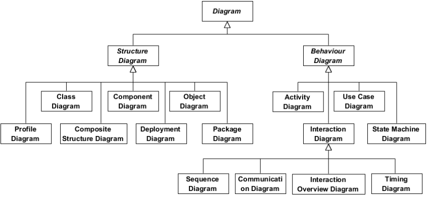

# UML

Official spec: https://www.omg.org/spec/UML/2.5.1/About-UML

The Unified Modeling Language (UML) was created to forge a common, semantically and syntactically rich visual modeling language for the architecture, design, and implementation of complex software systems both structurally and behaviorally.

We have several stakeholder interested in software development:

- Analyst
- Designer
- Coder
- Tester
- QA Engineer
- Customer
- Technical Author

But each of them requires different viewpoint.

System development focuses on three overall different system models:

- Functional:  These are Use Case diagrams, which describe system functionality from the point of view of the user.

- Object: These are Class Diagrams, which describe the structure of the system in terms of objects, attributes, associations, and operations.

- Dynamic: Interaction Diagrams, State Machine Diagrams, and Activity Diagrams are used to describe the internal behavior of the system.

That's why UML has so many Diagrams.

Structure Diagrams show statics structure of a system. 

- **Class Diagram** - Describers types of objects in the system and their static relationships in an OOP manner.
- **Component Diagram** - Shows complex system as a set of components, which communicate using defined interfaces.
- **Object Diagram** - Shows an instance of a class with real-world values as attributes and relationships with other classes instances. A peek at a system at given time.
- **Profile Diagram** - 
- **Composite Structure Diagram** - Shows an internal structure of a class.
- **Deployment Diagram** - Illustrates system hardware and its software. Used when software is deployed across multiple machines.
- **Package Diagram** - Shows organization and arrangement of various UML model elements in the form of packages. Great to show the architecture of a system.

Behavior Diagrams show dynamic behavior of objects in a system.

- **Activity Diagram** - shows a business or operational workflow (as opposed to BPMN used more in software design context)
- **Use Case Diagram** - shows a particular use case to illustrate how functionality works
- **State Machine Diagram** - shows possible states of an objects
- **Sequence Diagram** - shows how objects interact with each other and the order of occurrence. They represent interactions for a particular scenario.
- **Communication Diagram** - shows which objects connect with which ones
- **Interaction Overview Diagram** - its a high-level diagram which can be used to navigate between Interaction Diagrams
- **Timing Diagram** - shows how much time objects spends in what states

## Structure Diagrams

### Class Diagram

Describers types of objects in the system and their static relationships in an OOP manner.

https://www.visual-paradigm.com/guide/uml-unified-modeling-language/what-is-class-diagram/

https://www.lucidchart.com/pages/uml-class-diagram?usecase=uml

### Component Diagram

https://www.visual-paradigm.com/guide/uml-unified-modeling-language/what-is-component-diagram/

https://www.lucidchart.com/pages/uml-component-diagram?usecase=uml

### Object Diagram

https://www.visual-paradigm.com/guide/uml-unified-modeling-language/what-is-object-diagram/

https://www.lucidchart.com/pages/uml-object-diagram?usecase=uml

### Profile Diagram

https://www.visual-paradigm.com/guide/uml-unified-modeling-language/what-is-profile-diagram/

### Composite Structure Diagram

https://www.visual-paradigm.com/guide/uml-unified-modeling-language/what-is-composite-structure-diagram/

https://www.lucidchart.com/pages/uml-composite-structure-diagram?usecase=uml

### Deployment Diagram

https://www.visual-paradigm.com/guide/uml-unified-modeling-language/what-is-deployment-diagram/

https://www.lucidchart.com/pages/uml-deployment-diagram?usecase=uml

### Package Diagram

https://www.visual-paradigm.com/guide/uml-unified-modeling-language/what-is-package-diagram/

https://www.lucidchart.com/pages/uml-package-diagram?usecase=uml

## Behavior Diagrams

### Activity Diagram

https://www.visual-paradigm.com/guide/uml-unified-modeling-language/what-is-activity-diagram/

https://www.lucidchart.com/pages/uml-activity-diagram?usecase=uml

### Use Case Diagram

https://www.visual-paradigm.com/guide/uml-unified-modeling-language/what-is-use-case-diagram/

https://www.lucidchart.com/pages/uml-use-case-diagram?usecase=uml

### State Machine Diagram

https://www.visual-paradigm.com/guide/uml-unified-modeling-language/what-is-state-machine-diagram/

https://www.lucidchart.com/pages/uml-state-machine-diagram?usecase=uml

### Sequence Diagram

https://www.visual-paradigm.com/guide/uml-unified-modeling-language/what-is-sequence-diagram/

https://www.lucidchart.com/pages/uml-sequence-diagram?usecase=uml

### Communication Diagram

https://www.visual-paradigm.com/guide/uml-unified-modeling-language/what-is-communication-diagram/

https://www.lucidchart.com/pages/uml-communication-diagram?usecase=uml

### Interaction Overview Diagram

https://www.visual-paradigm.com/guide/uml-unified-modeling-language/what-is-interaction-overview-diagram/

https://www.lucidchart.com/pages/uml-interaction-diagram?usecase=uml

### Timing Diagram

https://www.visual-paradigm.com/guide/uml-unified-modeling-language/what-is-timing-diagram/

https://www.lucidchart.com/pages/uml-timing-diagram?usecase=uml