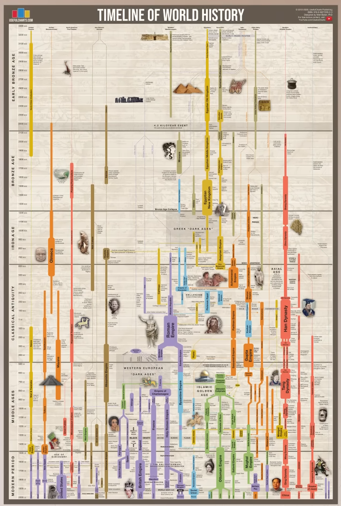
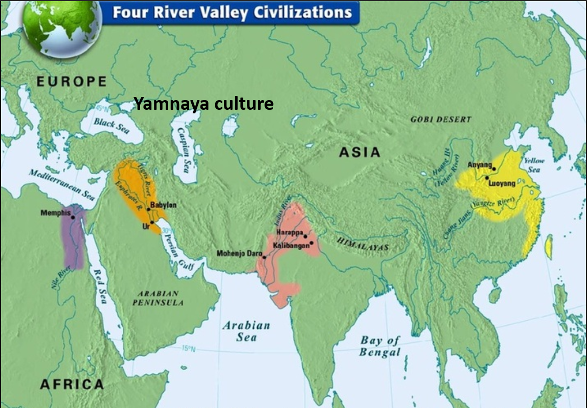

# 0 The starting point

The starting point is this YouTube video -> https://youtu.be/__BaaMfiD0Q?si=Mx1aH9sbeq13QOeI.

And this map:

The chart is equidistant, on the OY axis we have increasing time. On the OX axis we have a different parts of the world.
- Americas (Far left)
- Africa
- Europe
- Asia
- Pacific Islands (Far right)

Every line symbolizes a specific culutre, civilization or empire and the widht of the line represents importance of that culture compared to other culutres in the same time perdios.  

BC and AD:
- BC - Before Christ
- AD - Anno Domini (latin. *in the year of the lord*) - so simply how old the Jesus would be in that year

BCE and CE:
- BCE - Before Common Era
- CE - Common Era

There was no year 0!!! After year 1 BCE a year 1 CE was next.

Ok, so here is the full map

## Full map

The year 3300 BCE is a starting point because, this is approx when writing first appeared. And without written records we can't speak of a **history**. That's why everything before the emergence of writing systems is categorized as **prehistory** and basically a human prehistory goes back to the 200,000 BCE (a start of the [Stone Age](https://en.wikipedia.org/wiki/Stone_Age)). 

We have 6 ages:
- Early Bronze Age
- Bronze Age
- Iron Age
- Classical Antiquity
- Middle Ages
- Modern Period

Let's go one by one.

## Early bronze age

Humans for the first time make things out of bronze and around the same time they develop writing. Actually, it occured in 3 areas:
- Egyptian Old Kingdom
- Sumerian Civilization
- Indus Valley Civilization

Thos were the 3 great [civilizations](https://en.wikipedia.org/wiki/Civilization) of that time. 

But also a [Yamnaya culture](https://en.wikipedia.org/wiki/Yamnaya_culture) were present at that time. They didn't develop a civilizations yet but due to the [Indo-European migrations](https://en.wikipedia.org/wiki/Indo-European_migrations) they gave the foundation for latter civilization (all of the people that today sepak the Indo-European language family) so it is worth to add them at that point. 

Egyptians spoke the egypthian, an afroasiatic language. Summer spoke the summer language (an isolated language, not associated with any of the nowadays knwon families). Indus Valley people spoke some unknown language (since we still decipher their writing system). We may hipotetize that it was propably some proto-dravidian language. 

And the steppe poeple of Yamnaya culture spoke proto-indo-european language. 

> So the Indus Valley civilization after its fall left its people with its language, but when in 2000-1500 BCE Indo-Europeans (becoming Indo-Aryans) migrate to the India peninsula they mix with them, but as the stronger people they force their language (the [sanscrit](https://en.wikipedia.org/wiki/Sanskrit)) to be the official/elite one.     And also even though Indo-Aryans dominate, the majority of later population are genetically the descendants of Indus Valley people.

Summerians during the bronze age developed:
- the wheel
- the plow
- the sail 
- some astronomy
- some mathematics 

In the Egypt it was the time when the great pyramides of Giza were built.

These 3 civilization had large cities and all that stuff that was uimaginable e.g. for steppe people. 

The only other civilization besides them that also had large cities was a [Norte Chico Civilization](https://en.wikipedia.org/wiki/Caral%E2%80%93Supe_civilization) civilization in what is today Peru. But strangely they appear to have no writing system and no pottery.  

We also know that all of these 3 [river valley civilizations](https://archi-monarch.com/river-valley-civilizations/) were trading between each other. 

