# 7 000 000 BCE

- https://youtu.be/IcdRkeTb6gM?si=7TfT-kcXe4fWeEVD
- https://youtu.be/-6Wu0Q7x5D0?si=9lYqQTuERbSX0GjZ 

- [Epic of Gilgamesh](https://en.wikipedia.org/wiki/Epic_of_Gilgamesh)
    - [Text](https://uruk-warka.dk/Gilgamish/The%20Epic%20of%20Gilgamesh.pdf)
- [Enūma Eliš PL](https://pl.wikipedia.org/wiki/Enuma_elisz)
- [Enūma Eliš ENG](https://en.wikipedia.org/wiki/En%C5%ABma_Eli%C5%A1)
- Atra-Hasis
- [Book of Sirach](https://en.wikipedia.org/wiki/Book_of_Sirach)
- [Timeline of human evolution](https://en.wikipedia.org/wiki/Timeline_of_human_evolution)
- [Seven Million Years of Human Evolution #datavisualization](https://youtu.be/DZv8VyIQ7YU?si=uYOqdqF40bF1RONk)

# 7,000,000 BCE

# 5,000,000 BCE
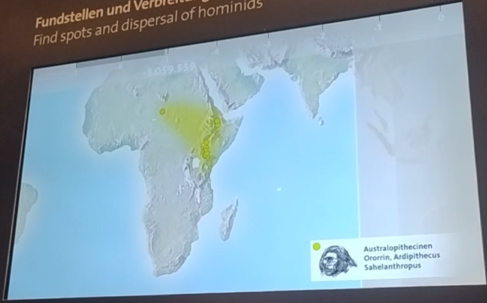
# 4,000,000 BCE
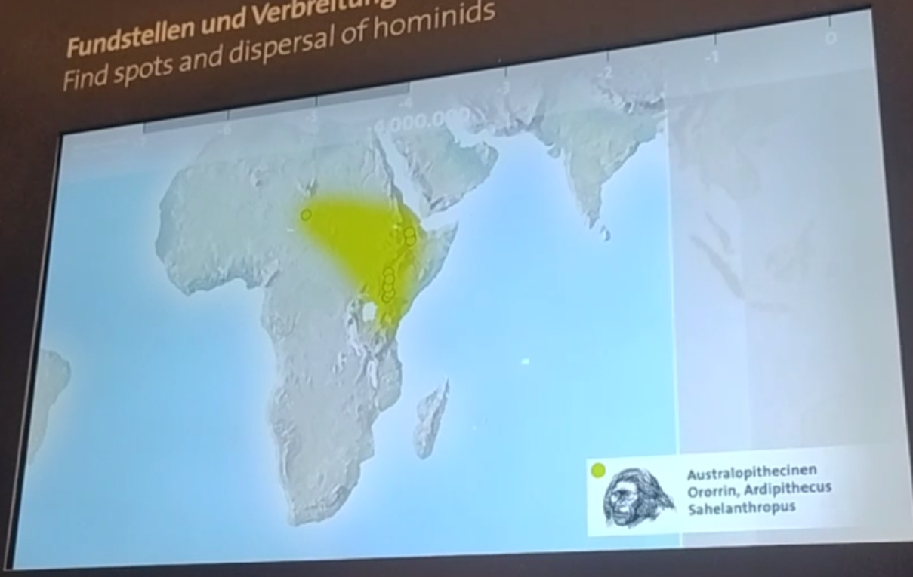
# 3,000,000 BCE
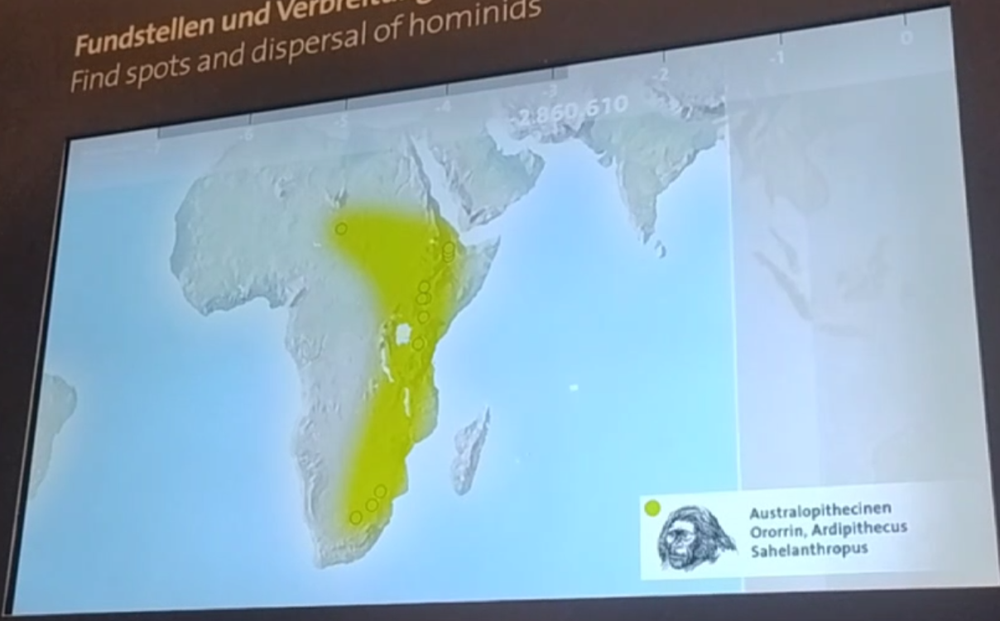
# 2,500,000 BCE
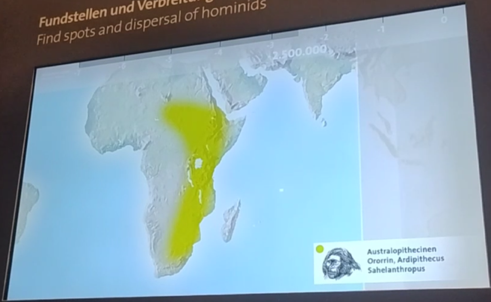
# 2,300,000 BCE

# 2,000,000 BCE

# 1,700,000 BCE
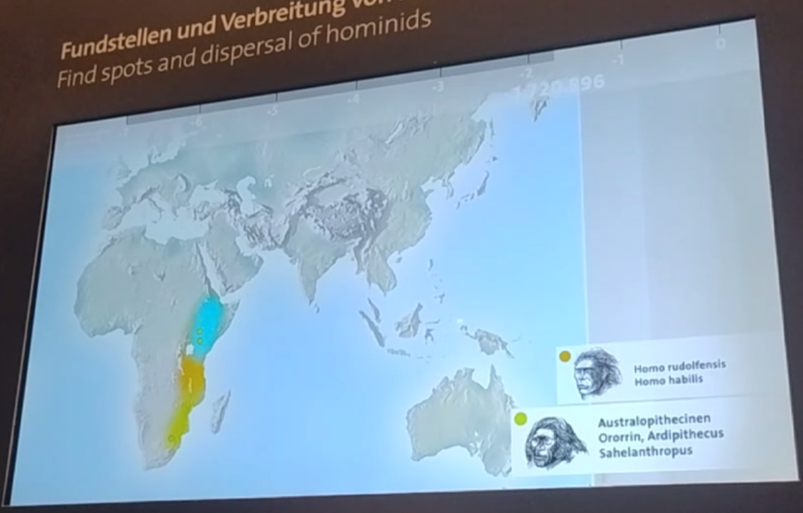
# 1,600,000 BCE

# 1,400,000 BCE

# 1,000,000 BCE

# 900,000 BCE

# 800,000 BCE
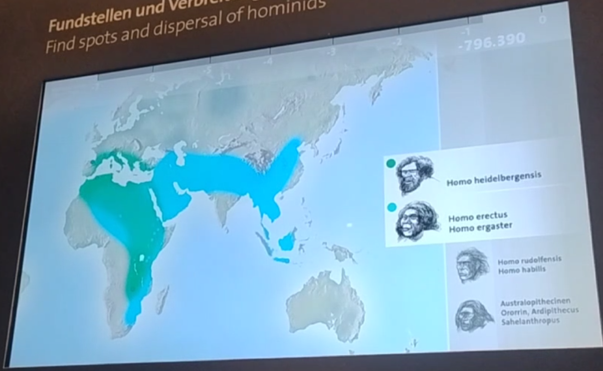
# 600,000 BCE

# 500,000 BCE
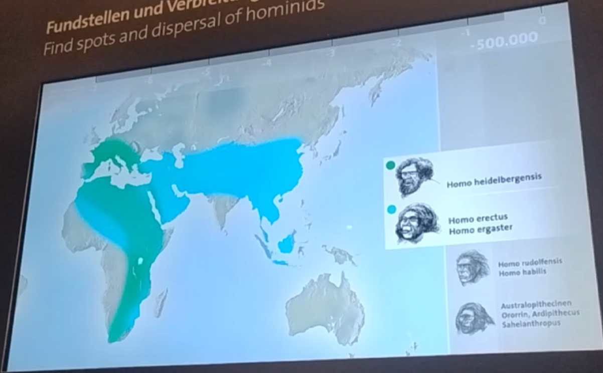
# 400,000 BCE

# 300,000 BCE

# 200,000 BCE

# 190,000 BCE
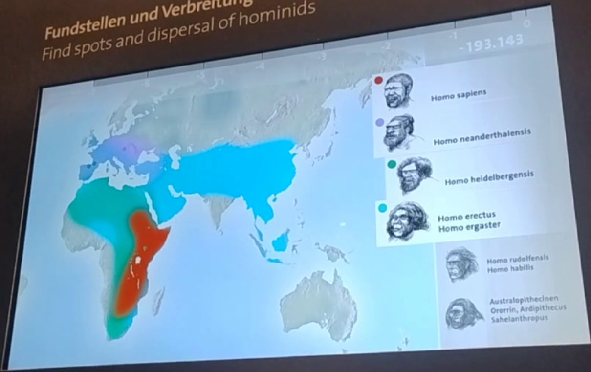
# 170,000 BCE
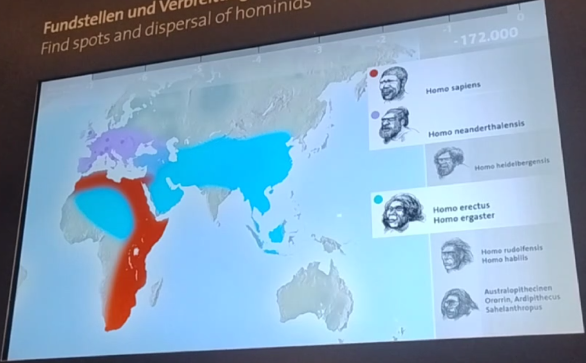
# 130,000 BCE

# 100,000 BCE

# 50,000 BCE
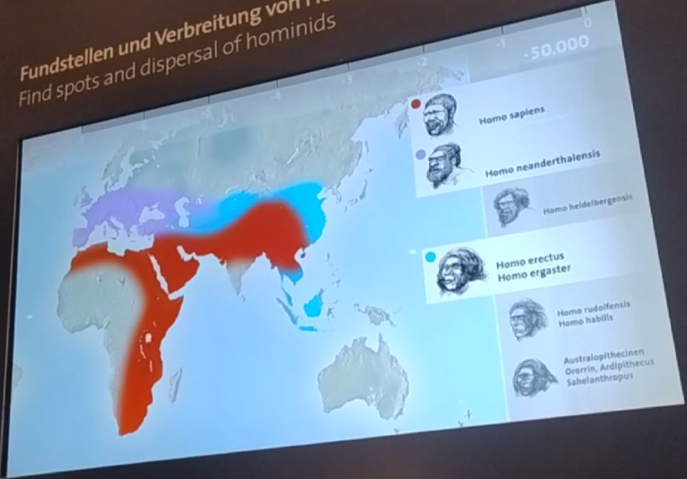
# 47,000 BCE
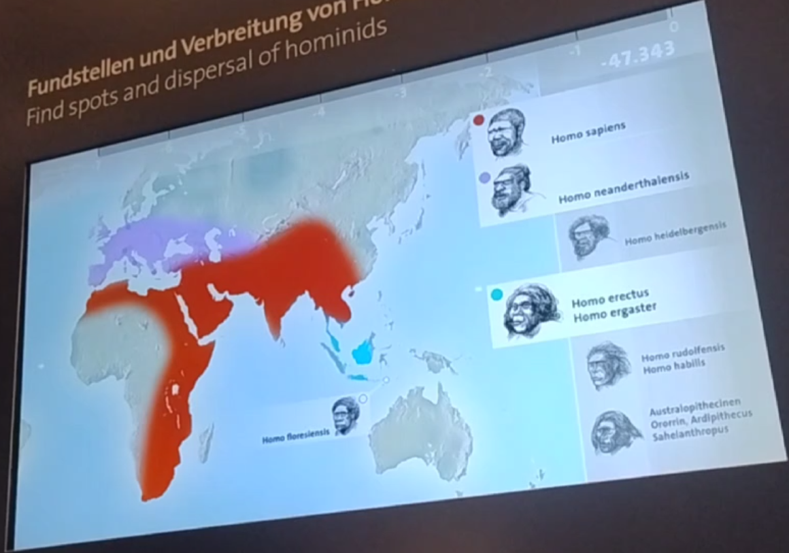
# 40,000 BCE

# 33,000 BCE
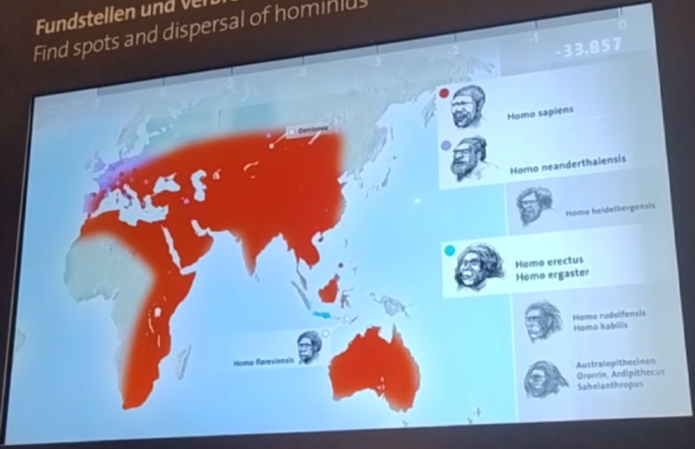
# 28,000 BCE

# 25,000 BCE
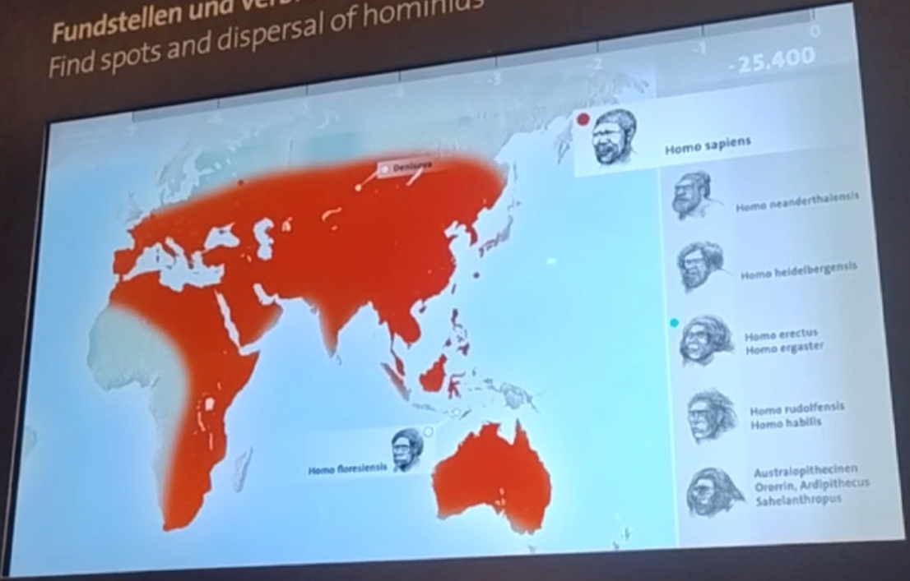
# 20,000 BCE

# 17,000 BCE
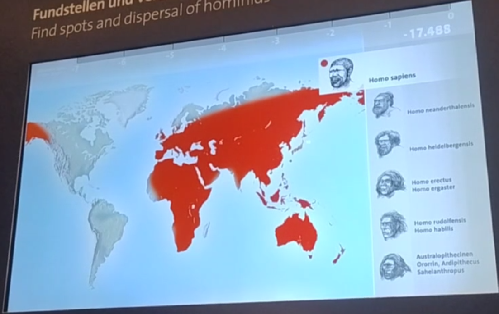
# 14,000 BCE

# 10,000 BCE

# 5,000 BCE

# 2,000 BCE
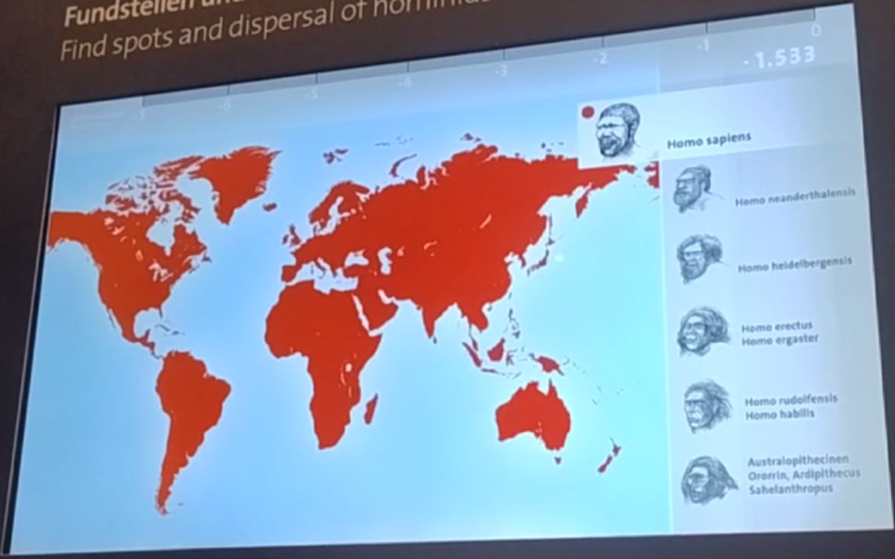
