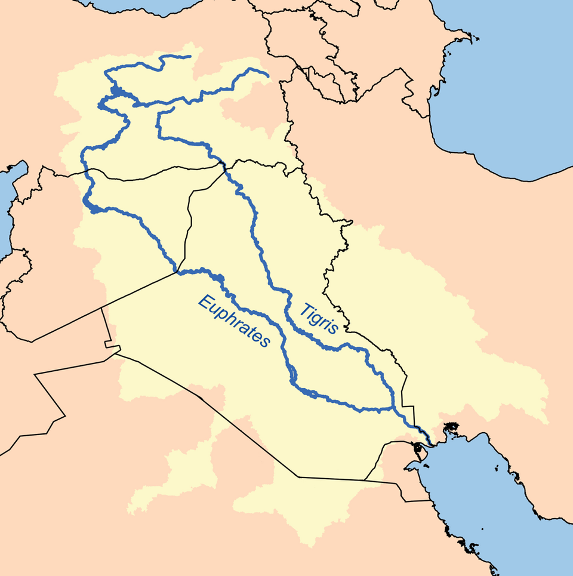

# Rulers

## Sumer

Ok 4100 BCE do Mezopotamii przybyli Sumerowie. Na całym tym obszarze mieszkały wtedy koczownicze ludy semickie. Sumerowie ich zastali jako przybysze. Ale no teren był duży, więc nie było im ciasno. Sumerowie z racji dużo wyższego poziomu rozwiniętej kultury dominowali semitów. Zaczęli uprawiać ziemię. 

Oprócz antropologii Sumerów nieznana jest również ich asymilacja z pierwotnymi Semitami. Najprawdopodobniej przybysze pokojowo zasymilowali się z gospodarzami, a dzięki znacznie wyższemu stopniowi kultury, łatwo osiągnęli przewagę w dolnej Mezopotamii (zwanej przez Semitów Sumerem).

To co na tym terenie było przed tymi wydarzeniami nazywamy [Okresem Ubajd](https://pl.wikipedia.org/wiki/Okres_Ubajd) ([Ubaid Period](https://en.wikipedia.org/wiki/Ubaid_period)) //TODO - było to od 6200 - 3700 BCE. 

Ludność ubajdzka wznosiła prostokątne domy z suszonej cegły, których centralnym punktem był dziedziniec. Domostwa miały prawie 200 m² powierzchni. Pojawiają się pierwsze świątynie stojące na platformach metrowej wysokości. Zmarłych chowano na cmentarzyskach w jednostkowych grobach, wyposażając nieboszczyków w biżuterię, ceramikę i żywność. Również w tym okresie opanowano sztukę nawadniania pól na większą skalę poprzez budowę skomplikowanej sieci kanałów - pozwoliło to na zagospodarowanie znacznej części nieużytków na terenach pustynnych, a to z kolei było jednym z czynników przyspieszających bardzo szybki rozwój społeczeństwa.

No tak, więc nagle przybyła tam ludność, która było nieco bardziej rozwinięta kulturowo od lokalnych semitów. Możliwe, że przybyli oni zza gór [Zagros](https://en.wikipedia.org/wiki/Zagros_Mountains), albo z Tybetu albo z Indus Valley? A może jakieś wspólne korzenie mają oba te ludy?

