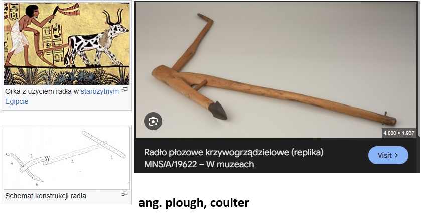

- [Radło](https://pl.wikipedia.org/wiki/Rad%C5%82o) - służące do spulchniania gleby bez jej odwracania, zastąpiło to motykę. W Polsce używano tego aż do 12w, kiedy zastąpione zostało przez [Sochę](https://pl.wikipedia.org/wiki/Socha) a potem [Pług](https://pl.wikipedia.org/wiki/P%C5%82ug).

- []

