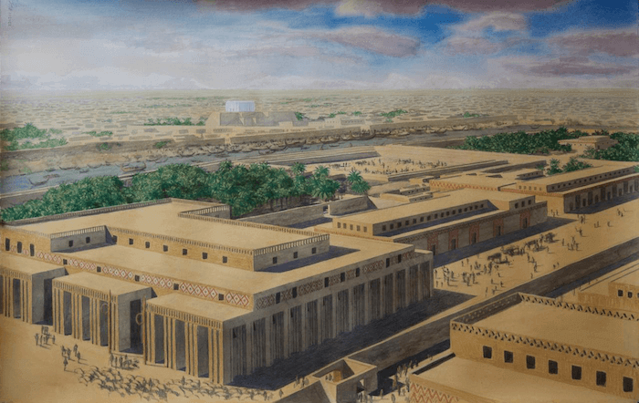

# Rulers

## Sumer

Okres 4300-3000 BCE nazywa się [okresem Uruk](https://pl.wikipedia.org/wiki/Okres_Uruk) ([Uruk Period](https://en.wikipedia.org/wiki/Uruk_period)) //TODO tu jest duzo

W porównaniu do poprzedniego okresu ([Ubajd](https://en.wikipedia.org/wiki/Ubaid_period)) kulturę Uruk cechuje przede wszystkim bezprecedensowy rozwój techniki i urbanizacji południowej Mezopotamii. Do najważniejszych innowacji technicznych należały: wynalazek [radła](https://pl.wikipedia.org/wiki/Rad%C5%82o), które zastąpiło motykę, szybkoobrotowego koła garncarskiego, zastosowanie koła do transportu w konstrukcji pierwszych wozów czterokołowych, a także rozpoczęcie wytopu miedzi. Jednakże najważniejszym wynalazkiem w tym okresie było pismo, które gwarantowało i było wręcz niezbędne do sprawnego funkcjonowania i dalszego rozwoju nowoczesnego miasta-państwa, a także całej cywilizacji. 

Pismo to jest to, co tworzy switch między prehistorią, a historią. Do tej pory wszystkie znane nam kultury to były tzw. [kultury archeologiczne](https://pl.wikipedia.org/wiki/Kultura_archeologiczna), od kiedy mamy do czynienia z pismem, to możemy mówi o historii.

Jego pierwsze zabytki, w postaci tabliczek ze znakami piktograficznymi, datowane na ok. 3300–3200 p.n.e., odkryto w Uruk w ruinach świątyni. Nie jest możliwe stwierdzenie, w jakim języku są spisane owe tabliczki, gdyż ich piktograficzny charakter uniemożliwia identyfikację językową. Opierając się na założeniu, że to Sumerowie byli twórcami kultury Uruk to najprawdopodobniej te najstarsze zabytki piśmiennictwa zapisane były w języku sumeryjskim.

### Demografia

Znaczny wzrost urbanizacji południowej Mezopotamii wynikał przede wszystkim ze wzrostu demograficznego ludności tego regionu, a to zjawisko z kolei było efektem z jednej strony sprzyjających warunków bytowania (i co za tym idzie większego przyrostu naturalnego niż w okresach poprzednich) oraz znacznego napływu nowej ludności koczowniczej z północy i wschodu na tereny Mezopotamii. Ludność napływowa, przyciągnięta być może korzyściami z uprawy nawadnianych pól już w okresie Ubajd, osiedlała się głównie przy biegu rzek (Eufrat i Tygrys), wokół starszych ośrodków osadniczych kultury Ubajd (które już od dawna były ośrodkami handlowymi i kultowymi) oraz tworzyła zupełnie nowe osiedla.

### Architektura

W stosunku do poprzedniego okresu (Ubajd) zmieniła się architektura i zabudowa miasta – w jego centralnym miejscu stała świątynia, jako budowla już znacznie bardziej okazała, która stała się ośrodkiem administracyjnym miasta i okolic. Miała ona zazwyczaj wydłużony kształt litery ‘T’ z długą centralna nawą. Ściany dekorowano zwykle techniką tzw. mozaiki ćwiekowej (inaczej zwaną mozaiką sztyftową) w różne wzory geometryczne. Podstawowym budulcem obiektów mieszkalnych i świątyń była glina, z której, zwłaszcza pod koniec okresu Uruk, wykonywano suszone cegły, formowane ręcznie w kształcie wydłużonych sztabek. Obok cegieł stosowano także importowany wapień.

Zastosowanie metalu – miedzi – ograniczało się tylko do potrzeb użytkowych, czyli wyrobu toporów, grotów strzał itp.

### Miasta kultury Uruk

Do największych miast tego okresu należały m.in.: Uruk, Ur i Lagasz – wszystkie one były centralnymi ośrodkami lokalnych systemów irygacyjnych, a także polityczno-ekonomiczno-religijnymi. Uruk panowało nad osiedlami różnego typu o charakterze typowo wiejskim, jak i bardziej miejskim. O wiele większego znaczenia, niż w poprzednim okresie, nabrały kontakty handlowe z odległymi miastami na terenie Mezopotamii (np. Niniwa) i na wybrzeżu Morza Śródziemnego (Byblos).

*source: https://ancientmesopotamia.org/cultures/uruk-period*

Miast było 13, każde ok 10k ludności, największe było Uruk, osiągnęło szczytowe 50k w okresie [Jemset-Nasr](https://en.wikipedia.org/wiki/Jemdet_Nasr_period). Każde z miast miało swojego Boga.

### Miasta-Państwa

Sumerowie stworzyli pierwsze w świecie formy państwowości. Każde ich miasto było oddzielnym, niezależnym państwem. Każde miało własnego władcę. Społeczeństwo ich miało hierarchię i podział ról. Jedni uprawiali ziemię, czy budowali; inni rządzili. Sumerowie zbudowali sztuczne kanały, które nawadniały suche tereny. Teraz rolnicy mogli uprawiać ziemię tam, gdzie kiedyś nie było to możliwe.

Pismo juz stawało się coraz mniej obrazkowe w Jemset-Nasr. 

Pisali na glinianych tabliczkach o powierzchni najczęściej 25 centymetrów kwadratowych. Znaki wyciskali w glinie za pomocą rylca. Pismo Sumerów było obrazkowe, to znaczy każdy znak był ideogramem – oznaczał cały wyraz. Pisane wówczas teksty miały przede wszystkim charakter praktyczny. Spisywano żywy inwentarz i narzędzia rolne, pisemnie ustalano podział produktów rolnych i wytworów rzemiosła. Zapisywano liczby: kreski oznaczały jedności, a koła dziesiątki. Pisano również listy. List dostarczał posłaniec i odczytywał go, adresatowi. Zdarzało się, że na jednej tabliczce pisano kilka listów do różnych osób. List zaczynał się słowami: "Mów do tego a tego: oto co rzecze ten a ten".

Religia Sumerów była politeistyczna. Bogów widzieli w siłach przyrody, czyli upersonifikowali je. Wierzyli, że bogowie tworzą arystokrację Wszechświata, a ludzie są niewolnikami pracującymi dla nich.

Sumerowie nieustannie byli nękani najazdami nomadów z zachodniej pustyni. Mniej więcej w tym okresie, na północ od Sumeru nad Tygrysem osiadły plemiona koczownicze mówiące w języku semickim. Wybudowali miasto [Aszur](https://pl.wikipedia.org/wiki/Aszur_(miasto)).