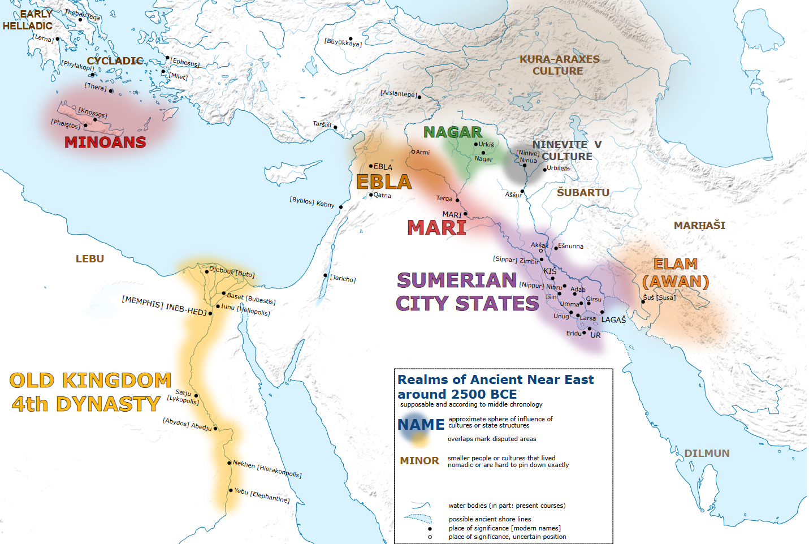
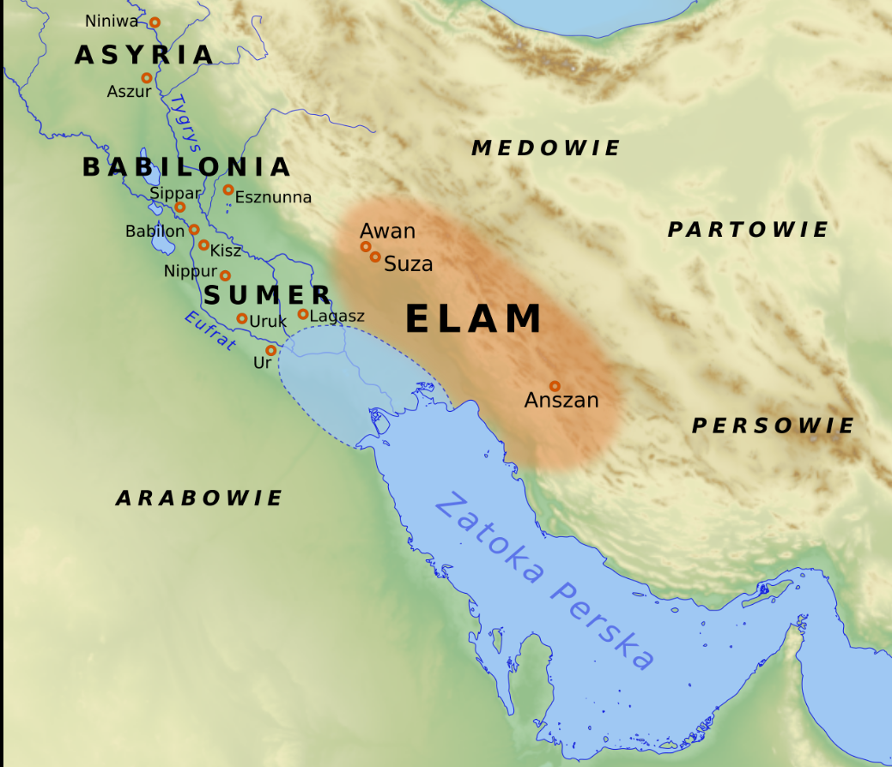
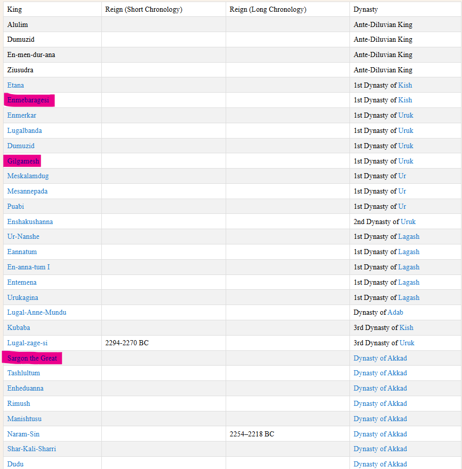
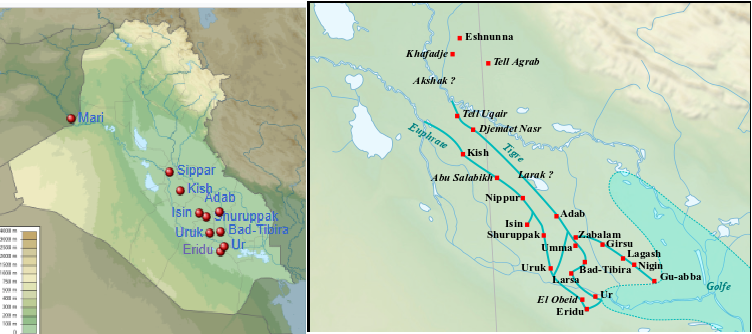

# Rulers

## Sumer

Tu mamy ztw. [Okres wczesnodynastyczny (ok. 2900–2350 p.n.e.)](https://pl.wikipedia.org/wiki/Sumer). Możemy go podzielić na 3 części. O 1 i 2 wiemy mało, a o 3 już sporo.

Opis historii tego okresu możemy zacząć właściwie od pierwszego, historycznie potwierdzonego władcy jakim był [Enmebaragesi](https://pl.wikipedia.org/wiki/Enmebaragesi) (ok. 2700 r. p.n.e.), władca Kisz. Powszechnie uznaje się go założycielem I Dynastii z Kisz. Wszystkie dostępne źródła potwierdzają dominującą rolę Kisz w świecie Sumeryjskim w 3000-2000 BCE. Enmebaragesi kontrolował [Nippur](https://pl.wikipedia.org/wiki/Nippur), które było powszechnie uważane za stolicę wszystkich Sumerów ze względu na liczne obiekty religijne znajdujące się w tym mieście takie jak świątynia głównego boga Sumerów – [Enlila](https://pl.wikipedia.org/wiki/Enlil). Ten kto kontrolował Kisz, kontrolował cały Sumer. Enme-baragesi toczył zwycięskie wojny z [Elamem](https://pl.wikipedia.org/wiki/Elam), jednak nie wiemy (z powodu niewielu inskrypcji) czy się tylko bronił, czy występował w roli agresora.

Drugim głównym ośrodkiem politycznym ówczesnego Sumeru było miasto Uruk. Rządziła wtedy tam I Dynastia z Uruk a zdecydowanie jej najwspanialszym przedstawicielem był [Gilgamesz](https://pl.wikipedia.org/wiki/Gilgamesz). Był to władca który prowadził liczne wojny ze wspomnianym wyżej miastem Kisz. Pokonał syna Enmebaragesi o imieniu Agga. Jednocześnie przejął kontrolę nad Nippur przez co Uruk urosło w randze politycznej. Jednocześnie pokonanie Kisz spowodowało zatrzymanie ekspansji tego miasta. Mimo tego zwycięstwa nie możemy mówić o jakiejkolwiek stabilizacji politycznej w tym okresie. Historycy argumentują ten fakt tym, iż większość państw-miast budowało w tym czasie potężne mury obronne. Świadczyło to o zagrożeniu ze strony sąsiadów lub barbarzyńskich ludów północy (semici jak np. Amoryci).

*[Sumerrian king list*](https://en.wikipedia.org/wiki/Sumerian_King_List)

W tym momencie kończy się słabo znajoma nam historia I i II części okresu wczesnodynastycznego. Historię tego okresu warto zacząć od miasta Lagasz, które doszło do swej potęgi dzięki dynastii [Ur-Nansze](https://pl.wikipedia.org/wiki/Ur-Nansze). Należy dodać tutaj, iż Lagasz* właściwie przez cały czas swego istnienia toczyło liczne boje z miastem Umma. Tematem sporów były zapewne żyzne gleby przygraniczne. Wprawdzie nie pierwszym, ale **najwybitniejszym** przedstawicielem dynastii Ur-Nansze był [Eanatum](https://pl.wikipedia.org/wiki/Eanatum) (ok. 2450 r. p.n.e.). Nie tylko rozgromił on Ummę, ale podporządkował sobie większość terenów Sumeru nie wyłączając Nippur i samego Kisz. Jego wojska dotarły nawet pod Marii.

> *Lagasz, a raczej Ur-Nansze, prowadziło w tamtym czasie handel z doliną Indusu.

Z niewiadomych przyczyn (prawdopodobnie z powodu śmierci władcy) imperium Eanatuma rozpadło się a rolę hegemona sumeryjskiego przejął przedstawiciel [I dynastii z Ur](https://pl.wikipedia.org/wiki/I_dynastia_z_Ur) – [Mesannepadda](https://pl.wikipedia.org/wiki/Mesanepada). W tym okresie możemy mówić o osłabieniu każdej władzy, za sprawą umacniania się semickich ludów Akadów. Prawdopodobnie fala najazdów tego ludu wstrząsnęła tamtejszymi strukturami państwowymi. To oczywiste i bezpośrednie zagrożenie zmusiło władców poszczególnych miast do zawarcia sojuszów. Zrobili to po raz pierwszy **(w historii świata)** królowie [Entemena](https://pl.wikipedia.org/wiki/Enmetena) z Lagasz oraz Lugal-kinisze-dudu z Ur. Nie był to jednak zwykły sojusz militarny. Porozumienie to dzieliło strefy wpływów oraz potwierdzało wzajemną pomoc wobec każdego agresora zewnętrznego.

Około 2370 r. p.n.e. rolę hegemona Sumeru przejął ummyjski władca Lugalzagesi (ok. 2375–2350 r. p.n.e.), który za wszelką cenę chciał pokonać odwiecznego wroga, jakim był Lagasz rządzone przez Urukaginę. Miał jednak również inny cel, znacznie ambitniejszy. Chciał zjednoczyć wszystkie miasta Sumeru (pod wodzą Ummy), aby wszystkie państwa przeciwstawiły się nowemu wrogowi, jakim byli Akadowie. Doznał katastrofalnej klęski i ugiął się pod naporem wojsk akadyjskich [Sargona](https://pl.wikipedia.org/wiki/Sargon_Wielki). Zwycięstwo Sargona Akadyjskiego (2350–2210 r. p.n.e.) było całkowite. Lugalzagesi skończył w pohańbieniu, uwiązany do bram świątyni Enlila w Nippur. Zdobyte zostały Uruk, Ur, Lagasz, Umma, a ich mury zniszczone. Inne miasta zapewne poddały się bez walki. Stolicę przeniesiono do nowo utworzonego miasta Akad, a Sumer od tego momentu stał się Sumero-Akadem. W ten sposób zakończył się okres wczesnodynastyczny, a tym samym rozpoczął się okres staroakadyjski.

W ten sposób powstało [Imperium Akadyjskie](https://pl.wikipedia.org/wiki/Imperium_akadyjskie).

