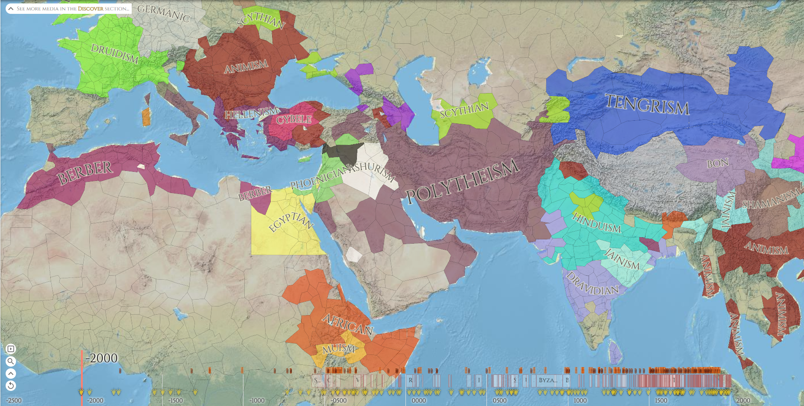
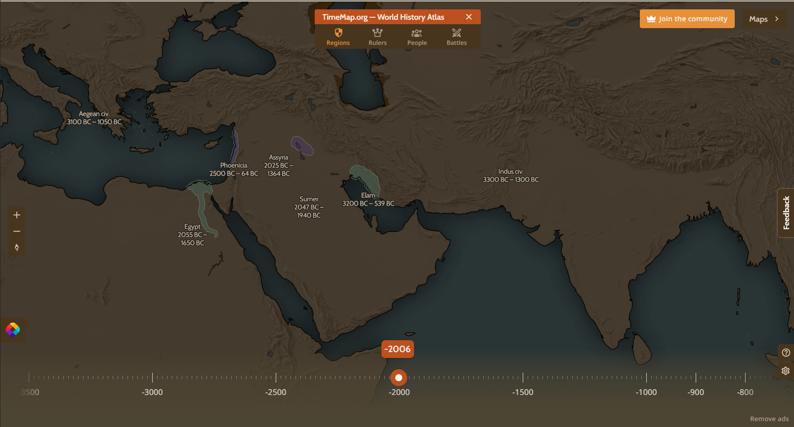
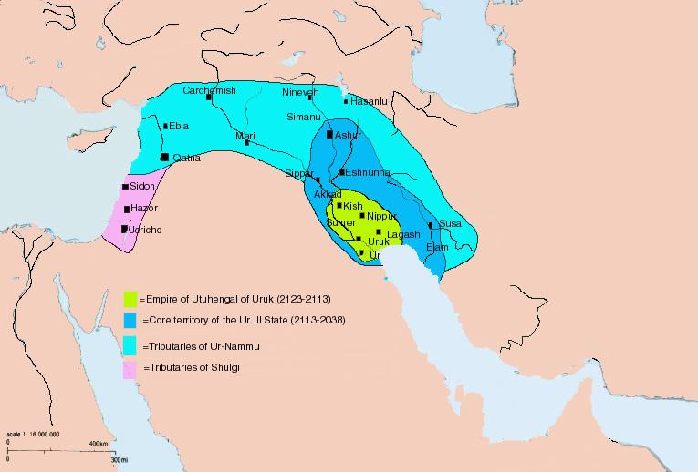
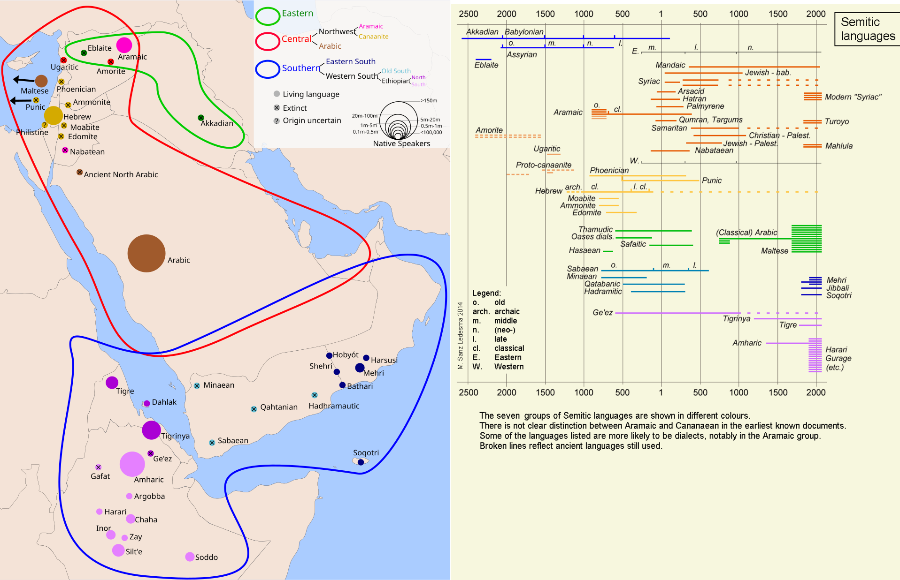

# Rulers

# Culture

# Religion

# Civilizations

## Sumer

Na tym terenie był [Okres staroakadyjski i gutejski (2350–2120 p.n.e.)](https://pl.wikipedia.org/wiki/Sumer#Okres_neosumeryjski_(2120%E2%80%932005_p.n.e.)).

[Sumer](https://en.wikipedia.org/wiki/Sumer)

[History of Sumer](https://en.wikipedia.org/wiki/History_of_Sumer)

**Okres staroakadyjski (2350–2210 p.n.e.)**

Sargon po podbiciu Sumeru stworzył [wielkie imperium](https://pl.wikipedia.org/wiki/Imperium_akadyjskie), które rozciągało się od Zatoki Perskiej po północną Mezopotamię. Mimo dość rozpowszechnionej propagandy, która ukazywała go jako wielkiego, sprawiedliwego i miłującego pokój władcę, podbite tereny sumeryjskie tylko czekały na zrzucenie jarzma tyrana. Po jego śmierci władzę przejęli dwaj synowie [Sargona Akadyjskiego](https://en.wikipedia.org/wiki/Sargon_of_Akkad) o imionach [Rimusza](https://pl.wikipedia.org/wiki/Rimusz) i [Manisztusu](https://pl.wikipedia.org/wiki/Manisztusu). Jednak ich panowanie tylko kompromitowało pierwszego króla Sumero – Akadu. Stracili większość dziedzictwa ojca za sprawą licznych buntów miast sumeryjskich. Najpierw Rimusza utracił liczne tereny północne imperium, a po wstąpieniu na tron jego brata, czyli Man-isztusu, odłączył się również podbity za Sargona [Elam](https://pl.wikipedia.org/wiki/Elam) (Elam to późniejsza Persja).

Odrodzenia imperium dokonał wnuk Sargona Akadyjskiego o imieniu [Naram-Sin](https://pl.wikipedia.org/wiki/Naram-Sin_z_Akadu) (2270–2235 r. p.n.e.). Jego panowaniu przypisywany jest wielki bunt, który wybuchł w południowym Sumerze. Zbuntowały się prawie wszystkie miasta pod przywództwem króla Uruk, jakim był w tym okresie Mamor-girida oraz króla Kisz noszący imię Iphur-Kisz. Walki trwały kilka lat, ale bunt stłumiono. Naram-sin nie tylko ponownie podporządkował sobie tereny buntownicze, ale zdobył również ważny rejon, jakim był Chabur.

Już za panowania Naram-sina poważnym zagrożeniem stały się ludy [Gutejczyków](https://en.wikipedia.org/wiki/Gutians) i [Lulubejów](https://en.wikipedia.org/wiki/Lullubi) z gór Zagros, które pustoszyły północne tereny Sumero-Akadu. Mimo wielu zwycięstw wielkiego władcy, liczne bitwy zostały nierozstrzygnięte i były to pierwsze przejawy schyłku państwa. Władzę po Naram-sinie przejął Szar-kali-szarri, który utrzymał tereny imperium tylko na początku swego panowania. Atakowany ze wszystkich stron przez Elamitów, koczownicze plemiona [Amorytów](https://pl.wikipedia.org/wiki/Amoryci) oraz ludy Zagrosu, Gutejczyków i Lulubajów uległ potędze wroga a kraj pogrążył się w ruinie na blisko 100 lat. Miało to miejsce w roku 2210 p.n.e.

**Okres gutejski (2210–2120 p.n.e.)**

Okres gutejski to prawdziwe ciemne wieki w historii Sumero-Akadu. Władzę objęli głównie Gutejczycy i Lulubajowie, zachowując typowo koczowniczy, lub półkoczowniczy tryb życia. Zadowalali się głównie daninami oraz łupami które zdobywali podczas regularnych najazdów na miasta byłego Sumero-Akadu. Sumeryjska Lista Królów wspomina o 21 królach barbarzyńskich. Najszybciej odrodziło się miasto Lagasz, dzięki swemu trudno dostępnemu położeniu. Prawdopodobnie nigdy nie zaznało obecności Gutejczyków na swym terytorium. W połowie XXII w. p.n.e. do władzy doszła tam lokalna II dynastia której najwspanialszym przedstawicielem był Gudea (2144–2124 r. p.n.e.). Uznał on zwierzchnictwo Gutejczyków i za ich zgodą zjednoczył południowy Sumer w tym Uruk, Ur, Eridu, Larsę i Zabalam. Doprowadził do rozkwitu gospodarczego podległych mu terytoriów. Jego panowanie było pierwszym przejawem "renesansu sumeryjskiego". Jednak to nie on ostatecznie wypędził wrogie ludy. Zrobił to [Utuhengal](https://pl.wikipedia.org/wiki/Utuhengal), król uniezależnionego Uruk, założyciel i jedyny przedstawiciel IV dynastii. Zebrał wielką armię i stopniowo wypędzał barbarzyńców z Sumero-Akadu aż do ostatecznego zwycięstwa.

**[Okres neosumeryjski (2120–2005 p.n.e.)](https://pl.wikipedia.org/wiki/Sumer#Okres_neosumeryjski_(2120%E2%80%932005_p.n.e.))**

W roku 2113 p.n.e. władca z Uruk został obalony przez swojego gubernatora (//TODO) z Ur, [Ur-Nammu](https://pl.wikipedia.org/wiki/Ur-Nammu), który następnie, głównie drogą dyplomatyczną, podporządkował sobie cały Sumero-Akad. Oficjalnym bogiem państwa stał się bóg księżyca – [Suen](https://pl.wikipedia.org/wiki/Nanna_(b%C3%B3g)). Odbudowano struktury administracyjne oraz system irygacyjny i prawo.

Postać tego króla musiała być bardzo istotna w czasach gutejskich, gdyż dopiero w jego czasach sporządzono pierwszą wersję Sumeryjskiej listy królów jako programowego tekstu ideologicznego. Niewiele wiemy o podbojach Ur-Nammu. Jednak pewne jest, że pokonał [Utuhengala](https://pl.wikipedia.org/wiki/Utuhengal) oraz głównego rywala, jakim był [Nammahani](https://pl.wikipedia.org/wiki/Nammahani) z Lagasz. Podporządkował sobie cały Sumero-Akad oraz przejął wpływy i kontakty handlowe po następcach Gudei. 

Jednak prawdziwym twórcą potęgi [III dynastii z Ur](https://www.swartzentrover.com/cotor/bible/timelines/Babylon/Ur.htm) był [Szulgi](https://pl.wikipedia.org/wiki/Szulgi) (2095–2048 r. p.n.e.). Podbił on całą Mezopotamię oraz Elam. Dotarł nawet do Zatoki Perskiej. Doprowadził do perfekcji system zarządzania prowincjami i ziemią. Rdzeniem państwa był Sumero-Akad, a na terenach prowincji rządzili namiestnicy (ensi) w imieniu króla. Armią dowodzili dostojnicy wojskowi (szagina). Za panowania Ur-Nammu państwo urosło do roli wielkiego imperium, jednak już jego następcy borykali się z wielkimi problemami, takimi jak rozwiązłość i kosztowność systemu administracyjnego. 

Do tego ogromnym problemem stało się utrzymanie odległych prowincji, w których lokalni namiestnicy uzurpowali sobie władzę starając się odłączyć od rdzenia państwa. Prawdziwym problemem jednak były koczownicze ludy [Amorytów](https://pl.wikipedia.org/wiki/Amoryci), Hurytów i Elamitów regularnie atakujących prowincje imperium.

 Katastrofalne apogeum osiągnięto za panowania [Ibbi-Suena](https://pl.wikipedia.org/wiki/Ibbi-Suen) (2029–2005 r. p.n.e.). Już na początku jego rządów amoryccy najeźdźcy przerwali główny pas umocnień zwany „murem przeciw Amorytom” wdzierając się do samego Sumero-Akadu. Chciano utrzymać władzę nadając najeźdźcom liczne tytuły z namiestnikami prowincji włącznie. Nic to nie dało i barbarzyńskie ludy spustoszyły większość miast imperium. Ostatni król sumeryjski został prawdopodobnie uprowadzony, a wraz z nim w bezpowrotną przeszłość odeszła cała epoka w dziejach Mezopotamii. **Skończył się czas Sumerów.**

 Chwilę później spisano [Lament nad upadkiem Ur](https://pl.wikipedia.org/wiki/Lament_nad_upadkiem_Ur), zdając sobie już wtedy sprawę z przełomu.

 Przemiany polityczne nie spowodowały upadku kulturalnego oraz ekonomicznego. **Amoryci**, w odróżnieniu od barbarzyńców z okresu gutejskiego, **szybko zasymilowali się** z ludnością podbitego imperium. **Przejęli** ich **język, pismo** a wymieszawszy kulturę sumeryjską ze swoją przyczynili się do jej rozkwitu.

> Na mapie wyżej jesteśmy na lini roku 2000 BCE.

I tak o to się domyka ten okres. A no i w 2200 BCE był [4.2-kiloyear event](https://en.wikipedia.org/wiki/4.2-kiloyear_event). Susza trwała od 2200 BCE do 2100 BCE, co też mogło przyczynić się do upadku Imperium Akadyjskiego. Państwo, oparte na gromadzeniu nadwyżki z plonów, wcale nie było już mocniejsze skoro nadwyżej nie było. Zamiast harmonii wygrywali koczowniczy i tak już Gutejowie, którzy w takich warunkach radzili sobie spoko.

//TODO https://en.wikipedia.org/wiki/Assyria (Teraz można opowiedzieć od strony Assyrian Empire).