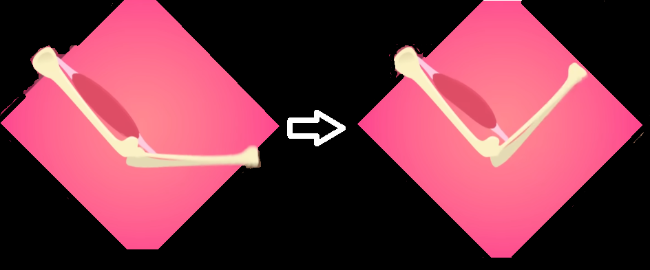
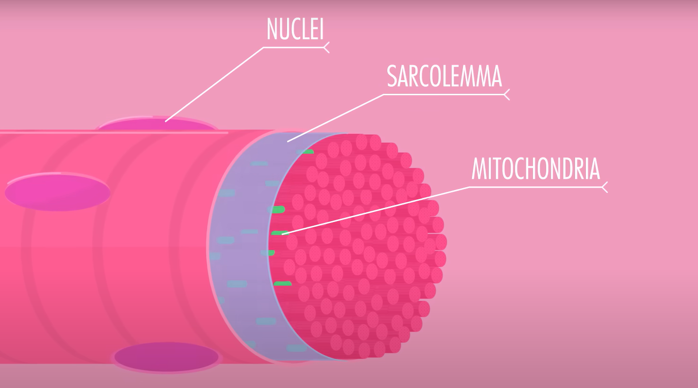
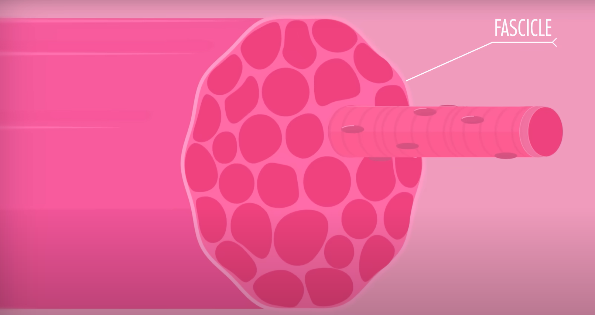

Najpierw CrashCourse o miesniach

Potem ten gość https://youtu.be/-_LBtX9kw4E?si=PGOzMqmkArIxJfG6 o ruchu

Tu mozesz zaznaczac miesnie https://youtu.be/p0wr1rXtwSI?si=

Na szkielecie zaznacz stawy.

# Crash course part 1

Muscles, like Romeo and Juliet, got their own famous coupling - pair of tiny [**protein strands**](https://en.wikipedia.org/wiki/Protein_secondary_structure) called **actin** and **myosin**. 

**Protein strand** - more accurately referred to as a polypeptide chain, is a linear sequence of amino acids linked together by peptide bonds. Proteins are large, complex molecules that play many critical roles in the body.

**Actin** - Actin is a highly conserved and ubiquitous protein that plays a critical role in various cellular functions, particularly in the cytoskeleton, muscle contraction, and cell motility. Muscle Contraction: In muscle cells, actin works closely with myosin, another protein, to facilitate muscle contraction. Actin filaments (thin filaments) and myosin filaments (thick filaments) slide past each other in a process powered by ATP hydrolysis, leading to muscle shortening and force generation.

**myosin** - Myosin is a type of motor protein that interacts with actin filaments to generate force and movement in cells. It is essential for many cellular processes, including muscle contraction, cell motility, and intracellular transport. Muscle Contraction: In muscle cells, myosin II interacts with actin filaments to produce contraction. The heads of myosin bind to actin, undergo a power stroke driven by ATP hydrolysis, and slide the actin filaments past the myosin filaments. This sliding filament mechanism shortens the muscle, generating force and movement.

## Muscles tissues

We have three types of muscle tissue:
- smooth
- cardiac
- skeletal

### Smooth
Found in walls of all your hollow visceral organs like stomach, bowels, airways and blood vessels, where it involuntarily* pushes fluid and other material around by contacting and relaxing over and over. They are smooth, contain no striations*.

> involuntarily - odruchowo, mimowolnie, nieumyślnie
> striations - prążki

### Cardiac

Found in hearth, also involuntarily pumping your blood. They are striated.

### Skeletal muscles

Also striated like cardiac muscles, but they are mostly voluntary, meaning you have to think about using them and activate them with your [somatic nervous system](somatic-nervous-system.md).

Most of them are attached to your skeleton and create movement by pulling bones in different directions as they **contract**. 

## Skeletal muscle
Each of your different skeletal muscle (like biceps brachii) is technically its own organ, made up:
- mostly of muslce tissue, but also of
- [connective tissue](https://en.wikipedia.org/wiki/Connective_tissue),
- blood vessels and 
- nerve fibers.

Each one is rigged up with <u> its own personal nerve </u> to stimulate **contaction** and its own artery and vein to feed it with the blood (oxygen and nutrients) it needs to operate.

> artery - tętnica
> vein - żyła
> vessel - naczynie, pojemnik

### Anatomy

Muscle is a sturdy piece of rope.

Thousands of tiny, pararell threads called **myofibrils** squich together to form **muscle fiber**.

Which are your actual muscle cells, cells with mitochondira, mutliple nuclei and a ceullular membrane called a sarcolemma.

Those muslce fibers then form a larger, string like bundle called **fascicles**, 

which combine to form the larger rope like muscle organ like your biceps brachii.

And also every muscle contains a few different kinds of supportive sheats of connective tissue.

The entire muscle is wrapped in a layer of a dense connective tissue called the **epimysium** (greek for “upon the muscle”).

Within that muscle, the fascicles are surrounded by the **perimysium**, a layer of fibrous connective tissue (meaning “around the muscle.”)

The third, innermost layer is the **endomysium** which surrounds and reinforces every muscle fiber.

## Two rules about proteins

They are both true for a lot of proteins like enzymes or ion channels or receptors or muscle proteins.

### Rule 1
Proteins like to change shape when stuff binds to them

### Rule 2
Changing shapes can allow proteins to bind or unbind with other stuff 

## Sarcomeres

Myofibrils are divided lenghtwise into segments called **sarcomeres**, which contain  two even tinier strainds of protein -- two different kinds of **myofilaments** called **actin** and **myosin**.

A sarcomere contains both thin filaments made up mostyl of two light and twisty actin strainds and thick filaments, composed of thicker, lumpy-looking myosin strands.

Each sarcomere is separated by a **Z line** at either end, which just a border formed by alternating thin filamnets in a king of zig zag pattern.

> It's the repeating pattern of overlapping filaments in lots of sarcomeres that gives skeletal and cardiac muscle tissue that striated, or striped, appearance.
> Actin and Myosin are also players in smooth and cardiac muscle tissue, though the control and organization of the filaments and fibers is different.

A muscle contracting is all about sarcomeres bringing thos Z-Line closer together.

## The sliding filament model of muscle contraction 

When relaxed actin is blocked by **tropomyosin** and **troponin** which keeps in the way.

Luckily, these guards can be bought off with a little [ATP](atp.md) and some calcium.

ATP contains chemical energy, and your muscles are all about converting chemical energy into mechanical one (motion)

Muscle cells have a lot of nuclei but some of them also have mitochondria, whose sole purpose in life is to crank out ATP.

Muscle cells also have their own version of an **endoplasmic reticulum** (a transport and storage system of a cell) called **sarcoplasmic reticulum**.

Its walls are loaded with calcium pumps which use ATP to save up a bunch of calcium ions. And it's also studded with calcium channels that are linked to voltage-sensitive proteins in the membrane of a muscle cell.

> pump (physiology) - an active transport mechanism in living cells by which specific ions are moved through the cell membrane against a concentration gradient.
> studded - nabite

## Let's say I wanna move my arm

My brain sends action potential along the motor neuron until its synapses with a muscle cell in my arm. The receptors on that muscle cell are ligant-gated sodium channels, so when motor neuron  releases acetylcholine into the synapse, the channels open up and create a rush of sodium into the cell as a graded potential, which, if is strong enough, causes nearby voltage-gated sodium channels to open.  

This action potential zips along a muscle cells membrane, the sarcolemma, which has lots of tubes that run inside the cells, called T-Tubules.

When the action potential travels down one of thos tubes, it eventually triggers the voltage-sensitive proteins that are linked to thos calcium channels on the cell's sarcoplasmic reticulum.

So now the calcium stored inside rushes into the rest of the cell.

Troponin just loves to bind with calcium and by rule 1, it changes shape. So the calcium latches on to the troponin and causes it to pull the tropomysoin away from the sites on the actin strands.

Myosin heads that can bind to those newly exposed sites are ready for action. But the only ones that have already grabbed a molecule of ATP that's been floating around, and then broken it down into ADP and the leftover phosphate.

When myosin head does that it moves into an extended position, kinda like stretched spring, holding on to the ADP and phophate, and still storing the energy that was released when they were broken apart. 

So after all that, with the myosin ready for action and actin sites being exposed the myosin releases all that energy by changing shape.

It pulls on its actin strand, kind of like pulling a rope hand of the fist.

And in the process it shrinks the whole sarcomere and contracts the muscle.

Now, with its energy spent  that little head has no use for ADP and the phosphate so it unbinds with it because remember rule 2.

That unbinding result in a small change in myosin head shape which lets a fresh ATP binds there in its place

That binding generates another change in shape but this time it releases myosin from the actin.

And meanwhile, those calcium pumps are working hard to restock the calcium in the sarcoplasmic reticulum, so they start grabbing the calcium that's floating around, causing calcium to unbind from the troponin. When it unbinds the resulting shape-change puts the tropomyosin back into place

And here we are again in relaxed position.

# Part 2

We notice two things about muscles:
- 1. They never push, they always pull
- 2. Whatever one muscle does, another muscle can undo

##
1. Most skeletal muscles extend over joints to connect to at least 2 bones (that's why they're skeletal).

When a muscle contracts the bone that moves is called the **muscle's insertion point**. And the muscle brings the insertion point to the bone that doesn't move (or at least moves less) and that's called the **muscle's origin**.

It has to be this way, muscles cannot extend themselves beyond their resting state to push a bone away from it, so even though push ups push you up off the ground, its your muscles actually pulling their insertion bones toward their origin bones. 

And in case of pushups its like this.

## Functional Muscles Groups

We can classify them into 4 groups depending on the movement being performed:
- **Prime movers (agonist muscles)** - mainly responsible for producing a certain movement 
- **Antagonists** - working in reverse of movements made by prime movers by staying relaxed or stretching or contracting just enough to keep those prime movers from over-extending.
- **Synergists** - help the prime movers lending a little extra oomph stabilizing joints against discolation
- **Fixators**

The functional groups are in scope of a movement. Let's take jacks* for an example.

> jacks - pajacyki

When doing jacks we have two kinds of movement:
- adduction - which in general brings a limb toward the body
- abduction - which in general moves a limb away from the body

