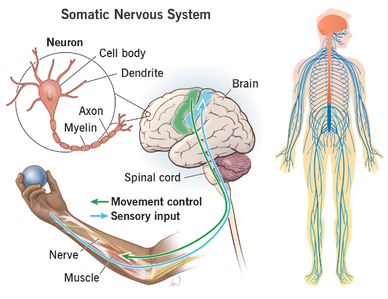

The somatic nervous system (SNS) is a part of the peripheral nervous system associated with voluntary control of body movements through the action of skeletal muscles. It is responsible for the reception of external stimuli and the execution of motor commands. Here’s an in-depth look at the somatic nervous system:

### Structure of the Somatic Nervous System

1. **Sensory (Afferent) Neurons**:
    - **Function**: Sensory neurons transmit information from sensory receptors in the skin, muscles, and joints to the central nervous system (CNS).
    - **Pathway**: Sensory information is carried from the periphery to the spinal cord and brain through dorsal root ganglia and cranial nerves.

2. **Motor (Efferent) Neurons**:
    - **Function**: Motor neurons convey signals from the CNS to skeletal muscles, facilitating voluntary movements.
    - **Pathway**: Motor signals travel from the brain or spinal cord to the muscles via ventral root nerves and cranial nerves.

### Components of the Somatic Nervous System

1. **Cranial Nerves**: Twelve pairs of nerves that emerge directly from the brain, some of which are involved in somatic functions like movement of the eyes (oculomotor nerve) and facial expressions (facial nerve).

2. **Spinal Nerves**: Thirty-one pairs of nerves that emerge from the spinal cord, each serving a specific region of the body. Each spinal nerve has both sensory and motor components.

3. **Neuromuscular Junction**: The synapse or junction between a motor neuron and a skeletal muscle fiber. It is where the motor neuron transmits a signal to the muscle fiber to initiate contraction.

### Functions of the Somatic Nervous System

1. **Voluntary Movement Control**:
    - The primary function of the SNS is to control voluntary movements of skeletal muscles. This involves the coordination of motor signals from the brain to the appropriate muscles to perform actions such as walking, grabbing, and talking.

2. **Reflex Arcs**:
    - Reflexes are automatic, involuntary responses to stimuli. Simple reflex arcs, such as the knee-jerk reflex, involve sensory input directly triggering motor output without involving the brain. This allows for rapid responses to potentially harmful stimuli.

3. **Sensory Perception**:
    - The SNS is responsible for processing sensory information from the external environment, including touch, pain, temperature, and proprioception (sense of body position and movement). This information is sent to the CNS for interpretation and appropriate response.

### Pathways in the Somatic Nervous System

1. **Motor Pathways**:
    - **Corticospinal Tract**: The primary pathway for voluntary motor control. It runs from the cerebral cortex to the spinal cord, where it synapses with motor neurons that control skeletal muscles.
    - **Extrapyramidal Tracts**: These pathways, which include the basal ganglia and cerebellum, are involved in the coordination and modulation of movement.

2. **Sensory Pathways**:
    - **Dorsal Column-Medial Lemniscal Pathway**: Carries fine touch, vibration, and proprioceptive information to the brain.
    - **Spinothalamic Tract**: Transmits pain, temperature, and crude touch sensations to the brain.

### Disorders of the Somatic Nervous System

1. **Neuropathies**: Conditions that result from damage to the peripheral nerves, leading to symptoms like numbness, tingling, and muscle weakness. Diabetes and physical trauma are common causes.

2. **Motor Neuron Diseases**: Conditions like amyotrophic lateral sclerosis (ALS) affect the motor neurons, leading to progressive muscle weakness and atrophy.

3. **Muscular Dystrophies**: A group of genetic disorders that cause progressive weakness and degeneration of skeletal muscles.

4. **Myasthenia Gravis**: An autoimmune disorder that affects the neuromuscular junction, leading to muscle weakness and fatigue.

In summary, the somatic nervous system is a critical component of the nervous system responsible for voluntary control of skeletal muscles and the transmission of sensory information from the body to the CNS. It involves complex networks of neurons and pathways that enable movement, sensory perception, and reflex actions.

