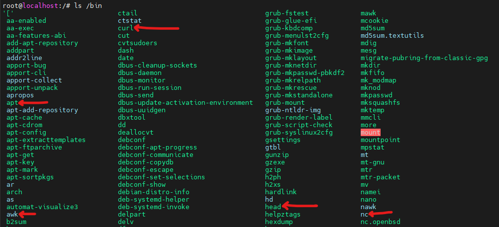
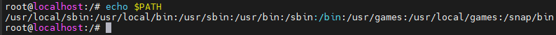

# Filesystem Hierarchy Standard

https://en.wikipedia.org/wiki/Filesystem_Hierarchy_Standard

https://refspecs.linuxfoundation.org/FHS_3.0/fhs/index.html

## Intro

It is possible to define two independent distinctions among files: shareable vs. unshareable and variable vs. static. In general, files that differ in either of these respects should be located in different directories. This makes it easy to store files with different usage characteristics on different filesystems.

**Shareable** files are thos that can be stored on one host and used on other hosts. They are not host-specific. For example, the files in user home directiories are shareable, whereas [device lock files](https://en.wikipedia.org/wiki/File_locking) are not. 

**Static** files include binaries, libraries, documentation files and other files that do not change without system administrator intervention.

> **File mounting** is the process of making a file system accessible to a computer by attaching it to a specific location in the directory structure. This means you "mount" a disk, partition, or remote resource (like a network share) so that its contents appear as part of the main file system. For example, when you plug in an external hard drive, the system mounts it so you can access its files through the file explorer. E.g. you can plug in USB memory with configured name `kingston_data_traveler` and Linux will mount its contest under `/media/<username>/kingston_data_traveler`.

Shareable files can be stored on one host and used on several others. Typically, however, not all files in the filesystem hierarchy are shareable and so each system has local storage containing at least its unshareable files.

Static and variable files should be segregated because static files, unlike variable files, can be stored on read-only media and do not need to be backed up on the same schedule as variable files.

Historical UNIX-like filesystem hierarchies contained both static and variable files under both `/usr` and `/etc`. In order to realize the advantages mentioned above, the `/var` hierarchy was created and all variable files were transferred from `/usr` to `/var`. Consequently `/usr` can now be mounted read-only (if it is a separate filesystem). Variable files have been transferred from `/etc` to `/var` over a longer period as technology has permitted.

|             | shareable           | unshareable      |
|-------------|---------------------|------------------|
| **static**  | /usr                | /etc             |
|             | /opt                | /boot            |
| **variable**| /var/mail           | /var/run         |
|             | /var/spool/news     | /var/lock        |

## ToC

There is:
- [The Root Filesystem](#the-root-filesystem)
- [The `/usr` Hierarchy](#the-usr-hierarchy)
- [The `/var` Hierarchy](#the-var-hierarchy)

## The Root Filesystem

Purpose: 
The contents of the root filesystem must be adequate to boot, restore, recover, and/or repair the system.

Requirements: 
- [`bin`](#bin)	Essential command binaries
- [`boot`](#boot)	Static files of the boot loader
- [`dev`](#dev)	Device files
- [`etc`](#etc)	Host-specific system configuration
- [`lib`](#lib)	Essential shared libraries and kernel modules
- [`media`](#media)	Mount point for removable media
- [`mnt`](#mnt)	Mount point for mounting a filesystem temporarily
- [`opt`](#opt)	Add-on application software packages
- [`run`](#run)	Data relevant to running processes
- [`sbin`](#sbin)	Essential system binaries
- [`srv`](#srv)	Data for services provided by this system
- [`tmp`](#tmp)	Temporary files
- [`usr`](#usr)	Secondary hierarchy
- [`var`](#var)	Variable data
Specific Options: 
- [`home`](#home) User home directories (optional)
- [`lib<qual`](#lib<qual>) Alternate format essential shared libraries (optional)
- [`root`](#root) Home directory for the root user (optional)

### `bin`
Essential user command binaries (for use by all users)

[Purpose: ](https://refspecs.linuxfoundation.org/FHS_3.0/fhs/ch03s04.html)
`/bin` contains commands that may be used by both the system administrator and by users, but which are required when no other filesystems are mounted (e.g. in single user mode).

Essential command binaries that need to be available in single-user mode, including to bring up the system or repair it,[3] for all users (e.g., cat, ls, cp).

Here are the programs like `ls`, `cat` etc...

Some facts:
- In modern Linux distros it tends to be symbolically linked to `usr/bin`.
- It cannot contain any 
- It is included in PATH 
    - 

> A **symbolic link** (symlink) in Linux is a special file that acts as a pointer to another file or directory. It allows you to create a reference to another location, making it easier to access files and directories from different places in the filesystem. Unlike hard links, symlinks can link to directories and files across different file systems. When you access a symlink, the system follows the reference to the actual file or directory.

> When a directory is included in the **PATH**, it means that the system will search that directory for executable files when you run a command. By adding directories to the PATH, you make it easier to run programs without specifying their full path. It helps you quickly execute commands by just typing the command name, and the system will automatically find the executable in one of the listed directories.

### `boot`
Static files of the boot loader

[Purpose:](https://refspecs.linuxfoundation.org/FHS_3.0/fhs/ch03s05.html) 
This directory contains everything required for the boot process except configuration files not needed at boot time and the map installer. Thus /boot stores data that is used before the kernel begins executing user-mode programs. This may include saved master boot sectors and sector map files.

[Boot loader](https://en.wikipedia.org/wiki/Bootloader) files (e.g., [kernels](https://en.wikipedia.org/wiki/Kernel_(operating_system)), [initrd](https://en.wikipedia.org/wiki/Initial_ramdisk)).

### `dev`
Device files

[Purpose](https://refspecs.linuxfoundation.org/FHS_3.0/fhs/ch03s06.html): 
The /dev directory is the location of special or device files.

[Device files](https://en.wikipedia.org/wiki/Device_file) (e.g., /dev/null, /dev/disk0, /dev/sda1, /dev/tty, /dev/random).

Some facts:
- These files are dynamically created based on various physical and virtual devices that are connected to your system
- "Everything is a file"
- This is typically an area that applications and drivers will access and is rarely a user should be dabbling in

### `etc`
Host-specific system configuration

[Purpose](https://refspecs.linuxfoundation.org/FHS_3.0/fhs/ch03s07.html): 
The /etc hierarchy contains configuration files. A "configuration file" is a local file used to control the operation of a program; it must be static and cannot be an executable binary.
It is recommended that files be stored in subdirectories of /etc rather than directly in /etc.

| File              | Description                                                   |
|-------------------|---------------------------------------------------------------|
| csh.login         | Systemwide initialization file for C shell logins (optional)  |
| exports           | NFS filesystem access control list (optional)                |
| fstab             | Static information about filesystems (optional)              |
| ftpusers          | FTP daemon user access control list (optional)               |
| gateways          | File which lists gateways for routed (optional)              |
| gettydefs         | Speed and terminal settings used by getty (optional)         |
| group             | User group file (optional)                                   |
| host.conf         | Resolver configuration file (optional)                       |
| hosts             | Static information about host names (optional)               |
| hosts.allow       | Host access file for TCP wrappers (optional)                 |
| hosts.deny        | Host access file for TCP wrappers (optional)                 |
| hosts.equiv       | List of trusted hosts for rlogin, rsh, rcp (optional)        |
| hosts.lpd         | List of trusted hosts for lpd (optional)                     |
| inetd.conf        | Configuration file for inetd (optional)                      |
| inittab           | Configuration file for init (optional)                       |
| issue             | Pre-login message and identification file (optional)        |
| ld.so.conf        | List of extra directories to search for shared libraries (optional) |
| motd              | Post-login message of the day file (optional)                |
| mtab              | Dynamic information about filesystems (optional)             |
| mtools.conf       | Configuration file for mtools (optional)                     |
| networks          | Static information about network names (optional)            |
| passwd            | The password file (optional)                                 |
| printcap          | The lpd printer capability database (optional)               |
| profile           | Systemwide initialization file for sh shell logins (optional)|
| protocols         | IP protocol listing (optional)                               |
| resolv.conf       | Resolver configuration file (optional)                       |
| rpc               | RPC protocol listing (optional)                              |
| securetty         | TTY access control for root login (optional)                 |
| services          | Port names for network services (optional)                   |
| shells            | Pathnames of valid login shells (optional)                   |
| syslog.conf       | Configuration file for syslogd (optional)                    |

Some facts:
- There has been controversy over the meaning of the name here. I will just accept "Edit To Configure".
- As Linux admin you will spend most time here
- Here are configurations that are system-wide, in contrary to use wide stored in their home directories
- e.g. `apt` has its direction here with `sources.list` file
 

### `home`
User home directories (optional)

[Purpose](https://refspecs.linuxfoundation.org/FHS_3.0/fhs/ch03s08.html) 
/home is a fairly standard concept, but it is clearly a site-specific filesystem. The setup will differ from host to host. Therefore, no program should assume any specific location for a home directory, rather it should query for it.

Users' [home directories](https://en.wikipedia.org/wiki/Home_directory), containing saved files, personal settings, etc.

Some facts:
- User specific configuration files for applications are stored in the user's home directory in a file that starts with the '.' character (a "dot file"). E.g. `.ssh` or `.bashrc`

### `lib`
Essential shared libraries and kernel modules.

Libraries essential for the binaries in /bin and /sbin.

[Purpose](https://refspecs.linuxfoundation.org/FHS_3.0/fhs/ch03s09.html): 
The /lib directory contains those shared library images needed to boot the system and run the commands in the root filesystem, ie. by binaries in /bin and /sbin.

At least one of each of the following filename patterns are required (they may be files, or symbolic links):
| File        | Description                                               |
|-------------|-----------------------------------------------------------|
| libc.so.*   | The dynamically-linked C library (optional)               |
| ld*         | The execution time linker/loader (optional)               |

### `lib<qual>`
There may be one or more variants of the /lib directory on systems which support more than one binary format requiring separate libraries.

Alternate format essential libraries. These are typically used on systems that support more than one executable code format, such as systems supporting 32-bit and 64-bit versions of an instruction set. Such directories are optional, but if they exist, they have some requirements.

> Programs labeled as **32-bit** or **64-bit** refer to the architecture of the processor and the way the program handles data. A **32-bit program** can use a maximum of 4 GB of RAM and works on 32-bit processors, while a **64-bit program** can access much more memory (theoretically up to 18.4 million TB) and runs on 64-bit processors. The difference impacts performance, especially when handling large amounts of data or running complex applications.

> A 32-bit process uses 32 bits of data per instruction, while  a 64-bit process uses 64 bits of data.

### `media`
Mount point for removable media

[Purpose](https://refspecs.linuxfoundation.org/FHS_3.0/fhs/ch03s11.html): 
This directory contains subdirectories which are used as mount points for removable media such as floppy disks, cdroms and zip disks.

Mount points for [removable media](https://en.wikipedia.org/wiki/Removable_media) such as CD-ROMs.

### `mnt`
Mount point for a temporarily mounted filesystem

[Purpose](https://refspecs.linuxfoundation.org/FHS_3.0/fhs/ch03s12.html) :
This directory is provided so that the system administrator may temporarily mount a filesystem as needed. The content of this directory is a local issue and should not affect the manner in which any program is run.

Some facts:
- For example if you want temporarily attach a network storage server to archive some files this is typically where you mount it.
- Here you mount manually, while `media` serves as the directory for automatic mount done by the Operating System

### `opt`
Add-on application software packages

[Purpose](https://refspecs.linuxfoundation.org/FHS_3.0/fhs/ch03s13.html): 
/opt is reserved for the installation of add-on application software packages. 

A package to be installed in /opt must locate its static files in a separate /opt/<package> or /opt/<provider> directory tree, where <package> is a name that describes the software package and <provider> is the provider's LANANA registered name.

Add-on [application software](https://en.wikipedia.org/wiki/Application_software) packages.

Some facts:
- optional folder
- manually installed software from vendors resides here (e.g. drivers for printer)
- this is also a place where you can place software you've created yourself
- rarely used nowadays, present most due to compatibility reasons

### `proc`
Virtual [filesystem](https://en.wikipedia.org/wiki/File_system) providing [process](https://en.wikipedia.org/wiki/Process_(computing)) and [kernel](https://en.wikipedia.org/wiki/Kernel_(operating_system)) information as files. In Linux, corresponds to a [procfs](https://en.wikipedia.org/wiki/Procfs) mount. Generally, automatically generated and populated by the system, on the fly. It is not a part of Filesystem Hierarchy Standard, rather a Linux specific.

[Purpose](https://refspecs.linuxfoundation.org/FHS_3.0/fhs/ch06.html#procKernelAndProcessInformationVir): 
The proc filesystem is the de-facto standard Linux method for handling process and system information, rather than /dev/kmem and other similar methods. We strongly encourage this for the storage and retrieval of process information as well as other kernel and memory information.

Some facts:
- Great example of a pseudo filesystem, which is a filesystem created at startup and it disappears at shutdown.
- These are not real files, this is the kernel translating other information to appear as files 
- Contains info about every running process, each active process has its own subdir here
- also has some files like `cpuinfo` or `uptime` with information about system 

### `root`
Home directory for the root user (optional)

[Purpose](https://refspecs.linuxfoundation.org/FHS_3.0/fhs/ch03s14.html): 
The root account's home directory may be determined by developer or local preference, but this is the recommended default location. 

### `run`
Run-time variable data

[Purpose](https://refspecs.linuxfoundation.org/FHS_3.0/fhs/ch03s15.html): 
This directory contains system information data describing the system since it was booted. Files under this directory must be cleared (removed or truncated as appropriate) at the beginning of the boot process.

Run-time variable data: Information about the running system since last boot, e.g., currently logged-in users and running daemons. Files under this directory must be either removed or truncated at the beginning of the boot process, but this is not necessary on systems that provide this directory as a [temporary filesystem](https://en.wikipedia.org/wiki/Tmpfs) (tmpfs) (appeared in FHS-3.0 in 2015).

Some facts:
- This one is fairly new and different distros use it in slightly different ways.
- It is Temp FS which means it runs in RAM, which implicates that everything is gone when the system is rebooted or shutdown.
- Contains information describing your system since the boot time.
- Along with proc can be used to gather info about your system and how its beign used.