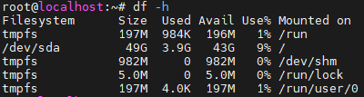

# Disk usage

```sh
df -h
```


`Filesystem` column indicates the name of disk or partition. `Mounted on` pintpoints the directory by which you have access to it.

In the case above:
- Your main disk `(/dev/sda)` is only 9% used, with 43 GB still available.
- The tmpfs entries are temporary memory-based filesystems, mainly used for runtime and temporary operations, not persistent storage.

# CPU&RAM usage

```sh
top
```

or (if installed)

```sh
htop
```
