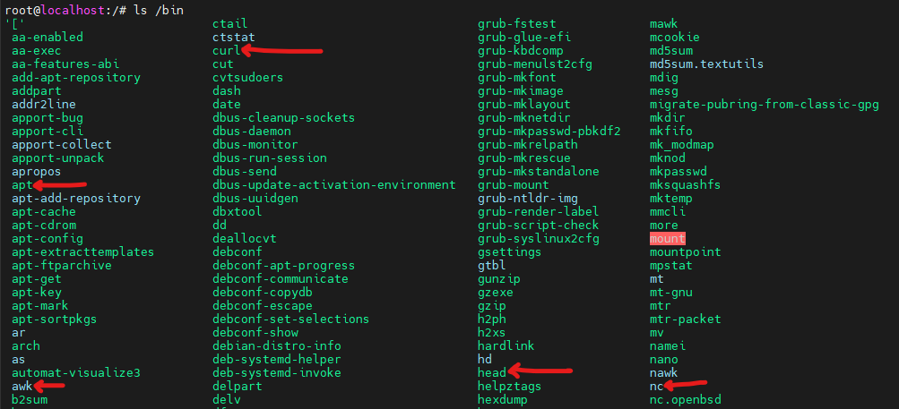
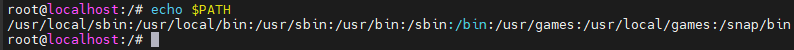
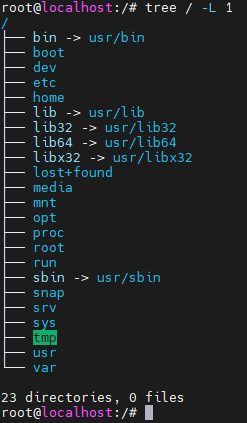

# Filesystem Hierarchy Standard

https://en.wikipedia.org/wiki/Filesystem_Hierarchy_Standard

https://refspecs.linuxfoundation.org/FHS_3.0/fhs/index.html

## Intro

It is possible to define two independent distinctions among files: shareable vs. unshareable and variable vs. static. In general, files that differ in either of these respects should be located in different directories. This makes it easy to store files with different usage characteristics on different filesystems.

**Shareable** files are thos that can be stored on one host and used on other hosts. They are not host-specific. For example, the files in user home directiories are shareable, whereas [device lock files](https://en.wikipedia.org/wiki/File_locking) are not. 

**Static** files include binaries, libraries, documentation files and other files that do not change without system administrator intervention.

> **File mounting** is the process of making a file system accessible to a computer by attaching it to a specific location in the directory structure. This means you "mount" a disk, partition, or remote resource (like a network share) so that its contents appear as part of the main file system. For example, when you plug in an external hard drive, the system mounts it so you can access its files through the file explorer. E.g. you can plug in USB memory with configured name `kingston_data_traveler` and Linux will mount its contest under `/media/<username>/kingston_data_traveler`.

Shareable files can be stored on one host and used on several others. Typically, however, not all files in the filesystem hierarchy are shareable and so each system has local storage containing at least its unshareable files.

Static and variable files should be segregated because static files, unlike variable files, can be stored on read-only media and do not need to be backed up on the same schedule as variable files.

Historical UNIX-like filesystem hierarchies contained both static and variable files under both `/usr` and `/etc`. In order to realize the advantages mentioned above, the `/var` hierarchy was created and all variable files were transferred from `/usr` to `/var`. Consequently `/usr` can now be mounted read-only (if it is a separate filesystem). Variable files have been transferred from `/etc` to `/var` over a longer period as technology has permitted.

|             | shareable           | unshareable      |
|-------------|---------------------|------------------|
| **static**  | /usr                | /etc             |
|             | /opt                | /boot            |
| **variable**| /var/mail           | /var/run         |
|             | /var/spool/news     | /var/lock        |

## ToC

There is:
- [The Root Filesystem](#the-root-filesystem)
- [The `/usr` Hierarchy](#the-usr-hierarchy)
- [The `/var` Hierarchy](#the-var-hierarchy)

## The Root Filesystem

Purpose: 
The contents of the root filesystem must be adequate to boot, restore, recover, and/or repair the system.

Requirements: 
- [`bin`](#bin)	Essential command binaries
- [`boot`](#boot)	Static files of the boot loader
- [`dev`](#dev)	Device files
- [`etc`](#etc)	Host-specific system configuration
- [`lib`](#lib)	Essential shared libraries and kernel modules
- [`media`](#media)	Mount point for removable media
- [`mnt`](#mnt)	Mount point for mounting a filesystem temporarily
- [`opt`](#opt)	Add-on application software packages
- [`run`](#run)	Data relevant to running processes
- [`sbin`](#sbin)	Essential system binaries
- [`srv`](#srv)	Data for services provided by this system
- [`tmp`](#tmp)	Temporary files
- [`usr`](#usr)	Secondary hierarchy
- [`var`](#var)	Variable data
Specific Options: 
- [`home`](#home) User home directories (optional)
- [`lib<qual`](#lib<qual>) Alternate format essential shared libraries (optional)
- [`root`](#root) Home directory for the root user (optional)

### `bin`
Essential user command binaries (for use by all users)

[Purpose: ](https://refspecs.linuxfoundation.org/FHS_3.0/fhs/ch03s04.html)
`/bin` contains commands that may be used by both the system administrator and by users, but which are required when no other filesystems are mounted (e.g. in single user mode).

Essential command binaries that need to be available in single-user mode, including to bring up the system or repair it,[3] for all users (e.g., cat, ls, cp).

Here are the programs like `ls`, `cat` etc...

Some facts:
- In modern Linux distros it tends to be symbolically linked to `usr/bin`.
- It cannot contain any 
- It is included in PATH 
    - 

> A **symbolic link** (symlink) in Linux is a special file that acts as a pointer to another file or directory. It allows you to create a reference to another location, making it easier to access files and directories from different places in the filesystem. Unlike hard links, symlinks can link to directories and files across different file systems. When you access a symlink, the system follows the reference to the actual file or directory.

> When a directory is included in the **PATH**, it means that the system will search that directory for executable files when you run a command. By adding directories to the PATH, you make it easier to run programs without specifying their full path. It helps you quickly execute commands by just typing the command name, and the system will automatically find the executable in one of the listed directories.

### `boot`
Static files of the boot loader

[Purpose:](https://refspecs.linuxfoundation.org/FHS_3.0/fhs/ch03s05.html) 
This directory contains everything required for the boot process except configuration files not needed at boot time and the map installer. Thus /boot stores data that is used before the kernel begins executing user-mode programs. This may include saved master boot sectors and sector map files.

[Boot loader](https://en.wikipedia.org/wiki/Bootloader) files (e.g., [kernels](https://en.wikipedia.org/wiki/Kernel_(operating_system)), [initrd](https://en.wikipedia.org/wiki/Initial_ramdisk)).

### `dev`
Device files

[Purpose](https://refspecs.linuxfoundation.org/FHS_3.0/fhs/ch03s06.html): 
The /dev directory is the location of special or device files.

[Device files](https://en.wikipedia.org/wiki/Device_file) (e.g., /dev/null, /dev/disk0, /dev/sda1, /dev/tty, /dev/random).

Some facts:
- These files are dynamically created based on various physical and virtual devices that are connected to your system
- "Everything is a file"
- This is typically an area that applications and drivers will access and is rarely a user should be dabbling in

### `etc`
Host-specific system configuration

[Purpose](https://refspecs.linuxfoundation.org/FHS_3.0/fhs/ch03s07.html): 
The /etc hierarchy contains configuration files. A "configuration file" is a local file used to control the operation of a program; it must be static and cannot be an executable binary.
It is recommended that files be stored in subdirectories of /etc rather than directly in /etc.

| File              | Description                                                   |
|-------------------|---------------------------------------------------------------|
| csh.login         | Systemwide initialization file for C shell logins (optional)  |
| exports           | NFS filesystem access control list (optional)                |
| fstab             | Static information about filesystems (optional)              |
| ftpusers          | FTP daemon user access control list (optional)               |
| gateways          | File which lists gateways for routed (optional)              |
| gettydefs         | Speed and terminal settings used by getty (optional)         |
| group             | User group file (optional)                                   |
| host.conf         | Resolver configuration file (optional)                       |
| hosts             | Static information about host names (optional)               |
| hosts.allow       | Host access file for TCP wrappers (optional)                 |
| hosts.deny        | Host access file for TCP wrappers (optional)                 |
| hosts.equiv       | List of trusted hosts for rlogin, rsh, rcp (optional)        |
| hosts.lpd         | List of trusted hosts for lpd (optional)                     |
| inetd.conf        | Configuration file for inetd (optional)                      |
| inittab           | Configuration file for init (optional)                       |
| issue             | Pre-login message and identification file (optional)        |
| ld.so.conf        | List of extra directories to search for shared libraries (optional) |
| motd              | Post-login message of the day file (optional)                |
| mtab              | Dynamic information about filesystems (optional)             |
| mtools.conf       | Configuration file for mtools (optional)                     |
| networks          | Static information about network names (optional)            |
| passwd            | The password file (optional)                                 |
| printcap          | The lpd printer capability database (optional)               |
| profile           | Systemwide initialization file for sh shell logins (optional)|
| protocols         | IP protocol listing (optional)                               |
| resolv.conf       | Resolver configuration file (optional)                       |
| rpc               | RPC protocol listing (optional)                              |
| securetty         | TTY access control for root login (optional)                 |
| services          | Port names for network services (optional)                   |
| shells            | Pathnames of valid login shells (optional)                   |
| syslog.conf       | Configuration file for syslogd (optional)                    |

Some facts:
- There has been controversy over the meaning of the name here. I will just accept "Edit To Configure".
- As Linux admin you will spend most time here
- Here are configurations that are system-wide, in contrary to use wide stored in their home directories
- e.g. `apt` has its direction here with `sources.list` file
 

### `home`
User home directories (optional)

[Purpose](https://refspecs.linuxfoundation.org/FHS_3.0/fhs/ch03s08.html) 
/home is a fairly standard concept, but it is clearly a site-specific filesystem. The setup will differ from host to host. Therefore, no program should assume any specific location for a home directory, rather it should query for it.

Users' [home directories](https://en.wikipedia.org/wiki/Home_directory), containing saved files, personal settings, etc.

Some facts:
- User specific configuration files for applications are stored in the user's home directory in a file that starts with the '.' character (a "dot file"). E.g. `.ssh` or `.bashrc`

### `lib`
Essential shared libraries and kernel modules.

Libraries essential for the binaries in /bin and /sbin.

[Purpose](https://refspecs.linuxfoundation.org/FHS_3.0/fhs/ch03s09.html): 
The /lib directory contains those shared library images needed to boot the system and run the commands in the root filesystem, ie. by binaries in /bin and /sbin.

At least one of each of the following filename patterns are required (they may be files, or symbolic links):
| File        | Description                                               |
|-------------|-----------------------------------------------------------|
| libc.so.*   | The dynamically-linked C library (optional)               |
| ld*         | The execution time linker/loader (optional)               |

### `lib<qual>`
There may be one or more variants of the /lib directory on systems which support more than one binary format requiring separate libraries.

Alternate format essential libraries. These are typically used on systems that support more than one executable code format, such as systems supporting 32-bit and 64-bit versions of an instruction set. Such directories are optional, but if they exist, they have some requirements.

> Programs labeled as **32-bit** or **64-bit** refer to the architecture of the processor and the way the program handles data. A **32-bit program** can use a maximum of 4 GB of RAM and works on 32-bit processors, while a **64-bit program** can access much more memory (theoretically up to 18.4 million TB) and runs on 64-bit processors. The difference impacts performance, especially when handling large amounts of data or running complex applications.

> A 32-bit process uses 32 bits of data per instruction, while  a 64-bit process uses 64 bits of data.

### `media`
Mount point for removable media

[Purpose](https://refspecs.linuxfoundation.org/FHS_3.0/fhs/ch03s11.html): 
This directory contains subdirectories which are used as mount points for removable media such as floppy disks, cdroms and zip disks.

Mount points for [removable media](https://en.wikipedia.org/wiki/Removable_media) such as CD-ROMs.

### `mnt`
Mount point for a temporarily mounted filesystem

[Purpose](https://refspecs.linuxfoundation.org/FHS_3.0/fhs/ch03s12.html) :
This directory is provided so that the system administrator may temporarily mount a filesystem as needed. The content of this directory is a local issue and should not affect the manner in which any program is run.

Some facts:
- For example if you want temporarily attach a network storage server to archive some files this is typically where you mount it.
- Here you mount manually, while `media` serves as the directory for automatic mount done by the Operating System

### `opt`
Add-on application software packages

[Purpose](https://refspecs.linuxfoundation.org/FHS_3.0/fhs/ch03s13.html): 
/opt is reserved for the installation of add-on application software packages. 

A package to be installed in /opt must locate its static files in a separate /opt/<package> or /opt/<provider> directory tree, where <package> is a name that describes the software package and <provider> is the provider's LANANA registered name.

Add-on [application software](https://en.wikipedia.org/wiki/Application_software) packages.

Some facts:
- optional folder
- manually installed software from vendors resides here (e.g. drivers for printer)
- this is also a place where you can place software you've created yourself
- rarely used nowadays, present most due to compatibility reasons

### `proc`
Virtual [filesystem](https://en.wikipedia.org/wiki/File_system) providing [process](https://en.wikipedia.org/wiki/Process_(computing)) and [kernel](https://en.wikipedia.org/wiki/Kernel_(operating_system)) information as files. In Linux, corresponds to a [procfs](https://en.wikipedia.org/wiki/Procfs) mount. Generally, automatically generated and populated by the system, on the fly. It is not a part of Filesystem Hierarchy Standard, rather a Linux specific.

[Purpose](https://refspecs.linuxfoundation.org/FHS_3.0/fhs/ch06.html#procKernelAndProcessInformationVir): 
The proc filesystem is the de-facto standard Linux method for handling process and system information, rather than /dev/kmem and other similar methods. We strongly encourage this for the storage and retrieval of process information as well as other kernel and memory information.

Some facts:
- Great example of a pseudo filesystem, which is a filesystem created at startup and it disappears at shutdown.
- These are not real files, this is the kernel translating other information to appear as files 
- Contains info about every running process, each active process has its own subdir here
- also has some files like `cpuinfo` or `uptime` with information about system 

### `root`
Home directory for the root user (optional)

[Purpose](https://refspecs.linuxfoundation.org/FHS_3.0/fhs/ch03s14.html): 
The root account's home directory may be determined by developer or local preference, but this is the recommended default location. 

### `run`
Run-time variable data

[Purpose](https://refspecs.linuxfoundation.org/FHS_3.0/fhs/ch03s15.html): 
This directory contains system information data describing the system since it was booted. Files under this directory must be cleared (removed or truncated as appropriate) at the beginning of the boot process.

Run-time variable data: Information about the running system since last boot, e.g., currently logged-in users and running daemons. Files under this directory must be either removed or truncated at the beginning of the boot process, but this is not necessary on systems that provide this directory as a [temporary filesystem](https://en.wikipedia.org/wiki/Tmpfs) (tmpfs) (appeared in FHS-3.0 in 2015).

Some facts:
- This one is fairly new and different distros use it in slightly different ways.
- It is Temp FS which means it runs in RAM, which implicates that everything is gone when the system is rebooted or shutdown.
- Contains information describing your system since the boot time.
- Along with proc can be used to gather info about your system and how its beign used.

### `sbin`
System binaries

[Purpose](https://refspecs.linuxfoundation.org/FHS_3.0/fhs/ch03s16.html): 
Utilities used for system administration (and other root-only commands) are stored in /sbin, /usr/sbin, and /usr/local/sbin. /sbin contains binaries essential for booting, restoring, recovering, and/or repairing the system in addition to the binaries in /bin. Programs executed after /usr is known to be mounted (when there are no problems) are generally placed into /usr/sbin. Locally-installed system administration programs should be placed into /usr/local/sbin.

Essential system binaries (e.g., [fsck](https://en.wikipedia.org/wiki/Fsck), [init](https://en.wikipedia.org/wiki/Init), [route](https://en.wikipedia.org/wiki/Route_(command))).

Some facts:
- There must be no subdirectories in /sbin.
- The following commands, or symbolic links to commands, are required in /sbin: `shutdown`	Command to bring the system down.
- Commands that I personally know available here are `iptables` and `netplan`

### `srv`
Data for services provided by this system

[Purpose](https://refspecs.linuxfoundation.org/FHS_3.0/fhs/ch03s17.html): 
/srv contains site-specific data which is served by this system.

This main purpose of specifying this is so that users may find the location of the data files for a particular service, and so that services which require a single tree for readonly data, writable data and scripts (such as cgi scripts) can be reasonably placed. Data that is only of interest to a specific user should go in that users' home directory. If the directory and file structure of the data is not exposed to consumers, it should go in /var/lib. 

The methodology used to name subdirectories of /srv is unspecified as there is currently no consensus on how this should be done. One method for structuring data under /srv is by protocol, eg. ftp, rsync, www, and cvs.

Site-specific data served by this system, such as data and scripts for web servers, data offered by FTP servers, and repositories for version control systems.

Some facts:
- Ocassionaly used as a folder for files served by a webserver or other server mechanisms such as FTP
- Rarely used in a modern era (OpenSUSE is an exception, but most of the time you will see this as blank directory)

### `sys`
Kernel and system information virtual filesystem

[Pupose](https://refspecs.linuxfoundation.org/FHS_3.0/fhs/ch06.html#sysKernelAndSystemInformation): 
The sys filesystem is the location where information about devices, drivers, and some kernel features is exposed. Its underlying structure is determined by the particular Linux kernel being used at the moment, and is otherwise unspecified.

Contains information about devices, drivers, and some kernel features.

Some facts:
- Often referred as "Like `proc`, but better structured"
- As Linux admin you will use it frequently
- It's a way to interact with kernel, one older example is writing to a file using VGA switcheroo
- Not physically written, created everytime system boots up  

### `tmp`
Temporary files

[Purpose](https://refspecs.linuxfoundation.org/FHS_3.0/fhs/ch03s18.html): 
The /tmp directory must be made available for programs that require temporary files. Programs must not assume that any files or directories in /tmp are preserved between invocations of the program.

Directory for temporary files (see also /var/tmp). Often not preserved between system reboots and may be severely size-restricted.

Some facts:
- Example: Writing a doc in a word processor - it will regularly save a temporary copy here, so if the applicaton crashes it can look here next time to see if there's a recent saved copy that you can recover

## The `usr` hierarchy

/usr is the second major section of the filesystem. /usr is shareable, read-only data. That means that /usr should be shareable between various FHS-compliant hosts and must not be written to. Any information that is host-specific or varies with time is stored elsewhere.
Large software packages must not use a direct subdirectory under the /usr hierarchy

Secondary hierarchy for read-only user data; contains the majority of (multi-)user utilities and applications. Should be shareable and read-only.

The following directories, or symbolic links to directories, are required in /usr.
- `bin` Most user commands
- `lib`	Libraries
- `local`	Local hierarchy (empty after main installation)
- `sbin`	Non-vital system binaries
- `share`	Architecture-independent data
- `games`	Games and educational binaries (optional)
- `include`	Header files included by C programs
- `libexec`	Binaries run by other programs (optional)
- `lib<qual>`	Alternate Format Libraries (optional)
- `src`	Source code (optional)

Some facts:
- Contains most of the programs and utilities your system will be running
- Folks usually pronounce it "user", which is wrong in modern-era. It's best to think of it as "the place most of your programs actually reside"
- On most modern systems `/bin`, `/lib`, `/lib<qual>`, `/sbin` are just a links to the corresponding folder in `/usr` directory
    - 
- This directory is shared among all users
- It read-only except for root or sudo
- This is the applications space
- As opposed to the `/bin` directory used by the system and system admin to perform maintenance 
- USR - UNIX System Resource
- All programs here are considered non-essential for basic system operation

### `usr/bin`
Most user commands

This is the primary directory of executable commands on the system.

Non-essential command binaries (not needed in [single-user mode](https://en.wikipedia.org/wiki/Single-user_mode)); for all users.

### `usr/include`
Directory for standard include files.

This is where all of the system's general-use include files for the C programming language should be placed.

Standard [include files](https://en.wikipedia.org/wiki/Include_directive).

### `usr/lib`
Libraries for programming and packages

/usr/lib includes object files and libraries. On some systems, it may also include internal binaries that are not intended to be executed directly by users or shell scripts. Applications may use a single subdirectory under /usr/lib. If an application uses a subdirectory, all architecture-dependent data exclusively used by the application must be placed within that subdirectory.

[Libraries](https://en.wikipedia.org/wiki/Library_(computing)) for the binaries in /usr/bin and /usr/sbin.

### `usr/libexec`
Binaries run by other programs (optional)

/usr/libexec includes internal binaries that are not intended to be executed directly by users or shell scripts. Applications may use a single subdirectory under /usr/libexec.
Applications which use /usr/libexec in this way must not also use /usr/lib to store internal binaries, though they may use /usr/lib for the other purposes documented here.

Binaries run by other programs that are not intended to be executed directly by users or shell scripts (optional).

### `usr/lib<qual>`
Alternate format libraries (optional)

### `usr/local`
Local hierarchy

The /usr/local hierarchy is for use by the system administrator when installing software locally. It needs to be safe from being overwritten when the system software is updated. It may be used for programs and data that are shareable amongst a group of hosts, but not found in /usr. Locally installed software must be placed within /usr/local rather than /usr unless it is being installed to replace or upgrade software in /usr.

Tertiary hierarchy for local data, specific to this host. Typically has further subdirectories (e.g., bin, lib, share).

The following directories, or symbolic links to directories, must be in /usr/local:
- `bin`	Local binaries
- `etc`	Host-specific system configuration for local binaries
- `games`	Local game binaries
- `include`	Local C header files
- `lib`	Local libraries
- `man`	Local online manuals
- `sbin`	Local system binaries
- `share`	Local architecture-independent hierarchy
- `src`	Local source code

> Local mean - pertaining only this host.

### `/usr/sbin`
Non-essential standard system binaries

This directory contains any non-essential binaries used exclusively by the system administrator. System administration programs that are required for system repair, system recovery, mounting /usr, or other essential functions must be placed in /sbin instead.

Non-essential system binaries (e.g., daemons for various network services).

### `/usr/share`
Architecture-independent data

The /usr/share hierarchy is for all read-only architecture independent data files.

This hierarchy is intended to be shareable among all architecture platforms of a given OS; thus, for example, a site with i386, Alpha, and PPC platforms might maintain a single /usr/share directory that is centrally-mounted. Note, however, that /usr/share is generally not intended to be shared by different OSes or by different releases of the same OS.

Game data stored in /usr/share/games must be purely static data. Any modifiable files, such as score files, game play logs, and so forth, should be placed in /var/

The following directories, or symbolic links to directories, must be in /usr/share:
- `man`	Online manuals
- `misc`	Miscellaneous architecture-independent data
- `color`	Color management information (optional)
- `dict`	Word lists (optional)
- `doc`	Miscellaneous documentation (optional)
- `games`	Static data files for /usr/games (optional)
- `info`	Primary directory for GNU Info system (optional)
- `locale`	Locale information (optional)
- `nls`	Message catalogs for Native language support (optional)
- `ppd`	Printer definitions (optional)
- `sgml`	SGML data (optional)
- `terminfo`	Directories for terminfo database (optional)
- `tmac`	troff macros not distributed with groff (optional)
- ``xml`	XML data (optional)
- `zoneinfo`	Timezone information and configuration (optional)

### `/usr/src`
Source code (optional)

Source code may be placed in this subdirectory, only for reference purposes. 

## The `var` hierarchy
/var contains variable data files. This includes spool directories and files, administrative and logging data, and transient and temporary files.

Some portions of /var are not shareable between different systems. For instance, /var/log, /var/lock, and /var/run. Other portions may be shared, notably /var/mail, /var/cache/man, /var/cache/fonts, and /var/spool/news.

/var is specified here in order to make it possible to mount /usr read-only. Everything that once went into /usr that is written to during system operation (as opposed to installation and software maintenance) must be in /var.

The following directories, or symbolic links to directories, are required in /var:
- `cache`	Application cache data
- `lib`	Variable state information
- `local`	Variable data for /usr/local
- `lock`	Lock files
- `log`	Log files and directories
- `opt`	Variable data for /opt
- `run`	Data relevant to running processes
- `spool`	Application spool data
- `tmp`	Temporary files preserved between system reboots
- `account`	Process accounting logs (optional)
- `crash`	System crash dumps (optional)
- `games`	Variable game data (optional)
- `mail`	User mailbox files (optional)
- `yp`	Network Information Service (NIS) database files (optional)

Variable files: files whose content is expected to continually change during normal operation of the system, such as logs, spool files, and temporary e-mail files.

Some facts:
- logs, temporary message files and spool files
- Confusingly, you can occassionaly find config files here that are'nt in `etc`
- This is also where webservers can place their files
- Apache often serves files from `/var/www`
- contains directories that are expected to grow in size 
- e.g. `var/crash` holds informations about processes that had crashed
- spool is a temporary storage for printer queues

### `/var/account`
Process accounting logs (optional)

This directory holds the current active process accounting log and the composite process usage data (as used in some UNIX-like systems by lastcomm and sa).

### `/var/cache`
Application cache data

Application cache data. Such data are locally generated as a result of time-consuming I/O or calculation. The application must be able to regenerate or restore the data. The cached files can be deleted without loss of data.

https://refspecs.linuxfoundation.org/FHS_3.0/fhs/ch05s05.html

### `/var/crash`
System crash dumps (optional)

https://refspecs.linuxfoundation.org/FHS_3.0/fhs/ch05s06.html

### `var/games`
Variable game data (optional)

Any variable data relating to games in /usr should be placed here. /var/games should hold the variable data previously found in /usr; static data, such as help text, level descriptions, and so on, must remain elsewhere, such as /usr/share/games.

https://refspecs.linuxfoundation.org/FHS_3.0/fhs/ch05s07.html

### `/var/lib`
Variable state information

State information. Persistent data modified by programs as they run (e.g., databases, packaging system metadata, etc.).

State information is generally used to preserve the condition of an application (or a group of inter-related applications) between invocations and between different instances of the same application. State information should generally remain valid after a reboot, should not be logging output, and should not be spooled data.

https://refspecs.linuxfoundation.org/FHS_3.0/fhs/ch05s08.html

### `/var/lock`
Lock files

Lock files should be stored within the /var/lock directory structure.

Lock files. Files keeping track of resources currently in use.

https://refspecs.linuxfoundation.org/FHS_3.0/fhs/ch05s09.html

### `/var/log`
Log files and directories

This directory contains miscellaneous log files. Most logs must be written to this directory or an appropriate subdirectory.

https://refspecs.linuxfoundation.org/FHS_3.0/fhs/ch05s10.html

### `/var/mail`
User mailbox files (optional)

The mail spool must be accessible through /var/mail and the mail spool files must take the form <username>.

Mailbox files. In some distributions, these files may be located in the deprecated /var/spool/mail.

### `/var/opt`
Variable data for /opt

Variable data of the packages in /opt must be installed in /var/opt/<subdir>, where <subdir> is the name of the subtree in /opt where the static data from an add-on software package is stored, except where superseded by another file in /etc. No structure is imposed on the internal arrangement of /var/opt/<subdir>.

Variable data from add-on packages that are stored in /opt.

### `/var/run`
Run-time variable data

This directory was once intended for system information data describing the system since it was booted. These functions have been moved to /run; this directory exists to ensure compatibility with systems and software using an older version of this specification.

Run-time variable data. This directory contains system information data describing the system since it was booted.[11]
In FHS 3.0, /var/run is replaced by /run; a system should either continue to provide a /var/run directory or provide a symbolic link from /var/run to /run for backwards compatibility.[12]

https://refspecs.linuxfoundation.org/FHS_3.0/fhs/ch05s13.html

### `/var/spool`
Application spool data

[Spool](https://en.wikipedia.org/wiki/Spooling) for tasks waiting to be processed (e.g., print queues and outgoing mail queue).

> A **spool** (short for Simultaneous Peripheral Operations On-line) is a buffer or temporary storage area where data is held before being processed by a program or device. Spooling allows multiple processes to interact efficiently with slow peripherals, such as printers or mail servers.

https://refspecs.linuxfoundation.org/FHS_3.0/fhs/ch05s14.html

### `/var/tmp`
Temporary files preserved between system reboots

The /var/tmp directory is made available for programs that require temporary files or directories that are preserved between system reboots. Therefore, data stored in /var/tmp is more persistent than data in /tmp.

https://refspecs.linuxfoundation.org/FHS_3.0/fhs/ch05s15.html

### `/var/yp`
Network Information Service (NIS) database files (optional)

Variable data for the Network Information Service (NIS), formerly known as the Sun Yellow Pages (YP), must be placed in this directory.

# Important takeaways

## Binary files locations
In a Linux filesystem, binary files (executables) can be found in multiple directories, each serving a specific purpose. Here’s a breakdown of the key locations where binaries can be placed and the differences between them:

---

### 1. **/bin (Essential User Binaries)**
   - Contains fundamental binaries needed for the system to boot and function in **single-user mode**.
   - Available to **all users**.
   - Includes commands like `ls`, `cp`, `mv`, `cat`, `echo`, `bash`.
   - **Example:** `/bin/ls`, `/bin/cp`

---

### 2. **/sbin (Essential System Binaries)**
   - Stores essential system binaries meant for **administrative tasks**.
   - Only **root** (or a user with `sudo`) should run these commands.
   - Used for system recovery and maintenance.
   - Includes commands like `fsck`, `mount`, `reboot`, `shutdown`.
   - **Example:** `/sbin/fsck`, `/sbin/reboot`

---

### 3. **/usr/bin (User Binaries)**
   - Contains **non-essential binaries** for **all users**.
   - Used for general applications and utilities.
   - Typically holds binaries from installed packages.
   - Includes commands like `vim`, `wget`, `python`, `gcc`, `tar`.
   - **Example:** `/usr/bin/vim`, `/usr/bin/python3`

---

### 4. **/usr/sbin (Non-Essential System Binaries)**
   - Contains **non-essential** binaries for **system administration**.
   - Similar to `/sbin`, but for **less critical** system tasks.
   - Used for networking, daemons, and administrative utilities.
   - Includes commands like `apachectl`, `postfix`, `tcpdump`.
   - **Example:** `/usr/sbin/tcpdump`, `/usr/sbin/apachectl`

---

### 5. **/usr/local/bin (Locally Installed User Binaries)**
   - Holds **user-installed binaries** that are **not managed** by the package manager.
   - Used for programs compiled from source or manually installed.
   - Available to **all users**.
   - **Example:** `/usr/local/bin/my_script`

---

### 6. **/usr/local/sbin (Locally Installed System Binaries)**
   - Like `/usr/local/bin`, but for **administrative** binaries.
   - Used for manually installed system utilities.
   - Only for **root or privileged users**.
   - **Example:** `/usr/local/sbin/custom_admin_tool`

---

### 7. **/opt (Optional Software Binaries)**
   - Stores third-party software and add-on packages.
   - Commonly used by proprietary software like Google Chrome, VirtualBox.
   - Each package is typically in its own subdirectory (e.g., `/opt/google/chrome`).
   - **Example:** `/opt/google/chrome/chrome`

---