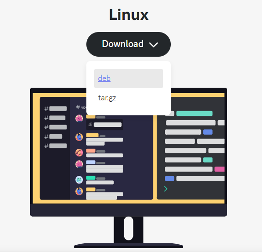
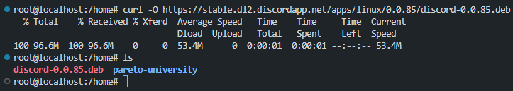
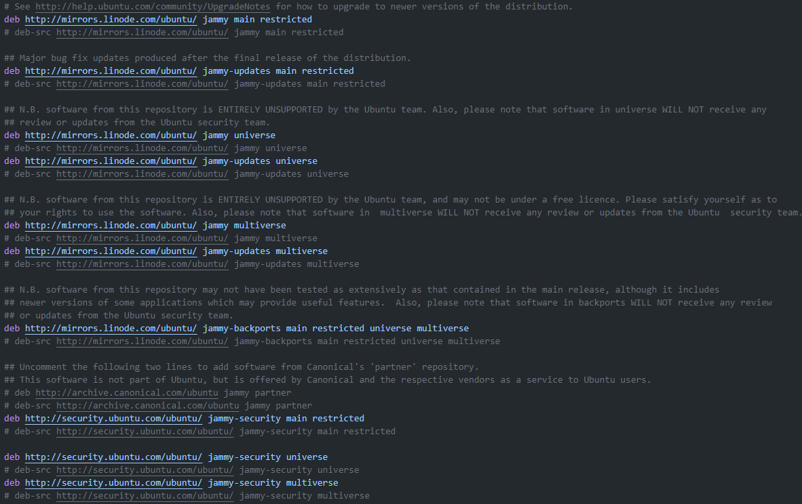

## Package Managers

Every piece of software we install comes in form of a [Package](https://en.wikipedia.org/wiki/Package_format). 

Pacakge is an archive of files.


We have two [Package Managers](https://en.wikipedia.org/wiki/Package_manager):
- dpkg (low level / dumb)
- apt   

## dpkg
https://en.wikipedia.org/wiki/Dpkg

1. First, you have to manually find the package in internet



2. Now install

```sh
dpkg -i discord-0.0.85.deb
```
- dpkg - for "depackage"
- i for "install"

3. But you will ALWAYS see dependency errors


## apt
https://en.wikipedia.org/wiki/APT_(software)

Advanced Package Tool, solves the problem of dependency resolving that dpkg has.


### repositories

Repository is basically a storage location. Someone's server that has a collcetion of all the software that we might want to use.
```sh
cat /etc/apt/sources.list
```


You can just visit these repositories in your browser: http://mirrors.linode.com/ubuntu/

