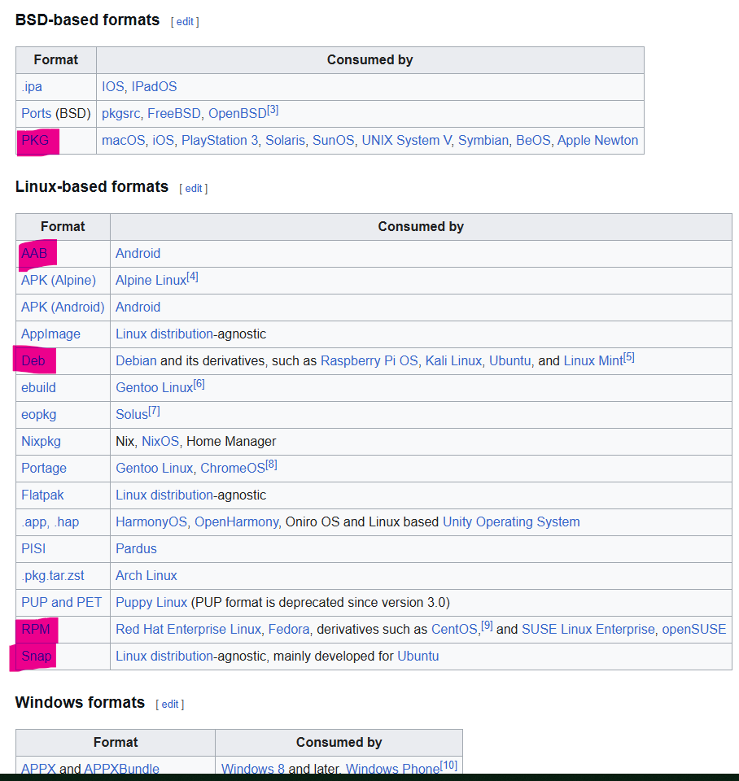
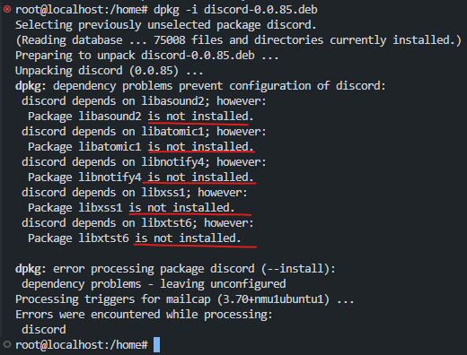

## Package Managers

Every piece of software we install comes in form of a [Package](https://en.wikipedia.org/wiki/Package_format). 

Pacakge is an archive of files.



We have two [Package Managers](https://en.wikipedia.org/wiki/Package_manager):
- dpkg (low level / dumb)
- apt   

## dpkg
https://en.wikipedia.org/wiki/Dpkg

1. First, you have to manually find the package in internet


2. Now install

```sh
dpkg -i discord-0.0.85.deb
```
- dpkg - for "depackage"
- i for "install"

3. But you will ALWAYS see dependency errors



## apt
https://en.wikipedia.org/wiki/APT_(software)

Advanced Package Tool, solves the problem of dependency resolving that dpkg has.


### repositories

Repository is basically a storage location. Someone's server that has a collcetion of all the software that we might want to use.
```sh
cat /etc/apt/sources.list
```


You can just visit these repositories in your browser: http://mirrors.linode.com/ubuntu/


You can see the source list with command:
```sh
sudo apt edit-sources
```

### apt update

This command goes to a repository and says "I want list of everything you have". 

It is a good practice to use it before any `apt install`, cuz someone own this repositories and updates them.

[Details here](#sudo-apt-update).

### apt list

```sh
sudo apt list
```
Lists all packages that are avaiable for you from repositories. 

```sh
sudo apt list --installed
```

Lists all packages that you have installed.

Also to describe packages you have 

```sh
sudo apt show vim
```
[Details of show](#sudo-apt-show).
or 
```sh
sudo apt search vim
```


### apt install

```sh
sudo apt install <package_name>
```

It fetches the packages and installs it.

### apt remove
```sh
sudo apt remove <package_name>
```

It uninstalls the package but not used data. All of the config will still be there.

### apt purge
```sh
sudo apt purge <package_name>
```

This removes package along with config.

### apt upgrade

```sh
sudo apt upgrade
```

It updates the version of your installed packages. Usually used with `update` first so apt will fetch the newest versions from repositories. 

## snap

If you are a developer and want to publish your software and give users opportunity to install it easily, right now and on any linux system the process of making it available on a repository is very long. A better way is to add you app to a store and it becomes immediately available (like in a snap of fingers).


## details

### sudo apt update
The `apt update` command updates the local package index, ensuring that APT knows about the latest available versions of packages. It **does not** install or upgrade any packages—it just fetches fresh metadata.

---

### **Step-by-Step Breakdown of `apt update`**
When you run:
```bash
sudo apt update
```
APT performs the following tasks:

### **1. Reads Repository Configuration**
- APT looks at the repositories listed in:
  - `/etc/apt/sources.list`
  - `/etc/apt/sources.list.d/*.list`

### **2. Connects to Remote Repositories**
- It sends HTTP requests to the URLs specified in the repository list.
- Example:
  ```plaintext
  http://mirrors.linode.com/ubuntu/
  http://security.ubuntu.com/ubuntu/
  ```
  
### **3. Downloads Package Index Files**
- APT retrieves **metadata** (not actual packages) in compressed files like:
  - `Packages.gz` / `Packages.xz` → Lists available packages.
  - `Sources.gz` → Source package info (if `deb-src` is enabled).
  - `Release` / `InRelease` → Security and integrity verification.
- Example log:
  ```plaintext
  Get:1 http://mirrors.linode.com/ubuntu jammy InRelease [270 kB]
  Get:2 http://security.ubuntu.com/ubuntu jammy-security InRelease [110 kB]
  Get:3 http://mirrors.linode.com/ubuntu jammy/main amd64 Packages [1800 kB]
  ```

### **4. Verifies Signatures (GPG Checks)**
- APT checks that downloaded metadata is signed using **GPG keys**.
- If the signature doesn’t match, you may see:
  ```plaintext
  NO_PUBKEY 9D6D8F6BC857C906
  ```
- Fix this using:
  ```bash
  sudo apt-key adv --keyserver keyserver.ubuntu.com --recv-keys 9D6D8F6BC857C906
  ```

### **5. Updates Local Package Cache**
- The old package list is replaced with the new one.
- You can view this cache in:
  ```bash
  ls /var/lib/apt/lists/
  ```
  
### **6. Displays Summary**
- If everything succeeds:
  ```plaintext
  Reading package lists... Done
  ```
- If some repositories are unreachable:
  ```plaintext
  Failed to fetch http://mirrors.linode.com/ubuntu/dists/jammy/main/binary-amd64/Packages
  ```

---

### **Key Differences: `apt update` vs `apt upgrade`**
| Command          | What it Does |
|-----------------|-------------|
| `apt update`   | Updates the package list (metadata) |
| `apt upgrade`  | Installs new versions of already installed packages |

So, after running `apt update`, you usually follow it with:
```bash
sudo apt upgrade
```
to actually install the latest package versions.

---

### **Checking What’s New After `apt update`**
To see which packages **have updates available**:
```bash
apt list --upgradable
```

---

### **When Should You Run `apt update`?**
- Before installing new packages (`apt install xyz`).
- Regularly, to keep package metadata fresh.
- Before upgrading the system (`apt upgrade` or `apt dist-upgrade`).

Would you like a deep dive into `apt upgrade` next? 😊


### sudo apt show
The `apt show <package>` command displays detailed information about a specific package available in the APT repositories. It does **not** install or modify anything—it just retrieves and presents metadata.

---

## **Usage Example**
```bash
apt show htop
```

### **Sample Output**
```plaintext
Package: htop
Version: 3.0.5-7
Priority: optional
Section: utils
Maintainer: Ubuntu Developers <ubuntu-devel-discuss@lists.ubuntu.com>
Installed-Size: 401 kB
Depends: libc6 (>= 2.34), libncursesw6 (>= 6), libtinfo6 (>= 6)
Homepage: https://htop.dev/
Download-Size: 105 kB
APT-Manual-Installed: yes
APT-Sources: http://mirrors.linode.com/ubuntu jammy/universe amd64 Packages
Description: interactive processes viewer
 htop is an interactive text-mode process viewer for Unix systems.
 It aims to be a better 'top'.
```

---

## **What Each Field Means**
| **Field**            | **Description** |
|----------------------|----------------|
| **Package**         | Name of the package (`htop`). |
| **Version**         | The available version (`3.0.5-7`). |
| **Priority**        | How important the package is (`optional`, `required`). |
| **Section**         | The category in the repository (`utils`). |
| **Maintainer**      | The person/team maintaining the package. |
| **Installed-Size**  | How much disk space it will take once installed (`401 kB`). |
| **Depends**         | Packages that must be installed for it to work (`libc6`, `libncursesw6`, etc.). |
| **Homepage**        | Official website for more information (`https://htop.dev/`). |
| **Download-Size**   | Size of the package to download (`105 kB`). |
| **APT-Sources**     | The repository it comes from (`jammy/universe`). |
| **Description**     | A short explanation of what the package does. |

---

## **Other Useful Flags**
1. **Check Installed Version**
   ```bash
   apt show htop | grep Version
   ```
   If the package is installed, you can also check with:
   ```bash
   dpkg -s htop | grep Version
   ```

2. **Check Dependencies**
   ```bash
   apt show --no-all-versions htop | grep Depends
   ```

3. **Find Reverse Dependencies (Who Needs This Package?)**
   ```bash
   apt-cache rdepends htop
   ```

4. **Find Similar Packages**
   ```bash
   apt search htop
   ```

---

## **Summary**
- `apt show <package>` gives you **detailed package metadata**.
- It shows version, dependencies, download size, repository source, and description.
- Useful for checking package details **before installing**.

Would you like to explore `apt depends <package>` next? 😊


## apt vs apt-get
https://youtu.be/YDsqni-oAPY?si=ZNxa9tzAmSE4gxpN

apt integrates `apt-cache`, `apt-get` and `dpkg -i` into a unified package management system.

1. Purpose and Design:
apt is a newer, user-friendly command-line interface introduced as part of the Advanced Package Tool (APT) suite to simplify common package management tasks. It combines the functionality of several older tools (apt-get, apt-cache, etc.) into a single command with sensible defaults.
apt-get is an older, more low-level tool that has been part of the APT suite for a long time. It offers more granular control but is less convenient for everyday package management.
2. Ease of Use:
apt is designed for everyday use, with shorter commands and default options that suit most scenarios.
apt-get provides more detailed control and scripting capabilities but is less user-friendly due to its more complex syntax and output.
3. Output and Display:
apt provides more readable, user-friendly output with progress bars and additional information during package installation or updates.
apt-get provides a more verbose and raw output, often preferred for scripting and detailed debugging.

When to use which?
- Use apt for most day-to-day package management tasks due to its simplicity and better user experience.
- Use apt-get when writing scripts or when you need more granular control over package management operations.
