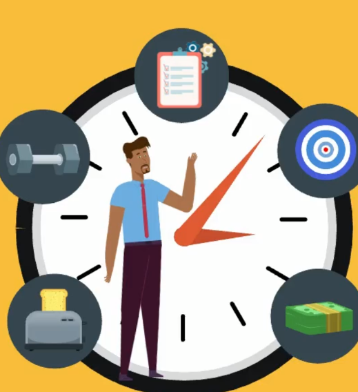

# Tips

Idea is not to copy step by step, specific method. But to experiment and try new things until you found the best plan for you.

## 1 Utilize paper

- Use paper to write down tasks to do.

- To break tasks into chunks.

- To write down your creative ideas during the day.

```
Use paper to write down your amazing, creative ideas during the day.
```

## 2 Organize interruptions into groups

Don't let yourself to be disturbed by anyone at anytime during the day. Just establish specific hours, when you are reachable with non-urgent inquires.

You can be distracted by co-worker, by family, by friends.

Remember not to mix your working time with your free time.

Just establish specific hours, when you are reachable with non-urgent inquires.

- Staying free on Non-urgent inquiries throughout the day	
- Keeping your Frame of Mind Relevant to work
  - 
- Improving the attention you give to Those around you
  - If someone interrupts, while you are focused on work u won't give him enough attention. It is better to make an appointment and talk there.

```
 Just establish specific hours, when you are reachable with non-urgent inquires.
```

## 3 Take that first tiny step

> No matter how small you start, start something that matters.

Most people find being productive so difficult because they psych themselves out, putting off each task until it seems insurmountable (*nie do pokonania*) task to get started.

Most people feel compelled (*zniewalająco*) to finish a task once it's been started.

- So make yourself a favor and commit to taking that first step. You will be surprised at how easily the rest comes by.

By doing so, u will get:

- Getting your head in the game early, less stress etc.
- Freeing up Time for other tasks
  - Breaking your tasks in small manageable staps and commit to taking the first one will give you huge head start for the rest of the day since before you know it, you will have first task over with.
- Keeping your focus
  - It's nearly impossible to get intimidated by small, easy task.

```
Define the first step for every new task that appears. And just do it.
```

## 4 Be selective about your energy

You should to know which task only you can take care of, and which would be better off getting completed by others. This can be from ordering food online, to grocery shooping and cooking to having someone at work take notes for you.

It's impossible to be productive without saving your highest mental focus for appropriate tasks

```
Delegate tasks, which can be done by someone else.
E.g. preparing meals, cleaning up etc.
```


## 5 Tackle tasks in small chunks

Instead of going after an entire project at once or comminting to finishing everything in one day or sitting think instead of punching holes at a task one in a time.

- A period of five minutes dedicated to a task can easily turn into an hour or two when you really get into the zone of the work
  - It seems easier to tell ourselves we'll sit down for five to 10 minutes to work on smth than it does to commit to multiple hours.
- It's a type of mental hack that fools your mind into viewing task as less of a hassle, and you'd often find that sitting for longer becomes much easier that you'd expect.

It also give you more opportunity to the variety during the day.

- A lot of people struggle because they don't give enough varies in their routines. 

- Working on project for short periods of time, at a time, you can introduce plenty of variety into your day

By taking small chunks at a time, you are making the most of those sudden bursts of creativity that come to you

```
Divide tasks into small parts, and do them short perdiods of time, at a time.
Say to yourself you will do some task for 10 minutes, and you will see it will be easier to faill into doing it for hours.
```

## 6 Do the highest priority item on the list - first

Ask yourself what would need to be done right now if you were to be leaving town tomorrow.

After you complete the most important task u will feel energy and the rest will be like a breeze by comparison, making it easy to get through them.

``` 
Prioritize your tasks
```

## 7 Plan the next day before you go to sleep

Before you go to sleep, do some brainstorming with a notebook and record each task you want to take care of the following day. 

- This will give you a clear cut picture of what needs to be focused on and will keep you from possible distractions (phone etc.).

- Seeing everything clearly will make u feel unstressed and comfortable. Making a list before bed means that you won't be lying there all night, trying to make sure you remember each task for the following day. Waking up more rested always measns more productive day.

- A defence against distractions
  - It's way too easy to get started on a goal for the day, be interrupted by a person or a phone call, and then completely lose track of what you were doing. If u will have a list, you will know what to do, no matter what event pops up.

- An encouraging checklist
  - Each time you check a goal off the list, you can feel empowered and extra energized to move on to the next one. Psychological trick.

```
Before you go to sleep, do some brainstorming with a notebook and record each task you want to take care of the following day. 
```

## 8 Start waking up earlier

Studies have shown that the way your morning is structured has affect how the rest of the day will go. It's quite common for the CEOs to wake up early in the morning.

While others are spending as much time as they can in bed, hitting the snooze button over and over, successful people have already begun their slaughter.

Benefits:

- Setting the right momentum for Time Management.
  - Waking up early means that each successive task will be easier to complete since you already set the momentum rolling in a positive and productive way.
- Making the days seem longer
- Utilizing *(wykorzystać, robić pożytek z)* the Most Quiet Part of the Day
  - Quiet time is conducive*(sprzyjający*) to focus

```
Start waking up earlier in the morining.
It does mean to sleep less. It means to wake up, and do not hit snooze button over and over.
```

## 9 Do the task you resent *(nie lubisz go*) the most, first

Do first high priority tasks.

Studies have shown that people who get their daily exercise out of the way at the very beginning of the day are a lot more likely to stick with the program long term. Leaving such activities for the end of the day means it's much easier to put it off and rationalize not going at all.

Benefits:

- Making the rest of the day seem easy
  - The rest of your tasks will seem like a piec of cake by comparison.
- Attaining self discipline
  - People who procrastinate have no self-discipline. Geeting the least pleasant task out of the way right at the start of your morning will teach you this important skill (self-discipline).

- An increased sense of self-respect
  - We have trouble taking ourselves seriously when we can't even follow through with our intentions for the day
  - Proving yourself that you can take care of tasks, will give you the proog you need that you can be productive

- Getting rid of avoidance habits
  - Putting off tasks until "later" often means that they never end up happening

```
Do the task you resent the most, first
```

Resentment - *uraz, oburzenie, złość*

## 10 Utilize affirmations

**Affirmations** - a positive statements, that you say to yourself. Also known as self-talk.

Positive commands are given by your conscious brain to your subconscious brain.

They can be say out loud. Saying these statements with enthusiasm and emotion will allow then to sink into our subconscious programming and affect your life in a positive way.

You can start by repetedly saying these affrimations to yourself, some examples are:

- "I am great at ...."
- "I enjoy a well balanced home and work life"

If you are consistent at repeating these mantras, eventually, your subconscious mind will accept them as truth.

Remember that you can always come up with new statemenst. There is no peak here.

```
Utilize affirmations
```

## 11 Do what you fear

Doing what you have the most anxiety about can be a great way to become better at managing your time.

Getting unpleasant but high priority tasks out of the way first is the best thing to do.

Benefits:

- Proving to yourself what you can do.

- Eradicating Irrational Anxiety
  - When you face your fears, you are proving to yourself that the fear was not actually as bad as you thought.

## 12 Act like your Most Ideal Self

Once u aware of what you want your future self to be. You only need to act that way.

Ask yourself what your most ideal self  would to, and then do that

This may seem impossible to you but that's only because you haven' believed you can do it yet

Benefits:

- Worrying less about how you could have performed better
  - Being the most ideal version of your self means that you will be free from anxiety.

```
Read above
```

## 13 Use visualization techniques 

A trick that a lot of succes figures use is mental pictures. This works similiar to the way affirmations work.

You can start using this technique to start seeing yourself as:

- efficient
- well organized
- pro time manager

Recall or recreate mental pictures of times you excelled or performed.

You can also create pictures that haven't happended yet.

Be sure to spend at least 10 minutes on these visualizations, seeing them in such vivid detail that your subconscious mind will believe that they are real<*>

Benefits:

- using mental pictures can help you become creative about your capabilities. You can reach new highs you never dreamed of previously.
- reminding yourself what you can do 
  - reming yourself of times that you excelled and accomplished a lot.
  - It can be easy to forget about these events if we don't make it a point to remind ourselves of them
- it creates opticimist attitude and pleasant demeanor

``` 
Visualize mental pictures of event when you excelled or imaginated ones.
Describe somewhere moments from you real life, when you excelled, so you can have a good picture of them to recall them later (it's important <*> )
```


## 14 Develop a One-Track Mind

Our modern culture tends to idealize the idea of taking on multiple tasks at once. But this is what slows down a lot of people.

When it comes to time management, it pays to have a one-track mind with a single focus.

People who enjoy success are able to shift their attention, at, will, to that which is most important.

Benefits:

- Becoming a better listener
  - You can listen to others entirely, rather than with only partial attention.

```
Learn how to focus upon one task at a time.
Do not split focus on several task at a time.
```

## 15 Get rid of distractions

This may seem like a no brainer, but too many people don't take it seriously enough.

YOU SHOULD BE RUTHLESS ABOUT GETTING RID OF DISTRACTIONS

For example "Get Concentrating" app will help you by blocking social media sites.

Benefits:

- When you aren't surrounded by distractions, you are more aware of the ideas that cross your mind.

Try "Forest" app.

```
YOU SHOULD BE RUTHLESS ABOUT GETTING RID OF DISTRACTIONS
```


## 16 Take advantage on habits/rituals

Successful people often rely heavily on habits and rituals.

Their action are like clockwork.

This is really powerful tool and it's no sense to describe it here. Better make separate document.



```
Establish some daily routine, some habist, some rituals and stick to them.
```

## 17 Stick to Meeting Time Limits

Meeting can be huge waste of time if they aren't approached in the fight way. It's easy to get distracted by conversation. 

If you stick to time limits each time you hold a meeting, you'll notice a huge difference in your ability to manage time and be productive. 

Sticking to time limits on meeting means:

- Keeping Meeting on topic
  - If everyone know how long the meeting lasts and what the agenda is, they will be less likely to stray from the subject on hand.
-  Stay on topic!!!

```
Stick to meeting time limits
```

## 18 Learn from highly productive people

Everyone. Event those from the top, have someone they look up to.

1. Who do you consider the best in terms of success?

2. Make their life your new study material
3. Read biographies, interviews etc

Get inspired by their example.

```
Read above
```