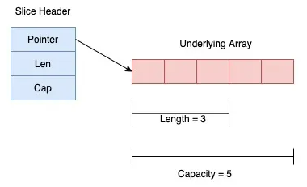
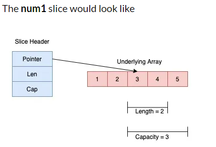

# Intro

The size of the array being part of it limits the expressiveness and power of array in go. This is where slice comes into the picture.
Slice is more powerful and convenient to use than an array. 

A slice points to an underlying array and is internally represented by a slice header.  Unlike array, the size of a slice is flexible and can be changed.

# Internal representation of a slice

Internally a slice if represented by three things:
- pointer to the underlying array
- current length of the underlying array
- total capacity which is the maximum capacity to which the underlying array can expand

Above internal representation is described by `SliceHeader` structure which looks like this.
```golang
    Pointer uintptr
    Len  int
    Cap  int
```

So a slice of length 3 and capacity 5 looks like this:


# Creating a slice

There are 4 ways:
- using `[]<type>{}` declaration
- from another slice or array
- using `make`
- using `new`

## Using `[]<type>{}` delaration

```golang
s := []int
```

Note that in array we had to specify size inside [] either with value or with `...` keyword.
The slice attribute is `[]` keyword.

The slice above will be of capacity and length 0 since it is not initialized with any values.

```golang
s := []int{1, 2}
```

This one will have both length and capacity equal to 2.

To summarize:<br>
When the actual elements are not specified, then both length and capacity of the slice is zero. When actual elements are specified , both length and capacity is equal to the number of actual elements specified.

## From another slice or array

```golang
slice := array[start:end]
```

The above operation will return a new slice from the array starting from index start to index end-1. So the element at index end is not included in the newly created slice. While re-slicing , both start and end index is optional. Default value for start is 0 and default for end is length of array.

```golang
numbers := [5]int{1, 2, 3, 4, 5}

//Both start and end
num1 := numbers[2:4]
// Only start
num2 := numbers[2:]
// only end
num3 := numbers[:3]
// none
num3 := numbers[:]
```


Exactly the same code works with slices. You can just replace 1-st line with `[]int{1, 2, 3, 4, 5}`

## Using make function
