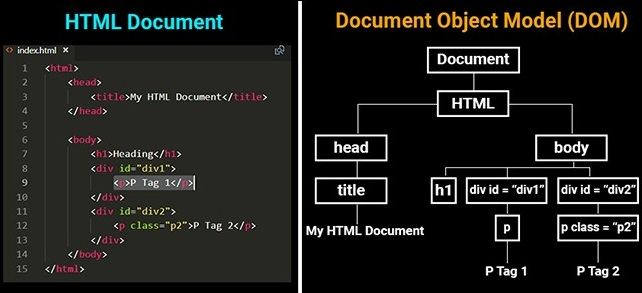
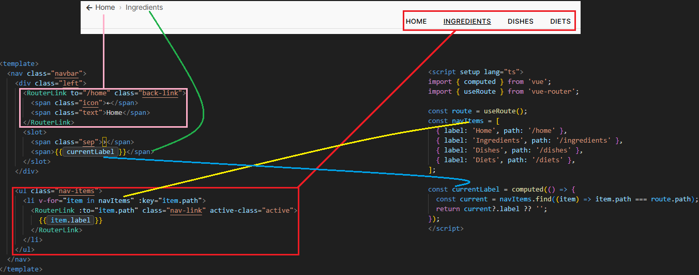

# Dietonez-fe analiza

## Index.html

```html
<!doctype html>
<html lang="en">
  <head>
    <meta charset="UTF-8" />
    <link rel="icon" type="image/svg+xml" href="/favicon.ico" />
    <link rel="icon" type="image/png" sizes="96x96" href="/icons/icons8-fry-ios7-96.png">
    <meta name="viewport" content="width=device-width, initial-scale=1.0" />
    <title>Dietonez</title>
  </head>
  <body>
    <div id="app"></div>
    <script type="module" src="/src/main.js"></script>
  </body>
</html>
```

Po przegladarka to jest program do renderowania html'ów, ale potem dodano do parsery CSS. A potem chciano aby strony przestały być statyczne, więc dodano do przeglądarek interpretery skryptów napisanych w Javascript. Serwer HTTP razem z plikiem .html może więc wysłać przegladarce plik .js, który zawiera skrypt, który przeglądarka ładuje do swojej pamięci i wykonuje gdy user jest na danej stronie.

Skrypty te polegają na dynamicznych modyfikacjach treści plików html, które przeglądarka odzwierciedli rerenderując go na ekran.

Modelem do renderowania treści html jest tzw. DOM (Document Object Model). 



Tak, więc plik `index.html` ma dwa zadania:

- stworzyć taki element w drzewie poniżej elementu `body` pod który skrypt `.js` się "podmontuje" (czyli oddamy mu sterowanie)
- wskazać w tagu `<script>` lokalizację pliku `.js` który zawiera skrypt, który będzie modyfikował DOM

Czyli w skrócie ma on za zadanie oddać sterowanie nad DOMem naszemu skyptowi `.js`

Co jest w tym skrypcie, więc:

## main.ts

```typescript
import { createApp } from 'vue'
import App from './App.vue'
import router from './router'

import Toast, { type PluginOptions, POSITION  } from 'vue-toastification'
import 'vue-toastification/dist/index.css'
import './style/style.css'

const app = createApp(App)

const toastOptions: PluginOptions = {
  position: POSITION.TOP_RIGHT,
  timeout: 3000,
  closeOnClick: true,
  pauseOnFocusLoss: true,
  pauseOnHover: true,
  draggable: true,
  draggablePercent: 0.6,
  showCloseButtonOnHover: false,
  hideProgressBar: false,
  closeButton: 'button',
  icon: true,
  rtl: false,
  transition: 'Vue-Toastification__bounce',
  maxToasts: 5,
  newestOnTop: true
}

// Używamy routera i toastów
app.use(router)
app.use(Toast, toastOptions)

// Montujemy aplikację
app.mount('#app')
```

Tu mały niuans, bo teraz Javascript ewoluował w Typescript.

No i tak właściwie to całe Vue.js to jest biblioteka funkcji i klas, zaimportowana natywnymi mechanizmami Typescript.

Taki podstawowy kod tego pliku to wygląda tak:

```typescript
import { createApp } from 'vue'
import App from './App.vue'

const app = createApp(App)

// Montujemy aplikację
app.mount('#app')
```

Czyli import klasy `App` napisanej przez usera oraz funkcji `createApp` z biblioteki Vue, stworzenie obiektu `app` oraz podmontowanie jej do DOM metodą `mount`, a w jej parametrze podajemy id tego elementu (u nas `app`).


No ale my dodajemy sobie jako middleware takie bajery jak `Toast` i `router` metodą `use` klasy `App` (nasza klasa App dziedziczy z klasy biblioteki).

No więc zobaczmy na tę swoją Apkę:

## App.vue

```vue
<template>
  <div id="app" :class="$route.name">
    <NavBar />
    <main class="main-content">
      <RouterView />
    </main>
  </div>
</template>


<script setup lang="ts">
import NavBar from './components/NavBar.vue';
</script>

<style>
.main-content {
  padding: 2rem;
  max-width: 1200px;
  margin: 0 auto;
}

.DietView .main-content {
  max-width: 1500px;
}
</style>
```

No i tu już się objawia pierwszy abstrakcyjny koncept Vue czyli komponent, ma on 3 sekcje:

- template html elementu DOM za który component odpowiada, tak naprawdę to to też jest funkcja Javascript, która zwraca potem prawdziwy statyczny html
- skrypt TS, który odpowiada za "logikę" komponentu
- css style tego kawałka html'a

Template html'owy danego komponentu może również zawierać inne komponenty i tak budujemy drzewo komponentów.

U nas komponent App jest tak zbudowany.


Czyli ma tylko dwa komponenty:

- NavBar - napisany przez nas
- RouterView - z bilioteki [Router.vuejs](https://router.vuejs.org)


Ten Router Vue to taki komponent, który podmienia wyświetlane komponenty na podstawie tego na jakim aktualnie user jest roocie, ale zanim do niego do omówmy sobie NavBar.

### NavBar

```vue
<template>
  <nav class="navbar">
    <div class="left">
      <RouterLink to="/home" class="back-link">
        <span class="icon">←</span>
        <span class="text">Home</span>
      </RouterLink>
      <slot>
        <span class="sep">›</span>
        <span>{{ currentLabel }}</span>
      </slot>
    </div>

    <ul class="nav-items">
      <li v-for="item in navItems" :key="item.path">
        <RouterLink :to="item.path" class="nav-link" active-class="active">
          {{ item.label }}
        </RouterLink>
      </li>
    </ul>	
  </nav>
</template>

<script setup lang="ts">
import { computed } from 'vue';
import { useRoute } from 'vue-router';
  
const route = useRoute();
const navItems = [
  { label: 'Home', path: '/home' },
  { label: 'Ingredients', path: '/ingredients' },
  { label: 'Dishes', path: '/dishes' },
  { label: 'Diets', path: '/diets' },
];

const currentLabel = computed(() => {
  const current = navItems.find((item) => item.path === route.path);
  return current?.label ?? '';
});
</script>
```



Skrypt setup komponentu NavBar zwraca zmienną `currentLabel`, która jest "computed", czyli **reaktywne wyrażenie obliczeniowe (dostarczane przez Vue)**. Należy do [silnika reaktyw]

No a oprócz tego wyświetla NavItems, z czego każdy NavItem to komponent `RouterLink` dostarczany przez libkę `Router.vuejs`. Taki komponent ma atrybut (HTML attribute) o nazwie "to", który w tym przypadku 

