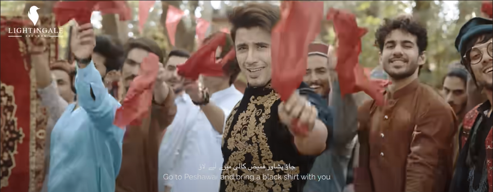
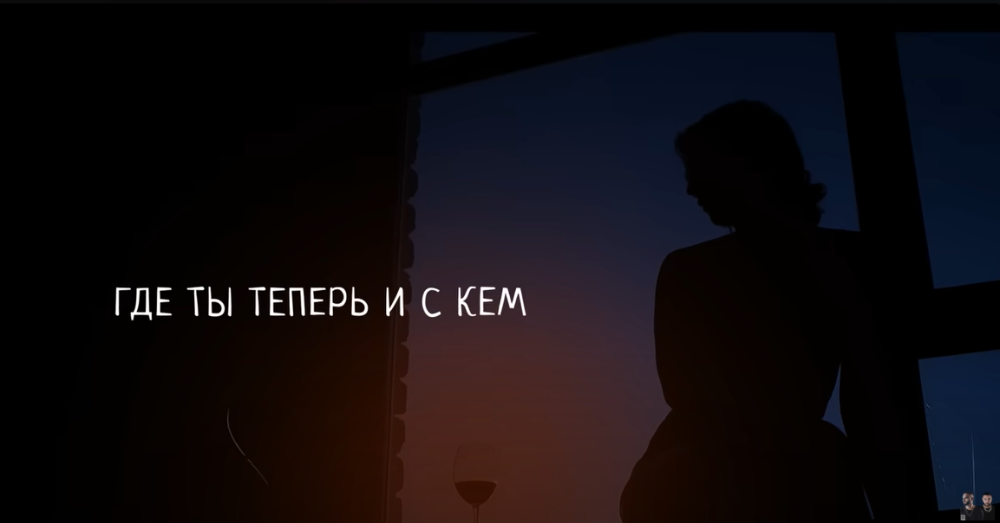
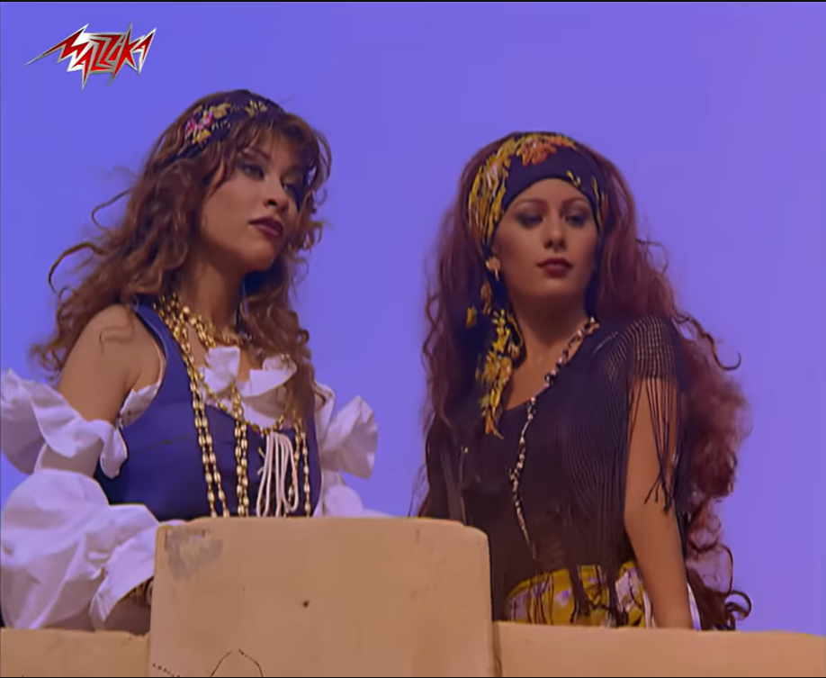
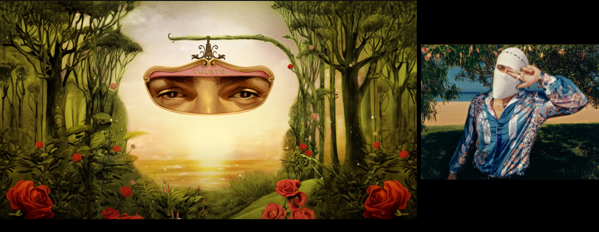

# Pashtun
https://en.wikipedia.org/wiki/Pashtuns

[Larsha Pekhawar | Ali Zafar ft. Gul Panra & Fortitude Pukhtoon Core | Pashto Song](https://youtu.be/lh6Ltp5Ew9k?si=tc6kYkP4rM2iqS-J)

# Punjabi
https://en.wikipedia.org/wiki/Punjabis

[Sardaar Ji | Maritime Bhangra Group | Bhangra at Dartmouth-Halifax Water Front](https://youtu.be/nWaB_7AOwdQ?si=-9SXTpYnxrU6hvFD) - taniec Punjabi

[Rahat Fateh Ali Khan - Habibi](https://youtu.be/iNiqZzl-_G0?si=CDC0eOW6U7lJK5iF)

# Azerbaijani
https://en.wikipedia.org/wiki/Azerbaijanis

[Uzeyir Mehdizade - Yaxsi Olar ( Official Video Clip ) 2018](https://youtu.be/U4q4JwA1cp8?si=yc2LIMqKEzoKLGbG) - fajna piosenka o miłości, sprawdź konicznie tekst.

# Russian

[Баста, HammAli & Navai - Где ты теперь и с кем](https://youtu.be/LQ_be1KSonc?si=oBpEAPZyOS9Y9OPq)

# Arab

[Al Qawlu Qawlu Sawarim](https://youtu.be/hJU2A8qtHAI?si=WHsdYug7FRcTkmWq) - propagandowa pieśni powstała w kręgu [ISIS](https://en.wikipedia.org/wiki/Islamic_State) jest po arabsku, ale nie można ją powiązać z żadną konkretną grupą, bo jest wytworem propagandowym z 2013 roku.

## Egyptians

[محمود الليثي و حماده الليثي ( كدة لا ) الفيديو كليب الرسمي 2024  Keda La](https://youtu.be/tDoDLH7bj-E?si=I2akv0es0s0NiGnV) - to typowa piosenka popowa/romantyczna z Egiptu, której tekst mówi o miłości, tęsknocie i emocjach („kocham Cię wolno”, „serce mnie boli”, „chcę, żebyś to poczuła” itp.). Nie znalazłem potwierdzenia, że klip miał cel satyryczny czy „śmieszny” w zamierzeniu – raczej używa się lekko humorystycznych motywów (np. przesadnych gestów, komicznych sytuacji) jakie bywają w arabskich wideoklipach romantycznych, ale główny ton to romantyzm i zabawa, a nie parodia.

[Amr Diab - Nour El Ein | Official Music Video - HD Version | عمرو دياب - نور العين](https://youtu.be/KLJA-srM_yM?si=MQtzWot-O0ZLEvYy) - „Nour El Ein” (نور العين – „Światło oczu”) to przebój arabskiego popu wydany w 1996 roku przez egipskiego piosenkarza Amra Diaba (عمرو دياب), pochodzącego z Port Said w Egipcie i należącego do kultury arabskiej. Utwór, wykonywany w dialekcie egipskim, stał się międzynarodowym hitem i symbolem stylu „al-jīl”, czyli arabskiego popu łączącego tradycyjne motywy muzyki arabskiej z nowoczesnymi elementami zachodniego popu.

[TUL8TE - Heseeny I تووليت - حسيني](https://youtu.be/QHC-9PGT5ZQ?si=oMyx7V5_H3GEi5dG)

„Heseeny” (حسيني) to utwór egipskiego artysty TUL8TE, wykonywany w dialekcie egipskim i utrzymany w stylistyce współczesnego arabic pop/rapu, w którym tradycyjne elementy języka i melodii łączą się z nowoczesnymi trendami hip-hopu i muzyki elektronicznej; tekst piosenki ma charakter romantyczny, opowiada o silnym uczuciu i emocjonalnej więzi z ukochaną osobą, o tęsknocie i potrzebie bliskości, a główny motyw to prośba, by druga strona usłyszała i poczuła szczerość słów oraz odwzajemniła uczucie, dzięki czemu piosenka wyraża uniwersalne pragnienie miłości, oddania i wspólnego szczęścia.

