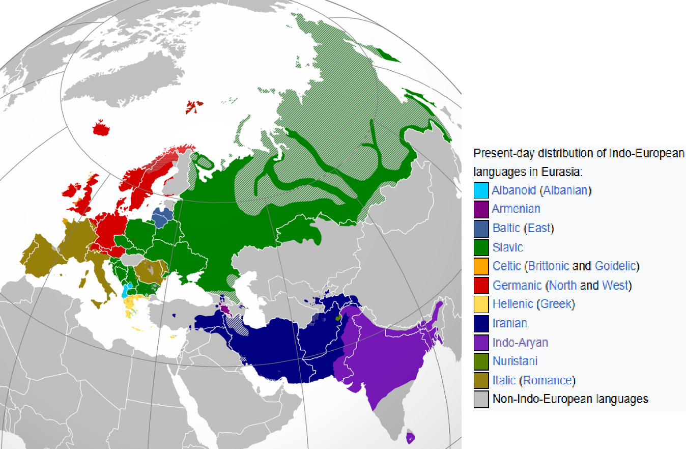
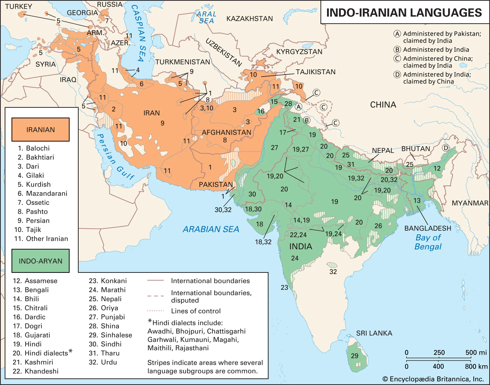
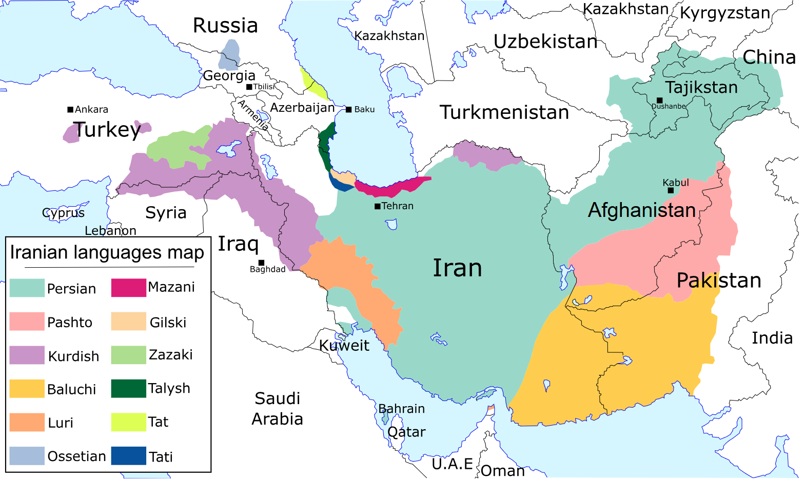
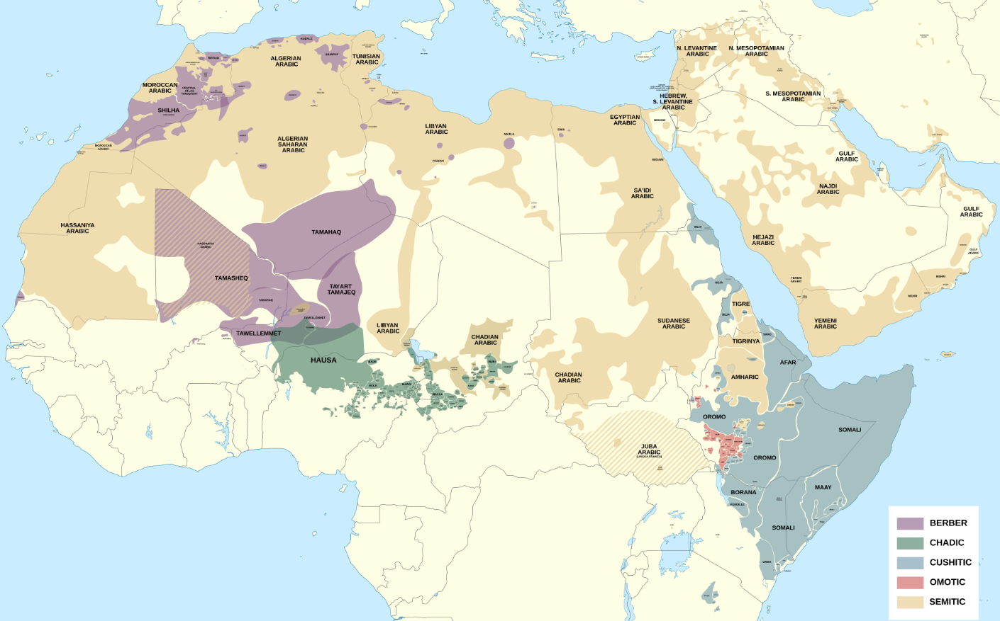
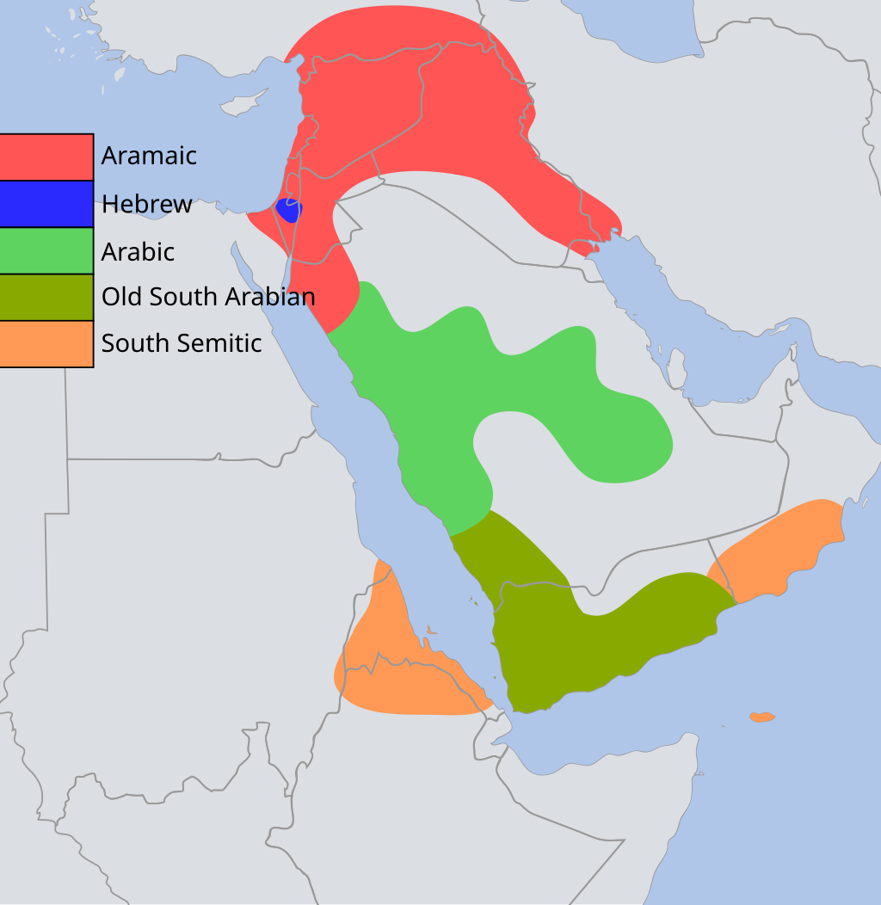
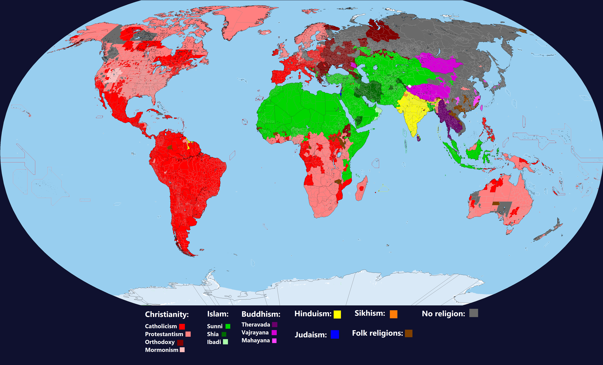
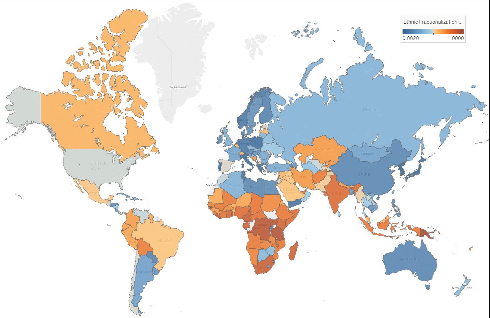
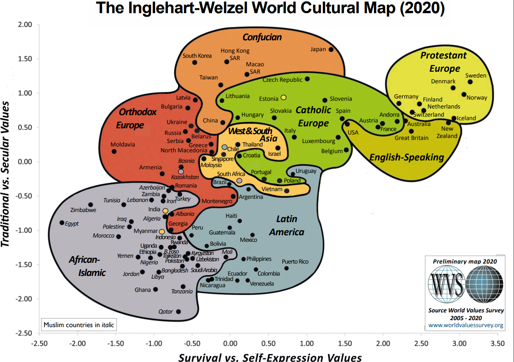

# Known-world
Below is the map of the countries that I have studied. What does my study include?
- Basic economic indicators
- Religions practised
- Ethnic groups of inhabitants
- Languages spoken

[Here is the map ->](https://zliczto.pl/known-world/map.html).

Below I will present some general disctincions based on several factors. This version of the notebook is in very early stage thus can be a little mess. Also, I will focus only on the known world. 

# Languages

## Indo-European languages

https://en.wikipedia.org/wiki/Indo-European_languages

https://upload.wikimedia.org/wikipedia/commons/4/4f/IndoEuropeanTree.svg

### Indo-Iranian languages

https://en.wikipedia.org/wiki/Indo-Iranian_languages

#### Iranian languages

#### Indo-Aryan languages

## Turkic languages

https://en.wikipedia.org/wiki/Turkic_languages

## Afro-Asiatic languages

https://en.wikipedia.org/wiki/Afroasiatic_languages

Historical map:

### Semitic languages

Semitic languages includes:
- All of the present day arabic
- Hebrew 
- Aramaic (the historical language)

This maps shows the "Approximate distribution of the Semitic languages around the 1st century AD".

# Religion

## 1st-level division:

https://www.pbslearningmedia.org/resource/sj14-soc-religmap/world-religions-map/    

## 2nd-level division:

https://www.reddit.com/r/MapPorn/comments/x2lzue/map_of_the_worlds_religions/

# Cultural specifics

## Multiculturalism

https://en.wikipedia.org/wiki/Multiculturalism#/media/File:List_of_countries_ranked_by_ethnic_and_cultural_diversity_level,_List_based_on_Fearon

## Inglehart-Welzel Cultural Map

https://www.iffs.se/media/23025/cultural-map-2020_eng.pdf

