# Known-world
Below is the map of the countries that I have studied. What does my study include?
- Basic economic indicators
- Religions practised
- Ethnic groups of inhabitants
- Languages spoken

[Here is the map ->](https://zliczto.pl/known-world/map.html).

Below I will present some general disctincions based on several factors. This version of the notebook is in very early stage thus can be a little mess. Also, I will focus only on the known world. 

Countries ToC:
- Arab world:
    - [Morocco](#morocco)
    - [Mauritania](#mauritania)
    - [Algeria](#algeria)
    - [Tunisia](#tunisia)
    - [Libya](#Libya)
    - [Egypt](#egypt)
    - [Sudan](#sudan)
    - [Somalia](#somalia)
    - [Saudi Arabia](#saudi-arabia)
    - [Yemen](#yemen)
    - [Oman](#oman)
    - [United Arab Emirates](#united-arab-emirates)
    - [Qatar](#qatar)
    - [Kuwait](#kuwait)
    - [Jordan](#jordan)
    - [Iraq](#iraq)
    - [Syria](#syria)
    - [Palestine](#palestine)
- Israel:
    - [Israel](#israel)
- Iranian:
    - [Iran](#iran)
    - [Afghanistan](#afghanistan)
    - [Tajikistan](#tajikistan)
- Turkic:
    - [Türkiye](#türkiye)
    - [Azerbaijan](#azerbaijan)
    - [Turkmenistan](#turkmenistan)
    - [Uzbekistan](#uzbekistan)
    - [Kyrgyzstan](#kyrgyzstan)
    - [Kazakhstan](#kazakhstan)
- Georgia:
    - [Georgia](#georgia)
- Armenia:
    - [Armenia](#armenia)
- South Asia:
    - [Pakistan](#pakistan)
    - [India](#india)
    - [Sri Lanka](#sri-lanka)
    - [Nepal](#nepal)
    - [Bhutan](#bhutan)
    - [Bangladesh](#bangladesh)

# Languages

## Indo-European languages

https://en.wikipedia.org/wiki/Indo-European_languages

https://upload.wikimedia.org/wikipedia/commons/4/4f/IndoEuropeanTree.svg

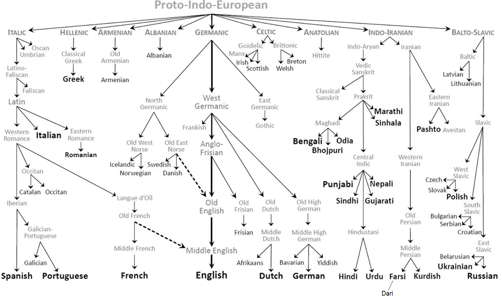

### Indo-Iranian languages

https://en.wikipedia.org/wiki/Indo-Iranian_languages

#### Iranian languages

#### Indo-Aryan languages

## Turkic languages

https://en.wikipedia.org/wiki/Turkic_languages

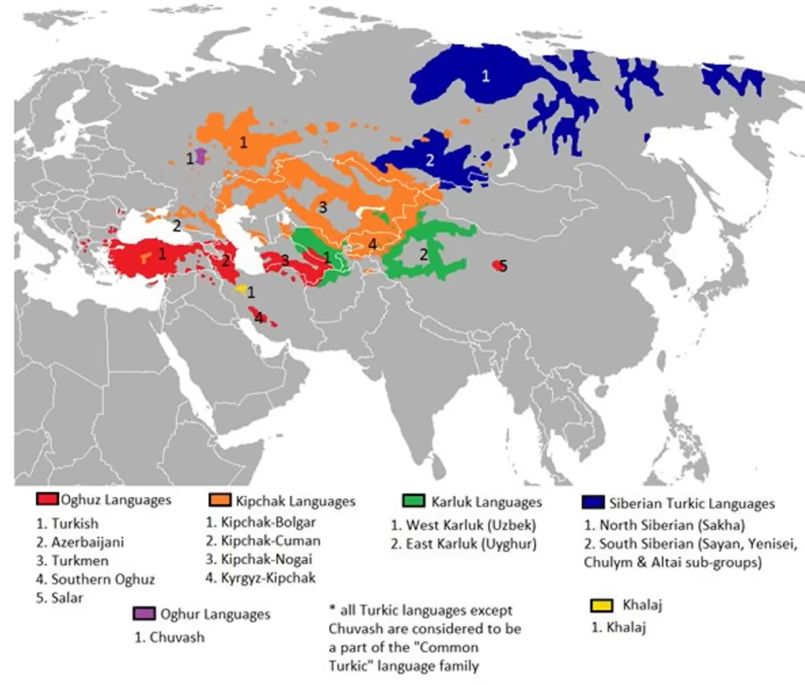

## Afro-Asiatic languages

https://en.wikipedia.org/wiki/Afroasiatic_languages

Historical map:

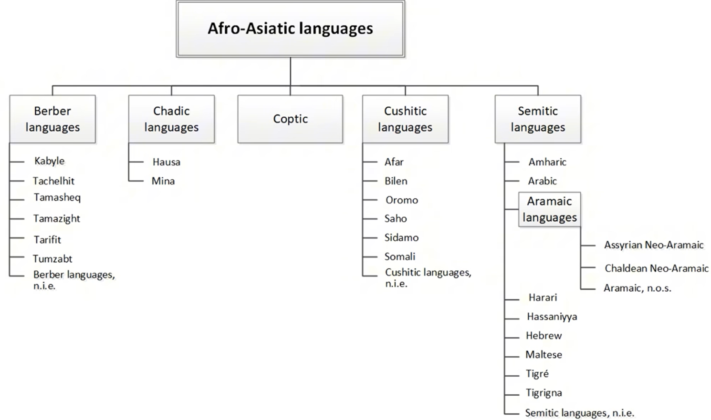

### Semitic languages

Semitic languages includes:
- All of the present day arabic
- Hebrew 
- Aramaic (the historical language)

This maps shows the "Approximate distribution of the Semitic languages around the 1st century AD".

### Middle east languages

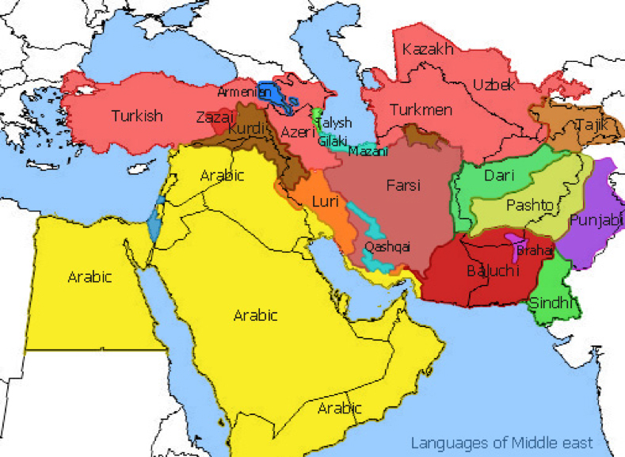

## Dravidian languages

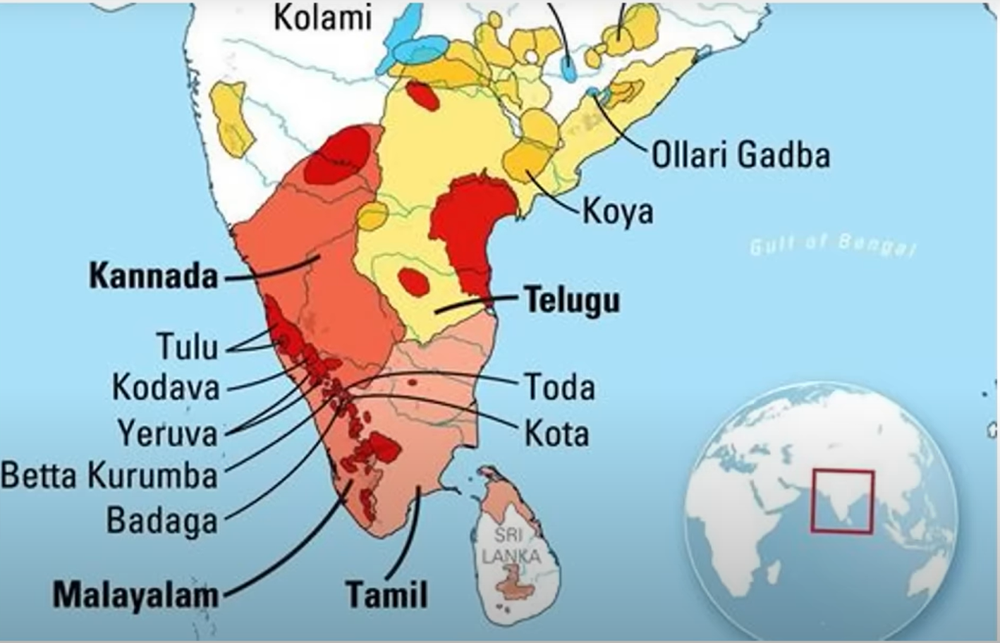

## Present day languages in Asia

## Alphabets

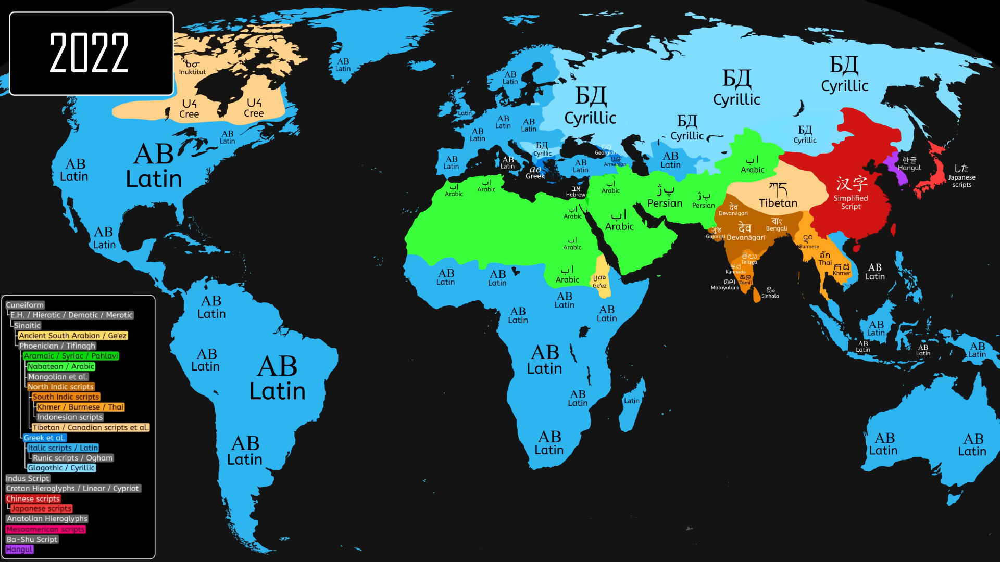

# Religion

## 1st-level division:

https://www.pbslearningmedia.org/resource/sj14-soc-religmap/world-religions-map/    

## 2nd-level division:

https://www.reddit.com/r/MapPorn/comments/x2lzue/map_of_the_worlds_religions/

# Cultural specifics

## Multiculturalism

https://en.wikipedia.org/wiki/Multiculturalism#/media/File:List_of_countries_ranked_by_ethnic_and_cultural_diversity_level,_List_based_on_Fearon

## Inglehart-Welzel Cultural Map

https://www.iffs.se/media/23025/cultural-map-2020_eng.pdf

# Physical maps
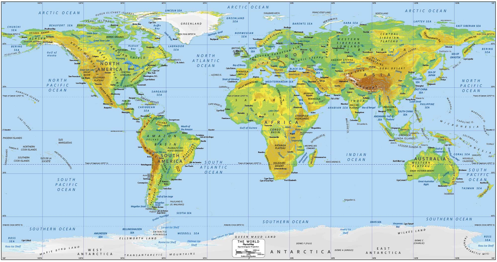

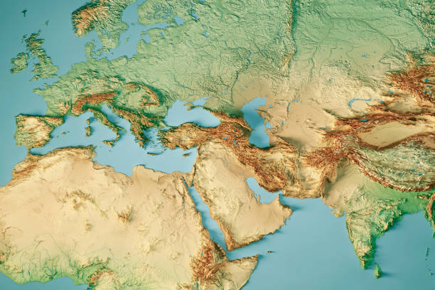

## Rivers

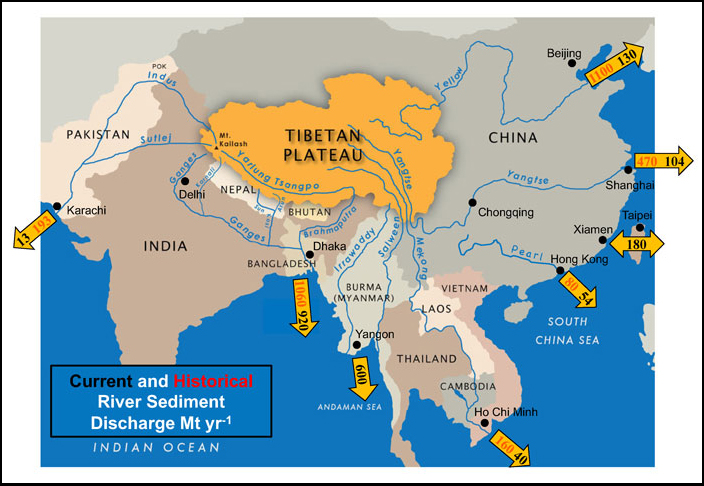

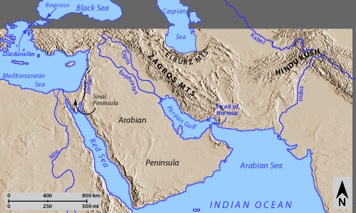

## Moutain systems of Eurasia

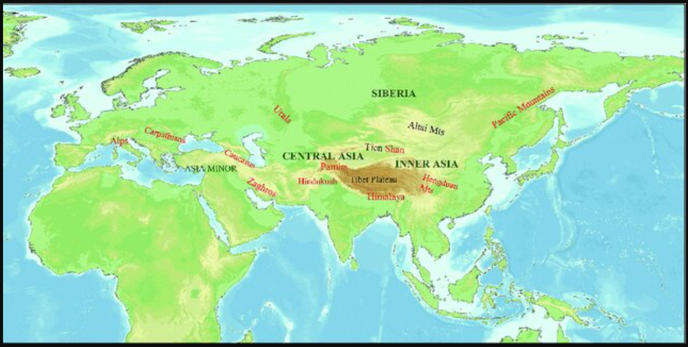

# Countries

# Morocco
[Wikipedia](https://en.wikipedia.org/wiki/Morocco)

# Mauritania
[Wikipedia](https://en.wikipedia.org/wiki/Mauritania)

# Algeria
[Wikipedia](https://en.wikipedia.org/wiki/Algeria)

# Tunisia
[Wikipedia](https://en.wikipedia.org/wiki/Tunisia)

# Libya
[Wikipedia](https://en.wikipedia.org/wiki/Libya)

# Egypt
[Wikipedia](https://en.wikipedia.org/wiki/Egypt)

# Sudan
[Wikipedia](https://en.wikipedia.org/wiki/Sudan)

# Somalia
[Wikipedia](https://en.wikipedia.org/wiki/Somalia)

# Saudi Arabia
[Wikipedia](https://en.wikipedia.org/wiki/Saudi_Arabia)

# Yemen
[Wikipedia](https://en.wikipedia.org/wiki/Yemen)

# Oman
[Wikipedia](https://en.wikipedia.org/wiki/Oman)

# United Arab Emirates
[Wikipedia](https://en.wikipedia.org/wiki/United_Arab_Emirates)

# Qatar
[Wikipedia](https://en.wikipedia.org/wiki/Qatar)

# Kuwait
[Wikipedia](https://en.wikipedia.org/wiki/Kuwait)

# Jordan
[Wikipedia](https://en.wikipedia.org/wiki/Jordan)

# Iraq
[Wikipedia](https://en.wikipedia.org/wiki/Iraq)

# Syria
[Wikipedia](https://en.wikipedia.org/wiki/Syria)

# Palestine
[Wikipedia](https://en.wikipedia.org/wiki/State_of_Palestine)

# Israel
[Wikipedia](https://en.wikipedia.org/wiki/Israel)

# Iran
[Wikipedia](https://en.wikipedia.org/wiki/Iran)

# Afghanistan
[Wikipedia](https://en.wikipedia.org/wiki/Afghanistan)

# Tajikistan
[Wikipedia](https://en.wikipedia.org/wiki/Tajikistan)

# Turkey
[Wikipedia](https://en.wikipedia.org/wiki/Turkey)

# Azerbaijan
[Wikipedia](https://en.wikipedia.org/wiki/Azerbaijan)

# Turkmenistan
[Wikipedia](https://en.wikipedia.org/wiki/Turkmenistan)

# Uzbekistan
[Wikipedia](https://en.wikipedia.org/wiki/Uzbekistan)

# Kyrgyzstan
[Wikipedia](https://en.wikipedia.org/wiki/Kyrgyzstan)

# Kazakhstan
[Wikipedia](https://en.wikipedia.org/wiki/Kazakhstan)

# Georgia
[Wikipedia](https://en.wikipedia.org/wiki/Georgia_(country))

# Armenia
[Wikipedia](https://en.wikipedia.org/wiki/Armenia)

# Pakistan
[Wikipedia](https://en.wikipedia.org/wiki/Pakistan)

# India
[Wikipedia](https://en.wikipedia.org/wiki/India)

# Sri Lanka
[Wikipedia](https://en.wikipedia.org/wiki/Sri_Lanka)

# Nepal
[Wikipedia](https://en.wikipedia.org/wiki/Nepal)

# Bhutan
[Wikipedia](https://en.wikipedia.org/wiki/Bhutan)

# Bangladesh
[Wikipedia](https://en.wikipedia.org/wiki/Bangladesh)
